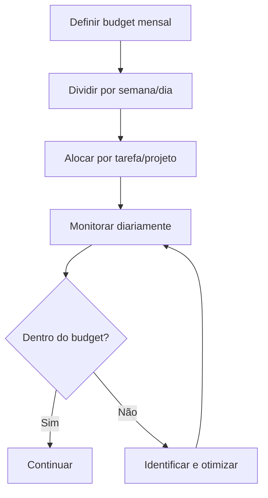

# Orçamento e hard limits

> [!abstract] TL;DR
> Orçamento sem limite técnico é dependência de disciplina humana — e humanos esquecem. A camada inferior é budget (planejamento estatístico), a camada superior são **hard limits** (corte automático): `max_tokens` por chamada, caps mensais no provider, kill switches que abortam sessões fora do esperado. Sem hard limits, uma única chamada com `max_tokens` aberto ou um agente em loop pode queimar o budget de um mês em horas.

## Duas camadas: orçamento vs hard limit

| Camada | Função | Atua quando | Exemplo |
|---|---|---|---|
| **Budget** | Planejar | Antes da execução | "Esperamos gastar $200/mês neste projeto" |
| **Hard limit** | Bloquear | Durante a execução | "Aborte se a sessão passar de 500K tokens" |

Budget responde *quanto*. Hard limit responde *o que fazer quando passar*. Os dois são necessários — budget sem hard limit é wishful thinking; hard limit sem budget é arbitrário.

## Camada 1 — Orçamento

### Framework



### Orçamentos de referência (2026)

| Perfil | Budget mensal | Modelo principal | Nota |
|---|---|---|---|
| Dev solo, casual | $10-30 | Haiku 4.5 + Flash | Autocomplete + chat ocasional |
| Dev solo, power user | $50-150 | Claude Sonnet 4.6 | Agente ativo diário |
| Dev solo, heavy | $150-300 | Sonnet + Opus | Sessões longas de agente |
| Time de 5 devs | $300-1000 | Mix com routing | Ver [[09 - Model routing — modelo certo para a tarefa]] |
| Startup (10 devs + CI) | $1000-3000 | Enterprise plan | Inclui automação |

### Alertas de gasto

```bash
# Anthropic: Settings → Usage Limits → Set monthly limit
# OpenAI:    Settings → Billing → Usage limits
```

Configurar **dois alertas** — em 70% (sinal amarelo) e 90% (sinal vermelho). Acima de 90%, intervenção é mandatória.

## Camada 2 — Hard limits

### `max_tokens` em cada chamada

A defesa mais barata e mais esquecida. Sem `max_tokens`, o modelo pode gerar até o limite do contexto.

```python
# Errado: sem teto
response = client.messages.create(
    model="claude-sonnet-4-6",
    messages=msgs,
)

# Certo: teto explícito
response = client.messages.create(
    model="claude-sonnet-4-6",
    max_tokens=2000,           # corte preventivo
    messages=msgs,
)
```

> [!tip] Calibre por endpoint
> Endpoints diferentes têm necessidades diferentes. Resumo curto: 500. Análise técnica: 2000. Geração de código longo: 4000-8000. **Nunca** deixe o default (geralmente o máximo do modelo).

### Caps no provider

Hard limit do lado do servidor — protege contra falha do código cliente.

- **Anthropic Console** → Plan & Billing → spending limit (mensal)
- **OpenAI** → Billing → usage limits (soft + hard)
- **Vertex AI / Bedrock** → quota policies por projeto

Soft limit dispara alerta. Hard limit **bloqueia** novas chamadas até o ciclo seguinte ou intervenção manual.

### Kill switches em agentes

Agentes em loop são o cenário mais perigoso — o gasto não é por chamada, é por sessão. Defina kill switches em três dimensões:

| Dimensão | Exemplo de limite | Ação |
|---|---|---|
| **Tokens por sessão** | 500K input | Abortar |
| **Iterações** | 50 turnos sem completar tarefa | Abortar + log |
| **Tempo** | 30 min de sessão | Pausar para revisão humana |

```python
# Exemplo simplificado de kill switch
class AgentSession:
    MAX_TOKENS = 500_000
    MAX_ITERATIONS = 50

    def __init__(self):
        self.tokens_used = 0
        self.iterations = 0

    def step(self, ...):
        if self.tokens_used > self.MAX_TOKENS:
            raise BudgetExceeded(f"Token cap: {self.tokens_used}")
        if self.iterations > self.MAX_ITERATIONS:
            raise BudgetExceeded(f"Iteration cap: {self.iterations}")
        ...
```

Em ferramentas existentes:

- **Claude Code:** `/limits` mostra consumo da sessão; permissions limitam tools que podem ser chamadas em loop
- **Cursor:** "Max iterations" no agent mode (default ~25)
- **OpenCode:** config `agent.maxSteps`

## Checklist consolidado

- [ ] Budget mensal definido e comunicado ao time
- [ ] Alertas configurados a 70% e 90% do budget
- [ ] `max_tokens` explícito em **todas** as chamadas de produção
- [ ] Spending limit no console do provider (defesa em profundidade)
- [ ] Kill switch por sessão em agentes (tokens, iterações, tempo)
- [ ] Dashboard de consumo revisado semanalmente
- [ ] Custo por feature/task rastreado

## Armadilhas

- **`max_tokens` ausente em produção** — uma resposta runaway pode custar mais que um dia inteiro de uso normal.
- **Budget sem hard limit** — disciplina humana falha; código falha menos.
- **Hard limit sem budget** — limite arbitrário gera fricção sem alvo claro de otimização.
- **Kill switch só por tempo** — agente pode queimar tokens rapidamente em pouco tempo. Combine com cap de tokens.
- **Soft limit "para alertar"** — se ninguém olha o alerta, ele é decoração. Hard limit > soft limit.

## Veja também

- [[04 - Monitoramento — ccusage, Langfuse, dashboards]]
- [[09 - Model routing — modelo certo para a tarefa]]
- [[16 - Auditoria de consumo]]
- [[18 - Playbook de economia — checklist completo]]

## Referências

- **Anthropic** — *Spending Limits documentation* (2026).
- **OpenAI** — *Usage limits and billing API* (2026).
- **CostGoat** — *LLM Budget Planning Guide* (2026).
