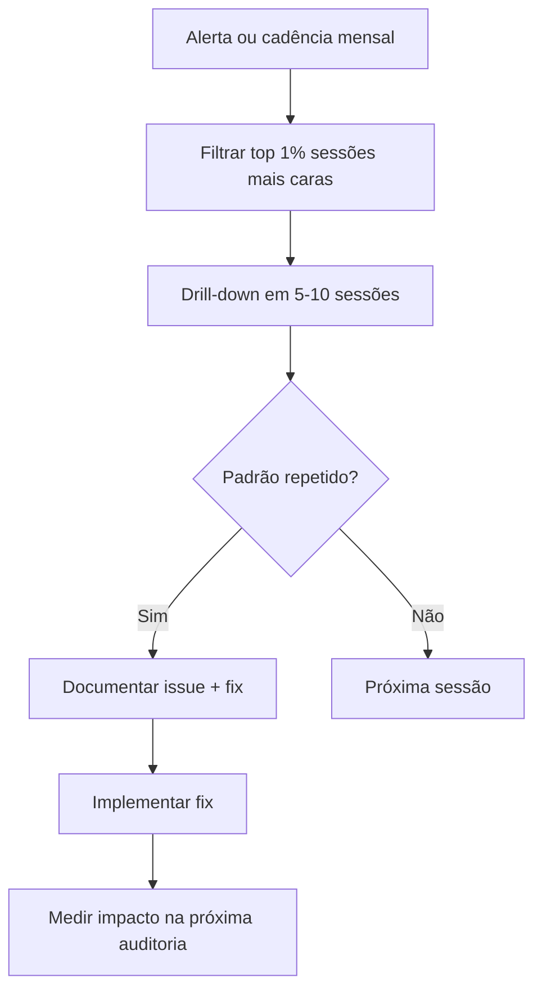

# Auditoria de consumo

> [!abstract] TL;DR
> Monitoramento mostra *quanto* gastou; auditoria mostra *por quê* gastou. É investigação causal: drill-down em traces para encontrar top offenders, padrões de desperdício e oportunidades de otimização. Sem cadência regular de auditoria (mensal, no mínimo), times só descobrem desperdício quando a fatura passa do budget — tarde demais.

## Auditoria vs monitoramento

| Pergunta | Onde procurar |
|---|---|
| "Quanto gastei este mês?" | Dashboard ([[04 - Monitoramento — ccusage, Langfuse, dashboards]]) |
| "Está dentro do budget?" | Dashboard + alerta |
| **"Por que esta sessão custou $4?"** | **Auditoria** |
| **"Qual feature está queimando 30% do budget?"** | **Auditoria** |
| **"Cadê o desperdício escondido?"** | **Auditoria** |

## Top offenders típicos

A cada auditoria, esperar encontrar pelo menos 2-3 destes padrões:

### 1. Tools verbosos sem filtro

`grep -r "TODO" .` retornando 5K matches que entram no histórico. Ou `cat package-lock.json` (50K tokens). Sintoma: turno único com >20K input tokens.

### 2. Histórico não compactado em sessão longa

Sessão de 2h sem compactação carregando 300K tokens em cada turno. Sintoma: input por turno cresce linearmente.

### 3. Retries invisíveis

Tool calls com sintaxe errada disparando retry automático. Sintoma: 2-3 turnos consecutivos com payloads quase idênticos.

### 4. Reasoning excessivo em tarefa simples

Extended thinking ligado para responder "qual é a capital de França?". Sintoma: reasoning_tokens >> output_tokens em queries triviais.

### 5. Modelo errado para a tarefa

Opus chamado para autocomplete; Haiku chamado para análise complexa que falha e re-tenta com Opus. Sintoma: distribuição enviesada de modelo por tipo de tarefa.

### 6. Tool definitions infladas

System prompt com 15 tools quando 3 seriam usadas. Sintoma: input fixo do system prompt > 10K tokens.

### 7. Caching mal configurado

`cache_control` ausente em prefixos repetidos; ou breakpoints no lugar errado. Sintoma: cache hit rate <40%.

## Workflow de auditoria

### Passo a passo prático

1. **Filtrar** — top 1% de sessões por custo (Langfuse: order by cost desc, Phoenix: sort by tokens)
2. **Amostrar** — 5-10 sessões representativas
3. **Drill-down** — abrir trace, ver turno-a-turno: quantos tokens, qual tool, qual output
4. **Identificar** — em que turno o gasto explode? Por quê?
5. **Categorizar** — qual dos 7 padrões acima?
6. **Fix** — código, prompt, config
7. **Medir** — auditoria seguinte deve mostrar redução

## Ferramentas

| Ferramenta | Forte em |
|---|---|
| **Langfuse** | Trace search, filtros por custo, comparação de versões |
| **Arize Phoenix** | Sessions com timeline visual, fácil drill-down |
| **LangSmith** | Filtros por tags, integração nativa LangChain |
| **Helicone** | Proxy + analytics; bom para teams sem instrumentação |
| **ccusage** (CLI) | Quick audit de Claude Code local |

## Cadência recomendada

| Time | Cadência | Profundidade |
|---|---|---|
| Dev solo | Mensal | 30 min, top 5 sessões |
| Time pequeno (5) | Quinzenal | 1h, top 10 sessões + relatório |
| Time grande (>10) | Semanal | Tracking contínuo + revisão semanal |
| Pós-incidente | Imediato | Drill em todas sessões >P95 |

## Checklist de auditoria mensal

- [ ] Top 10 sessões por custo identificadas
- [ ] Cada sessão classificada em pelo menos 1 dos 7 padrões
- [ ] Pelo menos 2 fixes priorizados
- [ ] Cache hit rate medido e comparado com mês anterior
- [ ] Distribuição de modelo por tipo de tarefa revisada
- [ ] Relatório curto (1 página) compartilhado com stakeholders

## Armadilhas

- **Auditar só o agregado** — média esconde outliers que são exatamente o problema.
- **Não documentar fixes** — mesmo padrão volta no mês seguinte sem aprendizado acumulado.
- **Auditoria sem ação** — relatório bonito sem fix implementado é teatro.
- **Auditar só pós-incidente** — descobre tarde. Cadência regular previne incidentes.

## Veja também

- [[04 - Monitoramento — ccusage, Langfuse, dashboards]]
- [[15 - Orçamento e hard limits]]
- [[17 - ROI de IA — quando o agente vale o custo]]
- [[18 - Playbook de economia — checklist completo]]

## Referências

- **Langfuse** — *Trace analysis and cost attribution docs* (2026).
- **Arize** — *LLM observability best practices* (2025).
