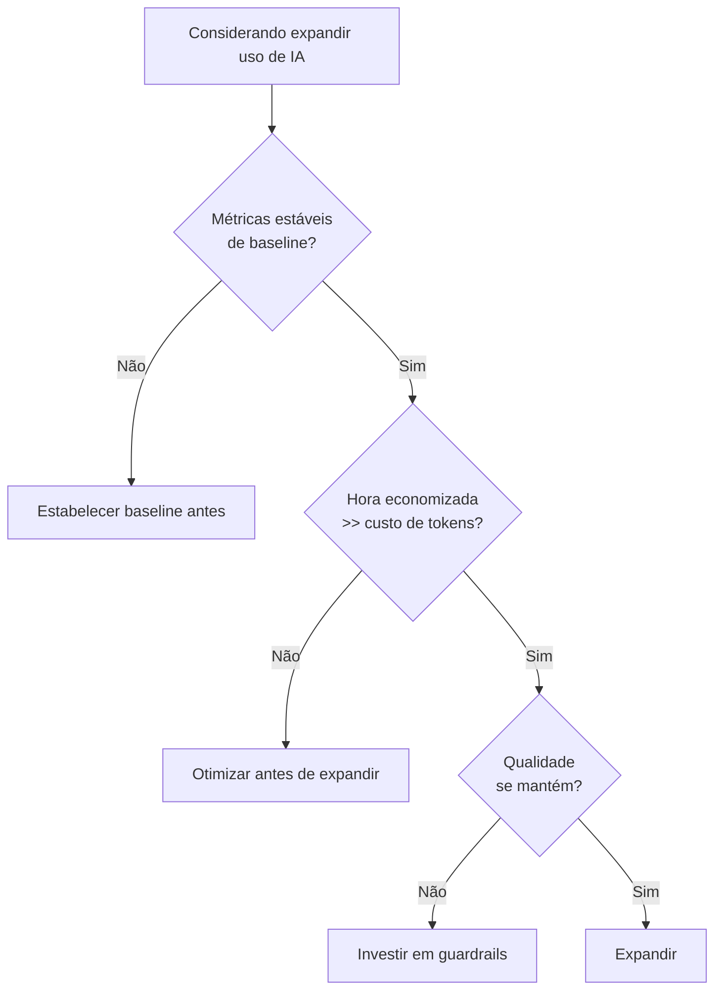

# ROI de IA — quando o agente vale o custo

> [!abstract] TL;DR
> A pergunta certa não é "quanto custa o agente?" — é "quanto custa **não** ter o agente?". ROI de IA se mede comparando custo de tokens vs custo de hora de engenheiro economizada, ajustado por qualidade e risco. A hora de um senior brasileiro ($30-60) compra ~10K-30K tokens de Sonnet — significa que se um agente economiza 1h por dia, ele paga $1000+/mês de tokens. Mas vanity metrics (uso, frequência) podem mascarar valor real (defeitos evitados, tempo recuperado).

## A equação básica

```
ROI = (Valor capturado - Custo de tokens - Custo de overhead) / Custo total
```

Onde:

- **Valor capturado** = horas economizadas × custo/hora + valor de defeitos evitados
- **Custo de tokens** = budget mensal de API / planos
- **Custo de overhead** = tempo de revisão, refatoração, retraining

> [!warning] ROI > 1 não é suficiente
> Se a alternativa (não usar IA) tem ROI maior em algum eixo (qualidade, segurança, predictability), IA não vale só porque "deu lucro". Veja [[#Quando IA NÃO vale a pena]].

## A matemática rápida

### Custo de hora vs custo de tokens

| Perfil (BR, 2026) | Custo/hora | Equivalente em tokens Sonnet 4.6 (input) |
|---|---|---|
| Junior | ~$15 | ~50K tokens |
| Pleno | ~$30 | ~100K tokens |
| Senior | ~$60 | ~200K tokens |
| Staff/Principal | ~$100+ | ~330K tokens |

**Leia: 1h de senior = 200K tokens de input.** Se um agente economiza 1h/dia desse senior, dá pra gastar até $60/dia em tokens (≈ $1.300/mês) antes de virar prejuízo direto.

### Payback period

```
Payback (meses) = Investimento inicial / (Economia mensal - Custo mensal)
```

Investimento inicial inclui: setup de ferramentas, treinamento, ajustes de processo. Tipicamente 20-80h por dev.

> [!example] Cálculo real
> - Setup: 40h × $60 = $2.400 (one-time)
> - Tokens: $200/mês
> - Economia (1.5h/dia × 20 dias × $60): $1.800/mês
> - Payback: $2.400 / ($1.800 - $200) = **1.5 meses**

## Métricas de valor (não apenas custo)

| Métrica | O que mede | Sinaliza |
|---|---|---|
| **Defect escape rate** | Bugs em prod / total | Qualidade do código gerado |
| **Rework ratio** | LOC reescritas / LOC commitadas | Tech debt acumulado |
| **Time-to-merge** | Idade média de PR | Velocidade real (não só geração) |
| **Cycle time** | Ideia → produção | Throughput do time |
| **Dev satisfaction** | NPS interno | Sustentabilidade |

> [!tip] Compare com baseline
> Métricas isoladas não dizem nada. Compare com o trimestre anterior à adoção de IA, ou com time controle, ou com benchmark da indústria.

## Vanity metrics que enganam

| Métrica vanity | Por que engana | Métrica melhor |
|---|---|---|
| Tokens consumidos/mês | Uso ≠ valor | Horas economizadas validadas |
| % de PRs com IA | Pode estar gerando lixo | PRs merged com IA × defect rate |
| Linhas de código geradas | Mais código ≠ mais valor | Features completas / sprint |
| Velocidade de geração | Rápido errado é caro | Time-to-merge (inclui review) |
| "Tickets fechados com agente" | Define-se "fechado" como? | Tickets sem regressão em 30 dias |

## Quando IA NÃO vale a pena

- **Qualidade crítica** com revisão custosa — o tempo de revisão pode anular a economia (medical, finance, infra crítica).
- **Domínio muito específico** sem dados suficientes para o modelo entender — o agente alucina mais do que ajuda.
- **Time pequeno e codebase pequena** — o overhead de configuração não amortiza.
- **Problema mal-definido** — IA acelera escrita, mas não substitui clareza de spec ([[Spec-Driven Development]]).
- **Métricas instáveis** — se você não consegue medir o ganho, está apostando, não investindo.
- **Compliance pesado** — auditoria de cada output gerado pode exigir mais trabalho do que escrever do zero.

## Decision framework



## Cadência de revisão

- **Mensal** — comparar custo vs economia do mês
- **Trimestral** — revisar métricas de qualidade (defect rate, rework)
- **Semestral** — decidir expandir, manter ou cortar feature/uso

## Armadilhas

- **Medir só uso, não valor** — produto fica viciado em métrica vanity.
- **Não medir contrafactual** — sem grupo controle ou baseline pré-IA, é fé.
- **Ignorar custo de revisão humana** — overhead invisível que come a economia.
- **Comparar IA com "fazer nada"** — comparar com a melhor alternativa não-IA é mais honesto.
- **Atribuir ganhos só à IA** — outros fatores (processo, time crescendo, dívida paga) afetam métricas.

## Veja também

- [[01 - O problema — por que tokens custam dinheiro]]
- [[15 - Orçamento e hard limits]]
- [[16 - Auditoria de consumo]]
- [[19 - Planos e tiers — Max, Pro, API, Enterprise]]
- [[20 - O futuro — tokens cada vez mais baratos]]

## Referências

- **Stack Overflow Developer Survey 2026** — *AI tools usage and productivity*.
- **GitHub Research** — *Quantifying GitHub Copilot's impact on developer productivity* (2024).
- **METR** — *Measuring impact of AI on real-world software development* (2025).
