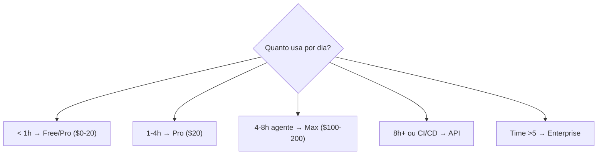

# Planos e tiers — Max, Pro, API, Enterprise

> [!abstract] TL;DR
> Providers oferecem múltiplos modelos de cobrança: pay-per-token (API), assinatura flat-rate (Pro/Max), e enterprise. Para dev solo que usa agentes 4h+/dia, planos flat-rate (Claude Max $100/mês, ChatGPT Plus $20/mês) geralmente são mais baratos que API pura. Para times e automação, API com routing é mais flexível. A decisão depende de volume, previsibilidade, e controle necessário.

## Comparativo de modelos de cobrança

| Modelo | Como cobra | Previsibilidade | Melhor para |
|--------|-----------|----------------|-------------|
| **API pay-per-token** | $/MTok por chamada | Variável | Automação, CI/CD, volume variável |
| **Pro ($20/mês)** | Flat rate, uso limitado | Alta | Dev casual, orçamento apertado |
| **Max ($100-200/mês)** | Flat rate, uso alto | Alta | Dev power user, agentes intensivos |
| **Enterprise** | Contrato anual, SLA | Muito alta | Times >10 devs, compliance |

### Claude (Anthropic) — maio 2026

| Plano | Preço | Limites | Modelos |
|-------|-------|---------|---------|
| Free | $0 | Muito limitado | Haiku |
| Pro | $20/mês | Uso moderado (Sonnet), limitado (Opus) | Sonnet, Opus |
| Max 5x | $100/mês | 5x uso do Pro | Sonnet, Opus |
| Max 20x | $200/mês | 20x uso do Pro | Sonnet, Opus |
| API | Pay-per-token | Sem limite (billing) | Todos |
| Enterprise | Contrato | Customizado | Todos + SLA |

### OpenAI — maio 2026

| Plano | Preço | Limites |
|-------|-------|---------|
| Free | $0 | Básico |
| Plus | $20/mês | GPT-4.1 padrão |
| Pro | $200/mês | Acesso prioritário, reasoning |
| API | Pay-per-token | Sem limite |
| Enterprise | Contrato | Customizado |

### Quando cada plano vale a pena

### Cálculo: API vs Max

Dev usando Claude Sonnet 4.6, 6h/dia, 22 dias/mês:

| | API | Max $100/mês |
|--|-----|-------------|
| Input estimado | ~3M tokens/dia | Incluído |
| Output estimado | ~500k tokens/dia | Incluído |
| Custo mensal | ~$330/mês | $100/mês |
| **Economia com Max** | — | **$230/mês** |

Para uso intensivo, flat-rate geralmente ganha. Para uso esporádico, API é mais econômica.

## Armadilhas

- **Pro para uso heavy** — o limite é atingido rápido. Invista no Max se usar agentes diariamente.
- **Max para uso leve** — se usa <1h/dia, $100/mês pode ser mais que API.
- **API sem monitoramento** — pay-per-token sem controle = fatura surpresa.
- **Vendor lock-in** — planos flat-rate prendem você ao provider. API permite trocar.

## Veja também
- [[15 - Orçamento e hard limits]]
- [[09 - Model routing — modelo certo para a tarefa]]
- [[04 - Monitoramento — ccusage, Langfuse, dashboards]]

## Referências
- **Anthropic** — *Pricing Page* (2026). Tabela oficial.
- **OpenAI** — *Pricing Page* (2026). Tabela oficial.
