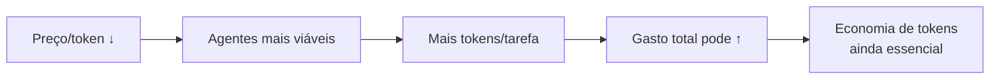

# O futuro — tokens cada vez mais baratos

> [!abstract] TL;DR
> O preço por token caiu ~100x entre 2023 e 2026, e a tendência continua. MoE, quantização, chips especializados, e competição entre providers aceleram a queda. Em 2027, modelos mid-tier de hoje serão commodities ultrabaratas. Mas volume de uso sobe ainda mais rápido — agentes consomem 10-100x mais tokens que chat. O gasto total pode SUBIR mesmo com preço por token caindo. A economia de tokens continuará sendo essencial.

## Como funciona

### Tendência de preço (input, por MTok, tier mid)

| Ano | Modelo representativo | Input $/MTok | Queda vs anterior |
|-----|----------------------|-------------|-------------------|
| 2023 | GPT-4 (março) | $30.00 | Baseline |
| 2024 | GPT-4o | $5.00 | -83% |
| 2025 | Claude 3.5 Sonnet | $3.00 | -40% |
| 2026 | Claude Sonnet 4.6 | $3.00 | Estável |
| 2026 | Gemini Flash | $0.50 | -83% vs Sonnet |
| 2026 | GPT-4.1 Nano | $0.10 | -97% vs GPT-4 |
| 2027 (projeção) | Tier mid | $0.50-1.00 | -50-70% |

### Fatores que reduzem preço

| Fator | Impacto |
|-------|---------|
| **MoE (Mixture of Experts)** | Menos computação por token (ativa <20% dos parâmetros) |
| **Quantização (INT4/INT8)** | Mesmo modelo, 2-4x menos memória GPU |
| **Chips especializados** | Groq, TPUs, Trainium — hardware otimizado para inferência |
| **Competição** | DeepSeek, Qwen forçam queda de preço global |
| **Escala** | Mais usuários = melhor utilização de hardware |

### Paradoxo do volume

Exemplo:
- 2024: Dev usa chat, ~50k tokens/dia → $0.25/dia
- 2026: Dev usa agente, ~2M tokens/dia → $6.00/dia (24x mais gasto, apesar de preço/token 6x menor)

### O que muda e o que não muda

| O que muda | O que NÃO muda |
|------------|---------------|
| Preço por token cai | Output continua sendo ~5x mais caro que input |
| Modelos mid-tier viram commodity | Flagship sempre terá premium |
| Contexto fica maior e mais barato | Contexto irrelevante ainda dilui qualidade |
| Caching fica padrão | Pruning ainda será necessário |

## Armadilhas

- **"Tokens vão ser grátis, não preciso otimizar"** — o volume cresce mais rápido que o preço cai.
- **"Esperar ficar mais barato antes de adotar"** — a vantagem competitiva de dominar agentes AGORA supera a economia de esperar.
- **Projeções lineares** — preço pode estagnar temporariamente se hardware supply for limitado.

## Veja também
- [[01 - O problema — por que tokens custam dinheiro]]
- [[09 - Model routing — modelo certo para a tarefa]]
- [[20 - O futuro dos LLMs — tendências 2026-2027]] (Trilha 1)

## Referências
- **Artificial Analysis** — *Token Price Trends* (2026). Dados históricos.
- **Benedict Evans** — *AI Costs and Scaling* (2026). Análise econômica.
