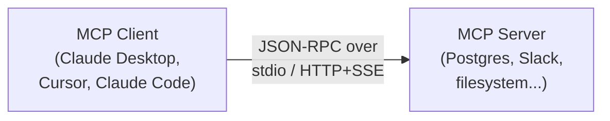
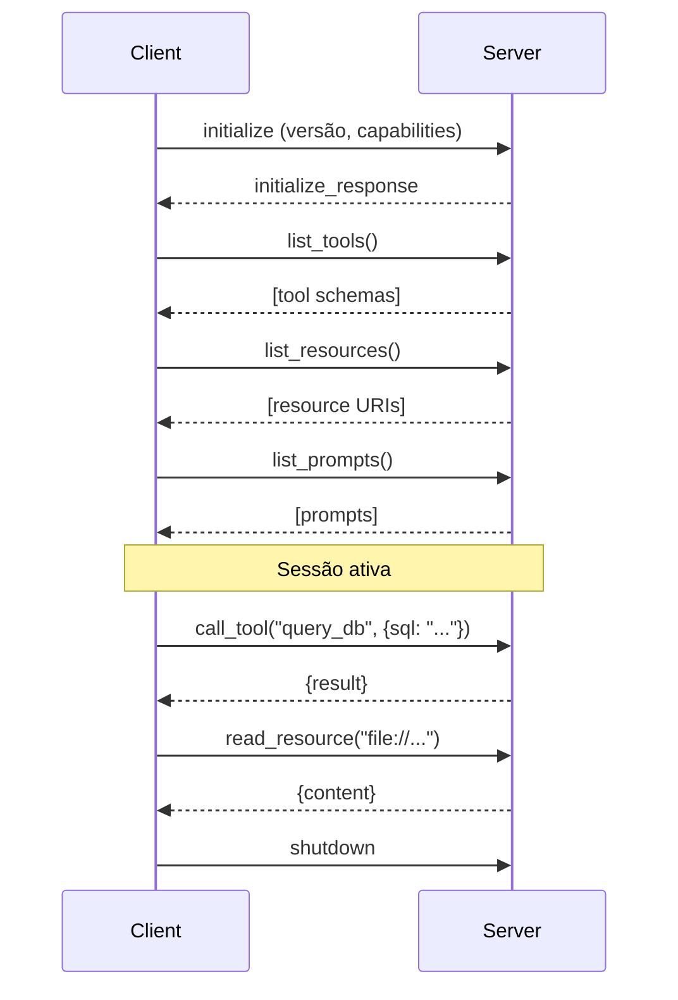
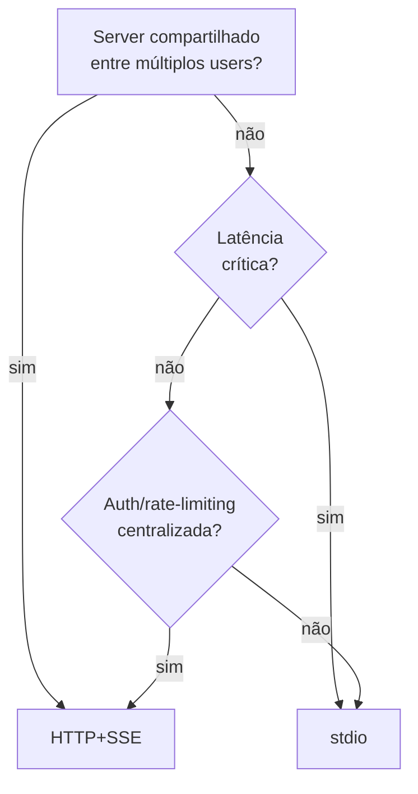

# Arquitetura cliente-servidor

> [!abstract] TL;DR
> MCP usa modelo **cliente-servidor** sobre **JSON-RPC 2.0**. Três transports: **stdio** (subprocesso local, mais comum), **HTTP+SSE** (remoto, multi-user), e **WebSocket** (bidirecional, casos específicos). Lifecycle típico: client conecta → discovery (list_tools/resources/prompts) → operações → close. Cada client (Claude Desktop, Cursor, Claude Code) tem mecanismo próprio de configurar servers — geralmente via JSON config file.

## O modelo cliente-servidor



- **Client**: aplicação que usa LLM (Claude Desktop, Cursor)
- **Server**: aplicação que expõe tools/resources/prompts
- **Protocol**: JSON-RPC 2.0 sobre transport escolhido

## Os 3 transports

### 1. stdio (mais comum)

Server roda como **subprocesso** do client, comunicando via stdin/stdout.

```
Client process
  ├── spawn → Server process
  ├── stdin (write JSON-RPC requests)
  └── stdout (read JSON-RPC responses)
```

**Quando usar:**
- Server local (mesmo machine que client)
- Solo dev, single user
- Setup simples

**Vantagens:**
- Sem network setup
- Auth implícita (mesmo user que rodou client)
- Latência mínima

**Desvantagens:**
- Não compartilha entre múltiplos users
- Cada client spawna seu próprio server
- Recursos duplicados

### 2. HTTP + SSE (multi-user, remoto)

Server roda **independente**, client conecta via HTTP. Server responde com Server-Sent Events para streams.

```
Server (rodando como serviço)
  ↑
  │ HTTP requests + SSE responses
  ↓
Client A    Client B    Client C
```

**Quando usar:**
- Server compartilhado entre time
- Self-hosted internal MCP
- SaaS MCP servers

**Vantagens:**
- Compartilhamento entre múltiplos users
- Persistent state no server
- Rate limiting, auth centralizada

**Desvantagens:**
- Mais setup (TLS, auth, deployment)
- Latência de rede

### 3. WebSocket (raro)

Bidirecional, full-duplex. Useful para casos onde server precisa **enviar eventos não-solicitados** ao client (subscriptions ativas).

Em 2026, raro usar diretamente — HTTP+SSE cobre 99% dos casos.

## Lifecycle de uma sessão



## JSON-RPC 2.0 — o wire protocol

```json
// Request
{
    "jsonrpc": "2.0",
    "id": 1,
    "method": "tools/call",
    "params": {
        "name": "query_database",
        "arguments": {"sql": "SELECT * FROM users LIMIT 10"}
    }
}

// Response
{
    "jsonrpc": "2.0",
    "id": 1,
    "result": {
        "content": [{"type": "text", "text": "..."}]
    }
}

// Error
{
    "jsonrpc": "2.0",
    "id": 1,
    "error": {
        "code": -32603,
        "message": "Database connection failed"
    }
}
```

Você raramente toca isso direto — SDKs (Python, TypeScript) abstraem.

## Configuração de servers no client

### Claude Desktop / Claude Code

```json
// ~/.config/claude/claude_desktop_config.json
{
  "mcpServers": {
    "postgres": {
      "command": "npx",
      "args": ["-y", "@modelcontextprotocol/server-postgres",
               "postgresql://..."]
    },
    "filesystem": {
      "command": "npx",
      "args": ["-y", "@modelcontextprotocol/server-filesystem", "/home/josenaldo/projects"]
    },
    "github": {
      "command": "npx",
      "args": ["-y", "@modelcontextprotocol/server-github"],
      "env": {
        "GITHUB_PERSONAL_ACCESS_TOKEN": "${GITHUB_PAT}"
      }
    }
  }
}
```

### Cursor

```json
// ~/.cursor/mcp.json (ou via UI)
{
  "mcpServers": {
    "postgres": { ... }
  }
}
```

### Codex CLI / outros

Cada cliente segue padrão similar com pequenas variações de filename.

## Capabilities negotiation

Na initialização, client e server negociam capabilities:

```json
// Client → Server
{
  "method": "initialize",
  "params": {
    "protocolVersion": "2025-06-18",
    "capabilities": {
      "roots": {},
      "sampling": {},
      "elicitation": {}
    }
  }
}

// Server → Client
{
  "result": {
    "capabilities": {
      "tools": {"listChanged": true},
      "resources": {"subscribe": true, "listChanged": true},
      "prompts": {"listChanged": true},
      "logging": {}
    }
  }
}
```

Permite compatibilidade incremental — server novo não quebra client antigo.

## Discovery patterns

### Discovery total na conexão

Client lista tudo no início. Padrão default.

```
Connect → list_tools → list_resources → list_prompts → ready
```

Custo: chamadas de listing podem ser caras se server tem milhares.

### Lazy discovery

Client lista quando necessário (só quando LLM perguntou sobre tools).

Não-padrão mas implementado em alguns clients (Cursor 3+).

### Subscription-based

Server notifica client de mudanças (`listChanged`). Útil em filesystem MCP onde arquivos mudam.

## MCP Inspector — debugar

```bash
npx @modelcontextprotocol/inspector
```

UI web para conectar a um MCP server e:
- Listar tools/resources/prompts
- Invocar tools manualmente
- Ver requests/responses raw
- Validar schemas

**Pré-requisito de produção** — sem inspector, debugging vira tentativa-e-erro.

## Latência típica

| Transport | Latência média |
|---|---|
| **stdio (local)** | 1-5ms |
| **HTTP+SSE (mesma região)** | 30-100ms |
| **HTTP+SSE (cross-region)** | 100-300ms |
| **WebSocket (mesma região)** | 20-80ms |

stdio é **muito** mais rápido. Use stdio quando puder.

## Decisão: stdio ou HTTP+SSE?



## Anti-patterns

- **HTTP+SSE para single user** — overkill, latência sem ganho
- **stdio para multi-user** — não escala, cada client duplica processo
- **Server sem capabilities negotiation** — quebra com clients novos
- **Sem MCP Inspector na stack** — debugging é tortura
- **Discovery sem cache no client** — listing toda hora é caro

## Veja também

- [[01 - O que é MCP e por que importa]]
- [[02 - Os três primitivos — Tools, Resources, Prompts]]
- [[05 - Construindo um MCP server local]]
- [[06 - MCP remoto — HTTP + SSE para times]]
- [[08 - Ecossistema 2026 — clients e integrações]]

## Referências

- **MCP Spec** — *Architecture and Transports* (modelcontextprotocol.io/spec)
- **JSON-RPC 2.0** — *jsonrpc.org/specification*
- **MCP Inspector** — *github.com/modelcontextprotocol/inspector*
- **Anthropic** — *Configuring MCP servers in Claude Desktop* (2025)
