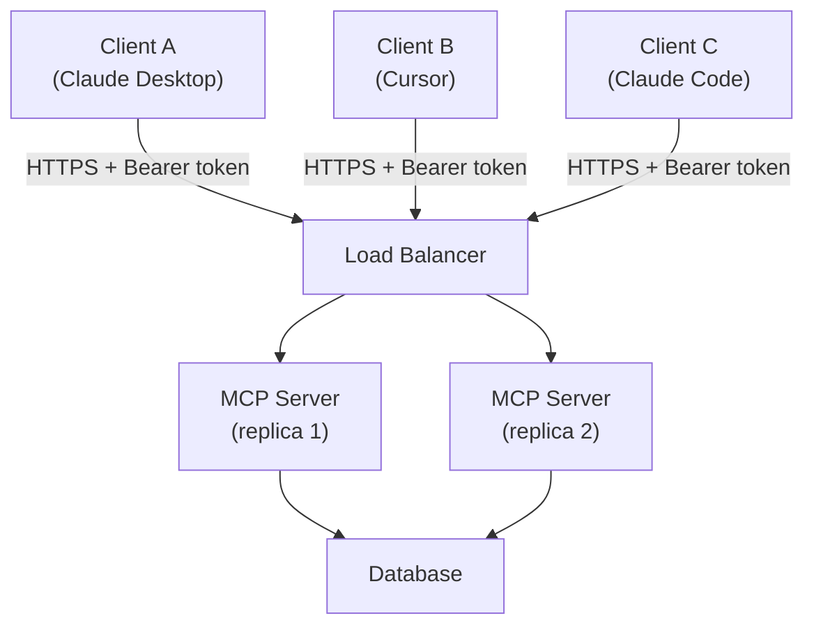

# MCP remoto — HTTP + SSE para times

> [!abstract] TL;DR
> stdio é simples mas **single-user**. Para times compartilharem MCP server, use **HTTP + SSE** (Server-Sent Events). Setup: server roda como serviço (Docker, K8s, ou managed), client conecta via URL com auth. Adiciona overhead de TLS, auth, deployment, mas habilita: server compartilhado, rate limit centralizado, audit log unificado, atualizações sem update no client. Em 2026, padrão para servers internos enterprise.

## Quando partir para HTTP+SSE

Sinais que indicam migrar de stdio:

- Múltiplos devs precisam do **mesmo server** (cada um spawnando subprocess é desperdício)
- Server precisa de **state persistente** entre sessões
- Auth/permissão **centralizada** (não cada user com creds próprias)
- Audit log **unificado** (compliance)
- Server tem **APIs caras** (rate limit compartilhado faz sentido)
- Update do server **sem update no client** (deploy server, todos pegam)

## Arquitetura



Server vira **microserviço** como qualquer outro.

## Setup mínimo (Python)

```python
# server.py
from mcp.server.fastmcp import FastMCP
from mcp.server.sse import SseServerTransport
import asyncio
from starlette.applications import Starlette
from starlette.routing import Mount, Route

mcp = FastMCP("team-mcp-server")

@mcp.tool()
def query_db(sql: str) -> dict:
    """Query the database."""
    return db.execute(sql)

# Setup HTTP+SSE transport
transport = SseServerTransport("/messages")

async def handle_sse(request):
    async with transport.connect_sse(request.scope, request.receive, request._send) as streams:
        await mcp._mcp_server.run(streams[0], streams[1], mcp._mcp_server.create_initialization_options())

app = Starlette(routes=[
    Route("/sse", endpoint=handle_sse),
    Mount("/messages", app=transport.handle_post_message),
])

# Run with uvicorn
# uvicorn server:app --host 0.0.0.0 --port 8000
```

## Configuração no client

```json
{
  "mcpServers": {
    "team-server": {
      "url": "https://mcp.empresa.com/sse",
      "headers": {
        "Authorization": "Bearer ${MCP_TOKEN}"
      }
    }
  }
}
```

Client conecta via URL em vez de spawn de processo.

## Auth — onde realmente importa

stdio assume que processo filho herda permissão do user. HTTP+SSE precisa **auth explícita**.

### Opção 1 — Bearer token (mais comum)

```python
from starlette.middleware.authentication import AuthenticationMiddleware
from starlette.authentication import (
    AuthenticationBackend, BaseUser, AuthCredentials
)

class BearerAuthBackend(AuthenticationBackend):
    async def authenticate(self, request):
        auth = request.headers.get("Authorization", "")
        if not auth.startswith("Bearer "):
            return None
        token = auth[7:]
        user = await validate_token(token)
        if not user:
            return None
        return AuthCredentials(["authenticated"]), user

app.add_middleware(AuthenticationMiddleware, backend=BearerAuthBackend())
```

Tokens podem ter scopes:

```python
@mcp.tool()
async def admin_action(request, ...):
    if "admin" not in request.user.scopes:
        raise PermissionError("Admin scope required")
    ...
```

### Opção 2 — OAuth 2.1 (enterprise)

MCP spec define OAuth flow. Mais setup, mas integra com SSO existente.

```
1. Client redirect → Auth server (Keycloak, Auth0, Okta)
2. User autentica
3. Auth server → Client com authorization code
4. Client → MCP server com code → access token
5. Client usa access token em chamadas MCP
```

Use OAuth quando:
- Auth corporativa existe (SSO)
- Compliance exige
- Multi-tenant com permissões fine-grained

### Opção 3 — mTLS (alta segurança)

Client e server apresentam certs. Comum em internal-only services.

## Rate limiting

```python
from slowapi import Limiter
from slowapi.util import get_remote_address

limiter = Limiter(key_func=lambda r: r.user.id)  # per user

@mcp.tool()
@limiter.limit("100/minute")
async def expensive_tool(...):
    ...
```

Importante para servers que falam com APIs externas pagas.

## Deploy patterns

### Docker simples

```dockerfile
FROM python:3.12-slim
WORKDIR /app
COPY requirements.txt .
RUN pip install -r requirements.txt
COPY server.py .
EXPOSE 8000
CMD ["uvicorn", "server:app", "--host", "0.0.0.0", "--port", "8000"]
```

```bash
docker build -t my-mcp-server .
docker run -p 8000:8000 -e DATABASE_URL=... my-mcp-server
```

### Kubernetes (production)

```yaml
apiVersion: apps/v1
kind: Deployment
metadata:
  name: mcp-server
spec:
  replicas: 3
  selector:
    matchLabels:
      app: mcp-server
  template:
    metadata:
      labels:
        app: mcp-server
    spec:
      containers:
      - name: server
        image: registry/mcp-server:1.2.0
        ports:
        - containerPort: 8000
        env:
        - name: DATABASE_URL
          valueFrom:
            secretKeyRef:
              name: mcp-secrets
              key: database_url
```

Health checks, autoscaling, etc — como qualquer microserviço.

### Managed (Cloudflare Workers, Vercel, Fly.io)

Cloudflare Workers tem suporte nativo a MCP em 2026:

```javascript
import { McpAgent } from "@cloudflare/mcp-agent";

export default new McpAgent({
  name: "team-server",
  tools: { ... },
}).asWorker();
```

Outros: Smithery (managed MCP), Anthropic-hosted (em beta).

## Observabilidade

```python
import logging
import time

@mcp.tool()
async def query_db(request, sql: str):
    start = time.time()
    user_id = request.user.id

    try:
        result = await db.execute(sql)
        log_event("tool_call", {
            "tool": "query_db",
            "user": user_id,
            "duration_ms": (time.time() - start) * 1000,
            "rows": len(result),
            "success": True
        })
        return result
    except Exception as e:
        log_event("tool_call", {
            "tool": "query_db",
            "user": user_id,
            "duration_ms": (time.time() - start) * 1000,
            "error": str(e),
            "success": False
        })
        raise
```

Métricas a tracar:
- Tool calls / minuto (per tool, per user)
- Latência p50, p95, p99
- Error rate
- Cost (se tool chama APIs pagas)

## Quando NÃO migrar para HTTP+SSE

❌ Single user (stdio basta)
❌ Server com tools que precisam de fs local (filesystem MCP)
❌ Latência crítica <50ms (overhead de rede)
❌ Time pequeno sem ops capability

## Custo

Server HTTP+SSE rodando 24/7 em produção:

| Setup | Custo/mês |
|---|---|
| Fly.io / Railway pequeno | $10-50 |
| Cloudflare Workers | $0-20 (free tier generoso) |
| K8s self-hosted | $30-100 (compute) + ops |
| Managed (Smithery, Anthropic) | $50-200 |

stdio: $0 (roda no machine do user).

## Anti-patterns

- **HTTP+SSE para single user** — overengineering
- **Sem auth** — server é gateway pra dados internos
- **Sem rate limit** — abuse mata budget de APIs externas
- **Server stateful sem persistência** — restart perde tudo
- **Sem health checks** — restarts silenciosos quebram clients
- **Mesmo server para dev e prod** — accidents irrecuperáveis
- **Audit log apenas em error** — ações bem-sucedidas também precisam tracking

## Métricas

| Métrica | Alvo |
|---|---|
| **Latência p95 tool call** | <500ms |
| **Uptime** | >99.9% |
| **Auth failure rate** | <1% |
| **Rate limit triggers/dia** | <5% das chamadas |
| **Custo por tool call** | <$0.001 |

## Veja também

- [[03 - Arquitetura cliente-servidor]]
- [[05 - Construindo um MCP server local]]
- [[07 - Segurança em MCP]]
- [[Segurança e Guardrails|06 - Permissões e sandboxing]]
- [[Segurança e Guardrails|11 - Governance as architecture — EU AI Act, GDPR, licenças]]

## Referências

- **MCP Spec** — *Transports section (HTTP+SSE)* (modelcontextprotocol.io)
- **Cloudflare** — *MCP on Cloudflare Workers* (2025)
- **Smithery.ai** — managed MCP hosting
- **Anthropic** — *Hosted MCP servers (beta)* (2026)
