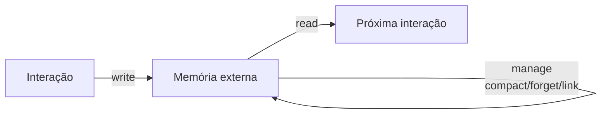

# O que é memória em IA

> [!abstract] TL;DR
> Memória em IA é a capacidade de um sistema com LLM lembrar de informação além da janela de contexto atual — entre sessões, entre tarefas, ao longo do tempo. Por padrão, LLMs não têm memória: cada conversa começa do zero. "Memória de agentes" é o conjunto de técnicas que resolvem isso, formalizado em surveys acadêmicos e implementado em frameworks de produção em 2026.

## O que é

Quando alguém em 2026 diz que um agente "tem memória", o termo carrega ambiguidade. Há pelo menos três coisas distintas chamadas de memória no contexto de LLMs, e confundi-las é a fonte mais comum de erro arquitetural na hora de desenhar um sistema. Distinguir os três tipos é o primeiro passo para entender qualquer discussão técnica do campo.

1. **Memória in-context.** É o conteúdo do prompt da chamada atual: system message, mensagens anteriores da conversa em curso, documentos colados, resultados de tools. Vive dentro da janela de contexto e é totalmente efêmera — termina no instante em que a chamada termina. Quando você pergunta "lembra do que falamos ontem?" e o ChatGPT parece lembrar, é porque a interface injetou o histórico no prompt. O modelo em si não lembra de nada; ele apenas lê o que recebe.

2. **Memória persistente.** Informação preservada entre chamadas e sessões em um substrato externo ao modelo: arquivos markdown, banco vetorial, grafo de conhecimento, banco relacional, log estruturado. O agente lê e escreve nesse substrato via tools ou via injeção de trechos no prompt. É **este** o foco da trilha "Memória de Agentes". Quando este vault fala em "memória de agentes", "agent memory" ou "agentic memory", está sempre falando deste tipo.

3. **Memória parametrizada.** Informação "absorvida" pelos pesos do modelo durante pré-treino ou fine-tuning. É o que faz o LLM "saber" que Paris é capital da França sem que ninguém precise contar. Praticamente imutável após o treino — atualizar exige novo treino, com custo proibitivo na prática. Não é o que esta trilha discute, mas vale ter o nome para não confundir com os outros dois.

A trilha inteira gira em torno do tipo (2). Qualquer técnica, framework ou arquitetura discutida nas próximas notas é, no fundo, uma forma diferente de organizar memória persistente em volta de um LLM que, sozinho, não lembra de nada.

## Por que importa

Sem memória persistente, agents são amnésicos. Cada sessão recomeça do zero: repetem perguntas que já foram respondidas, não acumulam contexto sobre quem é o usuário, não evoluem com o uso, não percebem que o projeto de hoje é continuação direta da conversa de ontem. Para um chat eventual de tirar dúvida pontual isso é aceitável — para qualquer sistema que pretende ser **parceiro contínuo** de trabalho, é fatal.

Em 2026, agentes memoriosos viraram precondição para classes inteiras de casos de uso que antes ficavam no protótipo: assistentes pessoais que aprendem hábitos, automação de longa duração que mantém estado entre disparos, sistemas de pesquisa que compõem conhecimento ao longo de meses, agents de coding que internalizam convenções de um codebase. Toda a discussão sobre "agentes autônomos" pressupõe, mesmo quando não diz com todas as letras, alguma forma de memória persistente.

O campo amadureceu rápido. Em 2026 já existem surveys acadêmicos consolidando vocabulário e taxonomias — o de Pengfei Du, "Memory for Autonomous LLM Agents: Mechanisms, Evaluation, and Emerging Frontiers", é uma referência central. O ICLR 2026 hospedou o workshop "MemAgents", dedicado especificamente ao tema. E há múltiplos frameworks de produção em circulação — cada um detalhado em outras notas desta trilha — disputando como exatamente fazer memória persistente funcionar.

## Como funciona

A ideia central é simples e merece ser repetida porque costuma demorar para "cair a ficha": **o LLM não tem memória nativa**. Tudo que parece memória é truque de engenharia construído em volta do modelo, externo a ele. O modelo continua sendo uma função pura — entra prompt, sai resposta, sem estado entre chamadas. A memória vive fora.

A arquitetura genérica que aparece em praticamente todos os sistemas modernos pode ser resumida num loop write-manage-read, formalização proposta no survey de 2026 de Du:

- **Write.** O agente decide o que vale guardar de cada interação: fatos sobre o usuário, decisões tomadas, resumos de longas conversas, observações sobre o ambiente.
- **Manage.** Memória que só cresce vira lixo. O sistema precisa compactar (resumir entradas redundantes), indexar (criar embeddings, links, tags), conectar (cruzar referências entre entradas) e esquecer (descartar o que envelheceu mal). Esta é a etapa que mais separa um sistema profissional de um log bruto.
- **Read.** Quando uma nova interação começa, o agente recupera o que é relevante — por busca vetorial, por wikilinks, por consulta a grafo, por leitura direta de markdown — e injeta no prompt da próxima chamada.

O substrato em que essa memória externa vive é um eixo de decisão importante: pode ser markdown plano, banco vetorial, grafo de conhecimento, ou combinações híbridas — cada escolha com tradeoffs próprios, explorados em [[08 - Arquitetura de um sistema de memória]] e em [[09 - Panorama de implementações (abril 2026)|09 - Panorama de implementações]].

Vale registrar uma referência foundational: em 2023, Park e colegas (Stanford) introduziram em "Generative Agents" o conceito de **memory stream** — um log apendado de observações com pontuação de relevância, recência e importância para recuperação. Foi um dos primeiros desenhos completos do loop write-manage-read aplicado a agentes. O paper é detalhado em [[17 - Generative Agents (Park, Stanford 2023)]] e fica como pré-leitura recomendada para quem quiser entender a genealogia técnica do campo.

## Quando usar / quando não usar

**Quando faz sentido:**

- Tarefas que **atravessam sessões** — assistente que se lembra hoje do que ficou combinado ontem.
- **Contexto compartilhado** entre usuários ou entre execuções que precisa persistir além da chamada atual.
- Agents que **aprendem com uso** — skills emergentes, preferências do usuário, idiossincrasias de um projeto.
- Domínios com **conhecimento que evolui** — projeto longo, relacionamento profissional contínuo, pesquisa de um tema por meses.
- Composição de conhecimento ao longo do tempo — quando o valor está em **acumular e cruzar**, não em consultar uma fonte única.

**Quando NÃO faz sentido:**

- **Tasks one-shot.** Se cada execução é independente, não há acumulação que justifique a infraestrutura.
- **Dados sensíveis sem proteção adequada.** Memória persistente é, por definição, dado pessoal armazenado — vira responsabilidade LGPD/GDPR. Sem governance clara, é risco maior que valor.
- Quando **RAG sobre docs fixos resolve.** Se o conhecimento já está num corpus estável e o problema é só "achar o trecho certo", retrieval clássico basta. A distinção é central e está detalhada em [[04 - RAG vs memória de longo prazo]].
- Quando o **custo de manutenção excede o valor.** Memória profissional exige lint, governance, observabilidade, esquecimento deliberado. Sem orçamento para isso, a memória apodrece e contamina respostas futuras.

## Armadilhas comuns

> [!warning] Erros recorrentes em quem começa
> Os itens abaixo são confusões conceituais que aparecem com frequência em discussões públicas e em desenhos iniciais de sistemas. Vale internalizar antes de seguir adiante na trilha.

- **Confundir RAG com memória.** RAG é retrieval reativo sobre documentos estáticos curados; memória de agentes é construção ativa que evolui com a interação. O LLM em RAG **lê** um corpus fixo; em sistemas de memória, o LLM **escreve** o corpus que depois consulta. A diferença é categórica e está no centro de [[04 - RAG vs memória de longo prazo]].
- **"Memorizar tudo" sem políticas de forget.** Memória que só cresce vira lixo informacional: ruído sufoca sinal, embeddings perdem precisão, prompts ficam poluídos. Esquecer deliberadamente é parte do design, não falha.
- **Supor que o LLM "lembra" da sessão passada.** Não lembra. Cada chamada começa do zero. Quando parece lembrar, é porque algum sistema externo injetou histórico no prompt — você só não viu acontecer.
- **Tratar memória como log passivo.** Anotar tudo num arquivo append-only não é memória, é histórico bruto. Sem etapa de manage — compactação, indexação, links emergentes, esquecimento — o sistema não evolui.
- **Confiança cega em conteúdo gerado pelo LLM.** Se o agente escreve a memória sozinho, erros silenciosos viram fatos consolidados que contaminam respostas futuras. Em domínios sensíveis (saúde, jurídico, financeiro), revisão humana de páginas críticas não é luxo.

## Veja também

- [[02 - O problema das janelas de contexto]] — o problema técnico que motiva tudo
- [[03 - Taxonomia da memória (episódica, semântica, procedural)]] — vocabulário fundamental
- [[04 - RAG vs memória de longo prazo]] — distinção crucial
- [[06 - O LLM Wiki Pattern (gist do Karpathy)]] — abordagem de Karpathy
- [[17 - Generative Agents (Park, Stanford 2023)]] — paper foundational

## Referências

- **Du, Pengfei (2026)** — "Memory for Autonomous LLM Agents: Mechanisms, Evaluation, and Emerging Frontiers". `https://arxiv.org/abs/2603.07670` — survey que formaliza o loop write-manage-read e apresenta cinco famílias de mecanismos de gerenciamento de memória, com avaliação em benchmarks multi-sessão.
- **The New Stack** — "Memory for AI Agents: A New Paradigm of Context Engineering" — cobertura editorial que enquadra memória de agentes como o próximo capítulo do "context engineering" depois de prompting e RAG.
- **Park, J. S. et al. (2023)** — "Generative Agents: Interactive Simulacra of Human Behavior". `https://arxiv.org/abs/2304.03442` — paper foundational de Stanford que introduziu o conceito de memory stream com pontuação de relevância, recência e importância. Detalhado em [[17 - Generative Agents (Park, Stanford 2023)]].
