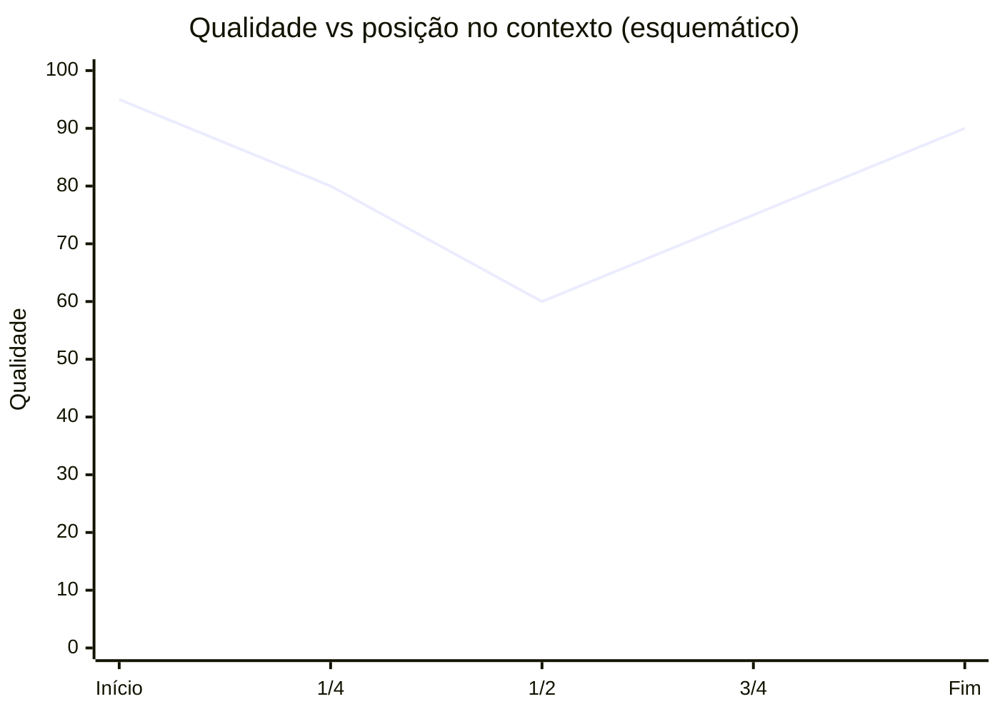

# O problema das janelas de contexto

> [!abstract] TL;DR
> Mesmo com janelas de contexto de 1M-2M tokens em 2026, há limites práticos que impedem tratar contexto longo como substituto de memória. Custo cresce linearmente com o tamanho do prompt, latência de prefill também, e o fenômeno **lost in the middle** faz informação no meio do contexto ser usada pior que nas bordas. Soma-se a isso o **context rot**: redundância e ruído acumulados degradam a qualidade ao longo da sessão. Janela grande não é memória resolvida — é um recurso caro que precisa ser gerenciado.

## O que é

Janela de contexto é o número de tokens que um LLM processa em uma única chamada, somando entrada (system prompt, histórico, documentos, tool results) e saída gerada. Tudo que o modelo "sabe" sobre a tarefa em curso vive ali; nada além disso é considerado. Quando a janela enche, o conteúdo mais antigo é truncado ou descartado pelo orquestrador antes da próxima chamada.

Em abril de 2026 os limites declarados pelos principais provedores são, em ordem de grandeza:

- **Claude Opus 4.7** e **Sonnet 4.6**: até **1M tokens** de contexto.
- **Gemini 2.5 Pro**: **1M tokens** atual, com **2M tokens** anunciado (março de 2025) mas ainda pendente em abril de 2026.
- **GPT-5 Pro**: contexto total de **400K tokens** (**272K** máx de input + **128K** máx de output) — significativamente menor que os concorrentes na ponta de contexto longo.

> [!info] GPT-5.5 (abril de 2026)
> **GPT-5.5**, lançado em **23-24 de abril de 2026** (dois dias antes desta nota), sobe para **1M tokens** de contexto — fechando a distância para Claude e Gemini. Esses números mudam rapidamente; antes de citar em produção, sempre confira a página oficial de cada provedor.

A leitura ingênua é animadora: "se cabe um livro no prompt, por que memória externa?". Esta nota responde com quatro problemas concretos.

## Por que importa

A premissa de que "modelo grande resolve tudo, basta jogar o histórico inteiro no prompt" é uma das tentações mais comuns ao desenhar um agente. Ela parece elegante: dispensa banco vetorial, RAG, lógica de retrieval, esquecimento. Mas se desfaz rápido em produção. Os quatro problemas listados a seguir — custo, latência, lost-in-the-middle e context rot — são a razão estrutural pela qual memória persistente continua necessária mesmo com janelas de 1M+ tokens.

Internalizar esses limites é o que separa um sistema que funciona em demo de um que sobrevive em produção. É também o que motiva todo o resto da trilha: cada framework discutido nas próximas notas é, no fundo, uma forma diferente de não pagar o custo de jogar tudo no prompt o tempo todo.

## Como funciona — anatomia do problema

Os quatro problemas abaixo se manifestam em ordem crescente de sutileza. Os dois primeiros são econômicos e visíveis na fatura; os dois últimos são qualitativos e só aparecem em avaliação cuidadosa.

### 1. Custo linear em tokens

Cada token enviado e cada token gerado é cobrado. Para Claude Opus 4.7, em abril de 2026, a tabela oficial cita aproximadamente **$5 por milhão de tokens de input** e **$25 por milhão de tokens de output**. Modelos de Sonnet e Haiku ficam abaixo, e há descontos relevantes via prompt caching e batch processing — mas o custo nominal segue linear no tamanho do prompt.

Em números arredondados: encher uma janela de 1M tokens de input em Opus custa cerca de **$5 por requisição** (sem cache). Para um chat eventual, é trivial. Para um app com volume — milhares de usuários, várias chamadas por sessão — vira fatura proibitiva rapidamente. Memória externa existe, em parte, exatamente para evitar enviar o mesmo histórico repetido a cada turno.

### 2. Latência de prefill

Antes do primeiro token de saída, o modelo precisa processar todo o input — etapa chamada **prefill**. O TTFT (*time to first token*) é dominado por esse custo quando o prompt é longo. Attention tradicional é **O(n²)** em memória e compute em relação ao tamanho do contexto, então prompts grandes não escalam linearmente em latência: escalam pior.

Otimizações como **FlashAttention**, **paged attention**, kernels customizados e técnicas de KV-cache mitigam constantes e melhoram throughput, mas não eliminam a complexidade assintótica. Em janelas de centenas de milhares a milhões de tokens, é normal o usuário esperar dezenas de segundos antes do primeiro caractere aparecer. Para aplicações conversacionais, isso é fatal de UX. Para aplicações batch, é apenas caro.

### 3. Lost in the middle

Mesmo quando o modelo aceita o prompt longo e o custo é absorvido, há um problema de qualidade documentado: o paper **"Lost in the Middle: How Language Models Use Long Contexts"**, de Liu et al. (2023, arXiv:2307.03172), mostrou empiricamente que LLMs **usam pior a informação posicionada no meio do contexto** do que a informação nas bordas. A performance forma uma curva em U: alta no início, vale no meio, recuperação no fim.

O fenômeno se manifesta tanto em modelos com janela "pequena" quanto em modelos explicitamente desenhados para contexto longo. Em prompts de dezenas de milhares de tokens a degradação já é mensurável; em centenas de milhares, vira dramática em tasks que exigem raciocínio multi-hop ou recuperação precisa. A implicação prática é incômoda: **onde você coloca a informação no prompt importa**, e enterrar fato crítico no meio de um contexto gigante é receita para o modelo "esquecer" mesmo lendo.

O gráfico acima é esquemático — números reais variam por modelo, tarefa e tamanho do prompt — mas a forma da curva é robusta na literatura.

### 4. Context rot

O quarto problema é mais sutil e menos formalizado academicamente, mas conhecido por qualquer pessoa que tenha mantido uma sessão longa com um agente: **a qualidade da resposta degrada ao longo do tempo mesmo dentro da janela**. Causas se sobrepõem:

- **Repetição.** O modelo reciclou a mesma instrução cinco vezes; agora ela compete consigo mesma.
- **Redundância.** Tool results acumulados trazem o mesmo fato em formatos diferentes, diluindo sinal.
- **Ruído.** Mensagens de erro, tentativas falhas, checkpoints intermediários ocupam espaço sem agregar.
- **Drift.** Decisões antigas que foram revistas continuam no histórico, criando contradição com o estado atual.

Context rot é um dos motivos pelos quais resumir e descartar — *manage* no loop write-manage-read discutido em [[01 - O que é memória em IA]] — é parte essencial do design, não detalhe de polimento. Memória externa bem mantida é, em última análise, a forma mais eficaz de evitar que o contexto vire lixão.

## Quando contexto longo basta / quando não

**Bom para:**

- **Single-doc analysis** estável e de tamanho moderado — analisar um artigo, um PDF de poucas páginas, um log de algumas dezenas de milhares de tokens.
- **Raciocínio cruzado entre poucas peças** que precisam estar juntas para fazer sentido — comparar dois contratos, sintetizar três papers.
- **Casos isolados** em que memória persistente seria overkill — script único, automação de uma vez só, exploração ad-hoc.
- **Prompts cacheáveis e estáveis** — system prompts grandes que se repetem entre chamadas se beneficiam fortemente de prompt caching, reduzindo custo efetivo do contexto longo.

**Ruim para:**

- **Histórico cumulativo** de chats de longa duração — cresce sem limite e custa caro a cada turno.
- **Multi-session** — sessões separadas precisam de algo que sobreviva entre chamadas, e janela de contexto não sobrevive.
- **Dados que mudam frequentemente** — manter no prompt obriga reenvio constante e arrisca informação desatualizada coexistir com nova.
- **Apps com volume relevante de usuários** — o custo linear vira inviável em qualquer ordem de grandeza séria.
- **Tasks que exigem precisão de recuperação** — lost-in-the-middle ataca exatamente esse caso, e RAG bem feito costuma vencer prompt longo em retrieval factual.

## Armadilhas comuns

> [!warning] Erros recorrentes ao desenhar com contexto longo
> Os itens abaixo aparecem com frequência em discussões públicas e em decisões iniciais de arquitetura. Vale internalizar antes de assumir que "1M tokens resolve".

- **Confiar no número da janela sem benchmark próprio.** "1M tokens" é a capacidade nominal, não a usável. Modelos diferentes degradam em ritmos diferentes; alguns são quase inúteis acima de 200K em tasks difíceis. Antes de apostar a arquitetura nesse limite, rode avaliação na sua tarefa real.
- **Esquecer que cada token custa.** Prompts gigantes em produção viram fatura surpresa no fim do mês. O cálculo *tokens × chamadas × usuários × dias* é o que separa "funciona em demo" de "sustenta em escala".
- **Ignorar lost-in-the-middle.** Posicionar fato crítico no meio de um prompt longo é furada documentada na literatura. Se precisa estar lá, repita nas bordas, ou estruture o retrieval para que só o relevante chegue ao prompt.
- **Achar que long context substitui RAG ou memória.** Quase nunca substitui. Long context é ótimo para uma análise pontual de um documento; RAG é ótimo para retrieval estável sobre corpus fixo; memória persistente é ótima para acumulação evolutiva. São ferramentas distintas, com regimes distintos — distinção detalhada em [[04 - RAG vs memória de longo prazo]].
- **Tratar prefill como grátis.** TTFT é parte da experiência percebida. Em chat, dezenas de segundos de espera quebram o produto antes de qualquer problema de qualidade aparecer.

## Veja também

- [[01 - O que é memória em IA]] — o conceito que vem antes
- [[04 - RAG vs memória de longo prazo]] — alternativa pragmática para retrieval estável
- [[05 - Beyond RAG - quando RAG não basta]] — onde o problema continua mesmo com RAG
- [[08 - Arquitetura de um sistema de memória]] — como sistemas reais resolvem
- [[09 - Panorama de implementações (abril 2026)|09 - Panorama de implementações]] — frameworks que tratam dos problemas acima

## Referências

- **Liu, N. F. et al. (2023)** — "Lost in the Middle: How Language Models Use Long Contexts". `https://arxiv.org/abs/2307.03172` — paper foundational do fenômeno: modelos usam pior informação no meio do contexto, com curva de qualidade em U entre início e fim. Avaliação em multi-document QA e key-value retrieval.
- **Anthropic (2024)** — "Introducing Contextual Retrieval". `https://www.anthropic.com/news/contextual-retrieval` — post explicando como Anthropic combina retrieval contextualizado com prompt caching para mitigar custo e qualidade em prompts longos; pano de fundo prático para as tradeoffs discutidas aqui.
- **Anthropic — Pricing oficial.** `https://www.anthropic.com/pricing` (e `https://platform.claude.com/docs/en/about-claude/pricing`) — tabela de preços por milhão de tokens de input/output dos modelos Claude. Em abril de 2026, Opus 4.7 figurava em ~$5/M input e ~$25/M output, com descontos via prompt caching e batch.
- **Google AI for Developers** — "Long context | Gemini API". `https://ai.google.dev/gemini-api/docs/long-context` — documentação oficial dos limites de janela do Gemini 2.5 Pro (1M atual, 2M anunciado).
- **OpenAI — documentação de modelos GPT-5.** Página oficial para limites por tier (Pro ~272K em abril/2026). Conferir antes de citar em produção, pois números mudam com frequência.
