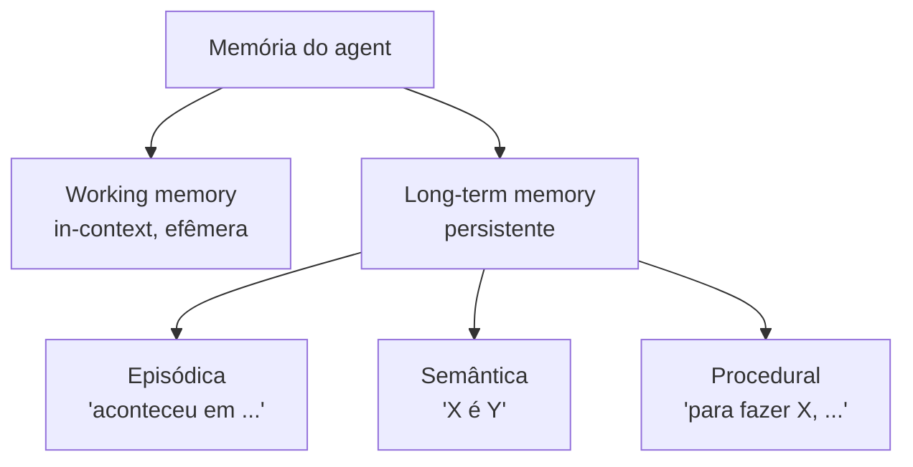

# Taxonomia da memória

> [!abstract] TL;DR
> Memória humana se divide em **episódica** (eventos vividos), **semântica** (fatos sobre o mundo) e **procedural** (como fazer coisas) — taxonomia proposta por Endel Tulving a partir de 1972. Sistemas de IA emprestam esse vocabulário para discutir agentes que precisam lembrar **o que aconteceu**, **o que é** e **como agir**. A isso soma-se a distinção **working memory** (in-context, efêmera) versus **long-term memory** (persistente). É metáfora útil, não regra rígida — implementações reais misturam tipos.

## O que é

A taxonomia clássica vem do psicólogo Endel Tulving. Em 1972, ele distinguiu **memória episódica** — lembrança de eventos específicos vividos pelo sujeito, marcados no tempo e no contexto — de **memória semântica** — conhecimento factual sobre o mundo, descontextualizado e atemporal. Mais tarde a literatura cognitiva incorporou a **memória procedural** (saber como executar habilidades, frequentemente sem acesso consciente ao "como") e a **working memory** (espaço de trabalho de curtíssimo prazo, popularizado pelo modelo de Baddeley).

Em IA, esse vocabulário foi importado por extensão metafórica. Quando um paper de 2026 fala em "memória episódica do agente", está apropriando o termo de Tulving para descrever um log cronológico de interações; "memória semântica" costuma referir-se a fatos consolidados num grafo, knowledge base ou páginas de wiki. A correspondência é frouxa — sistemas reais não respeitam fronteiras conceituais com precisão — mas a metáfora pegou porque resolve um problema prático: dá nomes diferentes para coisas que, embora todas se chamem "memória", têm padrões de uso radicalmente distintos.

A trilha "Memória de Agentes" usa esses quatro termos como vocabulário-base. Saber se um caso é episódico, semântico, procedural ou in-context vai ser útil em quase toda nota seguinte.

## Por que importa

A taxonomia paga seu custo por três razões práticas.

Primeiro: **vocabulário compartilhado**. Sem nomes distintos, qualquer discussão sobre "memória do agente" desliza para ambiguidade. Um engenheiro chama de "memória" o histórico do chat; outro chama de "memória" a base de conhecimento; um terceiro chama de "memória" os system prompts versionados. Os três falam coisas diferentes e nenhum percebe. Episódico/semântico/procedural/working são quatro etiquetas que custam pouco e evitam horas de conversa cruzada.

Segundo: **cada tipo tem padrões distintos de write/read/forget**. Episódica é alta-frequência de escrita, baixa de leitura, política agressiva de esquecimento ou compactação. Semântica é baixa de escrita, alta de leitura, política de revisão e versionamento. Procedural quase nunca muda, mas precisa estar disponível em quase toda chamada. Tratar os três com o mesmo substrato e a mesma política é receita para um sistema que desperdiça recursos ou esquece o que importa.

Terceiro: **a taxonomia ajuda a decidir substrato**. Episódica casa com log cronológico apendado (jsonl, event store, memory stream). Semântica casa com knowledge graph, banco vetorial ou markdown em wiki. Procedural casa com arquivos versionados em git: skills, prompts, AGENTS.md/CLAUDE.md, runbooks. Quando substrato e tipo combinam, leitura e escrita ficam baratas; quando não, o sistema sofre.

## Como funciona

Cada tipo carrega uma pergunta arquetípica. Episódica responde "**aconteceu o quê, quando?**". Semântica responde "**o que é X?**". Procedural responde "**como se faz Y?**". Working memory responde "**o que está em jogo agora?**".

### Memória episódica — "aconteceu em..."

Cronológica, datável e contextual. Cada entrada está ancorada num momento específico e carrega o entorno em que aconteceu — quem falou, o que foi dito, qual era a tarefa, o que veio antes. Em humanos, é "lembrar do que aconteceu ontem na reunião". Em IA, manifesta-se como log de interações: chat history, registros de tool calls, observações de ambiente em ordem temporal.

O exemplo canônico é o **memory stream** de Park et al. em "Generative Agents" (Stanford, 2023): um log apendado de observações em linguagem natural, cada uma com timestamp e pontuada por relevância, recência e importância no momento da recuperação. Detalhes em [[17 - Generative Agents (Park, Stanford 2023)]]. Exemplo prosaico: "em 2026-04-25 às 14h32, o usuário pediu X numa conversa sobre Y".

### Memória semântica — "X é Y"

Atemporal, factual e descontextualizada. Não importa **quando** alguém aprendeu que Paris é capital da França — o fato é tratado como verdade estável, sem âncora temporal. Em IA, manifesta-se como knowledge graph, base estruturada de fatos, páginas de wiki ou notas zettelkasten.

O exemplo no qual a trilha mais investe é o **LLM Wiki Pattern** proposto por Karpathy ([[06 - O LLM Wiki Pattern (gist do Karpathy)]]): cada conceito vira página de markdown, com título, definição, links para outras páginas, atualizada quando o entendimento evolui. Outro exemplo é o **A-MEM** ([[18 - A-MEM — Zettelkasten dinâmico]]), em que o agente cria notas atômicas e as conecta dinamicamente. Entrada semântica típica: "LLM Wiki Pattern é um padrão proposto por Karpathy em abril/2026".

### Memória procedural — "para fazer X, ..."

O "como". Skills, padrões de ação, prompts reutilizáveis, runbooks, receitas. Em humanos, é o tipo que fica intacto em vários quadros de amnésia que apagam episódica e semântica — andar de bicicleta, datilografar. Tipicamente implícita: sabe-se fazer, sem explicar passo a passo.

Em IA, é frequentemente sub-discutida. O exemplo mais visível em 2026 são os **agent skills** versionados em git: arquivos como `CLAUDE.md` e `AGENTS.md`, que registram como o agente deve agir num projeto; tool patterns reutilizáveis; prompts como código. Entrada procedural típica: "Para revisar uma nota Obsidian, abrir o arquivo, conferir frontmatter, validar wikilinks, rodar lint de aliases, sugerir ajustes".

### Working memory — transversal

O espaço de trabalho da chamada atual: tudo dentro da janela de contexto naquele instante. Efêmera por definição — quando a chamada termina, o conteúdo se desfaz. Limitada pela capacidade da janela e pelos fenômenos discutidos em [[02 - O problema das janelas de contexto]].

Em IA, working memory é o prompt atual. Episódico, semântico e procedural só influenciam a chamada se forem **carregados** para a working memory na hora certa — via injeção no prompt ou via tool calls. Por isso os outros três são tipicamente **long-term memory**: vivem em substrato persistente e entram na working memory apenas quando recuperados. A separação working/long-term é ortogonal à de Tulving: qualquer tipo pode ser working ou long-term, dependendo de estar ou não dentro da janela atual.

## Quando usar / quando não forçar

**Quando a taxonomia ajuda:**

- **Decisões de substrato.** Saber se o caso é episódico, semântico ou procedural orienta a escolha entre log apendado, grafo, banco vetorial, wiki ou skills versionados.
- **Dimensionamento de políticas write/read/forget.** Frequência e custo de cada operação variam por tipo; saber qual tipo está em jogo evita overengineering em uns e underengineering em outros.
- **Comunicação entre time técnico e stakeholders.** Vocabulário compartilhado transforma decisões sobre o que persistir, descartar e revisar em conversa concreta — não negociação ambígua sobre a palavra "memória".
- **Comparação entre implementações.** Letta, Mem0, MemPalace, A-MEM, wiki pattern: os trade-offs ficam mais nítidos quando se pergunta "que mistura de episódico, semântico e procedural cada um cobre, e em que substrato?". A nota [[09 - Panorama de implementações (abril 2026)|09 - Panorama de implementações]] usa essa lente.

**Quando NÃO forçar:**

- **Implementações reais misturam tipos.** Um memory stream pode ser indexado por embeddings semânticos. Uma página de wiki pode ter log de revisões. Um skill pode incluir exemplos episódicos. Querer pureza categorial gera mais discussão do que clareza.
- **Casos simples não precisam da distinção.** Cache de respostas, chat curto, automação one-shot pedem código, não taxonomia. Importar Tulving para resolver um cache é overengineering.
- **Quando a complexidade excede o valor.** Em sistemas pequenos, três caixas viram três pastas vazias e três políticas redundantes. A taxonomia paga em sistemas que vão evoluir; em scripts de fim de semana, atrapalha.

## Armadilhas comuns

> [!warning] Erros recorrentes na aplicação da taxonomia
> Os itens abaixo aparecem com frequência quando a taxonomia é aprendida na semana e aplicada na seguinte. Vale internalizar antes de virar dogma.

- **Forçar separação rigorosa.** O memory stream do Park et al. é episódico no formato (log datado), mas é consultado por similaridade semântica via embeddings. Querer pureza categorial leva a abstrações que não modelam o que está acontecendo.
- **Confundir working memory com memória persistente.** Working memory **é** o prompt atual; memória persistente **é** o que vive em arquivo, banco ou grafo. Chamar "histórico do chat na sessão atual" de "memória do agente" sem distinguir cria confusão sempre que alguém novo entra no time.
- **Tratar todos os tipos com o mesmo substrato.** Knowledge graph para episódica é exagero; arquivo de log para semântica é insuficiente. O substrato deve casar com o padrão de acesso esperado.
- **Esquecer procedural.** Muita discussão pública sobre memória de agentes só lida com episódico e semântico — chat history e knowledge base. Skills, prompts versionados e runbooks costumam ser tratados como "configuração" e não como "memória"; o sistema perde uma camada inteira por falta de nome.
- **Tomar Tulving como bíblia.** A taxonomia veio de psicologia cognitiva humana e é guideline para IA, não ontologia exata. Agentes em silício não têm a fundação biológica que sustenta a distinção em humanos. A metáfora ajuda; a literalidade não.

## Veja também

- [[01 - O que é memória em IA]] — conceito antecedente
- [[02 - O problema das janelas de contexto]] — por que working memory não basta
- [[06 - O LLM Wiki Pattern (gist do Karpathy)]] — wiki como memória semântica
- [[08 - Arquitetura de um sistema de memória]] — como tipos viram componentes
- [[17 - Generative Agents (Park, Stanford 2023)]] — memory stream como memória episódica
- [[18 - A-MEM — Zettelkasten dinâmico]] — semântica com evolução dinâmica
- [[19 - Surveys e estado da arte 2026]] — formalização atual da taxonomia em IA

## Referências

- **Tulving, E. (1972)** — "Episodic and semantic memory". In: Tulving, E. & Donaldson, W. (eds.), *Organization of Memory*, Academic Press, pp. 381-403. Capítulo foundational que distingue episódico de semântico — ponto de partida para qualquer taxonomia derivada.
- **Tulving, E. (1985)** — "How many memory systems are there?". *American Psychologist*, 40(4), 385-398. Extensão em que Tulving formaliza a hierarquia procedural/semântica/episódica e discute dissociações neuropsicológicas que sustentam a separação.
- **Park, J. S. et al. (2023)** — "Generative Agents: Interactive Simulacra of Human Behavior". `https://arxiv.org/abs/2304.03442` — paper foundational do memory stream, exemplo canônico de memória episódica em agentes LLM. Detalhado em [[17 - Generative Agents (Park, Stanford 2023)]].
- **Du, Pengfei (2026)** — "Memory for Autonomous LLM Agents: Mechanisms, Evaluation, and Emerging Frontiers". `https://arxiv.org/abs/2603.07670` — survey que formaliza taxonomias modernas, cruzando a herança de Tulving com a divisão working/long-term.
