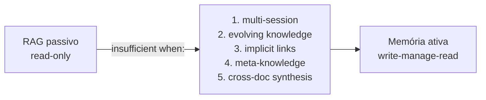

# Beyond RAG

> [!abstract] TL;DR
> RAG é poderoso para Q&A sobre documentação fixa, mas falha em cinco casos: **continuidade multi-sessão**, **conhecimento que evolui**, **conexões implícitas que precisam ser construídas**, **meta-conhecimento** (saber o que se sabe) e **síntese cross-document**. É aí que entra memória de longo prazo — e é por isso que patterns como o LLM Wiki do Karpathy (abril/2026) viraram referência. "Beyond RAG" não é "abandonar RAG"; é reconhecer onde retrieval passivo termina e onde escrita ativa começa.

## O que é

"Beyond RAG" é o framing que ganhou tração em 2026 para descrever os limites estruturais de Retrieval-Augmented Generation. RAG, formalizado por [Lewis et al. (2020)](https://arxiv.org/abs/2005.11401), é uma técnica madura: a maioria das aplicações sérias com LLM em produção tem alguma forma de RAG no meio do caminho — index, retrieve, augment. Funciona bem para Q&A sobre manuais, busca em base de conhecimento, citação em bots de suporte, sistemas regulatórios. Nesses casos, RAG é a ferramenta certa, e empilhar memória ativa em cima é over-engineering.

A virada de discurso veio quando Andrej Karpathy publicou o "LLM Wiki Pattern" em 3 de abril de 2026 — uma arquitetura em que o próprio LLM **escreve e mantém** uma wiki em markdown, dispensando vector DB. A cobertura da [VentureBeat](https://venturebeat.com/data/karpathy-shares-llm-knowledge-base-architecture-that-bypasses-rag-with-an) usou explicitamente "bypasses RAG", e o [post de Plaban Nayak no Level Up Coding](https://levelup.gitconnected.com/beyond-rag-how-andrej-karpathys-llm-wiki-pattern-builds-knowledge-that-actually-compounds-31a08528665e) consolidou o vocabulário "Beyond RAG" para descrever a categoria de problemas em que retrieval passivo não dá conta. Daí a importância de mapear, com precisão, **onde** RAG deixa de bastar — sem cair no oposto, que é tratar tudo como problema de memória ativa.

## Por que importa

Primeiro, **evita over-engineering**. É comum ver times empilhando camadas de RAG (hybrid search, reranking, query rewriting, multi-hop retrieval) quando o problema real não é de retrieval — é de escrita. Nenhuma dessas camadas resolve continuidade entre sessões, porque continuidade não é "achar o trecho certo"; é "ter um trecho que existe a partir do uso anterior".

Segundo, **ajuda a reconhecer quando o caso pede wiki ativa em vez de biblioteca passiva**. A pergunta diagnóstica é simples: o conteúdo da base **deve mudar como consequência da interação**? Se sim, RAG sozinho não basta — falta o passo de write deliberado. Se não, RAG provavelmente é suficiente, e camadas adicionais só aumentam custo.

Terceiro, o vocabulário "Beyond RAG" tem **valor de comunicação**. Em RFCs internos, discussões com stakeholders e posts técnicos, ter um termo compartilhado reduz fricção. Em escrita pública sobre arquitetura de agentes em 2026, alinhar-se com o discurso corrente do campo é estratégia editorial razoável.

## Como funciona — 5 cenários onde RAG não basta

### 1. Multi-session continuity

O usuário volta no dia seguinte e espera que o agente "lembre" do que foi discutido. RAG não lembra: cada chamada é stateless. Se o histórico de conversa estiver indexado em um vector DB, o sistema até recupera trechos antigos por similaridade — mas isso não é continuidade, é arqueologia. Continuidade implica que algumas conclusões foram **consolidadas** (preferências, decisões fechadas, contexto de projeto), e que o agente as trata como dadas, não como resultado de retrieval em runtime.

Exemplo concreto: um tutor digital descobre na sessão 1 que o aluno tem dificuldade com derivadas parciais. Na sessão 2, o tutor deveria **abrir** o assunto com essa informação no estado mental, não esperar que uma similarity search traga de volta um chunk de log. Para um assistente que se torna mais útil com uso, RAG sobre logs é fundamentalmente cego — falta o passo de extração e consolidação que define o que vale a pena lembrar. Ver [[02 - O problema das janelas de contexto]] para o porquê de contexto longo não resolver isso sozinho.

### 2. Conhecimento que evolui

Um fato novo contradiz um fato antigo. RAG retrieva os dois sem critério — match por similaridade não tem opinião sobre temporalidade ou autoridade. Quem decide qual é atual? O modelo, na hora, sem informação suficiente. O resultado típico: respostas inconsistentes entre chamadas, a depender de quais chunks foram retrievados.

Exemplo concreto: um agente de pesquisa de mercado indexa relatórios trimestrais. No Q1, a empresa X reportou margem de 18%. No Q4, reportou 12%. Sem manutenção ativa, RAG pode retrieve qualquer um dos dois trechos, e a resposta sobre "qual é a margem da X?" varia. A correção exige que **alguém** mantenha o conhecimento — marque a versão antiga como histórica, atualize a página de entidade, registre a mudança. Essa **manutenção** é o ponto da memória ativa, e é o trabalho que falta em RAG puro. Sistemas como [[15 - Zep e Graphiti — knowledge graph temporal|Zep/Graphiti]] atacam essa dimensão temporal explicitamente.

### 3. Conexões implícitas

"X e Y se relacionam por Z" é um insight que muitas vezes **não está em nenhuma fonte individual** — emerge da combinação. RAG só lê o que existe; não escreve insights novos. Pode até recuperar um trecho sobre X e outro sobre Y, e o LLM, no prompt, faz a conexão na resposta — mas essa conexão se evapora ao final da chamada. Não fica registrada, não vira página, não está disponível na próxima query.

Karpathy chama o LLM Wiki Pattern de "wiki que **compõe**", em oposição a "wiki que arquiva". A diferença é literal: na wiki que compõe, quando uma nova fonte é ingerida, **páginas de síntese existentes são atualizadas** para refletir a conexão nova. Numa biblioteca passiva (RAG), a fonte nova entra como mais um documento; na wiki ativa, ela altera o estado do conhecimento composto. Ver [[06 - O LLM Wiki Pattern (gist do Karpathy)]] para a abordagem completa.

Exemplo concreto: um analista pesquisa por meses "memória episódica em LLMs" e "Zettelkasten digital" como subdomínios separados. Em algum momento, percebe que A-MEM é a ponte entre os dois. Numa wiki ativa, essa percepção vira uma página de síntese que linka para os dois subdomínios e modifica os índices. Em RAG puro, a percepção morre quando o navegador fecha.

### 4. Meta-conhecimento

"O que eu sei sobre A?" é uma pergunta sobre o **estado da própria base** — exige reflection, não match. RAG não reflete: faz similaridade vetorial. Se a pergunta é "quais lacunas existem no que eu pesquisei sobre tópico X?", RAG não tem como responder, porque a resposta exige raciocínio sobre cobertura, não recuperação de chunks.

Sistemas que atacam meta-conhecimento explicitamente: [[18 - A-MEM — Zettelkasten dinâmico|A-MEM]] usa estrutura de Zettelkasten para tornar conexões e lacunas inspecionáveis; [[17 - Generative Agents (Park, Stanford 2023)|Park et al. (2023)]] introduziram memory streams com reflection trees, em que o agente periodicamente faz síntese de alto nível sobre o que viu — gerando memórias derivadas que falam **sobre** as memórias originais. Em ambos os casos, há uma estrutura deliberada para sustentar perguntas meta, algo que retrieval flat não suporta.

Exemplo concreto: um pesquisador pergunta ao agente "que fontes contradizem a hipótese H1 na minha base?". Em RAG, o melhor que se obtém é um set de chunks que mencionam H1 — sem garantia de cobertura, sem detecção de contradição, sem mapa do território. Em memória ativa com lint regular, contradições já estão **marcadas** porque o ciclo de manutenção as detectou no momento da ingestão.

### 5. Síntese cross-document

Combinar informação de N fontes em um insight novo é o problema clássico de **síntese**, não de retrieval. RAG retorna chunks e o LLM compõe na resposta — mas essa composição é refeita a cada chamada, com o conjunto de chunks que aquela query específica retrievou. Não há acumulação, não há refinamento, não há registro do trabalho de síntese.

Exemplo concreto: revisão de literatura cobrindo 80 papers. Em RAG, cada pergunta retrieva 5–10 chunks e o modelo monta uma resposta em runtime — a resposta pode ser boa, mas não fica registrada, e a próxima pergunta similar refaz o trabalho do zero. Em LLM Wiki, o produto é uma página de síntese mantida — "Estado da arte em memória de agentes (abril/2026)" — atualizada a cada paper novo ingerido, e que serve como ponto de partida para todas as queries sobre o tema. A síntese vira **artefato persistente**, não saída efêmera. Quando o leitor precisa de uma resposta com nuance composta de várias fontes — e quando essa resposta tende a ser pedida de novo ou a evoluir — RAG é só o começo do trabalho.

## Quando ainda usar RAG

> [!info] RAG continua sendo a ferramenta certa em vários casos
> Beyond RAG não é "RAG é ruim". É "RAG não cobre tudo". Há cenários em que RAG é, sim, a melhor escolha — e tentar substituí-lo por memória ativa é desperdício.

RAG é a ferramenta correta quando:

- **Q&A simples sobre documentos fixos.** Manuais de produto, FAQs, regulação, contratos. O conteúdo é autoritativo, estável e bem-formatado para retrieval. Adicionar memória ativa não traz ganho.
- **Casos one-shot ou stateless.** Sistemas em que cada interação é independente — pesquisa pública, busca em catálogo, suporte de tier 1. Não há acumulação para justificar a infraestrutura de memória.
- **Quando a manutenção de wiki é cara demais.** Lint regular, schema bem escrito e revisão de páginas críticas custam tempo. Para uma startup pequena com volume moderado de uso, esse custo pode não compensar.
- **Quando o conteúdo é autoritativo e não deve ser reescrito.** Regulação financeira, documentação médica, jurisprudência — a síntese do LLM pode mascarar nuances que importam legalmente. Aqui RAG com citação literal é mais seguro do que wiki ativa.

A regra prática: comece com RAG e introduza memória ativa quando os cinco cenários acima começarem a aparecer no produto. Não antes.

## Armadilhas comuns

> [!warning] Os erros típicos de quem cruza a fronteira RAG → memória
> Estas armadilhas aparecem em projetos que reconheceram a limitação de RAG mas erraram a transição.

- **"Vou empilhar mais RAG até resolver".** Múltiplas camadas de RAG (hybrid search, reranking, multi-query, multi-hop) **não substituem o write-step**. Se o problema é "o sistema precisa lembrar do que aconteceu", nenhuma sofisticação de retrieval resolve — falta alguém escrevendo deliberadamente, e RAG por construção não escreve.
- **Confundir "vector DB grande" com "memória".** Indexar todo o histórico de conversa num vector DB de 100M chunks **não é memória**: é log indexado. Escala não muda a natureza do sistema — sem extração, consolidação e resolução de contradições, é só log com search por similaridade. Ver [[04 - RAG vs memória de longo prazo]].
- **Tentar fazer manage-step com cron jobs em cima de RAG.** Cron noturno "limpando duplicatas" vira frankenstein rapidamente. O manage-step precisa estar acoplado ao write — decidir o que registrar, em qual nível de abstração, com quais links. Bolted on depois nunca alcança a coerência de um pipeline desenhado para isso desde o início.
- **Subestimar o custo de transição.** Migrar de RAG para memória ativa não é "trocar o substrato": envolve schema, observabilidade (lint, métricas de drift, taxa de contradição), revisão humana das primeiras semanas, versionamento da wiki. Estimar por baixo gera projetos parados na metade.
- **Generalizar prematuramente.** Tomar uma boa experiência com LLM Wiki num caso e aplicar a tudo. Há casos onde RAG é melhor, casos onde grafo é melhor, casos híbridos. A escolha é por substrato e loop de escrita, não por moda.

## Veja também

- [[04 - RAG vs memória de longo prazo]] — distinção fundamental entre retrieval reativo e construção ativa
- [[06 - O LLM Wiki Pattern (gist do Karpathy)]] — a abordagem ativa que motivou o framing "Beyond RAG"
- [[09 - Panorama de implementações (abril 2026)|09 - Panorama]] — quem está fazendo o quê em memória ativa
- [[14 - Mem0 — vetorial + grafo]] — sistema de produção que combina RAG e memória
- [[18 - A-MEM — Zettelkasten dinâmico]] — meta-conhecimento via Zettelkasten
- [[RAG e Vector Databases]] — para profundidade técnica em RAG (chunking, hybrid search, reranking)

## Referências

- **Karpathy, A.** *LLM Wiki* (gist, 03/abr/2026). — fonte primária do pattern que motivou o framing "Beyond RAG". [gist.github.com/karpathy/442a6bf555914893e9891c11519de94f](https://gist.github.com/karpathy/442a6bf555914893e9891c11519de94f)
- **VentureBeat** — "Karpathy shares 'LLM Knowledge Base' architecture that bypasses RAG with an evolving markdown library maintained by AI." Cobertura editorial mainstream que usou explicitamente "bypasses RAG" como tese. [venturebeat.com/data/karpathy-shares-llm-knowledge-base-architecture-that-bypasses-rag-with-an](https://venturebeat.com/data/karpathy-shares-llm-knowledge-base-architecture-that-bypasses-rag-with-an)
- **Nayak, P.** (Level Up Coding, abril/2026) — "Beyond RAG: How Andrej Karpathy's LLM Wiki Pattern Builds Knowledge That Actually Compounds." Análise focada em por que o pattern compõe enquanto RAG não. [levelup.gitconnected.com/beyond-rag-how-andrej-karpathys-llm-wiki-pattern-builds-knowledge-that-actually-compounds](https://levelup.gitconnected.com/beyond-rag-how-andrej-karpathys-llm-wiki-pattern-builds-knowledge-that-actually-compounds-31a08528665e)
- **Gamgee Blog** — "Andrej Karpathy's LLM Wiki: Why the Future of AI Memory Isn't RAG." Argumenta que memória deveria ser **síntese**, não retrieval, e detalha as dimensões que RAG não cobre (relacional, temporal, consolidação). [gamgee.ai/blogs/karpathy-llm-wiki-memory-pattern](https://gamgee.ai/blogs/karpathy-llm-wiki-memory-pattern/)
- **Lewis, P. et al.** (2020). *Retrieval-Augmented Generation for Knowledge-Intensive NLP Tasks.* — paper original que formaliza RAG, referência obrigatória ao discutir limites do framework. [arxiv.org/abs/2005.11401](https://arxiv.org/abs/2005.11401)
