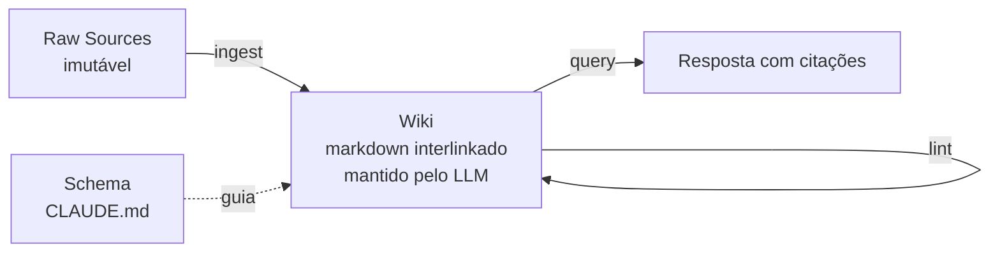

# O LLM Wiki Pattern

> [!abstract] TL;DR
> Em 3 de abril de 2026, Andrej Karpathy publicou no X (e via gist) o "LLM Wiki" pattern: em vez de o LLM consultar documentos via RAG, **um LLM constrói e mantém ativamente uma wiki interlinkada em markdown** a partir de fontes brutas. A arquitetura tem 3 camadas (raw sources, wiki, schema), 3 operações (ingest, query, lint) e um substrato textual durável. A wiki pessoal de Karpathy num único tópico de pesquisa atingiu cerca de 100 artigos e 400 mil palavras — mais que muitas teses de doutorado — sem que ele tenha redigido o texto. É evidência prática de que o pattern escala.

## O que é

O insight central de Karpathy é uma analogia com compiladores. Artigos brutos — PDFs, papers, posts, transcrições — são como _source code_: úteis, mas verbosos, redundantes, contextualmente implícitos, organizados para humanos e não para consulta rápida. O LLM atua como _compilador_: lê esse material e o "compila" numa wiki estruturada de páginas em markdown interlinkadas, otimizada para retrieval e síntese. A wiki é o _executable_ — o artefato que você efetivamente consulta no dia a dia.

A diferença crucial em relação a [[05 - Beyond RAG - quando RAG não basta|RAG]] é direcional: em RAG o LLM **lê** documentos estáticos a cada query, recuperando trechos por similaridade vetorial. No LLM Wiki o LLM **escreve** o knowledge base — ele sintetiza, cruza referências, atualiza páginas existentes quando novas fontes entram, e mantém um catálogo navegável. RAG resolve "achar a passagem certa"; o LLM Wiki resolve "manter um corpo de conhecimento que cresce e se reorganiza sozinho".

Há três papéis bem definidos. O **humano** cura as fontes (decide o que entra no raw) e dá direção estratégica (o que pesquisar, o que aprofundar). O **LLM** faz o trabalho de _bookkeeping_: ler, resumir, criar páginas de entidade, atualizar índices, identificar contradições. A **wiki** é o artefato que compõe — cada nova fonte ingerida não substitui o que já existe, ela enriquece, estende e refina. É essa propriedade de composição que diferencia o pattern de um repositório passivo de notas.

## Por que importa

RAG passivo escala mal para conhecimento que **compõe**. Quando você pesquisa um domínio por meses, o que importa não é só recuperar trechos relevantes — é manter continuidade entre sessões, conectar ideias que aparecem em fontes diferentes, perceber quando uma afirmação nova contradiz uma antiga, e construir uma estrutura mental que evolui. RAG não faz nada disso: cada query é independente, e o knowledge base é fixo até alguém reindexar.

O LLM Wiki estabelece um padrão claro para construção de "second brain" assistido por IA — território onde 2026 viu uma explosão de implementações inspiradas: [[10 - LLM-knowledge-base (Wendel) — direto do gist|LLM-knowledge-base do Wendel]] (a implementação canônica direto do gist), [[12 - basic-memory — MCP nativo Obsidian|basic-memory]] (MCP nativo para Obsidian), `graphify`, `NicholasSpisak/second-brain`, Apify Second Brain Builder, entre outros. O pattern virou referência porque resolve um problema real que profissionais de conhecimento sentem na pele: o conhecimento acumulado se perde entre sessões com o LLM.

A simplicidade radical do pattern é deliberada e merece atenção. Não há vector DB, embeddings, framework, biblioteca exótica. Markdown em arquivos. O que torna isso poderoso é o **schema** — o documento de regras que ensina o LLM como organizar, linkar e atualizar. O substrato é trivial; a inovação real está no protocolo de manutenção. Essa decisão arquitetural alinha o pattern com [[07 - Por que Obsidian e markdown como substrato|por que markdown é o substrato certo]].

## Como funciona

### Arquitetura em 3 camadas

**1. Raw Sources (imutável).** É a sua coleção curada de documentos-fonte: artigos, papers, imagens, dados, transcrições. Karpathy é explícito: "These are immutable — the LLM reads from them but never modifies them. This is your source of truth." O humano deposita material aqui; o LLM nunca altera. Essa imutabilidade é o que permite reconstruir a wiki do zero se o esquema mudar.

**2. The Wiki (mantida pelo LLM).** Um diretório de arquivos markdown gerados pelo LLM: summaries de fontes, entity pages (pessoas, empresas, conceitos), concept pages, comparações, overviews, sínteses. Karpathy: "The LLM owns this layer entirely." É aqui que o conhecimento composto vive — e é aqui que o trabalho de manutenção acontece.

**3. The Schema.** Um documento (tipicamente `CLAUDE.md` para Claude Code ou `AGENTS.md` para Codex) que diz ao LLM como a wiki é estruturada, quais são as convenções e quais workflows seguir. Esse arquivo é o equivalente do sistema de build na analogia do compilador: é onde a inovação real vive. Schema bem escrito produz wiki coerente; schema vago produz caos.

### As três operações

**Ingest.** Quando uma nova fonte entra no raw, o LLM a lê, discute os takeaways com o humano, escreve uma summary page na wiki, atualiza o `index.md`, modifica páginas relacionadas (entity pages, concept pages) em toda a wiki para refletir o novo material e adiciona uma entrada no `log.md`. Não é só "criar um resumo" — é integrar o novo conhecimento ao corpo existente.

**Query.** O humano faz uma pergunta. O LLM busca nas páginas da wiki, lê as relevantes e sintetiza uma resposta com citações para as wiki pages e fontes. Quando uma resposta é particularmente valiosa ou recorrente, ela vira material para uma nova wiki page — fechando o ciclo de composição.

**Lint.** Health check periódico. O LLM percorre a wiki procurando contradições entre páginas, claims stale (afirmações que fontes mais novas superaram), páginas órfãs (sem inbound links), índices desatualizados, links quebrados. É auto-healing: a wiki não apodrece sozinha porque há um ciclo deliberado de revisão. Sem lint, qualquer knowledge base de tamanho razoável degrada.

### Arquivos especiais

- **`index.md`** — catálogo content-oriented de todas as páginas, agrupado por categoria, cada entrada com link, one-liner e metadados opcionais (data, contagem de fontes).
- **`log.md`** — append-only log cronológico de todos os ingests, queries notáveis e lint passes. Serve como memória do _processo_ (não só do conteúdo).

> [!tip] Compiler analogy — vocabulário-chave
> Karpathy resume a divisão de papéis assim: "Obsidian is the IDE; the LLM is the programmer; the wiki is the codebase." Raw articles são source code; o LLM seguindo o schema é o compilador; a wiki é o output executável. Internalize esse vocabulário — ele é o que conecta o pattern ao restante do discurso sobre agentes em 2026.

### Escala demonstrada

A wiki pessoal de Karpathy num único tópico de pesquisa cresceu para cerca de 100 artigos e 400 mil palavras — comparável a uma tese longa — construída inteiramente pelo LLM a partir de fontes que ele curou. O próprio gist é mais conservador, descrevendo o ponto-doce como "~100 sources, ~hundreds of pages". De toda forma, não é toy: o pattern já provou que sustenta corpos de conhecimento profissionais. O tweet original de 3 de abril de 2026 acumulou mais de 16 milhões de visualizações e o gist passou de 5 mil estrelas em poucos dias — sinal de que tocou num problema real.

## Quando usar / quando não usar

**Quando faz sentido:**

- Conhecimento que **evolui** ao longo do tempo (vs. documentação estática que não muda).
- Multi-session continuity — você quer que o agente "lembre" o que foi discutido em sessões anteriores.
- Exploração de domínio novo, onde **conexões entre fontes** importam mais que retrieve de uma fonte específica.
- Casos onde meta-knowledge importa: "o que eu sei sobre X?", "quais lacunas existem na minha pesquisa?".
- Trabalhos onde **síntese cross-document** é o produto principal (revisão de literatura, due diligence, pesquisa de mercado).

**Quando NÃO faz sentido:**

- Q&A simples sobre documentos fixos onde a resposta está literal numa página — RAG basta e custa menos.
- Tarefas one-shot — não há acumulação para justificar a infraestrutura.
- Baixo orçamento de manutenção — lint regular é trabalho, e sem ele a wiki apodrece.
- Documentos autoritativos que **não devem** ser sintetizados (legal, regulatório, normativo) — a síntese do LLM pode mascarar nuances que importam juridicamente.
- Quando precisão factual exata é mais crítica que síntese — a wiki é interpretação, não cópia.

## Armadilhas comuns

> [!warning] Riscos práticos do pattern
> O LLM Wiki não é mágico. Cada um dos itens abaixo já fez wikis bem-intencionadas degenerarem.

- **Wiki rot sem lint regular.** Sem o ciclo de health check, contradições silenciosas se acumulam: uma página afirma X, outra afirma não-X, e ambas continuam linkadas em índices. Lint não é opcional em wikis com mais de algumas dezenas de páginas.
- **Schema mal escrito gera caos.** Instruções vagas no `CLAUDE.md` (ou equivalente) produzem wiki inconsistente — convenções de nome divergentes, páginas com seções diferentes, links quebrados. Schema é código; merece o mesmo cuidado.
- **Confiança cega em LLM-generated content.** O humano precisa revisar páginas críticas, especialmente nas primeiras semanas, antes que erros silenciosos virem citações em outras páginas e contaminem a wiki inteira.
- **Esperar que funcione "out of the box".** O pattern requer iteração no schema com base no que o LLM erra. As primeiras versões do schema sempre têm lacunas; refiná-lo é parte do trabalho.
- **Confundir o pattern com RAG.** Wiki **escrita** pelo LLM é categoricamente diferente de wiki **lida** pelo LLM. A escrita é o ponto. Quem implementa "RAG sobre uma pasta de markdown" e chama isso de LLM Wiki perde o que torna o pattern interessante.
- **Escalar `index.md` além do limite do contexto.** O `index.md` único funciona até 100-200 páginas. Acima disso, ele estoura o contexto do LLM em uma leitura — e aí precisa de busca real (BM25, vetorial, ou grafo de entidades) para não perder cobertura.

## Veja também

- [[05 - Beyond RAG - quando RAG não basta]] — o que motiva o pattern
- [[07 - Por que Obsidian e markdown como substrato]] — escolha de substrato
- [[08 - Arquitetura de um sistema de memória]] — generalização do pattern
- [[10 - LLM-knowledge-base (Wendel) — direto do gist]] — implementação canônica
- [[12 - basic-memory — MCP nativo Obsidian]] — alternativa pronta
- [[22 - Guia de implementação do zero]] — como começar

## Referências

- **Karpathy, gist oficial** — `https://gist.github.com/karpathy/442a6bf555914893e9891c11519de94f` — a fonte primária; descreve as 3 camadas, as 3 operações, `index.md` e `log.md`, a analogia "Obsidian/programmer/codebase".
- **Karpathy, tweet de 03/abr/2026** — `https://x.com/karpathy/status/2040470801506541998` — o post que viralizou (16M+ visualizações), com os números da wiki pessoal (~100 artigos, ~400k palavras num único tópico).
- **VentureBeat** — "Karpathy shares 'LLM Knowledge Base' architecture that bypasses RAG" — cobertura editorial mainstream do anúncio.
- **Plaban Nayak (Level Up Coding)** — "Beyond RAG: How Andrej Karpathy's LLM Wiki Pattern Builds Knowledge That Actually Compounds" — análise focada em por que o pattern compõe enquanto RAG não.
- **MindStudio** — "The Compiler Analogy Explained" — desdobra a analogia compiler/source-code/executable em quatro camadas operacionais.
