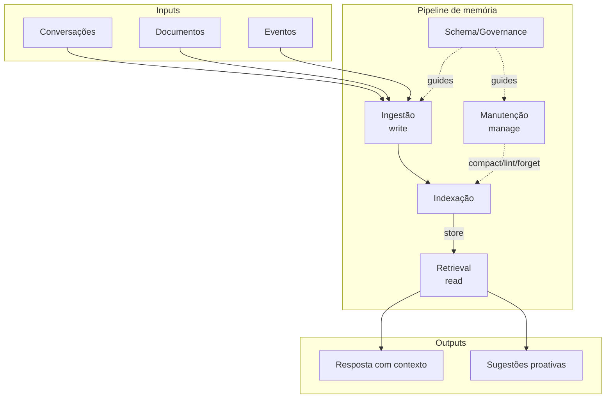

# Arquitetura de um sistema de memória

> [!abstract] TL;DR
> Sistemas de memória de agentes têm uma arquitetura comum, independente de implementação: **ingestão** (write), **indexação** (organização), **retrieval** (read), **manutenção** (compactação, forget, lint) e **schema/governance** (regras). O survey de 2026 (Du et al.) formaliza esse fluxo como **write-manage-read loop** e identifica 5 mecanismos arquiteturais distintos: context-resident compression, retrieval-augmented stores, reflective self-improvement, hierarchical virtual context e policy-learned management. Um framework complementar — Storage / Reflection / Experience — descreve a maturidade evolutiva de cada implementação. Este vocabulário é a base para comparar ferramentas concretas (Letta, Mem0, Zep, MemPalace, basic-memory, A-MEM) sem cair em anedota.

## O que é

A "arquitetura de um sistema de memória" não é uma arquitetura específica — é o conjunto de componentes que **toda** implementação tem em alguma forma, ainda que disfarçada. Quando se compara o LLM Wiki de Karpathy, o servidor MCP `basic-memory`, o tier system de Letta, o grafo temporal do Zep, o retrieval vetorial do Mem0 e a metáfora espacial do MemPalace, parece à primeira vista que cada um implementa algo radicalmente diferente. Não é o caso. Por baixo da superfície, todos resolvem as mesmas cinco perguntas: o que entra, como organizar, como buscar, como manter e quais são as regras.

Esse mapa arquitetural genérico é o vocabulário com o qual a trilha discute implementações específicas. As notas sobre cada ferramenta concreta — [[09 - Panorama de implementações (abril 2026)|panorama]], [[10 - LLM-knowledge-base (Wendel) — direto do gist|LLM-knowledge-base]], [[13 - Letta (ex-MemGPT)|Letta]], [[12 - basic-memory — MCP nativo Obsidian|basic-memory]], entre outras — vão se referir constantemente a esses cinco componentes. Sem o mapa, comparar implementações vira disputa de marca; com o mapa, vira conversa técnica.

## Por que importa

Sem essa base, comparar implementações vira anedota: "Mem0 é melhor que Letta", "Zep ganha do A-MEM", "use markdown e não vector DB". Com critério — qual componente cada solução prioriza, quais trade-offs assume, quais ignora — vira análise. Profissionais que conhecem o vocabulário arquitetural conseguem ler um repositório novo em 20 minutos, identificar o que ele faz bem e o que ignora, e decidir se serve para o caso de uso em mãos.

Há também um motivo pragmático: para projetar um sistema próprio (caminho previsto na nota [[22 - Guia de implementação do zero]]), o primeiro passo é mapear o caso de uso aos cinco componentes — quanto entra por dia, quão estruturada é a entrada, qual a latência aceitável de retrieval, quem mantém o sistema, quais regras de governança existem. Sem essa decomposição, o projeto começa pelo substrato (vector DB? markdown? grafo?) — que é exatamente a decisão menos importante. E para discurso público — entrevistas, talks, mentoria — o vocabulário é o que separa quem entende o campo de quem consome marketing.

## Como funciona — componentes universais

O loop fundamental é três operações em ciclo, com duas camadas de governança que perpassam tudo. O survey de Du et al. (2026) chama isso de **write-manage-read loop**, condensação útil de uma ideia que já aparecia em formas variadas em Park et al. (2023) e no gist de Karpathy.

Os cinco componentes funcionam assim:

### 1. Ingestão (write)

Decide o que entra na memória. As perguntas relevantes são: **o que filtrar**, **em que granularidade**, **quando processar** e **quem decide**. Em sistemas como o LLM Wiki, a ingestão é orquestrada por humano que decide quais fontes brutas alimentam a wiki — o LLM compila, mas o humano cura. Em sistemas conversacionais como Mem0 e Letta, a ingestão é majoritariamente automática: o agente extrai fatos de cada turno e decide o que persistir.

A granularidade é talvez a decisão mais subestimada. Gravar conversas inteiras é fácil mas inútil para retrieval; extrair fatos atômicos é caro mas alimenta busca precisa; armazenar resumos perde nuance. Cada implementação faz uma escolha aqui, e essa escolha governa muito do que vem depois. Sistemas que ingerem tudo sem filtro entram em colapso de sinal/ruído em poucas semanas — gravar tudo é gravar nada.

### 2. Indexação

Como organizar o que foi ingerido. Os eixos comuns são: **vetorial** (embeddings + similarity search), **grafo** (entidades e relações explícitas, com travessia), **hierárquico** (tiers de memória, RAM/disk), e **espacial** (memory palace, organização por loci). Implementações reais costumam combinar: Zep usa grafo temporal, Mem0 mistura vetorial e relacional, Letta organiza em tiers explícitos de tamanho.

A decisão central é o trade-off entre **custo de write** e **custo de read**. Indexação rica (embeddings + grafo + hierarquia) gasta no momento da escrita para tornar a leitura barata e precisa; indexação minimalista (só append em arquivo) é trivial no write mas joga toda a complexidade para o read. Não há resposta universal — depende da assimetria entre frequência de ingestão e frequência de query no caso de uso.

### 3. Retrieval (read)

Como buscar quando o agente precisa. Os padrões consolidados são: **similarity search** (cosine ou dot product sobre embeddings), **graph traversal** (seguir arestas a partir de entidades mencionadas), **hybrid search** (BM25 lexical combinado com vetor semântico) e **reranking** (segundo passo que reordena top-N por relevância semântica fina). Decisões importantes: tamanho do top-k, query rewriting (transformar a pergunta antes de buscar), e se há ou não cache de resultados.

Retrieval é onde a maior parte do esforço de pesquisa acadêmica se concentra — porque é mensurável: dá para benchmarkar com LongMemEval e ver número subindo. É também onde mais se exagera. Um retrieval excelente sobre uma memória mal mantida produz respostas precisamente erradas; um retrieval mediano sobre uma memória bem curada produz respostas certas. A nota [[20 - Comparativo crítico (LongMemEval)|comparativo crítico]] explora essa assimetria.

### 4. Manutenção (manage)

A operação mais negligenciada e a que mais separa sistemas reais de protótipos. Manutenção engloba: **compactação** (resumir logs antigos, reduzir verbosidade sem perder fato), **deduplicação** (detectar e fundir registros redundantes), **forget policy** (TTL, importância decay, eviction de baixo uso), e **lint** (detectar contradições, links quebrados, órfãos, schema violations).

Sem manutenção contínua, qualquer sistema de memória vira **wiki rot** — o termo é apropriado: mesmo padrão das wikis que cresceram sem manutenção e viraram cemitérios de páginas obsoletas. Em sistemas LLM o problema é pior: o agente recupera o lixo com a mesma confiança que recupera o conteúdo bom, e contamina respostas. O gist de Karpathy chama essa operação de "lint" deliberadamente, evocando o paralelo com linters de código — manutenção como prática rotineira, não como evento heroico.

### 5. Schema/Governance

As regras que governam tudo o resto: o `CLAUDE.md` ou `AGENTS.md` que ensina o LLM como organizar páginas, os YAMLs de configuração que definem TTL, os documentos de design que dizem o que constitui uma "entidade" no grafo. Schema não é apenas configuração técnica — é onde a maior parte do design real vive.

A observação contraintuitiva, e que aparece em quase toda implementação madura, é que **o substrato importa menos do que o schema**. Se duas implementações usam markdown como storage, ainda podem produzir sistemas radicalmente diferentes dependendo das regras de organização. Inversamente, um vector DB com schema bem desenhado pode emular muito do que uma implementação markdown faz. É no schema que o conhecimento operacional de cada projeto se acumula, e é por isso que documentos como o do Wendel ou o `basic-memory` README têm valor desproporcional ao tamanho — eles codificam decisões que parecem triviais até você tentar outra coisa.

## 5 mecanismos arquiteturais (do survey 2026)

Du et al. (2026) propõem uma classificação ortogonal aos cinco componentes — em vez de "o que cada sistema tem", olham para "como cada sistema resolve a memória de longo prazo". Cinco mecanismos emergem como dominantes na literatura:

1. **Context-resident compression.** Compactar o histórico dentro do próprio contexto da chamada — resumir turnos antigos, manter só fatos essenciais. Sem armazenamento externo. Limite: o que cabe no context window.

2. **Retrieval-augmented stores.** Armazenamento externo (vector DB, grafo, arquivos) acessado via query no momento da inferência — RAG-like. A maior parte das implementações comerciais (Mem0, Zep, basic-memory) cai aqui.

3. **Reflective self-improvement.** O agente reflete sobre a própria memória e a refina ativamente — extrai padrões, consolida insights, abstrai princípios. Origem em Park et al. (2023) com o ciclo observation/reflection/planning das generative agents.

4. **Hierarchical virtual context.** Analogia direta com sistemas operacionais — RAM/disk, paging entre tiers de memória de tamanhos diferentes. Letta (ex-MemGPT) é o exemplar canônico, e a metáfora "memória virtual para LLM" é a marca registrada do projeto.

5. **Policy-learned management.** Reinforcement learning aprende quando armazenar, quando esquecer, quando consolidar. Ainda majoritariamente research — pouca tração em produção, mas direção promissora para automatizar decisões de manutenção que hoje são heurísticas.

Implementações reais quase nunca implementam um mecanismo puro — são combinações. Letta é primariamente hierarchical mas usa retrieval; Zep é primariamente retrieval-augmented mas tem reflective steps; basic-memory é retrieval-augmented com compression em alguns fluxos. Os cinco mecanismos são lentes para análise, não caixas mutuamente exclusivas.

## Padrão Storage / Reflection / Experience

Um framework complementar — frequentemente referenciado na literatura como "From Storage to Experience" — descreve **maturidade evolutiva** de uma implementação em três estágios:

1. **Storage.** Preservação bruta. Memory stream do Park, log append-only do Karpathy, raw transcripts. O sistema lembra o que aconteceu, sem refinamento. Útil mas baixa densidade de sinal.

2. **Reflection.** Refinamento ativo. Resumos, extração de fatos, estruturação em entidades, identificação de relações. O sistema deixa de ser arquivo e passa a ser conhecimento organizado. É aqui que a maior parte das implementações de 2026 está.

3. **Experience.** Abstração reusável. Skills aprendidas, princípios destilados, **procedural memory** (ver [[03 - Taxonomia da memória (episódica, semântica, procedural)|taxonomia]]). O sistema deixa de só lembrar e passa a saber fazer. É o estágio mais raro, e o mais valioso para agentes que evoluem ao longo do tempo.

A utilidade prática deste framework é classificar maturidade. Quando se avalia uma ferramenta nova, perguntar "isto está em qual estágio?" é frequentemente mais informativo do que comparar features. Um sistema em estágio Storage com retrieval impecável ainda é menos poderoso do que um sistema em estágio Experience com retrieval mediano — porque o segundo destila conhecimento, e o primeiro só preserva.

## Quando NÃO usar uma arquitetura completa

Não há virtude em sobre-engenharia. Há cenários onde implementar todos os cinco componentes é desperdício:

- **Protótipos.** Começar com só ingestão append-only e retrieval simples (busca por substring ou top-1 vector). Validar valor antes de investir em manutenção e schema.
- **Casos one-shot.** Tarefas que terminam numa sessão não têm acumulação para arquitetar. Memória aqui é histórico de conversa, e o context window resolve.
- **Equipes que não sustentarão a manutenção.** Manage sem disciplina vira lixo acelerado — o sistema decai mais rápido do que se não tivesse manutenção alguma, porque as expectativas são maiores. Melhor não prometer manutenção do que prometer e abandonar.
- **Quando RAG basta.** Recuperação sobre corpus estático, sem composição entre fontes, sem evolução temporal. Ver [[04 - RAG vs memória de longo prazo]] e [[05 - Beyond RAG - quando RAG não basta]] para o critério de quando RAG é suficiente e quando não é.

> [!warning] Manutenção sem evaluation é teatro
> O componente de manutenção é especialmente vulnerável a virar atividade performática. Compactação que não preserva fatos críticos, lint que não detecta contradições reais, forget policy que evicta o que importava — sem métricas que validem cada operação, manutenção piora o sistema em vez de melhorar. Antes de implementar manage, definir como medir se está funcionando.

## Armadilhas comuns

- **Focar só no retrieval ignorando a manutenção.** Sistema bonito por seis meses, lixão depois. Retrieval é mensurável e excitante; manutenção é invisível e tediosa. Adivinha onde a maior parte do esforço vai? E adivinha onde está o gargalo real em sistemas que rodam mais de um ano?
- **Schema implícito vira inconsistência.** Sem regras escritas explicitamente, o LLM espalha conteúdo sem coerência. A primeira nota usa um padrão; a centésima usa outro; ninguém percebe até alguém tentar buscar por algo que existe em três formatos diferentes. Schema escrito é barato; consequência de schema implícito é cara.
- **Confundir storage substrate com arquitetura.** Markdown vs vector DB é detalhe de substrato. O loop write-manage-read é o ponto. Discussões que ficam só no nível "qual storage" perdem a substância — duas implementações com o mesmo storage podem ser arquiteturalmente opostas, e duas com storage diferente podem ser arquiteturalmente equivalentes.
- **Não medir qualidade da manutenção.** Lint sem evaluation é teatro. Compactação sem teste de preservação de fatos é wishful thinking. Forget policy sem audit é remoção arbitrária. Manage exige métricas tanto quanto retrieval — talvez mais, porque o efeito é assimétrico (manage degenerado contamina o sistema todo).
- **Ingestão sem filtro.** Gravar tudo é gravar nada. Memória virou diário em vez de knowledge base — impossível buscar com sinal/ruído alto. Filtrar agressivamente na ingestão é menos custoso do que limpar depois, e manda sinal claro para o agente sobre o que merece persistência.

## Veja também

- [[06 - O LLM Wiki Pattern (gist do Karpathy)]] — instância concreta do pattern, com Ingest/Query/Lint mapeados aos componentes
- [[07 - Por que Obsidian e markdown como substrato]] — substrato é decisão ortogonal à arquitetura
- [[19 - Surveys e estado da arte 2026]] — formalização acadêmica do write-manage-read loop e dos 5 mecanismos
- [[09 - Panorama de implementações (abril 2026)|09 - Panorama]] — quem implementa o quê, classificado pelos componentes desta nota
- [[20 - Comparativo crítico (LongMemEval)|20 - Comparativo crítico]] — comparação técnica usando este vocabulário
- [[22 - Guia de implementação do zero]] — aplicar a arquitetura num projeto novo, mapeando caso de uso aos componentes

## Referências

- Du et al. (2026). *A Survey on Memory in Large Language Model Agents*. [arxiv.org/abs/2603.07670](https://arxiv.org/abs/2603.07670). Formaliza o write-manage-read loop e classifica os 5 mecanismos arquiteturais.
- Karpathy, A. (2026). *LLM Wiki — gist*. [gist.github.com/karpathy/442a6bf555914893e9891c11519de94f](https://gist.github.com/karpathy/442a6bf555914893e9891c11519de94f). Operações Ingest / Query / Lint como mapeamento prático dos componentes.
- Park, J. S. et al. (2023). *Generative Agents: Interactive Simulacra of Human Behavior*. [arxiv.org/abs/2304.03442](https://arxiv.org/abs/2304.03442). Ciclo observation / reflection / planning, base do mecanismo reflective self-improvement.
- Framework "Storage / Reflection / Experience" — referenciado em literatura recente sobre maturidade de sistemas de memória; estágios evolutivos de preservação bruta a abstração reusável.
