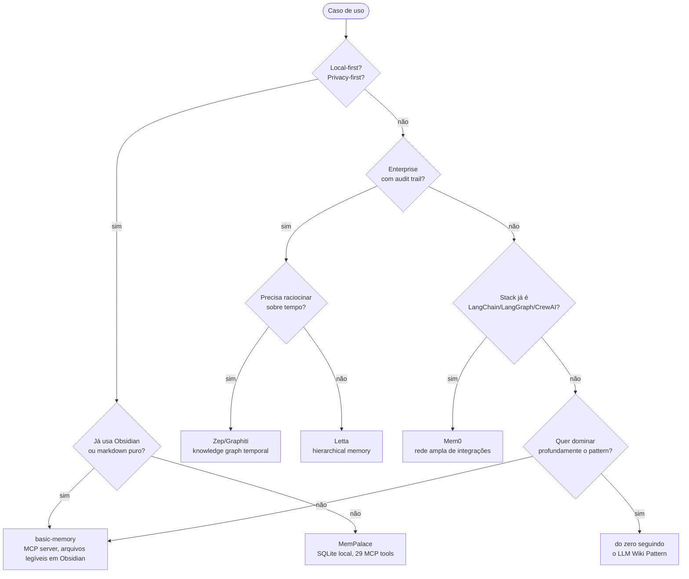

# Panorama de implementações

> [!abstract] TL;DR
> Em abril de 2026 há aproximadamente uma dúzia de implementações relevantes de memória de agentes circulando entre conferências, papers, threads no X e repositórios populares. Elas se agrupam em **três famílias**: (1) **inspiradas no LLM Wiki Pattern** do Karpathy — `LLM-knowledge-base` (Wendel), `graphify`, `basic-memory`, `NicholasSpisak/second-brain`, Apify Second Brain Builder; (2) **frameworks de produção** — Letta (ex-MemGPT), Mem0, Zep/Graphiti, MemPalace, Cognee, LangMem, SuperMemory; (3) **acadêmicas** — A-MEM. Esta nota é o gateway da Wave 5 da trilha: mapeia o terreno, oferece tabela síntese com hedges nos números e um fluxograma de escolha. As notas seguintes (10–16) detalham implementação por implementação.

## O que é

Esta nota é um **mapa de mercado**, não um catálogo exaustivo. O recorte temporal é deliberado: abril de 2026, momento em que o campo já tem benchmarks consolidados, surveys formais (ver [[19 - Surveys e estado da arte 2026|19 - Surveys]]) e o primeiro workshop dedicado em venue top-tier (MemAgents no ICLR 2026). Ferramentas surgem e somem rápido — três meses atrás MemPalace ainda não existia publicamente; daqui a três meses pode haver outras três que valem a pena. O objetivo aqui não é congelar uma lista definitiva, mas oferecer um esqueleto de orientação que o leitor possa reabrir periodicamente para reatualizar.

A trilha trata cada implementação relevante em nota própria a partir da [[10 - LLM-knowledge-base (Wendel) — direto do gist|10]] em diante. Esta nota — a 09 — funciona como índice anotado: explica como elas se relacionam, o que cada família resolve, quais sinalizam maturidade técnica e quais ainda são novidade promissora sem track-record. Quando uma decisão arquitetural precisa ser tomada — qual framework adotar, ou se vale construir do zero — esta página é o ponto de partida; as notas seguintes são o aprofundamento.

## Por que importa

- **Orienta a escolha de ferramenta sem afogamento.** A Lista de implementações de memória cresceu rápido em 2025–2026; sem um mapa, é fácil escolher pela primeira que apareceu no feed.
- **Situa cada implementação na trilha.** Cada linha da tabela tem uma nota dedicada; esta página é o índice navegável.
- **Separa hype recente de maturidade técnica.** "Lançada em abril" e "estável em produção" não são sinônimos. A coluna de maturidade na tabela explicita esse corte.
- **Dá vocabulário comparativo.** Termos como *LongMemEval*, *self-host*, *audit trail*, *memory palace*, *knowledge graph* têm significado preciso e vêm das fontes primárias — não são marketing.

## Como funciona — tabela síntese

> [!warning] Os números mudam frequentemente
> Pricing, scores de benchmark e contagem de integrações são instantâneos de **abril de 2026**. Antes de citar qualquer linha em texto público, verifique a fonte primária listada em [[#Referências]]. Cada implementação tem nota própria com tratamento mais detalhado.

| Implementação | Família | Substrato | LongMemEval | Custo | Maturidade | Quando usar |
|---|---|---|---|---|---|---|
| LLM-knowledge-base (Wendel) | Karpathy-inspired | Markdown + Python (`kb/`) | n/a | self-host | beta | implementação direta do gist, em PT, com hybrid search (BM25 + RRF) e healing automático |
| graphify | Karpathy-inspired | Knowledge graph (NetworkX, sem embeddings) | n/a | self-host (MIT) | beta | mixed-media (código, docs, vídeo, imagem); skill nativa para Claude Code/Cursor/Codex |
| basic-memory | Karpathy-inspired | Markdown + SQLite | n/a | open-source (AGPL-3.0) | estável | melhor integração markdown via MCP server; arquivos legíveis em Obsidian |
| Letta (ex-MemGPT) | Production | Hierarchical (RAM/disco, paginação) | não publicado | freemium / cloud paga | estável | self-editing memory, herdeiro do MemGPT, ecossistema maduro |
| Mem0 | Production | Vetor + grafo | ≈ 93,4% (auto-reportado) | tiers freemium | estável | rede ampla de integrações (LangChain, LangGraph, CrewAI, LlamaIndex, AutoGen, Agno e outras — verificar lista atual) |
| Zep/Graphiti | Production | Knowledge graph temporal (bi-temporal) | + 18,5% sobre full-context com GPT-4o | tiers cloud | estável | enterprise, audit trail, raciocínio temporal |
| MemPalace | Production | Memory palace + SQLite | 96,6% R@5 raw / ≥ 99% com LLM reranking | grátis local | recente (abr/2026) | local-first, MCP, sem cloud obrigatório |
| Cognee | Production | Pipeline modular (KG + vetor) | não publicado | open-source + cloud | em consolidação | quando se quer pipeline ETL de memória declarativo |
| LangMem | Production | Plug-in para LangChain/LangGraph | não publicado | open-source | em consolidação | quando o stack já é LangChain |
| SuperMemory | Production | Vetor + UI proprietária | não publicado | SaaS | em consolidação | uso pessoal com interface pronta |
| A-MEM | Acadêmica | Zettelkasten linkado dinamicamente | benchmark **LoCoMo**, não LongMemEval | research code | research | estudar a fronteira (NeurIPS 2025) |

> [!info] O símbolo "≈" e "+" não são casuais
> "≈ 93,4%" significa "score auto-reportado pelos autores em uma versão específica do benchmark". "+ 18,5%" é melhoria *sobre baseline*, não score absoluto. As duas grandezas **não são diretamente comparáveis** — quem reporta uma usa convenção diferente de quem reporta a outra. Detalhes em [[20 - Comparativo crítico (LongMemEval)|20 - Comparativo crítico]].

## Detalhes contextuais sobre LongMemEval

**LongMemEval** é o benchmark padrão da indústria para avaliar memória de longo prazo em LLM agents. Foi proposto em ICLR 2025 e o repositório oficial é `github.com/xiaowu0162/LongMemEval`. Ele isola cinco capacidades de memória — *information extraction*, *multi-session reasoning*, *temporal reasoning*, *knowledge updates* e *abstention* — em um conjunto de tarefas com histórico longo de sessões. É a referência preferida quando o objetivo é comparar implementações de forma minimamente justa.

Três observações importantes ao ler scores:

- **Quem não publicou scores.** Letta, Cognee, LangMem e SuperMemory **não divulgaram, no momento da publicação desta nota, scores em LongMemEval**. Isso não significa que sejam ruins — significa que falta evidência pública para comparação. É um sinal a considerar quando transparência importa (auditorias, decisões enterprise, defesa pública de escolha técnica).
- **Score de MemPalace em modo híbrido tem ressalvas.** A versão *hybrid v4 held-out* atinge 98,4% R@5 e a versão com LLM reranking atinge ≥ 99% R@5. Esses números, embora reais, foram obtidos com tuning adicional — análise crítica detalhada em [[21 - Críticas, limitações e armadilhas]]. Comparar 96,6% raw com 93,4% auto-reportado por Mem0 já não é apples-to-apples; comparar 99% híbrido é menos ainda.
- **A-MEM usa LoCoMo, não LongMemEval.** O paper de Wujiang Xu et al. (NeurIPS 2025, arXiv 2502.12110) avalia em **LoCoMo**, benchmark distinto, com cinco categorias de pergunta e formulação diferente. **Não é comparável diretamente** com os números em LongMemEval. Detalhes em [[18 - A-MEM — Zettelkasten dinâmico]].

A regra prática é: scores são úteis para descartar ferramentas claramente fracas, não para escolher entre ferramentas próximas. Quando dois sistemas estão dentro de poucos pontos um do outro, custo, integração e ergonomia decidem mais do que benchmark.

## Como escolher — fluxograma

O fluxograma é heurístico, não normativo. Existem casos legítimos de combinar duas ferramentas — por exemplo, basic-memory para o vault pessoal e Mem0 para um agente em produção — e existem casos em que nenhuma das opções serve e o melhor é construir uma solução custom seguindo o gist do Karpathy. O ponto é eliminar paralisia: dado um caso de uso, o fluxograma aponta um candidato razoável de partida.

## Quando NÃO usar implementação pronta

- **Quando o objetivo é dominar profundamente o LLM Wiki Pattern.** Escrever do zero a partir do gist do Karpathy ([[06 - O LLM Wiki Pattern (gist do Karpathy)]]) é um exercício pedagógico sem substituto. Frameworks abstraem decisões que vale a pena tomar manualmente pelo menos uma vez.
- **Quando o caso é tão específico que adaptação custa mais que construir.** Schema customizado, regras de retenção idiossincráticas, integrações exóticas — em algum ponto o esforço de domar uma framework supera o de escrever a coisa.
- **Quando o volume é baixo demais para justificar overhead.** Para um conjunto pequeno de notas e um agente que o consulta esporadicamente, **markdown puro + Claude Code com `CLAUDE.md` schema** já resolve. Adicionar SQLite, vetor e grafo cria operação que não se paga.
- **Quando o requisito principal é auditoria forte.** Algumas frameworks armazenam memórias em estruturas opacas (vetor + JSON ofuscado). Se o caso exige inspeção humana fácil, markdown legível ([[07 - Por que Obsidian e markdown como substrato]]) ganha de qualquer abstração.

## Armadilhas comuns

- **Confundir LongMemEval score com qualidade real em produção.** O benchmark mede capacidades específicas em distribuição específica; sistemas podem estar otimizados para o benchmark sem ganho proporcional em casos reais. Análise crítica em [[21 - Críticas, limitações e armadilhas]].
- **Escolher por hype recente sem benchmark próprio.** MemPalace é abril/2026 — promissor, mas sem track-record longo. Letta tem vários anos de iteração desde MemGPT. As duas afirmações coexistem; o leitor decide o trade-off.
- **Não checar se o framework tem fallback de provider.** Se a memória depende exclusivamente de OpenAI ou Anthropic, mudanças de pricing ou rate-limit derrubam o sistema. Frameworks maduros oferecem providers configuráveis.
- **Achar que "estável" é absoluto.** Em 2026 o campo se move rápido; "estável hoje" pode ser "deprecated em seis meses". Reavaliar periodicamente faz parte da operação de qualquer sistema de memória que o leitor adote.
- **Tratar a tabela como autoridade final.** Esta nota é instantânea. Antes de tomar uma decisão arquitetural, é obrigatório abrir os repos e blogs primários para ver o que mudou.

## Veja também

- [[06 - O LLM Wiki Pattern (gist do Karpathy)]] — pattern que inspira a família 1
- [[10 - LLM-knowledge-base (Wendel) — direto do gist|10 - LLM-knowledge-base]] — implementação canônica em PT
- [[11 - graphify — knowledge graph de raw|11 - graphify]] — graph-based, mixed-media
- [[12 - basic-memory — MCP nativo Obsidian|12 - basic-memory]] — MCP server, markdown legível em Obsidian
- [[13 - Letta (ex-MemGPT)|13 - Letta]] — framework production, hierarchical
- [[14 - Mem0 — vetorial + grafo|14 - Mem0]] — vetor + grafo, rede ampla de integrações
- [[15 - Zep e Graphiti — knowledge graph temporal|15 - Zep e Graphiti]] — KG temporal, enterprise
- [[16 - MemPalace (Milla Jovovich)|16 - MemPalace]] — memory palace local-first
- [[18 - A-MEM — Zettelkasten dinâmico]] — research/Zettelkasten
- [[19 - Surveys e estado da arte 2026]] — fundamentação acadêmica
- [[20 - Comparativo crítico (LongMemEval)|20 - Comparativo crítico]] — análise rigorosa de benchmarks
- [[21 - Críticas, limitações e armadilhas]] — auditoria honesta do campo

## Referências

- LongMemEval (Wu et al., ICLR 2025) — repositório oficial em `https://github.com/xiaowu0162/LongMemEval`
- Vectorize.io — *Best AI Agent Memory Systems in 2026*: `https://vectorize.io/articles/langchain-memory-alternatives`
- Atlan — *Best AI Agent Memory Frameworks 2026* (comparativo editorial)
- DEV.to (Bhardwaj / Anajulia Bittencourt) — *Mem0 vs Zep vs LangMem vs MemoClaw: AI Agent Memory Comparison 2026*: `https://dev.to/anajuliabit/mem0-vs-zep-vs-langmem-vs-memoclaw-ai-agent-memory-comparison-2026-1l1k`
- Mem0 blog — *State of AI Agent Memory 2026*: `https://mem0.ai/blog/state-of-ai-agent-memory-2026`
- Graphlit — *Survey of AI Agent Memory Frameworks* (comparativo editorial)
- Repositórios primários:
    - `https://github.com/wendeus0/LLM-knowledge-base` (Wendel — direto do gist do Karpathy)
    - `https://github.com/safishamsi/graphify` (knowledge graph, MIT)
    - `https://github.com/basicmachines-co/basic-memory` (Markdown + SQLite, AGPL-3.0)
    - `https://github.com/letta-ai/letta` (ex-MemGPT)
    - `https://github.com/mem0ai/mem0` (Mem0)
    - `https://github.com/getzep/graphiti` (Graphiti, KG temporal)
    - `https://github.com/milla-jovovich/mempalace` (MemPalace)
    - `https://github.com/agiresearch/A-mem` e `https://github.com/WujiangXu/AgenticMemory` (A-MEM)
- Zep blog — *State of the Art Agent Memory* (números de + 18,5% sobre baseline com GPT-4o): `https://blog.getzep.com/state-of-the-art-agent-memory/`
- Karpathy gist do LLM Wiki Pattern (3 de abril de 2026) — referenciado em [[06 - O LLM Wiki Pattern (gist do Karpathy)]]
