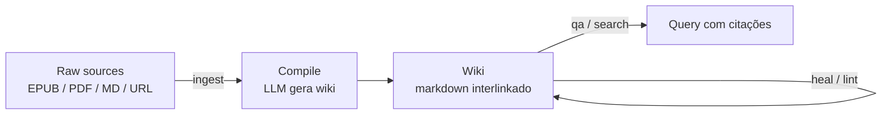

# LLM-knowledge-base (Wendel)

> [!abstract] TL;DR
> Implementação Python de referência do **LLM Wiki Pattern** do Karpathy mantida por Wendel em `https://github.com/wendeus0/LLM-knowledge-base`. Pacote `kb/` com ciclo de quatro etapas — *ingest → compile → Q&A/search → heal/lint* —, busca híbrida (keyword + BM25 + RRF), claims lifecycle (confiança, supersessão, decaimento), importadores EPUB/PDF com OCR opcional, integração com Obsidian via `obsidian-terminal` e 311 testes com 90%+ de cobertura. Vale como **referência canônica em código real** para estudar o pattern, não como SaaS pronto.

## O que é

`LLM-knowledge-base` é uma engine Python autônoma que transcreve o gist do Karpathy ([[06 - O LLM Wiki Pattern (gist do Karpathy)]]) em código executável. O README descreve o sistema como "engine de knowledge base mantida por LLM" — coleta documentos brutos, compila-os em uma wiki markdown, responde perguntas contra essa wiki e executa health checks com healing automático. Cada uma das três camadas e três operações do gist tem ponto de entrada explícito na CLI, e o pacote `kb/` é legível para quem quer entender o pattern em código real, não só em prosa.

A separação entre engine e dados é uma escolha arquitetural bem sinalizada. O repositório guarda **apenas** o pacote Python, testes, documentação e exemplos neutros. O *corpus* do usuário — `raw/`, `wiki/`, `outputs/`, `kb_state/` — vive em um diretório externo apontado pela variável de ambiente `KB_DATA_DIR`. Isso evita o erro clássico de misturar código e conteúdo no mesmo repositório e permite reconstruir a wiki do zero a partir do raw imutável quando o schema muda. O frontend recomendado é Obsidian sobre o vault em `KB_DATA_DIR`, com o plugin `obsidian-terminal` rodando comandos `kb` no terminal integrado.

## Por que importa

Para quem está estudando o LLM Wiki Pattern, ler o gist resolve a parte conceitual; ler `kb/` resolve a parte de "como isso vira código". A maioria dos repositórios inspirados no pattern abstrai decisões importantes atrás de frameworks ou esconde lógica em prompts opacos. Aqui, a tradução de cada conceito do gist para Python é direta o suficiente para servir de mapa: módulos com nomes como `compile.py`, `qa.py`, `lint.py` e `heal.py` ecoam um por um as operações descritas pelo Karpathy. Essa transparência é o argumento principal para citar o repositório como referência canônica em uma trilha de estudo do pattern.

Além da fidelidade ao gist, o repositório acrescenta camadas que o gist não detalha mas que qualquer implementação séria precisa: detecção de conteúdo sensível com opt-in explícito (`--allow-sensitive`), commits Git controlados por flag, tracking SQLite de execuções, jobs canônicos agendáveis (`jobs run`, `jobs gate`, `jobs cron`), conformidade documental (`doc-gate`) e handoff estruturado de sessão. Para quem vai construir variante própria, esse conjunto serve como checklist do que falta implementar ao sair do "demo de fim de semana" para algo usável de fato.

## Como funciona — 4-stage cycle

O ciclo central é descrito no próprio README como `Ingest → Compile → Q&A / Search → Heal / Lint`. Cada estágio tem comando dedicado na CLI Typer.

1. **Ingest** — `kb ingest` adiciona documentos e URLs a `raw/`. O comando `kb import-book` é a porta de entrada para EPUB/PDF, gerando capítulos em markdown; `--ocr` aciona reconhecimento de texto para PDFs escaneados; `--chunk-pages` controla granularidade. Web ingest (`kb ingest <url>`) requer o extra opcional `[web]`.
2. **Compile** — `kb compile` lê `raw/` e produz a wiki em markdown via LLM, em paralelo (`--workers N`). O frontmatter YAML de cada artigo compilado inclui `title`, `topic`, `tags`, `source`, `translated_by`, `reviewed_at`. O guardrail de conteúdo sensível bloqueia compilação por padrão; `--allow-sensitive` é o opt-in explícito.
3. **Q&A / Search** — `kb qa "pergunta"` responde com routing por fonte e *traversal* de wikilinks; `-f` arquiva a resposta como file-back em `outputs/`; `--commit` versiona explicitamente. `kb search "termo"` faz busca híbrida combinando keyword, BM25 e *reciprocal rank fusion* (RRF), sem dependência externa de vetor DB.
4. **Heal / Lint** — `kb heal --n N` faz healing estocástico de N arquivos por execução (corresponde à manutenção contínua do gist); `kb lint` faz auditoria da wiki via LLM. Ambos compõem o "health gate" exposto por `kb jobs gate --stale-max-pct ...`, que falha o job quando thresholds configuráveis são violados.

A simetria com o gist é clara: as operações **ingest**, **query** e **lint** do Karpathy aparecem como `ingest`+`compile`, `qa`+`search` e `heal`+`lint`. A divisão extra (compile separado de ingest, heal separado de lint) reflete decisões pragmáticas de Python — separar I/O de chamada LLM, separar correção estocástica leve de auditoria global pesada — sem trair o pattern original.

## Anatomia técnica

Detalhes refletem o estado público do `main` em abril de 2026 — repositório está ativo, vale revisitar.

- **Estrutura do pacote.** `kb/` contém os módulos do ciclo (`compile.py`, `qa.py`, `search.py`, `heal.py`, `lint.py`), CLI Typer (`cli.py`), helpers de estado (`state.py`, `audit.py`, `claims.py`), importadores (`book_import.py`, `book_import_core.py`, `book_import_pdf.py`, `web_ingest.py`), routing/grafo (`router.py`, `graph.py`), guardrails, git helper, handoff, conformidade documental e subpacotes `cmds/`, `core/`, `discover/`, `analytics/`. Os dados do usuário vivem em `KB_DATA_DIR`, fora do repositório, com subpastas `raw/`, `wiki/`, `outputs/` e `kb_state/`.
- **Hybrid search sem vetor DB externo.** `search.py` combina keyword, BM25 e *reciprocal rank fusion* — cobertura semântica razoável sem operar Pinecone, Qdrant ou Weaviate. Custo computacional pago em CPU local.
- **Claims lifecycle.** `claims.py` implementa o ciclo de vida das afirmações — confiança, supersessão explícita (claims novos invalidam antigos) e decaimento. Entradas em JSON-Lines em `kb_state/`, timestamps em UTC. É o subsistema que persiste *meta-conhecimento* sobre o que está atualizado, obsoleto ou pedindo revisão.
- **Importadores EPUB/PDF/Web.** `book_import.py` é a *facade* sobre `book_import_core.py` e `book_import_pdf.py`. PDFs textuais usam o extra `[pdf]`; escaneados, `[ocr]`; web ingest, `[web]`. A modularização por extras opcionais mantém a instalação base enxuta.
- **Health gate.** `kb jobs gate --stale-max-pct N` falha quando o vault tem mais que N% de páginas stale — útil em CI ou crons noturnos. `kb jobs cron` imprime bloco de cron sugerido.
- **Git integration explícita.** Por padrão, comandos que escrevem **não** comitam — alteração local pura. `--commit` versiona; `--no-commit` continua sendo *no-op* válido. É o oposto do "commit automático silencioso".
- **Obsidian compatibility.** Frontmatter YAML padronizado, wikilinks, integração via plugin `obsidian-terminal` documentada em `docs/OBSIDIAN.md`. Sintetiza com [[07 - Por que Obsidian e markdown como substrato]].
- **Tests.** O README declara **311 testes passando e 90%+ de cobertura** (baseline 22/abr/2026). Por módulo: `git.py` 100%, `cli.py` 98%, `client.py` 97%, `book_import_core.py` 97%, `compile.py` 91%.
- **Stack.** Python 3.11+, Typer + Rich, OpenAI SDK (OpenCode Go, OpenAI oficial, modelos locais), armazenamento em JSON, markdown e SQLite. Lint com ruff. Licença AGPL-3.0.

## Quando usar / quando não usar

**Quando vale considerar:**

- O objetivo é estudar o **LLM Wiki Pattern em código real**. O repositório serve como tradução fiel do gist para Python, com nomes de módulo que ecoam os termos do Karpathy.
- Pretende construir variante própria em Python e prefere começar de uma base com TDD/SDD já estabelecidos a partir do zero.
- O caso de uso requer importação de **EPUB/PDF**, inclusive escaneados (OCR), e integração com Obsidian — esses fluxos estão prontos.
- Tolera UX *rougher* — é CLI Typer, não SaaS polido. A curva de adoção exige conforto com terminal, variáveis de ambiente e edição de YAML.
- Quer self-host AGPL-3.0 explícito, sem dependência de vendor ou cloud obrigatória.

**Quando NÃO vale:**

- Procura solução pronta com UX limpa — [[12 - basic-memory — MCP nativo Obsidian|basic-memory]] resolve melhor o caso "abrir Obsidian e funcionar" via MCP nativo, sem exigir CLI separada.
- Não conhece Python o suficiente para estender. O pattern é simples, mas customizar `compile.py`, ajustar prompts ou alterar o esquema de claims requer leitura de código.
- O caso pede SaaS gerenciado — Mem0 e Zep cobrem cenários enterprise com integrações prontas; ver [[09 - Panorama de implementações (abril 2026)|09 - Panorama]].
- Stack já é LangChain/LangGraph e a equipe quer um plug-in nativo — LangMem encaixa melhor sem adicionar uma CLI separada.
- O domínio é regulatório/legal/normativo onde síntese automática mascara nuances jurídicas. Markdown puro com revisão humana ainda é o caminho.

## Armadilhas comuns

> [!warning] Confundir referência com produto pronto
> O maior risco ao adotar o repositório é tratá-lo como SaaS — com SLAs, equipe de suporte e roadmap previsível. É código de um único autor sob AGPL-3.0; útil como referência e como base, **não** como produto. Quem precisa de garantias contratuais deve buscar Letta, Mem0 ou Zep, e quem precisa só de Obsidian deve olhar basic-memory antes.

- **Confundir `kb/` com SaaS pronto.** É library/CLI sob AGPL — o ônus operacional fica com quem instala. Não há equipe atrás.
- **Subestimar dependência de OCR.** O extra `[ocr]` puxa toolchain pesada (Tesseract, libs nativas). Em containers minimal ou máquinas corporativas, a instalação pode virar projeto à parte. Avaliar se EPUBs ou PDFs textuais já cobrem o caso antes de habilitar.
- **Lint pass sem disciplina vira teatro.** `kb lint` chama LLM contra a wiki — útil, mas só efetivo com schema bem escrito. Schema vago produz lint que aprova qualquer coisa. A inovação real continua sendo o schema, conforme [[06 - O LLM Wiki Pattern (gist do Karpathy)]].
- **Cobertura de testes alta não é garantia de adequação.** 311 testes em 90%+ cobrem cenários *do autor*, não os seus. Modos de uso fora do trilho documentado podem expor caminhos não testados.
- **AGPL-3.0 em produto comercial.** Qualquer fork servido em rede precisa publicar o fonte sob a mesma licença — incompatível com SaaS proprietário fechado. Vale leitura antes de embutir o código.
- **`KB_DATA_DIR` mal configurado é bug silencioso.** Se a variável apontar para um diretório errado, `kb` cria estrutura nova em vez de avisar. Validar o caminho na primeira execução é higiene básica.

## Veja também

- [[06 - O LLM Wiki Pattern (gist do Karpathy)]] — pattern original que esta nota implementa
- [[09 - Panorama de implementações (abril 2026)|09 - Panorama]] — onde o repositório se posiciona em relação às outras famílias
- [[12 - basic-memory — MCP nativo Obsidian|12 - basic-memory]] — alternativa Karpathy-inspired mais polida no front Obsidian
- [[22 - Guia de implementação do zero]] — usar `kb/` como referência ao implementar variante própria
- [[RAG e Vector Databases]] — fundamentos de hybrid search, BM25 e RRF que aparecem aqui
- [[07 - Por que Obsidian e markdown como substrato]] — escolha de substrato que o repositório adota

## Referências

- **Repositório oficial** — `https://github.com/wendeus0/LLM-knowledge-base` — engine Python sob AGPL-3.0, README em PT com versão `README.en.md` em inglês. URL confirmado via `gh api repos/wendeus0/LLM-knowledge-base` em abril de 2026.
- **Karpathy, gist oficial** — `https://gist.github.com/karpathy/442a6bf555914893e9891c11519de94f` — pattern original que o repositório implementa.
- **Documentação interna do repo** — `docs/architecture/ARCHITECTURE.md`, `docs/API.md` (referência CLI + Python API, ~813 linhas), `docs/OBSIDIAN.md`, `docs/adr/` (16 ADRs numerados 0001–0016) — material de aprofundamento publicado dentro do próprio repositório.
- **README — seção "Stack" e "Roadmap"** — declara explicitamente Python 3.11+, Typer, Rich, OpenAI SDK, busca BM25+RRF sem dependência externa, e roadmap com itens já entregues e pendentes (embeddings + RAG híbrido, multi-agent specialization).
