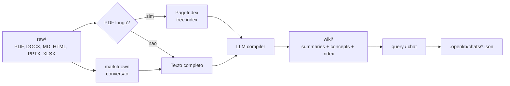

# OpenKB

> [!abstract] TL;DR
> **OpenKB** (`github.com/VectifyAI/OpenKB`) é uma implementação open-source do **LLM Wiki Pattern** em forma de CLI Python: documentos brutos entram em `raw/`, são convertidos por `markitdown`, documentos longos passam por **PageIndex** e o LLM compila uma wiki markdown em `wiki/` com `summaries/`, `concepts/`, `index.md`, `log.md` e `AGENTS.md`. O diferencial em relação a implementações mais simples do pattern é a aposta explícita em **long document retrieval vectorless** via PageIndex, multimodalidade e chat interativo com sessões persistidas em `.openkb/chats/*.json`. Encaixa bem como **memória longa documental** para agentes e pesquisa, mas ainda não substitui uma memory layer conversacional tipo Mem0/Letta: a sessão é salva como histórico, não como fatos duráveis curados automaticamente.

## O que é

OpenKB se apresenta como "Open LLM Knowledge Base": um sistema de CLI que transforma documentos em uma wiki estruturada, interlinkada e mantida por LLM. A ideia é a mesma família conceitual do [[06 - O LLM Wiki Pattern (gist do Karpathy)|LLM Wiki Pattern]]: em vez de fazer RAG tradicional sobre chunks a cada pergunta, o sistema **compila conhecimento uma vez** em páginas persistentes — resumos, conceitos, cross-links e índice — e usa essa wiki como substrato de consulta e evolução.

A arquitetura padrão criada por `openkb init` é deliberadamente legível:

- `raw/` — arquivos originais adicionados pelo usuário
- `wiki/sources/` — conversões para texto/markdown e fontes extraídas
- `wiki/summaries/` — resumo por documento
- `wiki/concepts/` — sínteses transversais entre documentos
- `wiki/explorations/` — respostas salvas e transcripts exportados
- `wiki/reports/` — relatórios de lint
- `wiki/AGENTS.md` — instruções/schema da wiki para o LLM
- `.openkb/` — estado operacional, configuração, hashes e sessões de chat

O ponto arquitetural mais interessante é que OpenKB não tenta ser apenas "Obsidian com bot". Ele adiciona uma camada de processamento para documentos longos: PDFs a partir de um limiar configurável passam por PageIndex, que cria uma árvore hierárquica de páginas/seções. O LLM navega essa árvore em vez de carregar o PDF inteiro no contexto. Isso diferencia OpenKB de soluções markdown-first mais simples como [[13 - basic-memory — MCP nativo Obsidian|basic-memory]] e de engines mais diretas do gist como [[10 - LLM-knowledge-base (Wendel) — direto do gist|LLM-knowledge-base]].

## Por que importa

- **É o Karpathy pattern empacotado como CLI instalável.** `pip install openkb`, `openkb init`, `openkb add`, `openkb query`, `openkb chat` deixam o pattern acessível sem escrever a própria engine.
- **Resolve melhor documentos longos que o wiki pattern mínimo.** PageIndex reduz o problema de contexto longo, contexto podre e sumarização rasa em PDFs grandes. Para pesquisa bibliográfica, relatórios e livros, isso é vantagem real.
- **Mantém o resultado em markdown.** A wiki final é auditável por humano, versionável em Git e compatível com Obsidian, preservando o argumento de [[07 - Por que Obsidian e markdown como substrato]].
- **Tem sessão interativa persistida.** `openkb chat` mantém histórico multi-turn retomável por `--resume`, lista sessões e permite exportar transcript para `wiki/explorations/`.
- **Evita vector DB externo.** A proposta de PageIndex é retrieval raciocinado/vectorless; isso reduz infra, embora não elimine custo de LLM nem complexidade de indexação.

## Como funciona

O ciclo operacional é:

1. **Inicializar.** `openkb init` cria `raw/`, `wiki/`, `.openkb/config.yaml`, `wiki/AGENTS.md`, `wiki/index.md` e `wiki/log.md`.
2. **Adicionar documentos.** `openkb add <arquivo_ou_dir>` converte formatos suportados via `markitdown`. PDFs longos são indexados por PageIndex; documentos curtos são lidos integralmente pelo LLM.
3. **Compilar wiki.** O agente gera um resumo do documento, lê conceitos existentes, cria ou atualiza conceitos, atualiza índice e log. Um único documento pode tocar várias páginas.
4. **Consultar.** `openkb query "pergunta"` faz uma pergunta pontual contra a wiki. Com `--save`, salva a resposta em `wiki/explorations/`.
5. **Conversar.** `openkb chat` abre REPL multi-turn. A sessão carrega `session.history` como input para o Agents SDK e salva o novo histórico depois de cada turno.
6. **Manter.** `openkb lint` roda checks estruturais e semânticos; `openkb watch` observa `raw/` e compila arquivos novos automaticamente.

## Anatomia técnica

Os itens abaixo refletem o estado público do repositório em 06/05/2026.

- **Pacote.** `openkb`, versão `0.1.3`, Python `>=3.10`, licença Apache-2.0.
- **Stack.** PageIndex `0.3.0.dev1`, `markitdown[all]`, Click, watchdog, LiteLLM, OpenAI Agents SDK, PyYAML, python-dotenv, json-repair, prompt_toolkit e Rich.
- **Multi-LLM.** Configuração via LiteLLM em `.openkb/config.yaml`; exemplos do README usam OpenAI, Anthropic e Gemini. A variável genérica é `LLM_API_KEY`, propagada para env vars específicas quando necessário.
- **Schema editável.** `wiki/AGENTS.md` define estrutura e convenções da wiki. O runtime lê o arquivo do disco, então alterações no schema passam a valer sem recompilar o pacote.
- **Sessões.** Cada chat fica em `<kb>/.openkb/chats/<id>.json`. O arquivo guarda `id`, timestamps, modelo, idioma, título, contagem de turnos, `history`, `user_turns` e `assistant_texts`.
- **Sanitização de imagens.** O histórico do Agents SDK é persistido via `RunResult.to_input_list()`, mas payloads `data:` de imagens retornadas por tools são substituídos por placeholders textuais com instrução de re-chamar `get_image` se necessário.
- **Gestão de sessão.** `openkb chat --resume`, `--list` e `--delete` permitem retomar, listar e apagar sessões. Prefixos únicos de id são aceitos.
- **Tools de wiki.** O agente lê arquivos markdown, lista diretórios, consulta páginas específicas convertidas para JSON, lê imagens como data URL e escreve arquivos markdown dentro do root da wiki com proteção contra path traversal.
- **Estado de ingestão.** `.openkb/hashes.json` evita reprocessar arquivos já adicionados.

## Onde ele fica na trilha

OpenKB pertence à família **Karpathy-inspired**, mas ocupa uma posição intermediária:

| Sistema | Melhor leitura |
|---|---|
| [[10 - LLM-knowledge-base (Wendel) — direto do gist|LLM-knowledge-base]] | implementação direta do gist, boa para estudar o pattern por dentro |
| **OpenKB** | CLI pronta para compilar documentos longos em wiki com PageIndex |
| [[12 - graphify — knowledge graph de raw|graphify]] | aposta graph-first sobre raw heterogêneo |
| [[13 - basic-memory — MCP nativo Obsidian|basic-memory]] | memória markdown via MCP para agentes interativos |

O eixo decisivo é: **OpenKB é uma knowledge base documental compilada**, não uma memória conversacional universal. Ele é muito bom quando o agente precisa consultar um corpo de documentos e manter sínteses legíveis. É menos adequado quando o problema principal é lembrar preferências de usuário, fatos extraídos de conversas ou estado incremental multi-user.

## Quando usar / quando não usar

**Quando vale:**

- Pesquisa sobre corpus de documentos longos — papers, relatórios, livros, documentação técnica.
- Necessidade de wiki markdown/Obsidian como artefato final, não só retrieval invisível.
- Preferência por evitar vector DB externo.
- Workflow CLI local-first com LLM configurável por LiteLLM.
- Agente que precisa de uma memória longa **documental** e auditável.
- Exploração do LLM Wiki Pattern com suporte pronto a documentos longos e multimodalidade.

**Quando NÃO vale:**

- Memória conversacional personalizada por usuário, com extração automática de fatos salientes a cada turno. Para isso, [[15 - Mem0 — vetorial + grafo|Mem0]], [[14 - Letta (ex-MemGPT)|Letta]] ou [[16 - Zep e Graphiti — knowledge graph temporal|Zep/Graphiti]] estão mais próximos do problema.
- Multi-user enterprise com ACL, audit trail formal e compliance. OpenKB é CLI/local-first, não plataforma de governança.
- Caso que exige API server estável para plugar em produto. O README não posiciona OpenKB como serviço backend; a superfície principal é CLI.
- Volume massivo de coleção com reindexação, permissões e lifecycle corporativo. O roadmap ainda lista storage database-backed e web UI como futuros.
- Ambientes onde PageIndex, markitdown e dependências de conversão multimodal são pesadas demais para o deployment.

## Armadilhas comuns

- **Confundir chat persistido com memória semântica.** `.openkb/chats/*.json` guarda histórico de sessão; não necessariamente extrai preferências, fatos duráveis e decisões para páginas estáveis.
- **Achar que "sem vector DB" significa "sem infra cognitiva".** PageIndex troca embeddings por uma árvore de recuperação raciocinada. Isso reduz um tipo de infra, mas adiciona outro tipo de indexação e dependência de LLM.
- **Confiar cegamente na compilação automática.** A qualidade da wiki depende do `AGENTS.md`, do modelo escolhido e das fontes. Schema fraco gera conceitos fracos.
- **Misturar memória de pesquisa com memória de produto.** Uma knowledge base pessoal pode tolerar correções manuais e inconsistências transitórias; memória de usuário em produção não pode.
- **Ignorar estado alpha.** O pacote está em `0.1.3` e o classifier do projeto marca "Development Status :: 3 - Alpha". Bom para estudar e prototipar; prudência antes de vender como infraestrutura estável.
- **Não versionar a wiki.** Como o agente escreve markdown, Git é o mecanismo natural de auditoria. Sem histórico, um rewrite ruim de conceito pode passar despercebido.

## Integração prática com memória de agentes

Se eu fosse usar OpenKB como parte de uma arquitetura de agente, separaria três camadas:

1. **Histórico de sessão curto.** Usar o próprio `.openkb/chats/*.json` ou a memória nativa do framework para retomar conversas recentes.
2. **Explorações episódicas.** Exportar respostas e transcripts relevantes para `wiki/explorations/`, com data, pergunta, decisões e pendências.
3. **Memória semântica durável.** Promover manualmente ou por pipeline controlado os achados estáveis para `wiki/concepts/`, evitando que todo turno de conversa vire conhecimento permanente.

Essa separação impede o erro "gravar tudo é lembrar tudo". OpenKB deve ser visto como **compilador de conhecimento documental**; a camada de política — o que entra, o que vira conceito, o que expira — ainda precisa ser desenhada.

## Veja também

- [[06 - O LLM Wiki Pattern (gist do Karpathy)]] — pattern conceitual que OpenKB operacionaliza
- [[07 - Por que Obsidian e markdown como substrato]] — por que a saída em markdown importa
- [[08 - Arquitetura de um sistema de memória]] — vocabulário ingestão, indexação, retrieval e manutenção
- [[09 - Panorama de implementações (abril 2026)|09 - Panorama]] — mapa das implementações
- [[10 - LLM-knowledge-base (Wendel) — direto do gist|10 - LLM-knowledge-base]] — implementação Python mais direta do gist
- [[12 - graphify — knowledge graph de raw|12 - graphify]] — alternativa graph-first
- [[13 - basic-memory — MCP nativo Obsidian|13 - basic-memory]] — alternativa MCP/markdown para agentes
- [[22 - Críticas, limitações e armadilhas]] — riscos de benchmarks, hype e memória persistente mal governada
- [[23 - Guia de implementação do zero]] — como construir variante própria

## Referências

- Repositório oficial — `https://github.com/VectifyAI/OpenKB` (verificado em 06/05/2026; Apache-2.0; Python; README com arquitetura, comandos e roadmap).
- README oficial — seções *What is OpenKB*, *How OpenKB Works*, *Interactive Chat*, *AGENTS.md* e *The Stack*.
- `pyproject.toml` — pacote `openkb` versão `0.1.3`, dependências principais (`pageindex==0.3.0.dev1`, `markitdown[all]`, `litellm`, `openai-agents`) e classifier alpha.
- `openkb/agent/chat_session.py` — persistência de sessões em `.openkb/chats/*.json` e sanitização de payloads de imagem.
- `openkb/agent/chat.py` — REPL multi-turn, `/save`, `/clear`, `/add`, `/lint`, `--resume`, streaming e gravação do histórico via `session.record_turn(...)`.
- `openkb/agent/tools.py` — tools de leitura/escrita da wiki com proteção de path traversal.
- PageIndex — `https://github.com/VectifyAI/PageIndex` — sistema de document index vectorless usado por OpenKB para documentos longos.
