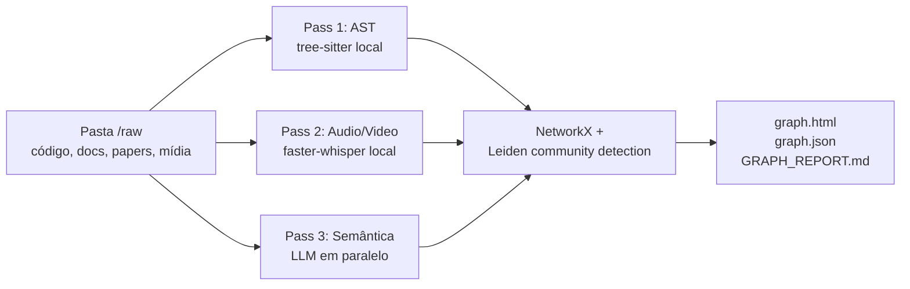

# graphify

> [!abstract] TL;DR
> `graphify` (`github.com/safishamsi/graphify`) transforma uma pasta `/raw` — código, docs, papers, imagens, áudio e vídeo — em um **knowledge graph queryable**. Descrito pelo autor como "the answer to Karpathy's `/raw` folder", leva o pattern para substrato gráfico em vez de markdown. Integra com Claude Code, Codex, Cursor, Gemini CLI e outros via slash command `/graphify .`. Promete cerca de **71,5x menos tokens por query** vs ler arquivos brutos — número auto-reportado, não auditado. Saída: `graph.html` (vis.js), `graph.json` (queryable) e `GRAPH_REPORT.md` (sumário de god nodes e comunidades).

## O que é

`graphify` é uma versão **graph-based** do [[06 - O LLM Wiki Pattern (gist do Karpathy)|LLM Wiki Pattern]]. Em vez de compilar uma wiki em markdown a partir do `/raw`, como [[10 - LLM-knowledge-base (Wendel) — direto do gist|LLM-knowledge-base]] faz, o repositório constrói um grafo `NetworkX`, clusteriza com **Leiden community detection** e exporta artefatos consumíveis pelo assistente de código. O posicionamento como sucessor explícito do `/raw` aparece literalmente no README — "Andrej Karpathy keeps a `/raw` folder where he drops papers, tweets, screenshots, and notes. graphify is the answer to that problem".

O foco é **mixed-media**, não só markdown: código (extração AST via tree-sitter em cerca de 25 linguagens), documentos, papers, imagens (Claude vision), áudio e vídeo (transcritos localmente com `faster-whisper`). É instalado como **skill** do assistente de código — `/graphify` no Claude Code/Cursor/Gemini CLI/Aider/Antigravity, `$graphify` no Codex — e roda em cima de qualquer pasta. Licença MIT, pacote PyPI `graphifyy` (com duplo y; o pacote `graphify` no PyPI é de outro projeto).

## Por que importa

- **Mostra que o LLM Wiki Pattern não precisa ser só markdown.** O substrato pode ser knowledge graph; a pergunta deixa de ser "qual artigo da wiki cita isso?" e vira "qual caminho no grafo conecta A a B?".
- **Eficiência de token é argumento concreto para escala.** O autor reporta cerca de 71,5x menos tokens por query vs ler arquivos brutos. Sinal, não número auditado, mas em codebases grandes muda a economia de uso do assistente.
- **Integração nativa com IDEs traz o pattern para o workflow diário.** `graphify` se instala como skill com hook que dispara antes de cada `Glob`/`Grep` no Claude Code, antes de cada Bash no Codex, antes de cada leitura no Gemini CLI. Quando existe `graphify-out/`, o assistente é instruído a consultar o grafo em vez de varrer arquivos.
- **Confidence tagging explícito.** Cada relação é rotulada `EXTRACTED`, `INFERRED` ou `AMBIGUOUS` — responde à crítica recorrente de KGs gerados por LLM ("o que foi visto vs inventado") sem esconder o problema.

## Como funciona — 3-pass processing

O README descreve o pipeline em três passes:

1. **AST pass — determinístico, local, sem LLM.** `tree-sitter` extrai estrutura de código: classes, funções, imports, call graph (cross-file em todas as linguagens suportadas), docstrings e comentários de rationale. Instantâneo, não consome tokens.
2. **Audio/video pass — local.** Vídeos e áudios são transcritos com `faster-whisper`, usando *prompt* domain-aware derivado dos *god nodes* do corpus (segundo o README, melhora reconhecimento de termos técnicos). Transcrições ficam em cache em `graphify-out/transcripts/`. Áudio nunca sai da máquina.
3. **Semantic pass — LLM em paralelo.** Subagentes (Claude por padrão, ou outro modelo conforme a plataforma) processam docs, papers, imagens e transcrições para extrair conceitos, relacionamentos e design rationale. Os resultados são fundidos em um grafo `NetworkX`, clusterizado com **Leiden community detection** e exportado.

O clustering é **topológico, não baseado em embeddings** — o README é explícito: "Clustering is graph-topology-based — no embeddings". Edges semânticas (`semantically_similar_to`) extraídas pelo LLM e marcadas `INFERRED` já estão no grafo e influenciam a detecção de comunidade diretamente, eliminando dependência de vector DB.

## Anatomia técnica

Os itens abaixo refletem o estado público do README de `safishamsi/graphify` em abril de 2026. O repositório está ativo (default branch `v5`, atualizado dias antes), portanto vale revisitar a fonte primária antes de decisões críticas.

- **Construção do grafo.** `NetworkX` para representação; **Leiden community detection** para clustering por densidade de aresta, sem embeddings nem vector DB externo. A similaridade semântica entra como aresta `INFERRED` extraída no semantic pass, não como busca em espaço vetorial.
- **Visualização.** `graph.html` é gerado com `vis.js`, abrível em qualquer browser, com clique em nó, busca e filtro por comunidade.
- **Linguagens suportadas.** Cerca de 25 via `tree-sitter` — Python, JS, TS, JSX, TSX, Go, Rust, Java, C, C++, Ruby, C#, Kotlin, Scala, PHP, Swift, Lua, Zig, PowerShell, Elixir, Objective-C, Julia, Verilog/SystemVerilog, Vue, Svelte, Dart. Java tem extração extra de `extends`/`implements`. Call graph é cross-file em todas.
- **Outputs canônicos.** `graphify-out/graph.html` (visualização interativa), `graph.json` (grafo persistido, queryable em sessões futuras), `GRAPH_REPORT.md` (sumário de god nodes, comunidades, conexões surpreendentes e perguntas sugeridas) e `cache/` (cache SHA256 — re-runs só processam arquivos alterados).
- **Integração com IDEs — slash command + always-on.** `/graphify .` (ou `$graphify .` no Codex) roda em qualquer assistente compatível. Para deixar a integração *always-on*, comandos de plataforma injetam regras: Claude Code escreve seção em `CLAUDE.md` e instala **PreToolUse hook** que dispara antes de `Glob`/`Grep`; Codex usa `AGENTS.md` + PreToolUse hook em `.codex/hooks.json`; OpenCode usa plugin `tool.execute.before`; Cursor escreve `.cursor/rules/graphify.mdc` com `alwaysApply: true`; Gemini CLI usa `BeforeTool` hook. Plataformas sem hooks (Aider, OpenClaw, Factory Droid, Trae, Hermes) ficam com `AGENTS.md` como mecanismo always-on.
- **Confidence tagging.** Cada aresta é rotulada como `EXTRACTED` (encontrada literalmente), `INFERRED` (inferência razoável, com confidence score) ou `AMBIGUOUS` (sinalizada para revisão). O README enfatiza: "You always know what was found vs guessed".
- **Watch mode.** `graphify watch ./src` faz auto-rebuild conforme arquivos mudam. Para código, AST é instantâneo; para docs/papers, o sistema notifica que há re-pass semântico pendente — o disparo do LLM fica explícito. `graphify hook install` adiciona git hook que rebuilda no commit e no branch switch.
- **Token efficiency claim.** "**71.5x fewer tokens per query vs reading raw files**" — citação direta do README, **auto-reportada** pelo autor. Útil como ordem de grandeza, não como número auditado.
- **Team-friendly.** `graphify-out/` é projetado para commit no repositório — um teammate roda `/graphify .`, comita, e os outros recebem `GRAPH_REPORT.md` no `git pull`. `.graphifyignore` (sintaxe de `.gitignore`) exclui paths. O README sugere `.gitignore` para `manifest.json` (mtime-based, inválido pós-clone) e `cost.json` (tracking local).
- **Comandos avançados.** `graphify clone <github-url>` clona repo público e roda pipeline; `graphify merge-graphs g1.json g2.json ...` combina grafos cross-repo, taggeando cada nó pela origem; `graphify --mcp` ou `python -m graphify.serve graph.json` expõe MCP server com `query_graph`, `get_node`, `get_neighbors`, `shortest_path`. Exportação para Neo4j via `--neo4j`.
- **Stack e licença.** Python 3.10+, MIT, via `uv tool install graphifyy`, `pipx install graphifyy` ou `pip install graphifyy`. Extras `[video]`, `[office]`, `[ocr]`.

## Quando usar / quando não usar

**Quando vale considerar:**

- Corpus **misturado** — codebase grande + papers + slides + vídeos + screenshots — onde nenhum substrato puramente textual cobre tudo bem. É o ponto onde graphify se diferencia de basic-memory ou LLM-knowledge-base.
- Workflow já em IDE com slash commands — Claude Code, Cursor, Codex, Gemini CLI. A integração via PreToolUse/BeforeTool/rules é a parte mais polida do projeto.
- Multi-hop reasoning sobre relações importa mais que leitura humana do conteúdo. Knowledge graph responde "o que conecta X a Y via 3 saltos?" muito melhor que markdown.
- Ganho de tokens em escala é argumento concreto. Em codebase com centenas de arquivos consultados repetidamente, mesmo metade do número reportado já é material.
- Licença permissiva é requisito — MIT é mais leve que AGPL-3.0 de basic-memory ou LLM-knowledge-base.

**Quando NÃO vale:**

- Conteúdo majoritariamente markdown puro. [[10 - LLM-knowledge-base (Wendel) — direto do gist|LLM-knowledge-base]] ou basic-memory são mais simples e mais legíveis para humanos.
- Workflow não passa por Claude Code, Cursor, Codex ou outro assistente compatível. Sem a integração, sobra um CLI Python comum.
- Q&A simples sobre poucos docs. RAG tradicional ou Claude Project com `CLAUDE.md` resolve com menos infraestrutura.
- Requisito é manter contexto **humano-revisável** com edição manual constante. `graph.json` é estrutura de dados, não documento — menos legível que markdown e frágil a edição manual.
- Domínio exige auditoria forte de cada inferência. As tags `INFERRED`/`AMBIGUOUS` ajudam, mas auditar manualmente cada aresta de um grafo grande é proibitivo.

## Armadilhas comuns

> [!warning] "71,5x menos tokens" é claim do autor, não auditoria
> O número está no README e é repetido em divulgação do projeto. Não há, na data desta nota, benchmark público auditado externamente que reproduza a métrica. Em escolha técnica séria, validar com pipeline próprio antes de citar como fato. Tratar como ordem de grandeza, não como medida fechada.

- **Knowledge graph parece mais "smart" do que é.** Leiden é heurística topológica — encontra comunidades por densidade de aresta. Não há "compreensão" embutida; clusterização é tão boa quanto a qualidade das arestas extraídas pelo semantic pass. Lixo entrando, comunidade gerada vira lixo etiquetado bonito.
- **`graph.json` no repositório pode crescer rápido.** Watch mode + commits frequentes + corpus grande inflam o arquivo, e diff em git de JSON estruturado é ruim. Avaliar `.gitignore` específico ou regeneração no CI antes de aceitar o padrão recomendado pelo README.
- **`INFERRED` em produção é pegadinha.** A tag indica "inferência razoável" — o que parece ok em exploração pode estar errado em decisão técnica. Em pipelines automáticos, considerar filtrar para só `EXTRACTED`.
- **Hook PreToolUse é invasivo por design.** O ganho depende de `GRAPH_REPORT.md` estar atualizado. Grafo desatualizado + hook ativo = assistente lendo informação obsoleta com confiança. `graphify hook install` ajuda mas não elimina o risco.
- **Pacote PyPI tem nome confundível.** Oficial é `graphifyy` (dois "y"). `graphify` no PyPI é de outro projeto. Erro de digitação instala software errado.
- **AST pass não cobre tudo.** Cerca de 25 linguagens é amplo, mas não universal. Erlang/OCaml/Haskell/Clojure/Nim ou DSLs internas ficam fora — viram texto bruto no semantic pass, perdendo a precisão do AST.
- **Custo de LLM no semantic pass cresce com o corpus.** Cache SHA256 ajuda em re-runs, mas a primeira indexação de corpus grande é cara. `--update` re-extrai só arquivos alterados; vale planejar antes de rodar em monorepo.

## Veja também

- [[06 - O LLM Wiki Pattern (gist do Karpathy)]] — pattern original que `graphify` estende em substrato gráfico
- [[09 - Panorama de implementações (abril 2026)|09 - Panorama]] — onde graphify se posiciona na família Karpathy-inspired
- [[10 - LLM-knowledge-base (Wendel) — direto do gist|10 - LLM-knowledge-base]] — alternativa markdown-based ao mesmo problema
- [[15 - Zep e Graphiti — knowledge graph temporal|15 - Zep e Graphiti]] — outro KG, com foco em raciocínio temporal em vez de mixed-media
- [[18 - A-MEM — Zettelkasten dinâmico]] — KG acadêmico com Zettelkasten dinâmico
- [[22 - Guia de implementação do zero]] — como integrar `graphify` em um sistema próprio

## Referências

- **Repositório oficial** — `https://github.com/safishamsi/graphify` — licença MIT, default branch `v5`. Metadados verificados via `gh api repos/safishamsi/graphify` em abril de 2026; README oficial inspecionado para todos os claims técnicos desta nota.
- **Site oficial** — `https://graphifylabs.ai/` (linkado no README).
- **Pacote PyPI** — `https://pypi.org/project/graphifyy/` (duplo "y"). O CLI e o slash command continuam sendo `graphify`.
- **Karpathy gist do LLM Wiki Pattern** — pattern que graphify cita explicitamente como motivação. Detalhado em [[06 - O LLM Wiki Pattern (gist do Karpathy)]].
- **`tree-sitter`** (`https://tree-sitter.github.io/`) e **`faster-whisper`** (`https://github.com/SYSTRAN/faster-whisper`) — bibliotecas usadas, respectivamente, no AST pass e no audio/video pass.
- **Leiden community detection** — Traag, Waltman & van Eck (2019), *From Louvain to Leiden: guaranteeing well-connected communities*. Algoritmo usado para clustering topológico do grafo.
