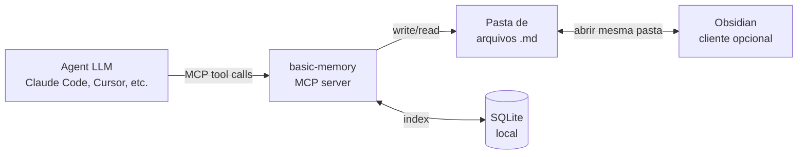

# basic-memory

> [!abstract] TL;DR
> `basic-memory` (`github.com/basicmachines-co/basic-memory`) é um **MCP server** mantido pela basicmachines-co que mantém uma memória persistente de agentes em **arquivos `.md` numa pasta local**, com **SQLite** indexando estrutura e busca em background. A integração com Obsidian é por **compatibilidade de formato**, não por plugin: como ambos consomem markdown, abrir a mesma pasta no Obsidian permite leitura e edição humana do conteúdo escrito pelo agent. **Não é um plugin Obsidian** — o Obsidian não foi modificado, extendido ou estendido; é cliente opcional do mesmo diretório. O servidor padroniza convenções de markdown — frontmatter com `permalink`, observações estruturadas tipo `- [tipo] conteúdo #tag (contexto)` e relações `- relacao [[outra-nota]]` — para que o markdown vire grafo traversable. Licença AGPL-3.0, Python 3.12+, distribuído via PyPI e imagem Docker.

## O que é

`basic-memory` é um **servidor MCP** ([[MCP]] = Model Context Protocol) que dá memória persistente a LLMs compatíveis (Claude Desktop, Claude Code, Cursor, VS Code com MCP, etc.) gravando o conteúdo das conversas em arquivos markdown locais. O servidor expõe um conjunto de ferramentas — `write_note`, `read_note`, `search_notes`, `edit_note`, `build_context`, entre outras — que o LLM invoca via MCP para criar, ler, editar, mover ou deletar notas. Cada nota é um arquivo `.md` na pasta configurada (por padrão `~/basic-memory`), com frontmatter padronizado e corpo seguindo convenções semânticas explícitas.

A persistência acontece em duas camadas: o markdown é a **fonte da verdade** legível por humano e por qualquer editor, e o **SQLite local** (em `~/.basic-memory/`) indexa o conteúdo para busca rápida — full-text e, a partir de v0.19.0, busca vetorial híbrida com embeddings via FastEmbed. O índice é derivado dos arquivos: apagar o SQLite reconstrói; perder os arquivos perde tudo. O substrato canônico é o markdown ([[07 - Por que Obsidian e markdown como substrato]]), o SQLite é cache. A relação com Obsidian é estritamente de **compartilhamento de pasta**: o usuário aponta o Obsidian para a pasta `basic-memory` (ou vice-versa) e ambos leem e escrevem nos mesmos arquivos.

> [!warning] "MCP nativo Obsidian" é apelido, não descrição técnica
> O título desta nota mantém o slug original porque já é referenciado em wikilinks de outras notas da trilha. Tecnicamente, **`basic-memory` não é plugin Obsidian e não tem dependência do Obsidian**. É um servidor MCP cujos arquivos `.md` são, por consequência do formato, legíveis em qualquer editor de markdown — Obsidian, VS Code, vim. A "integração" é abrir a mesma pasta. Quem cita esta nota em texto público deve preferir a formulação "compatível com Obsidian" em vez de "nativo Obsidian".

## Por que importa

- **Maior consenso prático em "memória de agente em markdown" no início de 2026.** Repositório com mais de 2.900 estrelas, ativo, com governance em empresa (basicmachines-co) — sinal de que o esforço não evapora amanhã. É a referência adulta da família "Karpathy-inspired" em [[09 - Panorama de implementações (abril 2026)|09 - Panorama]].
- **Resolve "agent escreve markdown sem schema".** O problema clássico do [[06 - O LLM Wiki Pattern (gist do Karpathy)|LLM Wiki Pattern]] aplicado a agents é que markdown livre vira lixo. `basic-memory` impõe **convenções mínimas** — frontmatter com `permalink`, observações `- [categoria]`, relações `- relacao [[link]]` — que tornam cada nota uma `Entity` com `Observations` e `Relations`, formando grafo navegável.
- **Compatibilidade com Obsidian é o killer feature.** Vault Obsidian existente vira memória de agente sem migração: aponte o `basic-memory` para a pasta do vault e os arquivos já são markdown padrão — sem lock-in, sem export.
- **Local-first como default, cloud opcional.** A versão open-source roda 100% local; a Cloud paga (v0.19.x) é opt-in para sync entre dispositivos. Para casos que exigem privacidade hard, local-first elimina a discussão.

## Como funciona

Fluxo típico:

1. **Setup.** O usuário configura o servidor MCP no cliente apontando para `uvx basic-memory mcp`. Pasta-alvo é `~/basic-memory` por padrão, ou um diretório específico via `--project`.
2. **Escrita pelo agent.** Durante uma conversa, o agent invoca `write_note(title, content, folder, tags)` via MCP. O servidor cria o `.md` no diretório com frontmatter padronizado e corpo nas convenções de observations/relations.
3. **Indexação.** SQLite atualizado em background; entidades, observações e relações são extraídas do markdown. `basic-memory sync --watch` faz sincronização em tempo real.
4. **Leitura humana paralela.** Se o Obsidian está aberto na mesma pasta, o usuário vê o arquivo aparecer instantaneamente, edita, adiciona links — e na próxima query do agent o conteúdo editado já reflete.
5. **Recuperação.** O agent invoca `search_notes(query, ...)` ou `build_context(memory://...)`; o servidor consulta o SQLite e o agent navega o grafo seguindo `[[wikilinks]]` se necessário.

Operação **bi-direcional e simétrica**: humano e agent são clientes do mesmo conjunto de arquivos.

## Anatomia técnica

Os itens abaixo refletem o estado público do repositório em abril de 2026 (verificados via README oficial e conteúdo do diretório `src/basic_memory/mcp/tools`). O projeto está ativo — pushes recentes, releases regulares — portanto vale revisitar a fonte primária antes de qualquer decisão crítica.

- **Tipo.** MCP server — Model Context Protocol. O servidor é processo separado que o cliente LLM (Claude Desktop, VS Code, Cursor, Claude Code) invoca via stdio ou HTTP/SSE.
- **Substrato.** Arquivos `.md` em pasta local (default `~/basic-memory`) + índice SQLite local (default em `~/.basic-memory/`). Markdown é fonte da verdade; SQLite é cache reconstruível. A partir de v0.19.0, busca vetorial híbrida via FastEmbed embeddings (full-text + similaridade semântica).
- **Ferramentas MCP expostas.** Verificadas no diretório `src/basic_memory/mcp/tools` do repositório:
    - **Content management:** `write_note`, `read_note`, `read_content`, `view_note`, `edit_note`, `move_note`, `delete_note`
    - **Knowledge graph navigation:** `build_context` (navega via URLs `memory://`), `recent_activity`, `list_directory`
    - **Search & discovery:** `search_notes` (com filtros por tag, tipo, data, metadata) e `search`
    - **Project management:** `list_memory_projects`, `create_memory_project`, `get_current_project`, `sync_status`
    - **Visualização:** `canvas` (gera visualizações de knowledge graph)
- **Convenções de markdown.** Cada arquivo segue:
    - **Frontmatter** com `title`, `type`, `permalink` (slug URI usado em `memory://`), e metadata opcional como `tags`
    - **Observações estruturadas:** `- [categoria] conteúdo #tag (contexto opcional)` — cada bullet vira uma `Observation` indexada
    - **Relações:** `- tipo_relacao [[Outra Nota]] (contexto opcional)` — cada bullet vira uma aresta no grafo, com tipo nomeado
- **URLs `memory://`.** O servidor expõe um esquema de URI próprio para referenciar entidades em prompts e tools, permitindo que o agent navegue o grafo entre invocações.
- **Sincronização Obsidian.** Não existe plugin. A "integração" é apontar o Obsidian para a mesma pasta que o `basic-memory` usa (ou vice-versa). Como ambos só consomem markdown e respeitam frontmatter, a coexistência é imediata. Edições em qualquer dos lados são vistas pelo outro na próxima leitura — ou em tempo real, se `basic-memory sync --watch` está rodando.
- **Linguagem.** Python 3.12+ (verificado em README e badges).
- **Distribuição.** PyPI (`pip install basic-memory`, `uv tool install basic-memory`, `uvx basic-memory mcp`), Homebrew, e imagem Docker (existe `Dockerfile`, `docker-compose.yml` e `docker-compose-postgres.yml` no repositório — o backend suporta SQLite ou Postgres).
- **Licença.** AGPL-3.0 (verificado via API do GitHub).
- **Auto-update e telemetria.** CLI tem auto-update default-on (24h, configurável). Telemetria anônima de funil cloud (sem conteúdo de notas, sem PII, sem per-tool-call); opt-out via `BASIC_MEMORY_NO_PROMOS=1`.
- **Fonte de inspiração.** O posicionamento na família "Karpathy-inspired" vem de literatura comparativa de mercado ([[09 - Panorama de implementações (abril 2026)|09 - Panorama]]); o README oficial **não cita Karpathy nominalmente**. A filiação ao [[06 - O LLM Wiki Pattern (gist do Karpathy)|LLM Wiki Pattern]] é interpretativa — mesma filosofia (markdown como substrato), não implementação reivindicada do gist.

## Quando usar / quando não usar

**Quando vale:**

- O usuário **já usa Obsidian** ou outro editor de markdown e quer dar memória ao agent sobre o vault sem migração de formato.
- Markdown como substrato é requisito — legibilidade humana, portabilidade, ausência de lock-in proprietário ([[07 - Por que Obsidian e markdown como substrato]]).
- O caso requer simplicidade — pasta + SQLite resolve sem infra extra. Não há vector DB externo, não há serviço a hospedar, não há cluster Kubernetes.
- Workflow é local-first — o conteúdo é sensível, ou a operação precisa funcionar offline, ou a privacidade é hard requirement.
- O cliente é compatível com MCP — Claude Desktop, Claude Code, VS Code com MCP, Cursor, etc.

**Quando NÃO vale:**

- **Enterprise com governance e audit trail formal.** Não há ACL granular, logs imutáveis nem pipeline de compliance. Para isso, [[15 - Zep e Graphiti — knowledge graph temporal|Zep]] ou Letta ([[09 - Panorama de implementações (abril 2026)|09 - Panorama]]) servem melhor.
- **Volume alto ou multi-user concorrente.** Design single-user oriented; SQLite local não escala para concorrência pesada. Cloud paga ajuda com sync entre devices, mas não resolve multi-user nativamente.
- **Knowledge graph rigoroso.** As relations são wikilinks tipados em markdown — leves, mas sem a expressividade de Cypher ou a precisão temporal de Graphiti. Para multi-hop reasoning sobre grafos densos, [[11 - graphify — knowledge graph de raw|graphify]] ou Zep/Graphiti são mais especializadas.
- **Cliente não-MCP.** Sem suporte a MCP no ambiente (LangChain puro, scripts diretos contra a API), `basic-memory` não acopla. Para esses casos, [[10 - LLM-knowledge-base (Wendel) — direto do gist|LLM-knowledge-base]] (Python direto) é mais natural.

## Armadilhas comuns

- **Confundir "compatível com Obsidian" com "plugin Obsidian".** É a confusão central. O Obsidian não foi modificado, não há plugin oficial, não há API hooks no Obsidian usados pelo `basic-memory`. Os dois projetos só compartilham um formato — markdown — e uma pasta. A frase correta é "basic-memory é compatível com Obsidian"; "basic-memory é nativo Obsidian" ou "plugin Obsidian" é incorreto. (O título desta nota usa "MCP nativo Obsidian" porque o slug já é referenciado em wikilinks da trilha; o framing preciso é o desta seção.)
- **Convenções de markdown precisam ser respeitadas pelo agent.** Sem schema enforcement em runtime, observações desestruturadas viram lixo no índice — bullets soltos sem `[categoria]` não são extraídos como `Observation`. O hábito do agent de seguir o formato é parte do design; system prompts e exemplos curados ajudam a sustentar.
- **SQLite local em multi-user é dor.** Locking, sync entre máquinas, backup, conflitos — o substrato é single-user por construção. Para multi-device, a Cloud paga oferece sync; para multi-user real, o caso é outro framework.
- **AGPL-3.0 afeta uso comercial.** Embutir `basic-memory` num SaaS proprietário pode forçar abertura de código por copyleft estrito da AGPL. Verificar com jurídico antes de incorporar em produto comercial fechado é obrigatório.
- **MCP só funciona em clients compatíveis.** Há lock-in de ecossistema: trocar Claude Desktop por uma ferramenta sem MCP exige adaptação. O protocolo está se popularizando, mas em abril de 2026 ainda não é universal.
- **Auto-update default-on.** O CLI checa atualizações a cada 24h por padrão. Em ambientes que exigem versão pinada (CI, build reproduzível), desativar via `"auto_update": false` em `~/.basic-memory/config.json` evita surpresas.

## Veja também

- [[06 - O LLM Wiki Pattern (gist do Karpathy)]] — pattern original que a família resolve
- [[07 - Por que Obsidian e markdown como substrato]] — justificativa do substrato
- [[09 - Panorama de implementações (abril 2026)|09 - Panorama]] — onde basic-memory se posiciona no mercado
- [[10 - LLM-knowledge-base (Wendel) — direto do gist|10 - LLM-knowledge-base]] — alternativa Python sem MCP
- [[11 - graphify — knowledge graph de raw|11 - graphify]] — alternativa graph-based, mixed-media
- [[15 - Zep e Graphiti — knowledge graph temporal|15 - Zep e Graphiti]] — alternativa enterprise / temporal
- [[22 - Guia de implementação do zero|22 - Guia de implementação]] — onde basic-memory aparece como ferramenta default sugerida
- [[MCP]] — protocolo que `basic-memory` usa como ponto de integração

## Referências

- Repositório oficial — `https://github.com/basicmachines-co/basic-memory` (verificado via API do GitHub: 2.929 estrelas, default branch `main`, último push em 23/04/2026, licença AGPL-3.0, linguagem Python, topics incluem `mcp`, `obsidian`, `markdown`, `local-first`)
- README oficial (verificado): `https://github.com/basicmachines-co/basic-memory#readme`
- Documentação oficial: `https://docs.basicmemory.com/`
- Site: `https://basicmemory.com`
- Karpathy gist do LLM Wiki Pattern (3 de abril de 2026) — referência ao pattern que motiva a família, ver [[06 - O LLM Wiki Pattern (gist do Karpathy)]]. **Nota:** o README de `basic-memory` não cita Karpathy nominalmente; a filiação à família "Karpathy-inspired" é interpretativa, baseada em literatura comparativa do mercado (ver [[09 - Panorama de implementações (abril 2026)|09 - Panorama]]).
- Diretório de tools MCP no repositório: `src/basic_memory/mcp/tools/` (verificado para conferência dos nomes exatos das ferramentas expostas).
