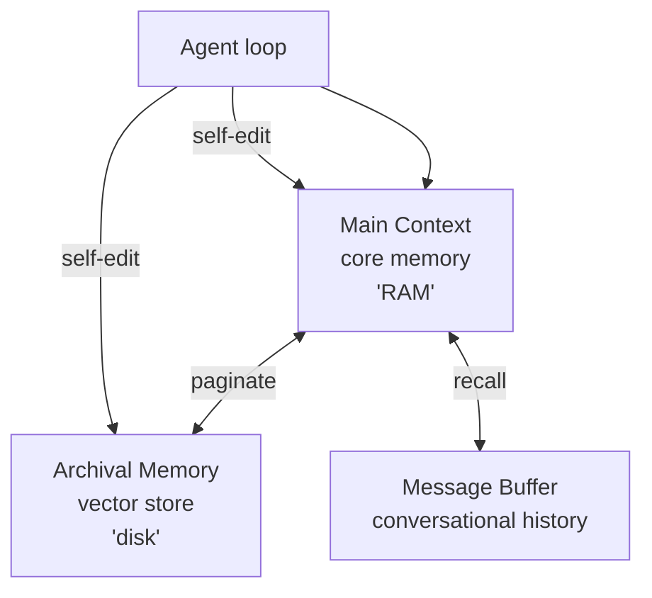

# Letta (ex-MemGPT)

> [!abstract] TL;DR
> **Letta** (`github.com/letta-ai/letta`) é o framework de produção sucessor do projeto **MemGPT** — paper de UC Berkeley apresentado por Packer et al. em outubro de 2023 (arxiv 2310.08560). O posicionamento canônico é **"LLM as OS"**: o agent gerencia hierarquicamente sua própria memória, com analogia explícita a sistemas operacionais — *core memory* sempre presente no contexto (RAM), *archival memory* fora do contexto e recuperada por busca (disco), e histórico de mensagens com paginação. A memória é **self-editing**: o agent decide o que mover entre tiers via tools como `core_memory_append`, `core_memory_replace`, `archival_memory_insert` e `archival_memory_search`. Open-source Apache-2.0 com self-host gratuito; cloud paga em modelo freemium. **Letta não publicou score em LongMemEval** — ponto a notar quando transparência de benchmark importa.

## O que é

Letta é um framework para construir **agents stateful** com memória persistente entre sessões. Em vez de tratar o LLM como função sem estado e tratar a memória como camada externa (caso típico de RAG simples), Letta posiciona o LLM como **kernel de um sistema operacional** que gerencia sua própria memória — herança direta da metáfora apresentada no paper original do MemGPT. O agent não é um wrapper sobre prompts; é um processo persistente, com identidade, com estado salvo em banco de dados, que continua existindo entre invocações.

A linhagem do projeto é importante: o **MemGPT** (Packer, Wooders, Lin, Fang, Patil, Stoica, Gonzalez — UC Berkeley AI Research, outubro/2023) propôs **virtual context management** como solução para a limitação fundamental de janelas de contexto fixas (ver [[02 - O problema das janelas de contexto]]). Em **setembro de 2024**, o projeto foi spun out como startup chamada **Letta**, fundada por Charles Packer e Sarah Wooders, e o framework open-source foi rebranded de `memgpt` para `letta` em consequência. O pattern conceitual permanece o mesmo do paper; o framework de produção amadureceu em torno dele com SDKs em Python e TypeScript, persistência formal, ADE (Agent Development Environment) e Letta Cloud.

## Por que importa

- **Pioneirou virtual context management como vocabulário.** A analogia OS — RAM/disco com paginação — não era óbvia em 2023 e virou referência comum para discutir hierarquia de memória em LLM agents. Mesmo trabalhos posteriores que **não** adotam Letta usam o vocabulário herdado do MemGPT.
- **Self-editing memory é diferencial real.** Em vez de o desenvolvedor escrever heurísticas para decidir o que armazenar, **o próprio agent invoca** as tools de memória durante o loop. Isso transfere uma decisão arquitetural ("o que vai para archival?") para a inteligência do modelo, com prós (autonomia) e contras (custo extra de tokens, comportamento menos previsível).
- **Em 2026 é uma das poucas opções open-source production-grade para agents stateful.** O repositório passa dos 22 mil stars, é Python puro, Apache-2.0, com SDKs em Python e TypeScript. Lock-in de plataforma é baixo via self-host — quem não quer usar Letta Cloud sobe um servidor com PostgreSQL e desliga o restante.
- **Linhagem acadêmica clara.** Diferente de frameworks que aparecem como produtos sem paper de fundação, Letta tem trabalho peer-review-quality como ponto de partida (arxiv 2310.08560), com autores ainda envolvidos.

## Como funciona — hierarchical memory

O design hierárquico do MemGPT/Letta organiza a memória em três camadas, todas acessíveis ao agent mas com papéis diferentes:

1. **Main context** — também chamado de **core memory** na documentação atual. É o pedaço de memória que está **sempre dentro do prompt** do LLM, dentro da janela de contexto. Tipicamente carrega informação crítica e estável: persona do agent, fatos centrais sobre o usuário, instruções operacionais. É a "RAM" — pequena, rápida, sempre disponível, mas limitada.
2. **Archival memory** — **vector store** externo ao prompt, recuperado por **semantic search** quando o agent invoca a tool de busca. É o "disco" — grande, persistente, fora do contexto imediato, acessado por demanda. É onde o agent guarda observações de longo prazo, fatos que não cabem em core memory, conhecimento acumulado.
3. **Message buffer** (também referido como histórico de conversa) — sequência de mensagens da sessão. Quando o buffer cresce além do limite, mensagens antigas são paginadas para armazenamento de longo prazo, deixando o contexto livre. O agent ainda pode recuperá-las por busca.

A operação central é **self-editing**: o agent invoca tools de memória como qualquer outra tool. As principais, verificadas na documentação oficial (`docs.letta.com/advanced/memory-management/` e `docs.letta.com/guides/ade/core-memory/`):

- `core_memory_append` — anexa conteúdo a um bloco da core memory.
- `core_memory_replace` — substitui conteúdo dentro de um bloco da core memory; recebe `old_content` (match exato) e `new_content`. Para deletar, passa-se string vazia.
- `archival_memory_insert` — grava um item na archival memory (vetorial).
- `archival_memory_search` — recupera itens da archival memory por similaridade semântica.

A diferença importante face a sistemas onde a memória é gerida por código externo: aqui o **LLM decide**. Cada vez que o agent percebe um fato que vale a pena reter, **ele próprio** chama `archival_memory_insert`; cada vez que precisa puxar contexto antigo, **ele próprio** chama `archival_memory_search`. O custo disso é o token e a chamada extra; o benefício é não precisar codificar a heurística "quando salvar".

## Anatomia técnica

Os itens abaixo refletem o estado público do projeto em abril de 2026, verificados via API do GitHub e documentação oficial em `docs.letta.com`. O ecossistema está ativo — pushes recentes, releases regulares — então vale revisitar a fonte primária antes de qualquer decisão crítica.

- **Tipo.** Framework open-source para agents stateful, distribuído como servidor + SDKs (Python e TypeScript). Roda como processo persistente que mantém estado em banco de dados.
- **Linguagem.** Python (cerca de 99,5% do código, segundo a API do GitHub). SDKs cliente também em TypeScript.
- **Licença.** Apache-2.0 (verificada via API do GitHub). Diferente de [[12 - basic-memory — MCP nativo Obsidian|basic-memory]], que usa AGPL-3.0, Letta tem licença permissiva — embutir em produto comercial fechado é menos friccionoso do ponto de vista jurídico.
- **Componentes principais.**
    - **Letta Server** — processo que executa os agents, mantém estado, roteia chamadas a LLMs. Pode rodar local (self-host) ou na cloud gerenciada.
    - **Letta SDKs** — `pip install letta-client` (Python) e `npm install @letta-ai/letta-client` (TypeScript/Node).
    - **ADE (Agent Development Environment)** — interface visual para inspecionar e editar prompts, blocos de core memory e archival memory, observar o loop do agent, debugar tools.
    - **Letta Cloud** — versão hospedada, acessada via `app.letta.com`, com plano gratuito e tiers pagos.
- **Modelos suportados.** Posicionado como **model-agnostic**. A documentação cita `Opus 4.5` e `GPT-5.2` como recomendações de melhor desempenho em abril de 2026 e referencia leaderboard próprio. Endpoints OpenAI, Anthropic e provedores compatíveis com OpenAI funcionam; suporte a modelos locais (via Ollama, vLLM, etc.) é parte do desenho. Lista exata e estado de cada provider vale conferir no docs antes de comprometer.
- **Persistência.** Estado completo do agent — memórias, mensagens, reasoning steps, tool calls — é serializado em banco. A documentação oficial é explícita: *"all state, includes memories, user messages, reasoning, tool calls, are all persisted in a database"*. PostgreSQL com pgvector é o backend canônico para deploy de produção (necessário para vector search em archival memory); SQLite é usado em setups de desenvolvimento. **Vale conferir o repositório atual** antes de assumir versões e extensões obrigatórias.
- **API.** REST (servidor Letta), Python SDK (`letta-client`), TypeScript SDK (`@letta-ai/letta-client`).
- **Raízes MemGPT.** O pattern hierárquico de memória implementado em Letta é **o mesmo descrito no paper original** (Packer et al., 2023). A documentação reconhece a herança e mantém a categoria *MemGPT Agents (Legacy)* — o agente memgpt original ainda está acessível, e o framework moderno generalizou o conceito (memory blocks, sleep-time agents etc.) sem abandonar a base.
- **Pricing tiers em abril de 2026** (verificado em `letta.com/pricing` — pode mudar):
    - **Self-host:** gratuito (open-source Apache-2.0).
    - **Free** (Letta Cloud): plano de entrada sem custo mensal, com quota.
    - **Pro:** US$ 20/mês — uso pessoal, quota para modelos open-weights e Letta Auto, pay-as-you-go acima do limite, até 20 stateful agents.
    - **Max Lite:** US$ 100/mês — quota expandida cobrindo frontier models, 5x maior em Letta Auto, até 50 agents.
    - **Max:** US$ 200/mês — power users, quota maior em frontier models, 20x em Letta Auto, early access.
    - **API Plan:** US$ 20/mês de plataforma — para times/organizações, agents ilimitados em modelo usage-based: US$ 0,10 por agent ativo/mês, US$ 0,00015/segundo de execução de tool, mais consumo LLM passado adiante.
    - Tier Enterprise/customizado padrão de 2024–2025 não aparece mais nominalmente na página em abril/2026; o caminho atual para uso enterprise parece ser API Plan + contato comercial. Verificar com vendas se o caso exige SLAs específicos.
- **Funding.** Letta saiu do stealth em **setembro de 2024** com **seed round de US$ 10 milhões** liderado por Felicis, com participação de Sunflower Capital e Essence VC, em valuation post-money de US$ 70 milhões. Cobertura primária em HPCwire/BigDATAwire, TechCrunch e PRNewswire. Como spin-out do **UC Berkeley AI Research Lab**, ancora a posição acadêmica do projeto na arquitetura institucional.

> [!info] Sobre LongMemEval
> Em abril de 2026, **Letta não publicou score oficial em LongMemEval** (ver [[20 - Comparativo crítico (LongMemEval)|20 - Comparativo crítico]]). Isso é **um sinal a notar**, não um veredicto: o framework existe há mais tempo que o benchmark e se posiciona como infraestrutura, não como otimizador para um teste. Mas em decisões enterprise onde transparência de benchmark importa, a ausência conta. Compare com [[14 - Mem0 — vetorial + grafo|Mem0]] (auto-reportado ≈ 93,4%) ou [[15 - Zep e Graphiti — knowledge graph temporal|Zep]] (+ 18,5% sobre full-context com GPT-4o) — números com convenções diferentes, ainda assim presentes.

## Quando usar / quando não usar

**Quando vale:**

- O caso pede **agent stateful com memória self-editing** e o desenvolvedor quer transferir a heurística de retenção para o próprio modelo.
- Importa **controle fino** sobre quais blocos da core memory existem, o que entra em archival, como a paginação acontece — Letta expõe isso.
- O setup tolera (ou prefere) **self-host** com PostgreSQL + pgvector. Para quem já roda esse stack, integrar Letta é incremental.
- Já existe investimento em "agent platform" e o time quer um SDK maduro com ecossistema (ADE, cloud opcional, comunidade).
- Linhagem acadêmica e licença permissiva (Apache-2.0) são requisitos — Letta atende ambos.

**Quando NÃO vale:**

- Quer **simplicidade** acima de tudo. [[12 - basic-memory — MCP nativo Obsidian|basic-memory]] é mais leve: pasta de markdown e SQLite, sem servidor formal, sem Postgres. Para um vault pessoal de notas, Letta é overkill.
- Workflow é **Obsidian-first** ou markdown-first. Letta não tem integração nativa com vault de markdown; o substrato natural é banco. Quem quer abrir o conteúdo no Obsidian usa basic-memory ou [[10 - LLM-knowledge-base (Wendel) — direto do gist|LLM-knowledge-base]].
- Transparência de **benchmark** é requisito formal. Sem score público em LongMemEval, comparações ficam por terra menos firme — alternativas com números publicados são mais defensáveis em auditoria.
- Cliente regulado precisa de **audit trail temporal** robusto (mudanças versionadas, raciocínio temporal sobre fatos). [[15 - Zep e Graphiti — knowledge graph temporal|Zep/Graphiti]] foram desenhadas para esse caso.
- Volume é tão baixo que **markdown puro + system prompt** já resolve. Quando a memória cabe num arquivo curto que o agent lê a cada chamada, qualquer framework é overhead.

## Armadilhas comuns

- **Confundir Letta com MemGPT.** São coisas relacionadas mas distintas: **MemGPT é o paper e o pattern** (Packer et al., 2023); **Letta é o framework concreto** que sucedeu o projeto open-source de mesmo nome em 2024. Em texto técnico vale ser preciso — "implementa o pattern do MemGPT" e "usa o framework Letta" são afirmações diferentes.
- **"Self-editing memory" não é mágica.** O agent só armazena ou move conteúdo se as **tools forem expostas e os prompts orientarem o uso**. Sem system prompt e exemplos sólidos, o LLM ignora `archival_memory_insert` na maioria dos turnos. A engenharia de prompt continua exigida.
- **Hierarchical paginação custa tokens.** Cada vez que o agent decide invocar uma tool de memória, é uma chamada LLM com tokens de input e output. Em loops longos isso acumula — o "free lunch" da metáfora OS é parcial.
- **Self-host PostgreSQL exige operação real.** Backup, replicação, monitoramento, scaling de pgvector — nada disso vem "grátis" com `docker compose up`. Para casos sérios, a operação do banco é parte do TCO; ignorar isso é uma das armadilhas clássicas de "open-source é grátis".
- **Sem score LongMemEval público.** Comparações com [[14 - Mem0 — vetorial + grafo|Mem0]], MemPalace e outros que reportam números são, no mínimo, assimétricas. Não é argumento para descartar Letta, mas é argumento para não citar Letta como "comparativamente superior" em texto sem qualificação.
- **Pricing muda.** Os tiers atuais (Pro, Max Lite, Max, API Plan) **não são** os mesmos descritos em material de 2024–2025 (que mencionavam Free 50 premium / 500 standard, Pro $20, Scale $750, Enterprise custom). Antes de citar valores em texto público, abrir `letta.com/pricing` na data corrente é obrigatório.
- **Apache-2.0 não é AGPL.** Para quem está acostumado com [[12 - basic-memory — MCP nativo Obsidian|basic-memory]] (AGPL-3.0), assumir as mesmas restrições com Letta é erro: a licença permissiva permite embutir em produto comercial fechado sem obrigação de abrir código derivado. O trade-off, claro, é que o ecossistema também pode ser embutido por concorrentes.

## Veja também

- [[06 - O LLM Wiki Pattern (gist do Karpathy)]] — abordagem alternativa, markdown-led em vez de hierarchical
- [[08 - Arquitetura de um sistema de memória]] — hierarchical é um dos mecanismos canônicos
- [[09 - Panorama de implementações (abril 2026)|09 - Panorama]] — onde Letta se posiciona no mapa
- [[12 - basic-memory — MCP nativo Obsidian|12 - basic-memory]] — alternativa leve, markdown-first
- [[14 - Mem0 — vetorial + grafo|14 - Mem0]] — outra opção production, com benchmark publicado
- [[15 - Zep e Graphiti — knowledge graph temporal|15 - Zep e Graphiti]] — alternativa enterprise/temporal
- [[20 - Comparativo crítico (LongMemEval)|20 - Comparativo crítico]] — onde a ausência de score de Letta aparece
- [[02 - O problema das janelas de contexto]] — a dor que MemGPT propôs resolver

## Referências

- Repositório oficial: `https://github.com/letta-ai/letta` — verificado via API do GitHub (descrição "Letta is the platform for building stateful agents", licença Apache-2.0, default branch `main`, linguagem Python, mais de 22 mil stars em abril/2026, último push em abril/2026, organização `letta-ai`).
- Paper original — Packer, Wooders, Lin, Fang, Patil, Stoica, Gonzalez. **MemGPT: Towards LLMs as Operating Systems** (UC Berkeley AI Research, outubro de 2023; revisão fevereiro de 2024). `https://arxiv.org/abs/2310.08560`.
- Site oficial: `https://letta.com/` — institucional.
- Página de pricing: `https://letta.com/pricing` — tiers atuais Free / Pro ($20) / Max Lite ($100) / Max ($200) / API Plan ($20 + usage). Verificada em abril/2026.
- Documentação: `https://docs.letta.com/` — referência de tools, conceitos e SDK. Páginas usadas para verificação: `docs.letta.com/advanced/memory-management/`, `docs.letta.com/guides/ade/core-memory/`, `docs.letta.com/guides/ade/archival-memory/`, `docs.letta.com/guides/agents/memory/`, `docs.letta.com/guides/agents/base-tools/`.
- Cobertura de funding (US$ 10M seed liderado por Felicis, valuation post-money US$ 70M, set/2024):
    - HPCwire / BigDATAwire — *Letta Emerges from Stealth with $10M to Build AI Agents with Advanced Memory*: `https://www.hpcwire.com/bigdatawire/this-just-in/letta-emerges-from-stealth-with-10m-to-build-ai-agents-with-advanced-memory/`
    - TechCrunch — *Letta, one of UC Berkeley's most anticipated AI startups, has just come out of stealth*: `https://techcrunch.com/2024/09/23/letta-one-of-uc-berkeleys-most-anticipated-ai-startups-has-just-come-out-of-stealth/`
    - PRNewswire — *Berkeley AI Research Lab Spinout Letta Raises $10M Seed Financing Led by Felicis*.
- SDKs: `pip install letta-client` (Python), `npm install @letta-ai/letta-client` (TypeScript/Node.js).
