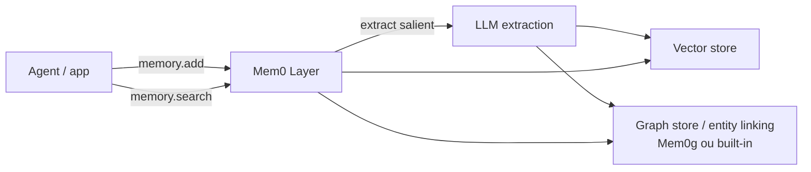

# Mem0

> [!abstract] TL;DR
> **Mem0** (`github.com/mem0ai/mem0`) é um framework de produção que se posiciona como **"universal memory layer for AI agents"**: uma camada drop-in que extrai fatos salientes de conversas via LLM e os persiste em **vector store** (variante base) ou em uma combinação de vetor com **grafo** (variante **Mem0g** descrita no paper original). O paper de fundação (arxiv 2504.19413, ECAI 2025) reporta **91% de redução em p95 latency** e **mais de 90% de economia de tokens** versus baselines full-context na avaliação LOCOMO. O blog oficial *State of AI Agent Memory 2026* (1º de abril de 2026) e a página de pesquisa (`mem0.ai/research`, 25 de abril de 2026) reportam **93,4% no LongMemEval** com o algoritmo atualizado — número **auto-reportado**, a ser validado por benchmark independente. Cobertura ampla de integrações: ~24 frameworks listados em `docs.mem0.ai/integrations` (LangChain, LangGraph, CrewAI, LlamaIndex, AutoGen, Vercel AI SDK, OpenAI Agents SDK, Google ADK, Mastra, Agno, Pipecat, ElevenLabs, Livekit e outros — verificar lista atual). Apache-2.0, Python + TypeScript SDK, self-host gratuito, cloud paga em modelo freemium.

## O que é

`mem0` é um framework para **memória persistente de agentes** mantido pela Mem0 AI. O paper de fundação — *Mem0: Building Production-Ready AI Agents with Scalable Long-Term Memory* (Chhikara, Khant, Aryan, Singh, Yadav; arxiv 2504.19413, ECAI 2025) — apresenta o sistema como resposta ao problema das janelas de contexto fixas (ver [[02 - O problema das janelas de contexto]]) e às limitações de RAG simples para conversas longas (ver [[04 - RAG vs memória de longo prazo]] e [[05 - Beyond RAG - quando RAG não basta]]).

O posicionamento canônico é o de **memory layer universal**: em vez de propor um framework de agent novo, Mem0 funciona como camada de memória que se acopla a qualquer LLM e a qualquer framework existente. A API central é minimalista — `memory.add(messages, user_id)` e `memory.search(query, user_id)` — e abstrai extração, armazenamento e recuperação por trás dessas duas operações. O paper apresenta duas variantes:

- **Base Mem0** — armazenamento puramente vetorial dos fatos extraídos.
- **Mem0g** — variante enriquecida com **representação em grafo** (entidades + relações labeled), que reporta cerca de 2 pontos percentuais a mais que a base no LOCOMO (68,4% vs 66,9% LLM-as-judge accuracy).

> [!warning] Mem0g no paper vs grafo no SDK open-source
> O paper de 2025 descreve **Mem0g** como variante com grafo (entidades + relações em store externo como Neo4j, Memgraph, Kùzu, Apache AGE ou Neptune). A documentação atual de `docs.mem0.ai` indica que **o suporte a graph store externo foi removido do SDK open-source** em release recente do "novo algoritmo de memória" e substituído por **entity linking embutido**, que extrai entidades durante o `add` e armazena em coleção paralela no próprio vector store. Antes de afirmar "Mem0g com Neo4j" em 2026, **verifique a versão do SDK** que se está usando — paper e código divergiram nesse ponto.

## Por que importa

- **Talvez o framework de memória open-source mais comercialmente maduro em abril de 2026.** Repositório com mais de 54 mil estrelas, paper peer-review-quality (ECAI 2025), empresa por trás do projeto (Mem0 AI), pricing público estabelecido, SDKs Python e TypeScript estáveis. É a opção de referência para times que querem memória de produção sem construir do zero.
- **Memory layer simplifica integração.** Não força reescrever o agent: acopla-se a um LangGraph existente, a um CrewAI, a um Vercel AI SDK chatbot, e ganha persistência sem reorganizar o código de orquestração. Diferente de [[13 - Letta (ex-MemGPT)|Letta]], que é um framework de agent stateful por inteiro, Mem0 é estritamente *layer*.
- **A variante grafo destrava raciocínio multi-hop.** No paper, Mem0g supera a variante base em queries que exigem composição de múltiplos fatos (entidades + relações), no espírito do que [[15 - Zep e Graphiti — knowledge graph temporal|Zep/Graphiti]] também propõem. O ganho não é gigantesco no LOCOMO (~2 pontos), mas é consistente.
- **Score de 93,4% no LongMemEval (auto-reportado, abril/2026) é dos mais altos do mercado.** Aparece no blog oficial *State of AI Agent Memory 2026* e na página de pesquisa, com o caveat usual de score auto-reportado por vendor (ver [[20 - Comparativo crítico (LongMemEval)|20 - Comparativo crítico]] e [[21 - Críticas, limitações e armadilhas]]).
- **Cobertura de integrações é o ponto comercial mais forte.** A página `docs.mem0.ai/integrations` lista ~24 frameworks de agentes — abrangência rara entre frameworks de memória.

## Como funciona

O fluxo central é deliberadamente simples e tem duas operações principais:

1. **`memory.add(messages, user_id)`** — recebe uma lista de mensagens (ou um turno de conversa) e um identificador de usuário/sessão. Internamente, o Mem0 invoca um LLM (configurável: OpenAI, Anthropic, Ollama local, Azure, Bedrock, Groq e outros) que **extrai fatos salientes** das mensagens — afirmações estáveis sobre o usuário, sobre o domínio, sobre o que foi decidido. Esses fatos são gravados no vector store configurado (Qdrant, Pinecone, Chroma, Weaviate, PGVector, Redis, Milvus, Elasticsearch, OpenSearch, Supabase, FAISS e outros). Quando entity linking está ativo (ou na variante Mem0g do paper, com graph store externo), entidades extraídas e suas relações também são gravadas.
2. **`memory.search(query, user_id)`** — recebe uma query e o identificador de usuário, e retorna a lista de fatos relevantes ranqueados, no estilo RAG. O agent injeta o resultado no prompt como contexto e responde.

A propriedade-chave do design é que **o agent não precisa decidir o que armazenar**. Diferente de [[13 - Letta (ex-MemGPT)|Letta]], que expõe `core_memory_append` e `archival_memory_insert` como tools que o agent invoca por conta própria, no Mem0 a decisão é delegada a um pipeline de extração rodando no `add` — invisível ao agent. Isso é simultaneamente uma vantagem (menos cognitive load no LLM principal, menos tokens gastos em decisões de memória) e uma desvantagem (a heurística de extração é parcialmente opaca, e cada `add` custa pelo menos uma chamada de LLM extra).

## Anatomia técnica

Os itens abaixo foram verificados em `github.com/mem0ai/mem0`, `docs.mem0.ai` e `mem0.ai` em abril de 2026. Algumas configurações suportadas em Python ainda não estão disponíveis no SDK TypeScript — quando relevante, indica-se a divergência.

- **Linguagens / SDKs:** Python (`pip install mem0ai`) e TypeScript/JavaScript (`npm install mem0ai`). CLI disponível em ambos. O repositório é majoritariamente Python (~56%) com TypeScript (~35%).
- **Licença:** **Apache-2.0**.
- **LLMs suportados (16, em Python):** OpenAI, Anthropic, Azure OpenAI, Google AI, AWS Bedrock, Mistral AI, DeepSeek, Together, Groq, xAI, MiniMax, Sarvam AI, Ollama, LM Studio, LiteLLM e Langchain como provider. No SDK TypeScript, atualmente apenas OpenAI, Anthropic e Groq.
- **Vector stores suportados (~20, em Python):** Qdrant, Chroma, Pinecone, Weaviate, Milvus, FAISS, PGVector, Redis, Valkey, Elasticsearch, OpenSearch, Supabase, MongoDB, Azure AI Search, Vertex AI, Upstash Vector, Amazon S3 Vectors, Databricks, Turbopuffer e Langchain. No SDK TypeScript, suporte mais restrito (Qdrant, Redis, Valkey, Cloudflare Vectorize e in-memory).
- **Graph store / entity linking:** o paper Mem0g descreve uso de graph stores externos (Neo4j, Memgraph, Kùzu, Apache AGE, Neptune). A documentação atual sinaliza que o **suporte a graph store externo foi removido do SDK open-source** em release recente, substituído por **entity linking embutido** no vector store. Verifique a versão antes de assumir Neo4j em produção.
- **Variantes (paper):** **Base Mem0** (vetorial puro, 66,9% LLM-as-judge no LOCOMO) e **Mem0g** (vetorial + grafo, 68,4% LLM-as-judge no LOCOMO).
- **Integrações de framework (~24 listadas em `docs.mem0.ai/integrations`):** LangChain, LangGraph, LangChain Tools, LlamaIndex, CrewAI, AutoGen, Vercel AI SDK, OpenAI Agents SDK, Google ADK, Mastra, Agno, Pipecat, Camel AI, ChatDev, ElevenLabs, Livekit, Dify, Flowise, Raycast, AgentOps, Keywords AI, AWS Bedrock, Mem0 MCP e outras. **Não afirmar "21 integrações"** sem reverificar — a lista cresceu desde o paper original.
- **API:** REST (cloud), Python SDK, TypeScript SDK, self-hosted server.
- **Pricing (em `mem0.ai/pricing`, abril/2026):** *Hobby* gratuito (10k add / 1k search por mês); *Starter* US$ 19/mês (50k add / 5k search); *Pro* US$ 249/mês (500k add / 50k search, analytics); *Enterprise* sob consulta (on-prem, SSO, audit logs). Self-host open-source é gratuito sempre — paga-se apenas pelo cloud gerenciado.
- **Scores reportados (auto-reportados por Mem0, em `mem0.ai/research`, 25 de abril de 2026):** LongMemEval **93,4** (categoria geral 92,0, em 500 questões / 6 categorias); LOCOMO **91,6** (overall 85,0); BEAM **64,1** em 1M tokens e **48,6** em 10M tokens; "averaging under 7,000 tokens per retrieval call" vs 25 mil+ em métodos full-context.
- **Claims de eficiência do paper (arxiv 2504.19413):** **91% lower p95 latency** vs full-context, **+90% economia de tokens** vs full-context, e **26% de melhora relativa** sobre OpenAI Memory na métrica LLM-as-judge.

## Quando usar / quando não usar

**Quando vale:**

- Time quer **memory layer drop-in** sem reescrever o agent existente (LangChain, LangGraph, CrewAI, Vercel AI SDK).
- Caso requer **integração com framework já em produção** — a cobertura de integrações é o ponto comercial mais forte.
- Cenário mistura **busca factual (RAG-like)** com **memória episódica de usuário** — exatamente o sweet spot de Mem0.
- Há tolerância a **dependência de cloud** (Mem0 Cloud) **OU** o time tem maturidade para self-host com infra de vector store (Qdrant, Pinecone, etc.).
- Se o ganho de **multi-hop com grafo** importa, e há infra para a variante Mem0g do paper (com a ressalva acima sobre o estado atual do graph store externo no SDK).

**Quando NÃO vale:**

- Cenário **local-first puro com markdown como substrato canônico**. Para isso, [[12 - basic-memory — MCP nativo Obsidian|basic-memory]] é melhor — o Mem0 não persiste em arquivos legíveis por humano.
- **Workflow markdown-first** (vault Obsidian, Logseq, Foam): Mem0 grava em vector store, não em `.md` editáveis. Quem precisa de revisão humana sobre cada nota deve preferir basic-memory ou seguir o [[06 - O LLM Wiki Pattern (gist do Karpathy)|gist do Karpathy]] direto.
- Quando se quer **transparência total do algoritmo de extração** — a seleção de "fatos salientes" via LLM é parcialmente opaca, e cada release pode mexer no pipeline.
- **Custo de infra / equipe não comporta** Qdrant ou Pinecone em produção, e cloud da Mem0 é caro demais para o caso.
- Caso pede **agent stateful por inteiro** (com identidade persistente, hierarquia de memória explícita, paginação RAM/disco): [[13 - Letta (ex-MemGPT)|Letta]] está mais alinhado.
- Quando **knowledge graph temporal** é requisito (queries do tipo "qual era o estado em t1?"): [[15 - Zep e Graphiti — knowledge graph temporal|Zep/Graphiti]] tem suporte a tempo bi-temporal nativo.

## Armadilhas comuns

- **Confiar em score LongMemEval auto-reportado.** Os 93,4% são reportados pela própria Mem0, não por benchmark independente. Antes de citar em decisão técnica, validar com benchmark próprio sobre o caso de uso real (ver auditoria em [[21 - Críticas, limitações e armadilhas]]).
- **Esquecer o custo da extração.** Cada `memory.add` invoca pelo menos uma chamada extra de LLM para extrair fatos salientes. Em conversas longas e de alto volume, esse custo acumula — e não aparece no benchmark de retrieval.
- **Tomar Mem0g do paper como sinônimo de Mem0 + Neo4j hoje.** O paper descreve graph store externo; a documentação atual indica remoção desse suporte no open-source em favor de entity linking embutido. Quem replica o setup do paper em 2026 pode encontrar surpresa na config.
- **Cobertura de "integrations" é variável.** Algumas integrações são exemplos / cookbooks, outras são suportadas oficialmente como first-class. Antes de prometer "Mem0 funciona com X" para um cliente, abrir a página de integração de X e verificar se é cookbook, exemplo ou suporte mantido.
- **Memória opaca para revisão humana.** Os fatos extraídos vivem em vector store. Não há `.md` legível para auditoria, comparado com [[10 - LLM-knowledge-base (Wendel) — direto do gist|LLM-knowledge-base]] ou [[12 - basic-memory — MCP nativo Obsidian|basic-memory]]. Em cenários regulados (saúde, finanças, jurídico) isso é considerável.
- **Score em LOCOMO no paper (66,9% / 68,4%) e score em LongMemEval no blog (93,4%) são benchmarks diferentes.** Não são comparáveis lado a lado — confundir os dois inflaciona a impressão de progresso.
- **Versão TypeScript ≠ versão Python.** SDK TS suporta menos LLMs e menos vector stores hoje. Projetos full-stack que dependem de paridade devem checar antes de se comprometer.

## Veja também

- [[06 - O LLM Wiki Pattern (gist do Karpathy)]] — abordagem alternativa, markdown-led, sem extração via LLM
- [[09 - Panorama de implementações (abril 2026)|09 - Panorama]] — onde Mem0 se posiciona no mapa
- [[12 - basic-memory — MCP nativo Obsidian|12 - basic-memory]] — alternativa local/markdown
- [[13 - Letta (ex-MemGPT)]] — alternativa hierarchical, stateful agent
- [[15 - Zep e Graphiti — knowledge graph temporal|15 - Zep e Graphiti]] — alternativa KG temporal
- [[20 - Comparativo crítico (LongMemEval)|20 - Comparativo crítico]] — onde o 93,4% aparece em contexto comparado
- [[21 - Críticas, limitações e armadilhas]] — auditoria de claims auto-reportados

## Referências

- Chhikara, P.; Khant, D.; Aryan, S.; Singh, T.; Yadav, D. *Mem0: Building Production-Ready AI Agents with Scalable Long-Term Memory*. arXiv:2504.19413, aceito em ECAI 2025. `https://arxiv.org/abs/2504.19413`
- Repositório oficial: `https://github.com/mem0ai/mem0` (Apache-2.0, ~54k stars em abril de 2026).
- Site oficial: `https://mem0.ai/`
- Página de pesquisa com benchmarks atualizados: `https://mem0.ai/research` (25 de abril de 2026).
- Blog oficial — *State of AI Agent Memory 2026* (1 de abril de 2026): `https://mem0.ai/blog/state-of-ai-agent-memory-2026`
- Documentação: `https://docs.mem0.ai/` — em particular `docs.mem0.ai/integrations`, `docs.mem0.ai/components/llms/overview` e `docs.mem0.ai/components/vectordbs/overview`.
- Pricing: `https://mem0.ai/pricing`.
