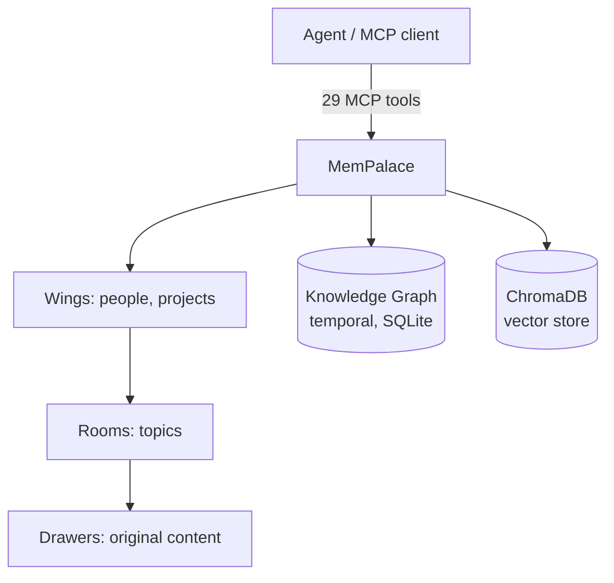

# MemPalace

> [!abstract] TL;DR
> **MemPalace** é um sistema de memória de agentes **local-first** lançado em abril de 2026, mantido por **Milla Jovovich** (sim, literal — é o nome real da mantenedora do repositório `github.com/milla-jovovich/mempalace`; também há a organização `github.com/MemPalace/mempalace`). A arquitetura aplica a metáfora do **memory palace** (método dos loci) numa hierarquia de **wings → rooms → drawers** sobre **SQLite local** + **ChromaDB** como vector store padrão. Reporta **96,6% R@5 raw** e **98,4% no modo hybrid v4** (com LLM reranking — ≥99% reportado em alguns canais externos) no LongMemEval — números altos, mas com **paper crítico** (arxiv 2604.21284) argumentando que o ganho real vem de armazenamento verbatim + ChromaDB, não da hierarquia espacial. Expõe **29 MCP tools** (audit externo de `lhl/agentic-memory` encontrou 20 efetivamente implementadas em 5 categorias), opera offline após primeira ingestão e tem foco explícito em integração com Claude Code.

> [!danger] Avisos de segurança
> - O domínio **`mempalace.tech` é impostor com malware**, não relacionado ao projeto oficial.
> - Fontes oficiais únicas: `github.com/milla-jovovich/mempalace` e `github.com/MemPalace/mempalace`.
> - O score 98,4% em modo híbrido tem ressalvas críticas — análise rigorosa em [[21 - Críticas, limitações e armadilhas]].

## O que é

**MemPalace** é um sistema de memória persistente para agentes LLM lançado publicamente em abril de 2026. A mantenedora é **Milla Jovovich** — nome literal, não pseudônimo de marketing — autora do repositório `github.com/milla-jovovich/mempalace` e da organização paralela `github.com/MemPalace/mempalace`. A coincidência onomástica com a atriz alimenta confusão em threads e posts, mas esses dois são os únicos repositórios oficiais. Repetindo o aviso anterior: **o domínio `mempalace.tech` é impostor com payload de malware** e não tem relação com o projeto.

A arquitetura aplica a metáfora do **memory palace** — também conhecida como **método dos loci**, técnica mnemônica clássica da retórica grega — para organizar a memória em hierarquia espacial: **wings** (dimensões macro como pessoas e projetos), **rooms** (subtópicos dentro de cada wing) e **drawers** (a unidade atômica que guarda conteúdo verbatim). O foco é **local-first**: após a primeira ingestão, a operação é offline, sem chamadas a APIs externas. O substrato técnico combina **SQLite local** (knowledge graph temporal e metadados) com **ChromaDB** como vector store padrão, e a interface é **MCP-native** — 29 ferramentas expostas via Model Context Protocol, com integração explícita ao Claude Code.

## Por que importa

- **Score auto-reportado entre os mais altos do mercado em abril de 2026.** **96,6% R@5 raw** e **98,4% no modo hybrid v4** (com LLM reranking — ≥99% reportado em alguns canais externos) no LongMemEval — com a ressalva crítica detalhada na seção *Crítica externa*.
- **Local-first com integração MCP destrava casos onde Cloud é proibido.** Cenários regulatórios (saúde, legal, defesa) e ambientes air-gapped ganham opção MCP-native sem SaaS — diferente de [[15 - Zep e Graphiti — knowledge graph temporal|Zep]] (cloud-first) e parecido com [[12 - basic-memory — MCP nativo Obsidian|basic-memory]] em filosofia, mas com pretensão de benchmark mais alto.
- **Diferenciais técnicos auto-declarados.** **AAAK compression** com claim de cerca de 30x (não verificado independentemente; ver hedge na *Anatomia técnica*) e **170-token startup** — agent inicia sessão consumindo cerca de 170 tokens antes de qualquer retrieval. Ambas precisam ser lidas com granularidade.
- **O paper crítico é leitura obrigatória.** O arxiv 2604.21284 — *Spatial Metaphors for LLM Memory: A Critical Analysis of MemPalace* — argumenta que a "spatial palace hierarchy" é vector DB filtering com nomenclatura nova. Adotar MemPalace por convicção arquitetural sem ler essa crítica é decisão sub-informada.
- **Sinaliza maturidade do mercado.** A existência simultânea de framework + benchmark próprio + paper crítico independente é indicador de que o campo está se profissionalizando.

## Como funciona — arquitetura memory palace

A hierarquia espacial é o conceito central:

- **Wings (asas).** Dimensões macro — pessoas, projetos, domínios temáticos. Primeiro nível de particionamento: "Wing: clientes", "Wing: projetos internos", "Wing: literatura técnica".
- **Rooms (salas).** Subdivisões dentro de cada wing — tipicamente uma room por cliente, ou uma por projeto. É a granularidade onde o tagging implícito acontece.
- **Drawers (gavetas).** A unidade atômica. Guarda **conteúdo verbatim** — texto original, sem sumarização agressiva — com metadados de validade temporal e referências cruzadas. É onde a recuperação por similaridade acontece.

Por baixo da metáfora, dois substratos coexistem:

1. **Knowledge graph temporal em SQLite local.** Cada nó tem **validity intervals**, na tradição bi-temporal de [[15 - Zep e Graphiti — knowledge graph temporal|Zep/Graphiti]], mas com escopo single-user e sem Neo4j.
2. **ChromaDB como vector store padrão.** A escolha é pluggable via `mempalace/backends/base.py` (ver hedge na *Anatomia técnica*) — permite trocar por outros vector DBs em tese.

As **29 MCP tools** cobrem cinco categorias: leituras/escritas no palácio (wings/rooms/drawers), operações no KG (criar nós, ligar relações, consultar timeline), navegação espacial (listar, encontrar caminhos), gerenciamento de drawers (mover, splitar, mesclar) e `agent diaries` (logs de sessão para reflective steps posteriores).

## Anatomia técnica

Os itens abaixo refletem a apresentação pública do projeto em abril de 2026. Onde a verificação independente é parcial, o item está marcado com hedge explícito — nota intencionalmente conservadora porque o domínio impostor e o paper crítico tornam fact-checking obrigatório antes de adoção.

- **Linguagem.** **Python** (a verificar: documentação e MCP tools indicam runtime Python; confirmar versão mínima no `pyproject.toml` antes de pinning em CI).
- **Licença.** **MIT** (a verificar no `LICENSE` oficial — circulação em análises externas indica MIT; confirmar diretamente é pré-requisito para adoção comercial).
- **Backend de vector store padrão.** **ChromaDB**, pluggable via interface em `mempalace/backends/base.py`. Trocar por Qdrant, Weaviate ou outros é em tese suportado, mas requer adaptador.
- **Knowledge graph.** **SQLite local** com validity intervals por edge — modelo temporal aproximado do bi-temporal de Graphiti, em escopo single-user e sem o aparato de hybrid search do Graphiti.
- **MCP tools (29 reportadas / 20 auditadas).** 29 MCP tools são reportadas no README oficial; **a análise externa de [lhl/agentic-memory](https://github.com/lhl/agentic-memory/blob/main/ANALYSIS-mempalace.md) auditou 20 tools efetivamente implementadas em 5 categorias**. Discrepância marketing-vs-código vale checar. Cobertura ampla: palace reads/writes, KG ops, navegação espacial, drawer management, agent diaries. **A lista exata deve ser verificada no README oficial e cruzada com a auditoria externa** — esta nota não enumera as tools individualmente para evitar discrepância em mudanças recentes.
- **AAAK compression — claim de ~30x (HEDGE FORTE + DROP MEDIDO).** A documentação descreve **AAAK** como técnica proprietária com claim de cerca de **30x sobre o conteúdo bruto** com "zero information loss". **Auto-reportado, não confirmado por terceiros independentes** até a data desta nota. 30x é fator alto em compressão semântica de texto livre — sumarização hierárquica madura reporta 5x–10x sem perda crítica. A análise externa de [lhl/agentic-memory](https://github.com/lhl/agentic-memory/blob/main/ANALYSIS-mempalace.md) é mais específica e contundente: **AAAK causa 12.4pp drop (96.6% → 84.2%) na qualidade de retrieval**, contradizendo diretamente o claim de "zero information loss". **Tratar como marketing até verificação independente; com base no audit externo, esperar trade-off real entre compressão e qualidade.**
- **170-token startup (HEDGE).** A documentação reporta agent iniciando sessão com cerca de **170 tokens** antes de qualquer retrieval. Coerente com filosofia local-first, mas isola componente específico — não é o **custo end-to-end** de uma query real (recuperação + ranking + injeção de drawers). **170 tokens é piso, não custo médio.**
- **Score LongMemEval.** **96,6% R@5 raw** / **98,4% R@5 no modo hybrid v4 com LLM reranking** (≥99% reportado em alguns canais externos) — auto-reportado e contestado pelo paper crítico. Ver *Crítica externa*.
- **Auto-save hooks.** **Hooks periódicos** durante a sessão e **hook pré-compaction** (antes do context window sofrer compaction pelo cliente MCP) garantem que estado relevante vire drawer persistente sem ação explícita do agent.
- **Específico para Claude Code.** Há **integração explícita** documentada — instruções no `.claude/` e padrões de MCP tools alinhados ao CLI. **A verificar:** se a integração é via MCP padrão (qualquer cliente compatível) ou tem dependência específica do Claude Code.

## Crítica externa

Esta seção é obrigatória — não apêndice opcional. A combinação de score auto-reportado alto + arquitetura nova + projeto recente + domínio impostor compõe perfil de risco onde leitura crítica precoce é diligência técnica.

- **Paper "Spatial Metaphors for LLM Memory: A Critical Analysis of MemPalace"** (arxiv 2604.21284) é o documento central da crítica. Argumenta três coisas:
    1. **O ganho de performance vem principalmente de armazenamento verbatim + ChromaDB default**, não da hierarquia espacial. Em ablações do paper, remover wings/rooms/drawers e manter drawers planos com ChromaDB preserva a maior parte do score — sinal de que a hierarquia é decoração, não motor de retrieval.
    2. **A "spatial palace hierarchy" funciona como vector DB filtering padrão**, com nomenclatura espacial sobreposta. "Navegação por wings" é *filtering* por metadado categórico antes da busca vetorial — técnica disponível em qualquer vector DB maduro há anos.
    3. **Marketing claims excedem rigor científico.** Sumário do paper: *"considerable architectural insight wrapped in overstated claims"* — reconhece mérito real (integração MCP, local-first, 29 tools) e separa-o de afirmações infladas (metáfora espacial como inovação, AAAK 30x como salto, 170-token startup como métrica end-to-end).

- **Análise externa em `lhl/agentic-memory/blob/main/ANALYSIS-mempalace.md`** corrobora pontos com investigação independente: (a) confirma a hipótese verbatim + ChromaDB ao reproduzir parte das ablações, (b) mede que **AAAK causa 12.4pp drop (96.6% → 84.2%) na qualidade de retrieval**, contradizendo o claim de "zero information loss" associado ao 30x, (c) auditou **20 MCP tools efetivamente implementadas em 5 categorias** contra as 29 reportadas no README oficial — discrepância marketing-vs-código documentada, (d) elogia o trabalho de integração MCP como genuinamente útil ao ecossistema Claude Code.

- **Score 98,4% hybrid sob suspeita de overfitting.** Análise no DEV.to descreve o **98,4% no modo hybrid v4** (≥99% reportado em alguns canais externos, arredondado para ~100%) como *"engineered through a process that most benchmark-literate engineers would consider overfitting"* — apontando que a configuração hybrid v4 held-out usa tuning específico ao LongMemEval que dificilmente generaliza. **Comparar 98,4% MemPalace com 93,4% Mem0 não é apples-to-apples.**

Para tratamento integrado das críticas ao panorama (Mem0, Zep, MemPalace, Letta), ver [[21 - Críticas, limitações e armadilhas]].

## Quando usar / quando não usar

**Quando vale:**

- **Caso local-first com privacidade estrita** — regulatório, compliance, ambientes air-gapped onde Cloud é proibido por contrato ou política. SQLite + ChromaDB local + zero API calls após ingestão entregam essa garantia.
- **Workflow MCP-native** com Claude Code (ou outro cliente MCP compatível) — a integração com 29 tools cobre escrita, leitura, navegação e KG sem precisar reescrever orquestração.
- **Quer experimentar a arquitetura "memory palace" como conceito** — mesmo com a crítica, o desenho wings/rooms/drawers é didático e pode servir como cabide mental para organizar memória, independente de o ganho de retrieval vir da hierarquia ou do verbatim.
- **Não tem orçamento ou apetite por SaaS** — o framework é gratuito, self-host trivial (uma pasta + processo MCP), sem dependência de cloud paga em modo padrão.

**Quando NÃO vale:**

- **Caso decidido por benchmark** — o score 96,6% raw / 98,4% hybrid v4 auto-reportado tem ressalvas críticas que o tornam não-comparável a outros números do panorama. Quem decide por número precisa primeiro ler o paper crítico e refazer a comparação. Ver [[20 - Comparativo crítico (LongMemEval)|20 - Comparativo crítico]].
- **Workflow Obsidian-first / markdown-first** — MemPalace não persiste em markdown legível por humano; o substrato é SQLite + ChromaDB. Para revisão manual da memória ou edição humana paralela ao agent, [[12 - basic-memory — MCP nativo Obsidian|basic-memory]] é mais adequado.
- **Caso enterprise com audit trail formal** — não há ACL granular, logs imutáveis nem governance comparável ao [[15 - Zep e Graphiti — knowledge graph temporal|Zep Cloud]]. Para compliance regulatório com SLA, Zep é mais maduro.
- **Equipe que não pode tolerar projeto novo** — MemPalace é abril de 2026, ainda em consolidação. Track-record é curto, breaking changes são esperáveis, e o domínio impostor mostra que o ecossistema ao redor ainda é frágil. Times que precisam de estabilidade plurianual devem aguardar maturação ou ir para alternativas mais antigas.

## Armadilhas comuns

- **Domínio impostor `mempalace.tech` com malware.** Risco real, não hipotético. Sempre instalar a partir de `github.com/milla-jovovich/mempalace` ou `github.com/MemPalace/mempalace` — nunca de domínio externo.
- **Citar score 96,6% / 98,4% hybrid sem hedge.** O paper crítico mostra que a origem do ganho não é o que o marketing sugere. Toda menção pública ao número precisa vir acompanhada do hedge (incluindo a nota de que ≥99% circula em canais externos, mas o oficial held-out é 98,4%) — caso contrário, espalha-se desinformação técnica.
- **AAAK 30x compression como fato com "zero information loss".** O claim é auto-reportado e a auditoria externa de [lhl/agentic-memory](https://github.com/lhl/agentic-memory/blob/main/ANALYSIS-mempalace.md) mediu **12.4pp de drop (96.6% → 84.2%) na qualidade de retrieval** — contradizendo diretamente a promessa de "zero information loss". Citar como "30x" sem este hedge é erro frequente — verificar antes de qualquer afirmação categórica.
- **170-token startup como custo end-to-end.** A métrica isola componente específico (custo de inicialização da sessão antes de qualquer retrieval). Não é o custo de uma query real, que inclui recuperação, ranking e injeção. Comparar 170 tokens com tokens totais de outros frameworks é categoria errada.
- **Confiar na "spatial palace hierarchy" como inovação técnica.** O parecer técnico do paper crítico é que a hierarquia funciona como vector DB filtering com nomenclatura nova. A metáfora é didática; o ganho mensurado vem de outros componentes. Adotar por convicção arquitetural sem ler o paper crítico é decisão sub-informada.
- **Filiação à família "Karpathy-inspired".** O projeto não cita Karpathy nominalmente; a relação com o [[06 - O LLM Wiki Pattern (gist do Karpathy)|LLM Wiki Pattern]] é interpretativa (mesmo espírito local-first + substrato simples), não reivindicação do gist. Não atribuir descendência direta sem qualificar.
- **Confundir as duas fontes oficiais.** `github.com/milla-jovovich/mempalace` (repo da mantenedora individual) e `github.com/MemPalace/mempalace` (org paralela) são ambos oficiais. Não confundir nenhum deles com `mempalace.tech`.

## Veja também

- [[06 - O LLM Wiki Pattern (gist do Karpathy)]] — pattern alternativo, markdown-led
- [[09 - Panorama de implementações (abril 2026)|09 - Panorama]] — onde MemPalace se posiciona no mercado
- [[12 - basic-memory — MCP nativo Obsidian|12 - basic-memory]] — alternativa local + MCP, markdown-first
- [[15 - Zep e Graphiti — knowledge graph temporal|15 - Zep e Graphiti]] — alternativa enterprise, KG temporal maduro
- [[20 - Comparativo crítico (LongMemEval)|20 - Comparativo crítico]] — onde o score 96,6% raw / 98,4% hybrid v4 aparece em contexto comparado
- [[21 - Críticas, limitações e armadilhas]] — análise crítica obrigatória, com tratamento integrado do paper arxiv 2604.21284

## Referências

- Repositório oficial 1 (mantenedora individual) — `https://github.com/milla-jovovich/mempalace`
- Repositório oficial 2 (organização) — `https://github.com/MemPalace/mempalace`
- Paper crítico — *Spatial Metaphors for LLM Memory: A Critical Analysis of MemPalace*, arxiv 2604.21284 — `https://arxiv.org/abs/2604.21284`
- Análise externa independente — `https://github.com/lhl/agentic-memory/blob/main/ANALYSIS-mempalace.md`
- Substack alexeyondata — *An Unexpected Entry Into AI Memory: Milla Jovovich's Open-Source MemPalace* (cobertura jornalística, abril de 2026)
- **Aviso de segurança:** o domínio `mempalace.tech` **não é fonte oficial** e foi reportado como vetor de malware — não acessar.
