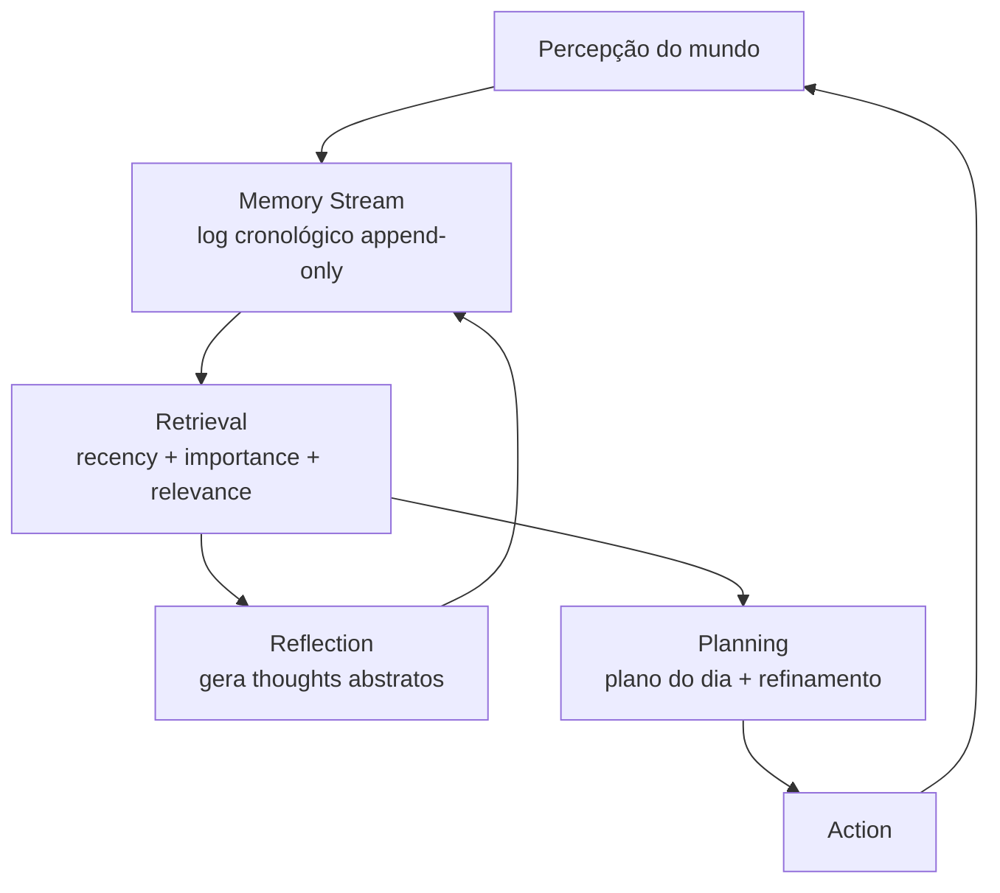

# Generative Agents (Park, Stanford 2023)

> [!abstract] TL;DR
> Paper foundational do campo de memória de agentes, publicado no UIST 2023 por Park et al. (Stanford + Google Research). Os autores simularam 25 agents num sandbox tipo The Sims e mostraram que três componentes — **memory stream, reflection trees e planning** — produzem comportamento social crível e emergente em LLMs. O artigo cunhou o vocabulário arquitetural (memory stream, retrieval scoring com **recency + importance + relevance**) que praticamente toda a literatura subsequente de agentic memory adotou e estendeu. É o ponto de partida obrigatório para quem quer entender por que agents precisam de mais do que um context window.

## Metadados

- **Autores:** Joon Sung Park, Joseph C. O'Brien, Carrie J. Cai, Meredith Ringel Morris, Percy Liang, Michael S. Bernstein
- **Afiliação:** Stanford University + Google Research
- **Venue:** UIST '23 (ACM Symposium on User Interface Software and Technology), October 2023
- **arXiv:** [2304.03442](https://arxiv.org/abs/2304.03442)
- **Código:** [github.com/joonspk-research/generative_agents](https://github.com/joonspk-research/generative_agents)

## Problema

Como agents podem exibir comportamento social crível ao longo de muitas interações? LLMs sozinhos não conseguem sustentar continuidade — o context window é finito e, mesmo dentro dele, não há mecanismo para distinguir o que importa do que é ruído. Pedir a um agent que "se lembre" de eventos relevantes de horas ou dias atrás esbarra em duas dificuldades: o histórico bruto não cabe no contexto, e cabendo, o LLM não consegue priorizar — trata tudo de forma uniforme.

Mesmo soluções de retrieval simples (busca por similaridade vetorial sobre um log de interações passadas) falham em capturar o que torna um comportamento "vivo". Park et al. argumentam que falta a "alma" — a capacidade de **refletir** sobre o passado para extrair padrões abstratos, e de **planejar** o futuro a partir desses padrões. Sem reflexão, o agent é reativo; sem planejamento, é desorganizado. O paper propõe que a combinação dos três (memória, reflexão, planejamento) é o que produz believability.

## Contribuição

A contribuição central é uma **arquitetura cognitiva em três partes** que opera sobre LLMs prontos (no caso original, GPT-3.5):

1. **Memory stream.** Um log cronológico de tudo que o agent percebe — observações do mundo, ações próprias, falas trocadas com outros agents. Cada entrada carrega timestamp, descrição em linguagem natural, score de **importance** atribuído pelo LLM (escala 1-10, dado em tempo de ingestão) e timestamp de último acesso. É um substrato denso, append-only, em texto.
2. **Reflection.** Periodicamente, o agent gera "thoughts" de alto nível a partir de memórias recentes. Reflexões viram novas entradas no memory stream — recursivamente, podem ser fonte para reflexões futuras, formando uma **árvore de abstração**. Reflexão é o mecanismo que transforma fatos brutos em insights generalizáveis ("Klaus tende a focar em pesquisa quando está estressado").
3. **Planning.** O agent planeja o dia em alto nível ao acordar (granularidade de horas) e refina recursivamente em planos mais finos (minutos, ações concretas) ao longo do tempo. Re-planeja em resposta a eventos que invalidam o plano vigente.

A combinação desses três componentes, mediada por um mecanismo de **retrieval scoring** sofisticado, produz agents que mantêm consistência longitudinal sem precisar de fine-tuning ou modelos especializados — apenas LLM calls coreografados.

## Como funciona

### Retrieval scoring é a chave

O coração técnico do paper está em como decidir, num dado instante, **quais memórias trazer ao contexto** para informar a próxima ação. Park et al. combinam três sinais ortogonais:

- **Recency.** Decay exponencial sobre o tempo desde o último acesso. Eventos recentes pesam mais — modela a intuição de que memórias frescas são mais salientes.
- **Importance.** Score 1-10 atribuído pelo LLM no momento da ingestão. Eventos mundanos ("comi cereal") recebem nota baixa; eventos significativos ("rompi com meu parceiro") recebem nota alta. Esse score é fixo após criação.
- **Relevance.** Cosine similarity entre o embedding da memória e o embedding da query atual (o que o agent está tentando fazer agora).

O score final é a soma ponderada dos três (normalizados). O agent recupera as top-N memórias por esse score combinado e as injeta no prompt da próxima decisão. A elegância está no fato de que cada sinal isoladamente é fraco — recency sozinha esquece o que importou ontem; importance sozinha ignora contexto situacional; relevance sozinha não diferencia novo de antigo. Combinados, capturam algo próximo do que humanos chamam de "memória contextual".

### Reflection trigger

A reflexão não acontece a cada tick. Os autores definem um threshold: quando a soma de importance dos eventos recentes ultrapassa um valor (~150 no paper), o agent dispara um ciclo de reflexão. O mecanismo é em duas etapas:

1. O LLM olha o memory stream recente e gera as 3 perguntas mais salientes que poderia fazer sobre si mesmo.
2. Para cada pergunta, recupera memórias relevantes via o scoring acima e gera "insights" — afirmações abstratas com referência às memórias originais que as suportam.

Esses insights entram no memory stream como entradas com type `reflection`, e podem ser recuperados pelo mesmo mecanismo. Reflexões iniciais são genéricas; com profundidade (reflexão sobre reflexões), tornam-se cada vez mais abstratas — formam a árvore.

### Planning

O agent gera um plano grosso para o dia ao acordar (5-8 itens), traduzido em linguagem natural ("9-10am: write a research proposal"). Esse plano é decomposto recursivamente em planos mais finos conforme o tempo avança. Quando uma observação inesperada invalida o plano (p.ex., um colega convida para almoço), o agent re-planeja a partir do ponto atual. Plano e re-plano também passam pelo memory stream — o agent "se lembra" do que planejou.

## Resultados

- **Sandbox.** O experimento principal roda 25 agents num "small town" virtual (Smallville) com 12 cômodos públicos e 25 espaços residenciais. Cada agent tem identidade inicial textual de poucas frases (nome, traços, relacionamentos, ocupação).
- **Comportamento emergente.** O resultado mais citado: uma única sugestão dada a um único agent — "organize uma festa de Valentine's Day" — propagou organicamente. Convites foram feitos, datas combinadas, locais escolhidos, e no dia da festa houve atendimento coordenado. Nada disso foi programado — emergiu do mecanismo de memória + reflexão + planejamento.
- **Avaliação humana.** Os autores conduziram avaliação humana comparando a arquitetura completa contra ablations. Avaliadores ranqueavam respostas dos agents em entrevistas estruturadas sobre dimensões como "self-knowledge", "memory", "plans", "reactions", "reflections". A arquitetura completa superou consistentemente: memory only, planning only e reflection only — todos degradam significativamente. Os três componentes são individualmente críticos e sinergéticos.
- **Believability.** O construto-chave da avaliação é "believability" — quão crível é o comportamento como o de uma pessoa. Não é uma métrica de tarefa convencional; é qualitativa, com inter-rater agreement reportado. Park et al. argumentam que esse é o framing certo para agents sociais, e o framing pegou na literatura subsequente.

## Limitações reconhecidas pelos autores

- **Custo computacional alto.** Cada percepção é uma LLM call (importance scoring), cada retrieval é uma LLM call indireta (decisão), cada reflexão é várias LLM calls. Para 25 agents num dia simulado, o custo experimental foi significativo. Os autores reconhecem que escalonar para centenas de agents ou ambientes ricos exige otimizações que o paper não aborda.
- **Sandbox simples.** Smallville é deliberadamente pequeno e bem-definido. A generalização para domínios complexos (multi-modal, com ferramentas reais, com stakes de mundo real) não é trivial — os autores admitem que o experimento é prova de conceito.
- **Hallucination persiste.** Mesmo com o memory stream, agents ocasionalmente "inventam" memórias inconsistentes ou fabricam relacionamentos que não existem. O memory stream reduz mas não elimina o problema.
- **Avaliação longitudinal limitada.** A simulação principal cobre 2 dias virtuais. Os autores reconhecem que comportamentos crônicos (relacionamentos que se desgastam ao longo de meses, hábitos que mudam) não foram testados.

## Crítica externa

- **Recepção.** O paper detonou uma explosão de trabalhos de "agentic memory" subsequentes. [[18 - A-MEM — Zettelkasten dinâmico|A-MEM]], MemGPT, Mem0, Memary, e várias frameworks comerciais citam Park et al. como referência fundacional. O artigo virou base citacional do campo e o termo "memory stream" entrou no léxico padrão.
- **Críticas comuns.** A escalabilidade de custo é o calcanhar de Aquiles mais frequentemente apontado — em produção, fazer LLM call para scoring de importance de cada percepção é proibitivo. Trabalhos posteriores (notavelmente A-MEM e abordagens com memory consolidation) propõem alternativas mais baratas. Outra crítica recorrente é que algumas ablations específicas têm reproducibilidade variável — o efeito agregado é robusto, mas decompor exatamente quanto cada componente contribui depende muito do prompt e do modelo base.
- **Reproduções independentes.** O repositório oficial é completo o suficiente para que múltiplas equipes tenham reproduzido o efeito de believability. Reviews públicas (notavelmente análises detalhadas em Medium por Andrew Lukyanenko e na newsletter gonzoml no Substack) confirmam que o comportamento emergente é real e não artefato do paper original. O efeito é robusto.

## Por que importa para a trilha

- **Cunhou o vocabulário** que toda a literatura subsequente usa: memory stream, reflection, retrieval com recency + importance + relevance, believability como métrica. Sem esse vocabulário, é impossível ler a literatura recente de agentic memory.
- **Conexão direta com [[03 - Taxonomia da memória (episódica, semântica, procedural)]].** O memory stream é uma instância clara de memória episódica de longo prazo — log de eventos com timestamps. As reflexões são o mecanismo de **transição** de episódica para semântica: extraem padrões generalizáveis a partir de eventos concretos. O paper antecipa, na prática, a divisão taxonômica que a literatura formalizaria depois.
- **Inspiração arquitetural para [[18 - A-MEM — Zettelkasten dinâmico]].** A-MEM evolui o conceito ampliando para um Zettelkasten dinâmico — em vez de log + reflexão, propõe uma estrutura de notas interlinkadas que se reorganizam. A relação direta de descendência intelectual está reconhecida no próprio paper do A-MEM.
- **Compara com [[06 - O LLM Wiki Pattern (gist do Karpathy)|06 - LLM Wiki Pattern]].** Park ataca o problema de memória com **simulação social** — agents num mundo virtual, mecanismo de retrieval probabilístico. Karpathy ataca o mesmo problema com **pragmatismo de wiki** — markdown interlinkado, schema explícito, humano na curadoria. Ambos resolvem o gap "LLM esquece"; estilos arquiteturais radicalmente diferentes. Lê-los em sequência ilumina o espaço de design.
- **Ponte para [[08 - Arquitetura de um sistema de memória]].** O vocabulário arquitetural usado nessa nota da trilha é informado diretamente por Park et al. — entender o paper original deixa a arquitetura genérica muito mais legível.

## Veja também

- [[03 - Taxonomia da memória (episódica, semântica, procedural)|03 - Taxonomia]] — onde memory stream encaixa
- [[06 - O LLM Wiki Pattern (gist do Karpathy)|06 - LLM Wiki Pattern]] — abordagem complementar
- [[08 - Arquitetura de um sistema de memória]] — vocabulário arquitetural
- [[18 - A-MEM — Zettelkasten dinâmico]] — evolução acadêmica
- [[19 - Surveys e estado da arte 2026]] — campo formalizado

## Referências

- Park, J. S., O'Brien, J. C., Cai, C. J., Morris, M. R., Liang, P., & Bernstein, M. S. (2023). _Generative Agents: Interactive Simulacra of Human Behavior._ UIST '23 — [arxiv.org/abs/2304.03442](https://arxiv.org/abs/2304.03442)
- Repositório oficial de código — [github.com/joonspk-research/generative_agents](https://github.com/joonspk-research/generative_agents)
- Stanford HAI — página institucional do projeto (Stanford Human-Centered AI Institute)
- Lukyanenko, A. — review detalhada em Medium sobre Generative Agents
- gonzoml (Substack) — análise crítica do paper e impacto no campo
