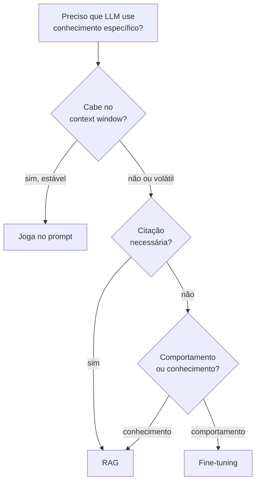
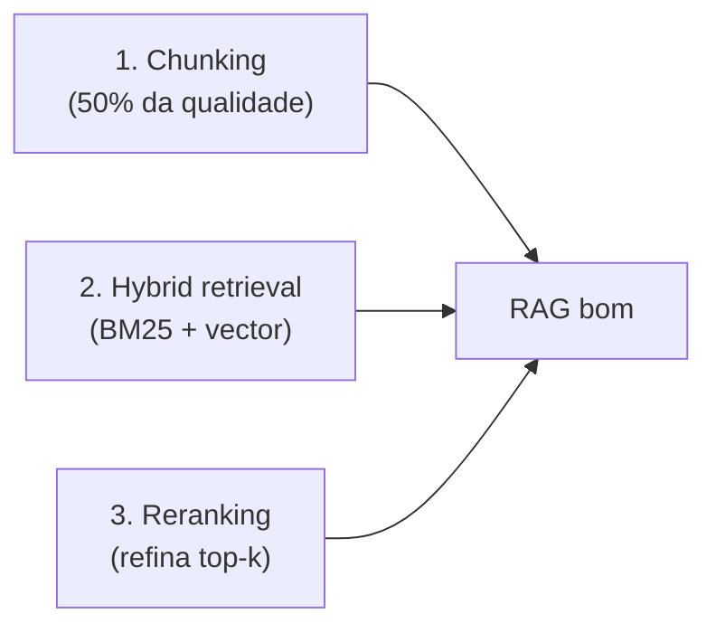

# O que é RAG e quando usar

> [!abstract] TL;DR
> **RAG (Retrieval-Augmented Generation)** combina dois passos: **retrieval** (busca trechos relevantes em uma base de conhecimento) + **generation** (LLM gera resposta usando esses trechos como contexto). O resultado: LLM que "parece" conhecer seus dados em runtime, sem treinar nada. Barato, flexível, com **capacidade chave: citar fontes**. Em 2026, quase toda aplicação séria com LLM tem RAG no meio do caminho — porque LLMs conhecem muita coisa, mas não conhecem **seus dados** (docs internas, políticas, base de clientes, histórico do paciente).

## A definição operacional

```text
[User pergunta] → [Retrieval] → [trechos relevantes] ┐
                                                     ▼
                                [LLM com contexto] → [Resposta com citações]
```

Dois componentes:

1. **Retrieval:** dado uma pergunta, busca os trechos mais relevantes em uma base de conhecimento
2. **Generation:** passa esses trechos como contexto ao LLM, que gera resposta baseada neles

## Por que RAG existe

LLMs têm **knowledge cutoff** e **não conhecem seus dados**. Soluções:

| Abordagem | Custo | Frescor | Citação |
|---|---|---|---|
| **Fine-tuning** | Alto (treino) | Stale (precisa retreinar) | ❌ |
| **Long context** | Alto (tokens) | Limitado pela janela | ⚠️ Frágil |
| **RAG** | Baixo | Atualizar = re-indexar | ✅ Direto |

RAG ganha em **flexibilidade + custo + auditabilidade**. Não substitui fine-tuning para mudar comportamento, mas substitui para **adicionar conhecimento**.

## Quando usar RAG

✅ **Use quando:**

- Base de conhecimento >context window (>200K tokens)
- Conhecimento muda com frequência (docs, FAQs, dados ao vivo)
- Citação de fonte é requisito
- Multi-tenant (cada usuário tem dados diferentes)
- Compliance exige auditoria de fontes

## Quando NÃO usar

❌ **Não use quando:**

- Dataset cabe inteiro no prompt (joga tudo no contexto)
- Tarefa é gramatical/estrutural (não factual)
- Domínio é estável e cabe em fine-tuning
- Latência crítica <500ms (RAG adiciona 2 round-trips)

## Decision tree rápido



## A capacidade-chave: citar fontes

> [!tip] Por que isso muda tudo
> Sem RAG, LLM responde com confiança alta sobre fatos que pode estar inventando.
>
> Com RAG, LLM cita o trecho específico que usou — usuário pode verificar.
>
> Em domínios regulados (medicina, legal, finance), citação não é nice-to-have — **é compliance**.

## RAG vs context-stuffing

Anti-pattern: *"vou jogar 500K tokens e deixar o modelo virar"*. Não. Quase sempre pior que RAG bem feito com 4K tokens relevantes:

- Atenção dilui ([[Context Engineering|03 - Context rot e atenção diluída]])
- Custo explode
- Latência sobe

RAG-filtered 8K tokens **vence** raw dump de 500K em quase todo benchmark, exceto refactoring codebase-wide.

## Os 3 pilares de qualidade



**RAG não é sobre vector DB** — é sobre **retrieval quality**. Vector DB virou commodity. Onde a qualidade vive: chunking, hybrid search, reranking.

## O que diferencia um senior em RAG

> [!tip]
> 1. Sabe que **RAG não é sobre vector DB** — é sobre retrieval quality
> 2. Nunca usa pure vector search em produção — hybrid (BM25 + vector) com reranker é o padrão
> 3. Trata chunking com seriedade — chunks ruins = RAG ruim
> 4. Mede **retrieval quality separado de generation quality**
> 5. Conhece armadilhas: tabela de conteúdos em vez de conteúdo, chunks sem metadata
> 6. Implementa **query rewriting** — pergunta do usuário raramente é a melhor query
> 7. Tem evaluation: faithfulness, relevance, context precision/recall
> 8. Sabe quando RAG ≠ resposta — devolve "não sei" ou "contexto não cobre isso"
> 9. Faz tiering: contexto pequeno e estável → joga no prompt; RAG só quando necessário
> 10. Não confunde RAG com fine-tuning — sabe escolher cada um

## Veja também

- [[02 - Anatomia do pipeline RAG]]
- [[09 - Evaluation de RAG]]
- [[10 - RAG vs long context vs fine-tuning]]
- [[Anatomia dos LLMs|14 - Fine-tuning vs prompting vs RAG]]
- [[Context Engineering|06 - Dynamic retrieval beyond RAG]]

## Referências

- **Pinecone** — *Learn RAG* (2025+)
- **Anthropic** — *Contextual Retrieval* (2024)
- **Lewis et al.** — *Retrieval-Augmented Generation for Knowledge-Intensive NLP Tasks* (2020, paper original)
- **Eugene Yan** — *Patterns for Building LLM-based Systems* (2024)
