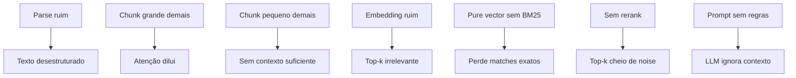

# Anatomia do pipeline RAG

> [!abstract] TL;DR
> Pipeline RAG tem **duas fases**: indexing (offline, uma vez por documento) e query (online, cada pergunta). Indexing: parse → chunk → embed → store. Query: rewrite → embed → retrieve → rerank → generate. Cada passo é uma oportunidade de melhorar OU destruir qualidade. Saber onde cada peça encaixa é pré-requisito para debugar quando a resposta vier ruim.

## As duas fases

```text
INDEXING (offline, uma vez)        QUERY (online, cada pergunta)
═══════════════════════════         ════════════════════════════
1. Parse                            5. Rewrite
2. Chunk                            6. Embed (query)
3. Embed (chunks)                   7. Retrieve
4. Store                            8. Rerank
                                    9. Generate
```

## Fase Indexing (offline)

Roda **uma vez** por documento (e quando ele muda).

### 1. Parse — texto estruturado

```
PDF / HTML / DOCX / MD → texto + metadata
```

| Formato | Tool |
|---|---|
| PDF | `pypdf`, `unstructured`, `marker`, `Docling` |
| HTML | `BeautifulSoup`, `trafilatura` |
| DOCX | `python-docx`, `unstructured` |
| Markdown | `mistletoe`, `markdown-it-py` |

> [!warning] Parse ruim destrói RAG
> PDF mal-parseado vira texto sem estrutura — chunks misturam tabelas com prosa, headers somem, citações se perdem. **Investigue** o output do parse antes de seguir.

### 2. Chunk — partir em pedaços

Texto → pedaços de N tokens com overlap. Crítico para qualidade. Detalhes em [[04 - Chunking — onde 50% da qualidade vive]].

### 3. Embed — texto vira vetor

Cada chunk → vetor denso (256-3072 dimensões). Detalhes em [[03 - Embeddings — representação semântica]].

### 4. Store — vector database

Salvar `(chunk_text, embedding, metadata)` em vector DB. Opções em [[05 - Vector databases — pgvector, Pinecone, Qdrant]].

## Fase Query (online)

Roda **a cada pergunta**. Latência total tipica: 200ms-2s.

### 5. Rewrite — query → query melhor (opcional)

```
"como faço para configurar X?" → "configurar X documentação"
```

Técnicas:
- **HyDE** (Hypothetical Document Embeddings) — gera resposta hipotética, usa como query
- **Query expansion** — múltiplas queries do mesmo conceito
- **Subquestion decomposition** — pergunta complexa → várias simples

Detalhes em [[06 - Retrieval — hybrid search, BM25, query rewriting]].

### 6. Embed (query)

Mesmo modelo do indexing. **Crucial** que seja o mesmo — embeddings de modelos diferentes não são comparáveis.

### 7. Retrieve — similarity search

```sql
-- Vector search com pgvector
SELECT chunk, metadata
FROM chunks
ORDER BY embedding <=> query_embedding
LIMIT 50;
```

Em produção: **hybrid retrieval** (BM25 + vector). Pure vector vence em ~70% dos casos; hybrid vence em ~95%.

### 8. Rerank — refinar top-k

Top-50 do retrieve → top-5 que vão pro prompt.

Modelos: Cohere Rerank, Voyage Rerank, BGE Reranker. Cross-encoders são mais precisos que bi-encoders (embeddings).

Detalhes em [[07 - Reranking — Cohere, Voyage, cross-encoders]].

### 9. Generate — LLM com contexto

Prompt típico:

```
Você é um assistente que responde baseado nos trechos abaixo.

Trechos:
{chunk1}
{chunk2}
{chunk3}

Pergunta: {query}

Regras:
- Cite o trecho usado em cada afirmação [1], [2], etc.
- Se trechos não cobrem a pergunta, diga "não sei".
```

Detalhes em [[08 - Generation — passar contexto ao LLM com citação]].

## Onde cada problema vive



Eval **separa retrieval de generation** ([[09 - Evaluation de RAG]]) — sem isso, você não sabe onde está o problema.

## Latência típica

| Step | Latência |
|---|---|
| Parse + chunk + embed (indexing) | offline, varia |
| Query rewrite | 100-500ms (LLM call) |
| Embed query | 20-50ms |
| Retrieve (vector + BM25) | 50-200ms |
| Rerank top-50 | 100-300ms |
| Generate | 500ms-3s (depende do modelo) |
| **Total online** | 800ms-4s |

## Custo típico (1000 queries/dia)

| Componente | Custo mensal |
|---|---|
| Embeddings (indexing one-time) | $5-50 |
| Embeddings (query) | $1-5/mês |
| Vector DB | $0-50 (pgvector free) |
| Reranker | $5-30 |
| LLM generation | $10-100 (depende do modelo) |
| **Total** | $20-235/mês |

## Métricas para monitorar

| Métrica | Alvo |
|---|---|
| Retrieval precision (top-5) | >70% |
| Retrieval recall | >85% |
| Faithfulness (resposta vs contexto) | >90% |
| Latência total p95 | <3s |
| Cost por query | <$0.01 |

## Anti-patterns

- **Pular passo de rerank** — top-k vira ruidoso
- **Skipping query rewrite** — pergunta do usuário ≠ query ótima
- **Mesmo modelo de embedding em queries de domínio diferente** — bias
- **Sem metadata em chunks** — não consegue filtrar (data, tipo, etc.)
- **Eval só de generation** — não detecta retrieval ruim

## Veja também

- [[01 - O que é RAG e quando usar]]
- [[03 - Embeddings — representação semântica]]
- [[04 - Chunking — onde 50% da qualidade vive]]
- [[05 - Vector databases — pgvector, Pinecone, Qdrant]]
- [[06 - Retrieval — hybrid search, BM25, query rewriting]]
- [[07 - Reranking — Cohere, Voyage, cross-encoders]]
- [[09 - Evaluation de RAG]]

## Referências

- **Anthropic** — *Contextual Retrieval* (2024)
- **Pinecone** — *Learn RAG* (2025)
- **LlamaIndex** — *RAG architecture documentation* (2026)
