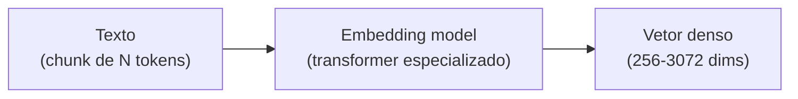

# Embeddings — representação semântica

> [!abstract] TL;DR
> **Embedding** é a representação vetorial de texto (ou outro dado) como array de números, tipicamente 256-3072 dimensões. Textos com significado similar ficam próximos nesse espaço. Modelos modernos (OpenAI text-embedding-3, Voyage 3, Cohere Embed v4) têm propriedades específicas: matryoshka (truncar dimensões preserva qualidade), domain-specific (legal, código), multilingue. Custo é baixo: $0.02-$0.13/M tokens. **A escolha do modelo de embedding é decisão arquitetural** — você fica casado com ele para o lifecycle do índice.

## A intuição

```
"rei"     → [0.12, -0.88, 0.34, ..., 0.21]   ┐
"rainha"  → [0.15, -0.85, 0.39, ..., 0.19]   │  perto (semanticamente similar)
"mesa"    → [-0.77, 0.23, 0.12, ..., 0.64]   ┘  longe
```

Tokens com significado parecido ficam próximos no espaço vetorial. Distância tipicamente medida com **cosine similarity**.

## Como funciona



Embedding model é tipicamente um **transformer encoder-only** (BERT-style) treinado para que textos similares produzam vetores próximos. Diferente do LLM (decoder-only) que gera texto.

## Modelos populares (2026)

| Modelo | Provider | Dims | Custo / M tokens | Forte em |
|---|---|---|---|---|
| **text-embedding-3-small** | OpenAI | 256-1536 | $0.02 | Default barato |
| **text-embedding-3-large** | OpenAI | 1024-3072 | $0.13 | Default qualidade |
| **voyage-3-large** | Voyage AI | 1024-2048 | $0.18 | Alta qualidade |
| **voyage-code-3** | Voyage AI | 1024 | $0.18 | Código (specialized) |
| **embed-english-v4** | Cohere | 1024 | $0.10 | English-only, multimodal |
| **embed-multilingual-v4** | Cohere | 1024 | $0.10 | 100+ idiomas |
| **bge-large-en-v1.5** | BAAI | 1024 | self-hosted | Open source forte |
| **e5-mistral-7b** | Microsoft | 4096 | self-hosted | LLM-as-embedder |

> [!tip] Default sensato em 2026
> - **Inglês geral:** OpenAI text-embedding-3-large (default), Voyage 3 (qualidade premium)
> - **Multilingue (incluindo PT-BR):** Cohere multilingual-v4
> - **Código:** Voyage code-3
> - **Self-hosted:** BGE-large ou e5-mistral

## Propriedades importantes

### Matryoshka (dimensões aninhadas)

Modelos modernos (OpenAI v3, Voyage 3) treinados para que **truncar as primeiras K dimensões preserve qualidade**. Permite trade-off custo/qualidade:

```python
# Mesma embedding, diferentes truncamentos
emb_full = openai.embeddings.create(model="text-embedding-3-large", input=text).data[0].embedding
# Truncar para 256 dims:
emb_256 = emb_full[:256]
# normalize após truncar
```

Vantagem: indexar uma vez, usar em diferentes níveis de qualidade.

### Anisotropia

Espaços de embedding têm uma **direção quente** onde todos os vetores concentram. Isso distorce similaridade. Mitigação: **whitening** (centrar e normalizar) em alguns pipelines.

### Linear structure

Operações como `king - man + woman ≈ queen` funcionam (parcialmente) em modelos bem treinados. Base de "word analogies".

### Dense vs sparse

| Tipo | Dimensão | Característica |
|---|---|---|
| **Dense** | 256-4000 | Maioria dos valores não-zero |
| **Sparse** | dim do vocabulário (~30K) | Maioria zero, semelhante a TF-IDF |

Sparse (SPLADE, ELSER): bom para keyword exact match. Dense: bom para semântica. **Hybrid usa os dois** (ver [[06 - Retrieval — hybrid search, BM25, query rewriting]]).

## Decisões arquiteturais

### 1. Qual modelo escolher

Critérios:
- **Idioma:** EN-only? Multilingue? Tem PT-BR específico?
- **Domínio:** código, legal, medical?
- **Qualidade vs custo:** premium pequeno ou bom barato em volume?
- **Self-hosted vs API:** compliance ou latência?

### 2. Qual dimensão

| Dim | Custo storage | Qualidade | Latência |
|---|---|---|---|
| 256 | Mínimo | -10% | Rápido |
| 768 | Baixo | -3% | Médio |
| 1024 | Médio | Baseline | Médio |
| 1536+ | Alto | +2-5% | Lento |

Default: 1024-1536. Reduza para 256-768 em escala alta com matryoshka.

### 3. Lock-in

> [!warning] Embedding model é decisão de longo prazo
> Mudar de modelo = re-indexar **toda** a base. Custo:
> - Re-embed milhões de chunks
> - Validação rigorosa (golden set rodando)
> - Migração com zero downtime
>
> Escolha pensando em 1-2 anos.

## Custo típico

```
1M chunks × 500 tokens/chunk × 1 indexing = 500M tokens
500M × $0.13/M (text-embedding-3-large) = $65 indexing one-time

1000 queries/dia × 100 tokens/query × 30 dias = 3M tokens/mês
3M × $0.13/M = $0.39/mês query
```

Embedding é **barato**. Não é onde o custo do RAG vive.

## Embeddings multimodais

Modelos que embedam **texto + imagem** no mesmo espaço:

| Modelo | Provider |
|---|---|
| **embed-english-v4** (multimodal) | Cohere |
| **CLIP** | OpenAI (open source) |
| **Voyage Multimodal-3** | Voyage |

Use case: busca visual ("encontre páginas com diagramas similares").

## Métricas

| Métrica | Alvo |
|---|---|
| **Latência embedding** (1 chunk) | <50ms |
| **Throughput batch** | >1000/s |
| **Cosine similarity em pares relevantes** | >0.7 |
| **Cost embeddings / total RAG cost** | <10% |

## Anti-patterns

- **Trocar modelo sem re-indexar** — embeddings ficam incompatíveis silenciosamente
- **Embedding query com modelo diferente do indexing** — busca quebrada
- **Embedding texto não-normalizado** (HTML cru, JSON) — qualidade ruim
- **Embedding chunks gigantes** — atenção do encoder dilui
- **Single dimension fits all** — domínios diferentes podem precisar de modelos diferentes

## Veja também

- [[02 - Anatomia do pipeline RAG]]
- [[04 - Chunking — onde 50% da qualidade vive]]
- [[05 - Vector databases — pgvector, Pinecone, Qdrant]]
- [[06 - Retrieval — hybrid search, BM25, query rewriting]]

## Referências

- **OpenAI** — *Embeddings documentation* (2026)
- **Voyage AI** — *voyageai.com/docs* (2026)
- **Cohere** — *Embed v4 documentation* (2026)
- **MTEB Leaderboard** — *Massive Text Embedding Benchmark* (HuggingFace)
- **Karpukhin et al.** — *Dense Passage Retrieval* (paper original DPR, 2020)
