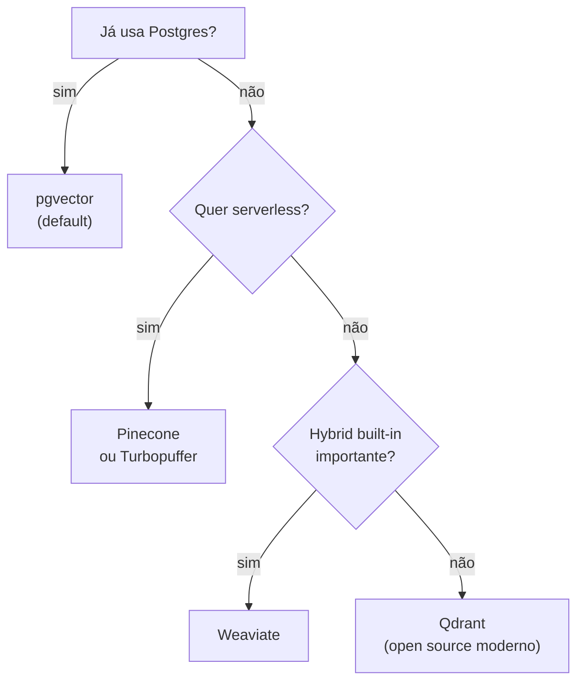

# Vector databases — pgvector, Pinecone, Qdrant

> [!abstract] TL;DR
> Vector DB armazena `(chunk_text, embedding, metadata)` e responde queries de similaridade rapidamente. Em 2026, ele é **commodity** — onde a qualidade do RAG vive é em chunking, retrieval, reranking. **Default sensato:** pgvector se já usa Postgres (o que abrange a maioria); Pinecone para serverless; Qdrant para self-hosted moderno; Weaviate para hybrid built-in. Custo: $0-200/mês para a maioria das aplicações. Performance é raramente o gargalo — com índice HNSW, query <100ms é trivial até 10M vetores.

## O que vector DB faz

```sql
-- Pseudo-SQL
SELECT chunk, metadata
FROM chunks
ORDER BY embedding <=> query_embedding   -- cosine distance
LIMIT 50;
```

3 operações essenciais:
1. **Insert** vetor com metadata
2. **Query** k-NN por similaridade (cosine, dot product, L2)
3. **Filter** por metadata (`WHERE date > X AND lang = 'pt'`)

## As principais opções (2026)

| DB | Tipo | Hosting | Forte em |
|---|---|---|---|
| **pgvector** | Extension Postgres | Self / RDS / Supabase | Já usa Postgres, transações |
| **Pinecone** | SaaS proprietary | Serverless | Escala sem operação |
| **Qdrant** | Open source dedicated | Self / Qdrant Cloud | Performance, filters |
| **Weaviate** | Open source | Self / Weaviate Cloud | Hybrid search nativo |
| **Milvus** | Open source | Self / Zilliz Cloud | Escala bilhões de vetores |
| **ChromaDB** | Open source dev-friendly | Self / embedded | Prototipos, simplicidade |
| **Redis Vector** | Extension Redis | Self / Redis Cloud | Já usa Redis |
| **Elasticsearch** | Search engine | Self / Elastic Cloud | Já usa ES, hybrid |
| **Vespa** | Open source enterprise | Self / Vespa Cloud | Yahoo-scale, hybrid |
| **Turbopuffer** | Serverless newcomer | Cloud only | Cost/performance ratio |

## pgvector — o default em 2026

> [!tip] pgvector ganhou em 2024-2025
> Razão: **a maioria já tem Postgres**. Adicionar vector capability como extension é trivial. Transações ACID, joins, filtros relacionais — tudo de graça.

```sql
-- Setup
CREATE EXTENSION vector;

CREATE TABLE chunks (
    id BIGSERIAL PRIMARY KEY,
    text TEXT,
    embedding VECTOR(1536),
    metadata JSONB,
    doc_id BIGINT REFERENCES documents(id),
    created_at TIMESTAMPTZ
);

-- Index HNSW (rápido, aproximado)
CREATE INDEX ON chunks USING hnsw (embedding vector_cosine_ops);

-- Query com filter
SELECT text, metadata
FROM chunks
WHERE doc_id IN (1,2,3) AND created_at > '2026-01-01'
ORDER BY embedding <=> $1
LIMIT 50;
```

**Vantagens:**
- Filtros relacionais robustos (`WHERE complex AND ...`)
- Transações
- Joins com tabelas existentes
- Backup/restore familiar
- Free no Postgres existing

**Limitações:**
- Performance cai >10M vetores (caso raro)
- Sem features fancy (multi-tenancy, gestão de índices automática)

## Pinecone — para serverless

```python
from pinecone import Pinecone

pc = Pinecone(api_key="...")
index = pc.Index("rag-prod")

# Insert
index.upsert([
    ("chunk_1", embedding, {"doc_id": 1, "text": "..."}),
])

# Query
results = index.query(
    vector=query_embedding,
    top_k=50,
    filter={"doc_date": {"$gt": "2026-01-01"}}
)
```

**Vantagens:**
- Zero operação
- Escala transparente (bilhões de vetores)
- Multi-tenancy nativo
- Pricing serverless (paga pelo uso)

**Limitações:**
- Lock-in
- Custo cresce com escala
- Sem joins relacionais
- Latência cross-region

## Qdrant — open source moderno

```python
from qdrant_client import QdrantClient
client = QdrantClient(url="http://localhost:6333")

client.upsert(
    collection_name="rag",
    points=[{
        "id": 1,
        "vector": embedding,
        "payload": {"doc_id": 1, "text": "..."}
    }]
)

results = client.search(
    collection_name="rag",
    query_vector=query_embedding,
    limit=50,
    query_filter={
        "must": [{"key": "doc_date", "range": {"gt": "2026-01-01"}}]
    }
)
```

**Vantagens:**
- Performance excelente
- Filters poderosos
- Open source maduro
- Pode rodar embedded ou distribuído

**Limitações:**
- Operação adicional (não usa Postgres existing)
- Backup/restore separado

## Weaviate — hybrid built-in

Forte em **hybrid search nativo** (vector + BM25 sem precisar configurar).

```python
client.query.get("Chunk", ["text"]).with_hybrid(
    query="user question",
    alpha=0.5  # 0=BM25, 1=vector
).do()
```

Vantagem: hybrid out-of-the-box, sem stack adicional.

## Heurística de escolha



## Index types

| Index | Trade-off |
|---|---|
| **HNSW** | Padrão moderno: fast query, mais memória |
| **IVF** | Menos memória, query mais lenta |
| **Flat** | Exato (brute force), pequena escala |
| **PQ / SQ** | Quantization para reduzir memória |

Default: **HNSW** com parâmetros padrão. Tune apenas se houver problema concreto.

## Performance típica

| Escala | Latência query | DB |
|---|---|---|
| 100K vetores | <30ms | Qualquer |
| 1M vetores | <100ms | pgvector com HNSW |
| 10M vetores | <200ms | Qdrant, Pinecone |
| 100M+ vetores | <500ms | Pinecone serverless, Milvus |

## Custo típico (1M chunks, 1M queries/mês)

| DB | Hosting | Custo/mês |
|---|---|---|
| **pgvector (Supabase)** | Managed Postgres | $25-100 |
| **pgvector (RDS)** | AWS RDS | $50-200 |
| **Pinecone serverless** | SaaS | $50-300 |
| **Qdrant Cloud** | SaaS | $50-200 |
| **Weaviate Cloud** | SaaS | $50-300 |
| **Self-hosted Qdrant** | EC2/GCE | $30-100 + ops |

## Anti-patterns

- **Vector DB sem metadata indexada** — não consegue filtrar com performance
- **Index sem HNSW** — query lenta sem necessidade
- **Trocar de DB sem re-indexar** — formato de embedding pode mudar
- **Pinecone para 10K vetores** — overengineered, pgvector basta
- **pgvector para 100M vetores em uma tabela** — split por shard ou troque
- **Sem backup do DB** — re-indexar 1M chunks custa horas e $$$

## Métricas

| Métrica | Alvo |
|---|---|
| **Latência p95 (search)** | <100ms |
| **Throughput insert** | >1000/s |
| **Recall@10** | >95% (vs brute force) |
| **Storage por vetor (1536 dims)** | ~6KB |

## Veja também

- [[02 - Anatomia do pipeline RAG]]
- [[03 - Embeddings — representação semântica]]
- [[06 - Retrieval — hybrid search, BM25, query rewriting]]
- [[Memória de Agentes|14 - Mem0 — vetorial + grafo]]
- [[Memória de Agentes|15 - Zep e Graphiti — knowledge graph temporal]]

## Referências

- **pgvector** — *github.com/pgvector/pgvector*
- **Pinecone** — *pinecone.io/docs* (2026)
- **Qdrant** — *qdrant.tech/documentation* (2026)
- **Weaviate** — *weaviate.io/developers* (2026)
- **MTEB Benchmark** — vetor DB comparison
- **ann-benchmarks.com** — performance comparativo
