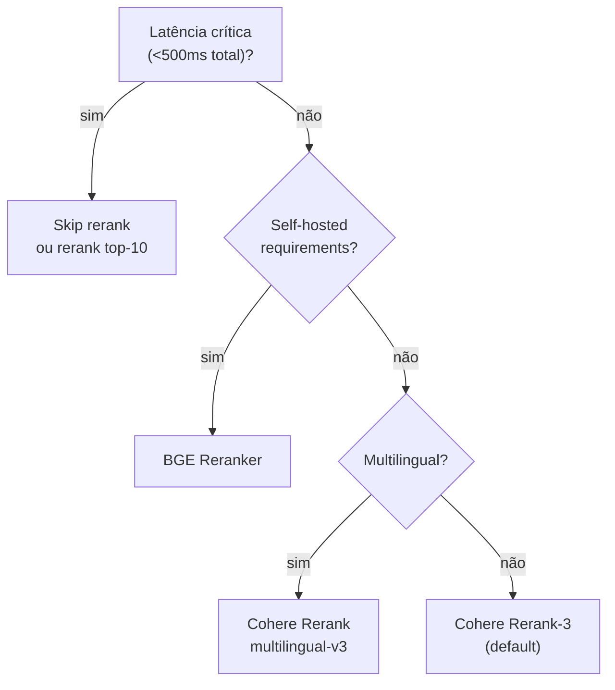

# Reranking — Cohere, Voyage, cross-encoders

> [!abstract] TL;DR
> Reranker é um modelo que **refina o ranking** dos top-N do retrieve. Diferente de embeddings (bi-encoders, embedam query e doc separadamente), rerankers são **cross-encoders** — analisam query+doc juntos, com atenção total entre eles. Resultado: ranking muito mais preciso, ao custo de latência (cada par requer 1 forward pass). Padrão: retrieve top-50, rerank → top-5. Modelos: Cohere Rerank (default), Voyage Rerank, BGE Reranker (open source). **Skip rerank = ruído no prompt.**

## Por que rerankers existem

Embeddings (bi-encoders):

```
Query  → encoder → vector_q
Doc    → encoder → vector_d
score = cosine(vector_q, vector_d)
```

Rápido, mas **encoders nunca se conhecem**. Vetores otimizados para approximate similarity, não relevância profunda.

Rerankers (cross-encoders):

```
[Query] [SEP] [Doc] → encoder → score
```

Query e doc **passam juntos** pelo encoder. Atenção total entre eles. Resultado: muito mais preciso, mas O(N) — precisa rodar uma vez por par.

## Trade-off explícito

| | Bi-encoder (embedding) | Cross-encoder (reranker) |
|---|---|---|
| **Latência por doc** | 0ms (pré-computado) | 50-200ms |
| **Precisão** | Boa | Excelente |
| **Escalabilidade** | Bilhões | Milhares |
| **Uso** | Top-50 do corpus | Top-5 do top-50 |

Pipeline ideal: bi-encoder filtra de 1M para 50; cross-encoder refina de 50 para 5.

## Modelos populares (2026)

| Reranker | Provider | Latência | Forte em |
|---|---|---|---|
| **Cohere Rerank 3** | Cohere API | 100-300ms | Default, multilingual |
| **Voyage Rerank-2** | Voyage AI | 100-300ms | Premium quality |
| **BGE Reranker v2-m3** | BAAI (open) | self-hosted | Open source forte |
| **Jina Reranker v2** | Jina AI | 100-300ms | Multilingual, multimodal |
| **MS MARCO** | Microsoft (open) | self-hosted | Baseline open source |

Default sensato em 2026: **Cohere Rerank** (API simples, qualidade alta) ou **BGE-Reranker-v2-m3** (self-hosted).

## Como usar — Cohere

```python
import cohere

co = cohere.Client(api_key="...")

response = co.rerank(
    model="rerank-3",
    query="user question",
    documents=[
        "doc 1 text...",
        "doc 2 text...",
        # ... up to 1000 docs
    ],
    top_n=5
)

# response.results: [{index: 2, relevance_score: 0.94}, ...]
final_docs = [docs[r.index] for r in response.results]
```

Custo: $1 / 1000 chamadas (1 chamada = 1 query + N docs). 100 docs por query: $1 / 100K queries. Barato.

## Como usar — BGE (self-hosted)

```python
from FlagEmbedding import FlagReranker

reranker = FlagReranker('BAAI/bge-reranker-v2-m3')

pairs = [(query, doc) for doc in candidates]
scores = reranker.compute_score(pairs)
ranked = sorted(zip(candidates, scores), key=lambda x: -x[1])[:5]
```

Custo: free (GPU), latência depende do hardware.

## Quando usar cada



## O ganho real

> [!example] Anthropic Contextual Retrieval (2024)
> Hybrid search (BM25 + vector) sozinho: 5.7% failed retrievals
> Hybrid + Reranker: 1.9% failed retrievals
> **Redução de 67%** apenas adicionando reranker.

Esse é o efeito típico em produção. Skip rerank = deixar dinheiro na mesa.

## Latência considerações

```
Top-50 docs × 200ms / doc = ~10s    ❌ inviável

Solução: batch
Top-50 docs em 1 batch call = 200-400ms total ✅
```

APIs (Cohere, Voyage) batcham automaticamente. Self-hosted: configure batch size.

## Filtragem antes de rerank

Para reduzir custo e latência, filtre **antes** do rerank:

```python
# 1. Hybrid retrieval — top-50
candidates = hybrid_retrieve(query, k=50)

# 2. Filter por relevance_score baixo (sinais óbvios de irrelevância)
filtered = [c for c in candidates if c.score > MIN_THRESHOLD]

# 3. Rerank apenas o que passou
top5 = rerank(query, filtered, top_n=5)
```

## Validação de threshold

Default: aceita top-N do reranker, sem threshold. Mas em produção:

```python
top5 = rerank(query, candidates, top_n=5)

# Se nem o top-1 tem boa relevância, devolve "não sei"
if top5[0].relevance_score < 0.6:
    return "Não encontrei informação relevante para sua pergunta."
```

Threshold típico: 0.5-0.7 (dependente do modelo).

## Reranker para multimodal

Modelos multimodais (Cohere Embed v4, Jina Reranker multimodal) ranqueiam pares **texto + imagem**. Útil em busca visual ou docs com diagramas.

## Métricas

| Métrica | Alvo |
|---|---|
| **NDCG@10** (após rerank) | >0.7 |
| **Precision@5** | >70% |
| **Latência rerank** | <500ms |
| **Cost rerank / total RAG** | <20% |
| **Threshold de "não sei"** | top-1 score <0.6 |

## Anti-patterns

- **Skip rerank em produção** — Anthropic mostrou 67% redução de failed retrievals
- **Rerank top-1000** — caro sem ganho marginal vs top-50
- **Sem threshold de relevância** — força resposta mesmo sem info
- **Rerankear sem hybrid retrieve** — top-50 vector ruim → rerank salva pouco
- **Reranker diferente do dataset de treino** — domain mismatch
- **Não validar reranker em golden set** — assume que qualquer reranker é melhor

## Veja também

- [[02 - Anatomia do pipeline RAG]]
- [[06 - Retrieval — hybrid search, BM25, query rewriting]]
- [[09 - Evaluation de RAG]]
- [[Anatomia dos LLMs|03 - A janela de contexto]]

## Referências

- **Anthropic** — *Contextual Retrieval* (2024)
- **Cohere** — *Rerank documentation* (2026)
- **Voyage AI** — *Reranker docs* (2026)
- **BGE** — *github.com/FlagOpen/FlagEmbedding* (2026)
- **Nogueira & Cho** — *Passage Re-ranking with BERT* (paper original cross-encoder, 2019)
