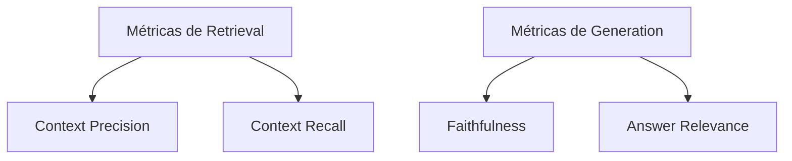

# Evaluation de RAG

> [!abstract] TL;DR
> RAG sem evaluation é aposta. Métricas fundamentais: **context precision** (chunks recuperados são relevantes?), **context recall** (chunks relevantes foram recuperados?), **faithfulness** (resposta é fiel ao contexto?), **answer relevance** (resposta atende à pergunta?). **Crucial:** medir retrieval **separado** de generation. Se retrieval falha, generation não salva. Tools: Ragas (mais popular), TruLens, DeepEval. Golden set de 30-100 perguntas com gabarito é o mínimo.

## A regra fundamental

> *"Mede retrieval separado de generation. Senão você não sabe onde está o problema."*

Resposta ruim em RAG tem **5 causas possíveis**:

1. Chunk relevante **não existe** no corpus (parse/chunk ruim)
2. Chunk relevante existe mas **não foi recuperado** (retrieval ruim)
3. Chunk recuperado mas **rerank baixou** (rerank ruim)
4. Chunks corretos mas **prompt não usou** (generation ruim)
5. Generation **complementou com knowledge** (faithfulness ruim)

Métricas separadas detectam cada causa.

## As 4 métricas canônicas (Ragas)



### 1. Context precision

*"Os chunks recuperados são relevantes?"*

```
context_precision = relevant_chunks_retrieved / total_chunks_retrieved
```

Mede se o retrieval **trouxe lixo junto**. Top-5 com 5 relevantes = 1.0. Top-5 com 2 relevantes = 0.4.

### 2. Context recall

*"Os chunks relevantes foram recuperados?"*

```
context_recall = relevant_chunks_retrieved / total_relevant_chunks_in_corpus
```

Mede se o retrieval **deixou info importante de fora**. Requer golden set com chunks esperados.

### 3. Faithfulness

*"A resposta é fiel ao contexto (não inventou)?"*

LLM-as-judge:

```
Para cada afirmação na resposta, verifique se ela é
suportada pelos chunks fornecidos. Output: 0-1.
```

Score abaixo de 0.9 = LLM está complementando com conhecimento próprio.

### 4. Answer relevance

*"A resposta atende à pergunta?"*

LLM-as-judge: pergunta original vs resposta. Mede se a resposta é **on-topic**, não se é correta.

## Outras métricas úteis

### Citation accuracy

```
% de citações onde [N] aponta para chunk que realmente contém a info
```

Critical em compliance. Implementação: parse `[N]` em resposta, verificar contra chunk[N].

### Latency p95

```
% queries respondidas em <Xs
```

Operacional. RAG bom mas lento perde para "joga tudo no contexto".

### Cost per query

```
$ por (retrieve + rerank + generate)
```

Muda decisões — Cohere Rerank é grátis comparado a query Opus.

## Golden set

A base de toda evaluation. 30-100 entradas:

```yaml
- id: q_001
  question: "Como configurar autenticação no FastAPI?"
  expected_answer: "Use Depends() com OAuth2..."
  expected_chunks: ["doc-12-section-3", "doc-12-section-4"]
  category: "tutorial"

- id: q_002
  question: "FastAPI é melhor que Django?"
  expected_answer: "[NÃO RESPONDER — não está no escopo]"
  category: "out_of_scope"
```

Categorias úteis:

- **Factual** — resposta direta no corpus
- **Multi-hop** — precisa juntar 2+ chunks
- **Out of scope** — corpus não cobre, deve responder "não sei"
- **Adversarial** — prompt injection, queries enganadoras

## Tools — Ragas

```python
from ragas import evaluate
from ragas.metrics import (
    context_precision,
    context_recall,
    faithfulness,
    answer_relevancy
)
from datasets import Dataset

dataset = Dataset.from_dict({
    "question": ["..."],
    "answer": ["..."],
    "contexts": [["..."]],
    "ground_truths": [["..."]],
})

result = evaluate(
    dataset,
    metrics=[context_precision, context_recall, faithfulness, answer_relevancy]
)
print(result)
# {"context_precision": 0.85, "faithfulness": 0.92, ...}
```

Ragas usa LLM-as-judge internamente. Custo: $0.05-0.20/exemplo (depende do modelo).

## Tools alternativas

| Tool | Forte em |
|---|---|
| **Ragas** | Mais popular, métricas canônicas |
| **TruLens** | Tracing + eval integrados |
| **DeepEval** | Pytest-style, fácil em CI |
| **Phoenix (Arize)** | Tracing visual + eval |
| **Langfuse** | Observabilidade + eval em prod |

## Pipeline de eval em CI

```yaml
# .github/workflows/rag-eval.yml
name: RAG Evaluation

on:
  pull_request:
    paths: ["src/rag/**", "prompts/**"]

jobs:
  eval:
    runs-on: ubuntu-latest
    steps:
      - uses: actions/checkout@v4
      - run: |
          python -m rag_eval --golden-set tests/golden_set.yaml                              --threshold-context-precision 0.7                              --threshold-faithfulness 0.85                              --report eval_report.md
      - run: |
          # Bloqueia merge se métricas caírem
          python -c "import json; r = json.load(open('eval_results.json'));                      assert r['context_precision'] >= 0.7"
```

Roda a cada PR de RAG. Bloqueia regressão.

## A/B test em produção

Eval automatizado mostra: nova versão é **5% melhor** em context_precision. Significa nada para usuário.

```python
# A/B em prod
def get_response(query, user_id):
    variant = ab_assign(user_id, "rag_v3_test", split=0.5)

    if variant == "control":
        rag = RAG_V2
    else:
        rag = RAG_V3

    response = rag.answer(query)
    log_event("rag_response", {
        "user_id": user_id,
        "variant": variant,
        "feedback": None  # preencher depois com thumbs up/down
    })
    return response
```

Métricas de negócio (resolution rate, NPS) > métricas técnicas.

## Maturidade

> [!example] Diagnóstico
>
> | Nível | Sinal |
> |---|---|
> | **0** | "Funcionou nos meus testes manuais" |
> | **1** | Golden set ad-hoc em planilha |
> | **2** | Ragas rodando em script local |
> | **3** | Eval em CI bloqueando merge |
> | **4** | Eval em CI + observabilidade prod (Langfuse) |
> | **5** | A/B test em prod com métricas de negócio |

Maioria está em 0-1. Meta para 2026: nível 3.

## Anti-patterns

- **Eval só de generation** — não detecta retrieval ruim
- **Golden set de 5 exemplos** — não representativo
- **Rodar eval só "no final"** — descobre regressão tarde
- **Métricas técnicas sem A/B** — pode estar otimizando o errado
- **Sem categoria "out of scope"** — não sabe se RAG diz "não sei" apropriadamente
- **Reusar prompts gold em treino** — circular reasoning

## Métricas-alvo

| Métrica | Alvo (produção) |
|---|---|
| **Context precision** | >0.7 |
| **Context recall** | >0.8 |
| **Faithfulness** | >0.9 |
| **Answer relevance** | >0.85 |
| **Citation accuracy** | >0.95 |
| **% "não sei" apropriado** | >70% das out-of-scope |
| **Latência p95** | <3s |

## Veja também

- [[02 - Anatomia do pipeline RAG]]
- [[06 - Retrieval — hybrid search, BM25, query rewriting]]
- [[07 - Reranking — Cohere, Voyage, cross-encoders]]
- [[08 - Generation — passar contexto ao LLM com citação]]
- [[Anatomia dos LLMs|17 - Evaluation de LLMs em produção]]
- [[Spec-Driven Development|07 - Fase Validate — spec como contrato executável]]

## Referências

- **Ragas** — *docs.ragas.io* (2026)
- **TruLens** — *trulens.org* (2026)
- **DeepEval** — *deepeval.com* (2026)
- **Es et al.** — *RAGAS: Automated Evaluation of Retrieval Augmented Generation* (paper, 2023)
- **Eugene Yan** — *Evaluation patterns* (2024)
