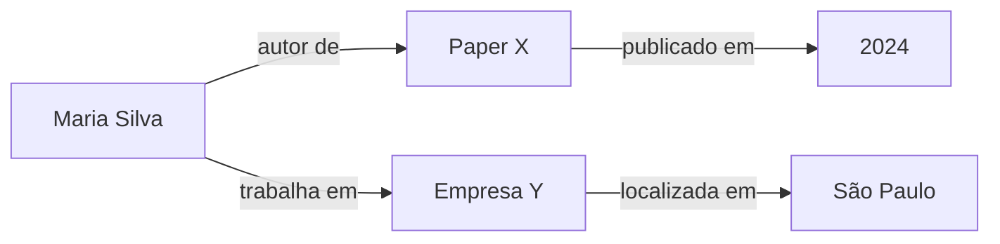
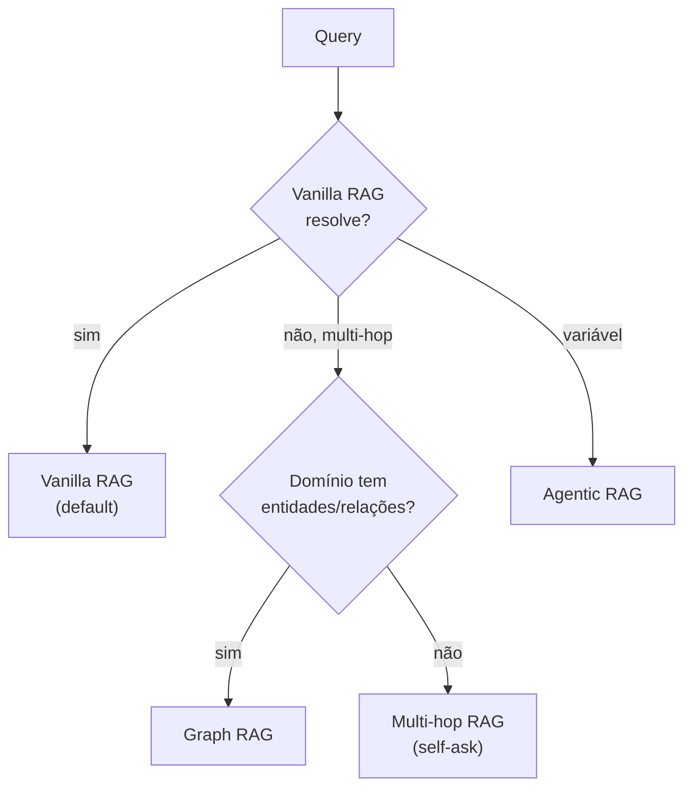

# Padrões avançados — Graph RAG, Agentic RAG, multi-hop

> [!abstract] TL;DR
> RAG vanilla resolve ~80% dos casos. Para os 20% restantes, padrões avançados: **Multi-hop RAG** (resposta requer juntar 2+ chunks via passos sequenciais), **Graph RAG** (Microsoft, indexa entidades e relações em knowledge graph para queries complexas), **Agentic RAG** (agent decide iterativamente quando/o que buscar). **Custo cresce significativamente** — só use quando RAG simples falha. Default: tente Hybrid + Rerank antes de partir para complexidade.

## Quando RAG vanilla falha

Sintomas que indicam padrão avançado:

- Pergunta requer juntar **2+ chunks de docs diferentes** (multi-hop)
- Pergunta sobre **relacionamentos** ("quais empresas são fornecedoras de X que estão na Europa?")
- Pergunta exige **exploração** ("encontre todos os pacientes com sintoma Y após 2024")
- Single retrieval **não cobre** mesmo com hybrid+rerank

## Multi-hop RAG

Pergunta que requer **N retrievals sequenciais**, onde cada retrieval usa info do anterior.

```
Q: "Em qual empresa trabalha o autor do paper X de 2024?"

Hop 1: encontre paper X de 2024 → "autor: Maria Silva"
Hop 2: encontre info sobre "Maria Silva" → "trabalha em Empresa Y"
A: "Empresa Y"
```

Vanilla RAG falha porque:
- Top-k do "paper X" tem o autor, mas não a empresa
- Top-k do "Maria Silva" pode não estar relacionado se a query inicial é sobre paper

### Implementação

**Padrão decomposition:**

```python
def multi_hop_rag(question):
    # 1. Decompor em sub-questions
    sub_qs = llm.decompose(question)
    # ["Quem é autor do paper X?", "Onde trabalha esse autor?"]

    answers = []
    for sub_q in sub_qs:
        # 2. RAG normal em cada sub-question
        chunks = retrieve(sub_q)
        answer = generate(sub_q, chunks)
        answers.append(answer)

        # 3. Próxima sub-question pode usar answer anterior
        sub_q_next = llm.refine(sub_q_next, previous_answer=answer)

    # 4. Sintetizar
    return llm.synthesize(question, answers)
```

**Padrão self-ask (mais elegante):**

```
Q: Em qual empresa trabalha autor do paper X?
Self-ask: Quem é o autor do paper X?
[retrieve...]
Self-answer: Maria Silva.
Self-ask: Onde trabalha Maria Silva?
[retrieve...]
Self-answer: Empresa Y.
Final: Empresa Y.
```

### Custo

3-5x query single. Latência multiplicada. Use só quando necessário.

## Graph RAG (Microsoft GraphRAG)

Em vez de chunks soltos, **knowledge graph** de entidades e relações.



### Como funciona

**Indexing:**
1. Parse docs e extrai entidades (NER + LLM)
2. Extrai relações entre entidades
3. Constrói grafo
4. Cluster por communities (Leiden algorithm)
5. Sumariza cada community

**Query:**
1. Pergunta → identifica entidades mencionadas
2. Localiza no grafo
3. Expande N hops a partir das entidades
4. Recupera community summaries relevantes
5. Genera resposta

### Quando usar Graph RAG

✅ Domínio com entidades e relações claras (legal, medical, scientific, business intelligence)
✅ Queries comparativas ou agregativas
✅ Dataset ≥1000 documentos com riqueza relacional

❌ Texto livre sem entidades (literatura, opiniões)
❌ Dataset pequeno (overhead não compensa)
❌ Time sem expertise em knowledge graphs

### Tools

- **Microsoft GraphRAG** — implementação oficial open source
- **Neo4j + LLM** — knowledge graph clássico
- **LlamaIndex KnowledgeGraphIndex** — building block
- **Graphiti (Zep)** — temporal knowledge graph

## Agentic RAG

Agent decide **quando** e **o quê** buscar — em vez de pipeline fixo.

```python
# Pipeline fixo (vanilla)
chunks = retrieve(query)
answer = generate(query, chunks)

# Agentic
agent = Agent(tools=[search, expand_search, read_doc])
answer = agent.run(query, max_steps=10)
# Agent decide: buscar primeiro? expandir? ler doc específico?
```

### Vantagens

- Adapta a queries de complexidade variável
- Pode "perceber" que precisa buscar mais
- Permite refinamento iterativo
- Multi-hop natural

### Desvantagens

- Custo alto (múltiplos LLM calls)
- Latência alta (não é one-shot)
- Difícil de debugar
- Pode entrar em loops

### Quando usar

✅ Queries variadas (alguns simples, outros complexos)
✅ Resultados podem ser refinados iterativamente
✅ Time tem expertise com agents ([[Anatomia de Agents]])

❌ Queries sempre similares (pipeline fixo é mais barato)
❌ Latência crítica
❌ Compliance exige resposta determinística

Detalhes em [[Context Engineering|06 - Dynamic retrieval beyond RAG]].

## Comparativo de custo

```
Vanilla RAG:        1 retrieval + 1 generation = $0.005
Multi-hop RAG:      3 retrievals + 3 generation = $0.015 (3x)
Graph RAG:          1 retrieval + 1 generation = $0.005 (mas indexing é 5-10x mais caro)
Agentic RAG:        5-10 LLM calls + tools = $0.020-0.050 (4-10x)
```

## Hybrid de patterns

Padrão maduro: **Vanilla RAG + Agentic fallback**.

```python
def smart_rag(query):
    # 1. Tentar vanilla
    chunks = retrieve(query)
    answer = generate(query, chunks)

    # 2. Se confidence baixa, escalar para agentic
    if confidence(answer, chunks) < 0.7:
        answer = agentic_rag(query)

    return answer
```

90% das queries pegam vanilla (rápido, barato). 10% caem em agentic (lento mas resolve).

## Decision tree



## Anti-patterns

- **Graph RAG em corpus pequeno** — overhead enorme sem ganho
- **Agentic RAG sempre** — custo escala assustadoramente
- **Multi-hop sem evaluation** — não sabe se está melhorando
- **"Vamos fazer Graph RAG porque é cool"** — sem evidência de que vanilla falha
- **Hybrid sem confidence threshold** — escala sem critério

## Quando ficar no vanilla

> [!tip] Princípio de simplicidade
> *"Vanilla RAG bem feito (chunking + hybrid + rerank) resolve 80%+ dos casos. Padrões avançados são para os 20% restantes — não para o conjunto inteiro."*
>
> Investir em **chunking estrutural + hybrid retrieval + Cohere Rerank + golden set** é maior ROI que partir direto para Graph RAG.

## Métricas

| Métrica | Vanilla | Multi-hop | Graph RAG | Agentic |
|---|---|---|---|---|
| Cost/query | $0.005 | $0.015 | $0.005 + indexing pesado | $0.02-0.05 |
| Latência p95 | 1-3s | 3-8s | 1-4s | 5-15s |
| Recall em multi-hop | <50% | >80% | >85% | >85% |
| Setup complexity | Baixa | Média | Alta | Alta |

## Veja também

- [[02 - Anatomia do pipeline RAG]]
- [[06 - Retrieval — hybrid search, BM25, query rewriting]]
- [[09 - Evaluation de RAG]]
- [[Anatomia de Agents|01 - O que é um agent]]
- [[Context Engineering|06 - Dynamic retrieval beyond RAG]]
- [[Memória de Agentes|11 - graphify — knowledge graph de raw]]
- [[Memória de Agentes|15 - Zep e Graphiti — knowledge graph temporal]]

## Referências

- **Microsoft** — *GraphRAG* (microsoft.github.io/graphrag, 2024)
- **Edge et al.** — *From Local to Global: A Graph RAG Approach* (paper 2024)
- **Press et al.** — *Self-Ask paper* (2022)
- **LlamaIndex** — *Multi-document agents* (2026)
- **Zep** — *Graphiti documentation* (2026)
