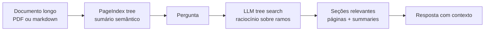

# PageIndex

> [!abstract] TL;DR
> **PageIndex** (`github.com/VectifyAI/PageIndex`) é uma abordagem de **RAG vectorless** para documentos longos: em vez de quebrar o documento em chunks, gerar embeddings e buscar por similaridade, ele constrói uma **árvore hierárquica tipo table of contents** e usa o LLM para navegar essa árvore por raciocínio. A tese é simples e forte: similaridade semântica não é o mesmo que relevância; em documentos profissionais longos, a seção certa muitas vezes é encontrada por estrutura, contexto e inferência multi-step. PageIndex encaixa como padrão avançado de retrieval, especialmente para PDFs financeiros, jurídicos, regulatórios, manuais técnicos e livros. Não substitui vector DB em todos os casos, nem é memória de agentes por si só; é uma técnica de indexação/retrieval que pode alimentar sistemas como [[Memória de Agentes|11 - OpenKB — wiki compilada com PageIndex]].

## O que é

PageIndex se posiciona como **"Vectorless, Reasoning-based RAG"**. A proposta ataca uma falha conhecida do RAG vetorial: embeddings recuperam trechos parecidos com a query, mas nem sempre recuperam o trecho **relevante** para responder. Em documentos profissionais longos, a resposta pode depender de navegação estrutural: primeiro entender o capítulo, depois a subseção, depois a página específica. Esse caminho se parece menos com similarity search e mais com um especialista folheando um documento pelo sumário.

O pipeline básico tem duas fases:

1. **Gerar uma árvore do documento.** A árvore parece um sumário enriquecido: cada nó tem título, intervalo de páginas ou índices, resumo e filhos.
2. **Fazer retrieval por tree search.** O LLM lê a pergunta, raciocina sobre quais ramos da árvore são promissores e navega até as seções relevantes.

A consequência é uma forma de RAG que troca **chunking + vector DB** por **estrutura + raciocínio**. Isso aproxima PageIndex de [[11 - Padrões avançados — Graph RAG, Agentic RAG, multi-hop|Agentic RAG]], mas com uma diferença: o espaço de busca não é uma lista flat de chunks ou um grafo de entidades; é a hierarquia interna do documento.

## Por que importa

- **Ataca o ponto fraco de documentos longos.** PDFs financeiros, contratos, manuais e textbooks têm estrutura. Chunking arbitrário destrói parte dessa estrutura; PageIndex tenta preservá-la.
- **Faz retrieval por relevância, não só por similaridade.** A pergunta pode não compartilhar vocabulário com a resposta; a árvore dá ao LLM uma superfície para raciocinar sobre onde procurar.
- **Reduz dependência de vector DB.** Para alguns casos, especialmente corpus pequeno/médio de documentos longos, operar uma árvore por documento é mais simples que embeddings + índice HNSW + rerank.
- **Melhora explicabilidade.** A resposta pode apontar caminho estrutural: documento → seção → subseção → página. Isso é mais auditável que "o chunk top-5 por cosine veio daqui".
- **É peça técnica do OpenKB.** [[Memória de Agentes|11 - OpenKB — wiki compilada com PageIndex]] usa PageIndex para lidar com documentos longos antes de compilar a wiki.

## Como funciona

Um nó típico da árvore contém:

- `title` — título da seção;
- `node_id` — identificador estável;
- `start_index` / `end_index` — intervalo coberto;
- `summary` — resumo semântico do nó;
- `nodes` — filhos, quando a seção é subdividida.

Essa representação transforma um documento longo em uma estrutura navegável. Em vez de perguntar "quais chunks são similares à query?", o sistema pergunta "qual ramo da estrutura tem maior chance de conter a resposta, dado o objetivo da pergunta?".

## Comparação com RAG vetorial

| Dimensão | RAG vetorial | PageIndex |
|---|---|---|
| Unidade de indexação | Chunk artificial | Seção/nó estrutural |
| Busca | Similaridade de embeddings | Tree search por LLM |
| Infra | Vector DB + embedding model | Árvore JSON/markdown + LLM |
| Melhor caso | Corpus amplo, queries semânticas variadas | Documento longo com estrutura forte |
| Explicabilidade | Score vetorial e chunk id | Caminho na árvore + páginas/seções |
| Custo principal | Embeddings + storage + rerank | Construção da árvore + calls de raciocínio |
| Falha típica | Similaridade ≠ relevância | Árvore ruim ou navegação cara/lenta |

PageIndex não invalida [[06 - Retrieval — hybrid search, BM25, query rewriting|hybrid search]] nem [[07 - Reranking — Cohere, Voyage, cross-encoders|reranking]]. Ele é uma alternativa para uma classe específica de corpus: documentos longos, estruturados, em que o problema é navegar dentro do documento mais que buscar entre milhões de fragmentos independentes.

## Quando usar / quando não usar

**Quando vale:**

- Documentos longos acima do contexto útil do modelo.
- PDFs profissionais com estrutura real: relatórios financeiros, SEC filings, contratos, normas, manuais, livros técnicos.
- Perguntas que exigem localizar seção específica antes de responder.
- Casos em que citação por página/seção é mais importante que recall amplo.
- Times que querem evitar vector DB para um corpus documental controlado.
- Pipelines como OpenKB, onde retrieval de documento longo é etapa anterior à compilação de uma knowledge base.

**Quando NÃO vale:**

- Corpus enorme de snippets curtos, FAQs, tickets e páginas pequenas. Vector/hybrid search é mais direto.
- Conteúdo sem hierarquia clara, como logs, conversas soltas ou comentários sociais.
- Latência crítica: tree search pode exigir múltiplas chamadas LLM.
- Casos onde o custo de construir árvore por documento não se paga.
- Ambientes que precisam de comportamento determinístico e barato em escala de milhões de queries.
- Quando o problema principal é **memória**: consolidar fatos, resolver contradições, esquecer, aprender preferências. Para isso, ver [[Memória de Agentes]].

## Relação com padrões avançados

PageIndex fica entre três famílias:

- **Agentic RAG.** O LLM decide onde procurar, mas o espaço de ação é restrito à árvore do documento.
- **Hierarchical retrieval.** A busca acontece em níveis: documento → seção → subseção → página.
- **Long-context RAG.** O objetivo é evitar jogar tudo no contexto; a árvore decide o recorte que entra.

Ele não é Graph RAG no sentido clássico, porque não extrai entidades/relações para um knowledge graph. Também não é multi-hop RAG genérico, embora possa fazer perguntas multi-step navegando ramos diferentes do mesmo documento.

## Armadilhas comuns

- **Chamar de "sem RAG".** PageIndex ainda é RAG: recupera contexto externo e injeta no LLM. O que muda é o mecanismo de retrieval.
- **Achar que elimina chunking sem custo.** Ele evita chunking artificial, mas paga com construção de árvore e chamadas LLM.
- **Confiar na árvore como se fosse ground truth.** Se o parser/OCR ou o LLM constroem uma hierarquia ruim, o retrieval navega o mapa errado.
- **Comparar benchmark de finanças com qualquer domínio.** O README cita resultado de 98,7% no FinanceBench via sistema Mafin 2.5; isso é sinal forte para documentos financeiros, não garantia universal.
- **Usar para memória conversacional.** Histórico de chat não tem estrutura de documento. Forçar PageIndex ali é transformar conversa em pseudo-documento, geralmente pior que extração de fatos.

## Veja também

- [[02 - Anatomia do pipeline RAG]] — onde PageIndex substitui chunking/embedding/indexing tradicionais
- [[04 - Chunking — onde 50% da qualidade vive]] — problema que PageIndex tenta evitar em documentos longos
- [[06 - Retrieval — hybrid search, BM25, query rewriting]] — baseline que PageIndex desafia
- [[07 - Reranking — Cohere, Voyage, cross-encoders]] — alternativa complementar para melhorar relevância
- [[10 - RAG vs long context vs fine-tuning]] — quando documento longo deve virar retrieval em vez de contexto bruto
- [[11 - Padrões avançados — Graph RAG, Agentic RAG, multi-hop]] — família onde vectorless/tree RAG se encaixa
- [[Memória de Agentes|11 - OpenKB — wiki compilada com PageIndex]] — uso de PageIndex dentro de knowledge base persistente

## Referências

- Repositório oficial — `https://github.com/VectifyAI/PageIndex` — README verificado em 06/05/2026; MIT; Python; ~28,6k stars; descreve PageIndex como "Document Index for Vectorless, Reasoning-based RAG".
- Documentação oficial — `https://docs.pageindex.ai` — cookbooks, tutorials e exemplos.
- Developer / MCP / API — `https://pageindex.ai` — integração via MCP e API.
- Blog introdutório — *PageIndex: Next-Generation Vectorless, Reasoning-based RAG* (Zhang, Tang e PageIndex Team, setembro de 2025), citado no README.
- FinanceBench — `https://arxiv.org/abs/2311.11944` — benchmark mencionado no README como caso onde Mafin 2.5, sistema baseado em PageIndex, reporta 98,7% de accuracy.
