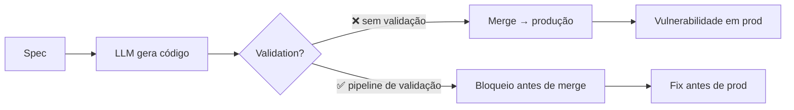

# Código gerado por IA é untrusted

> [!abstract] TL;DR
> A premissa que muda tudo: **código gerado por LLM é untrusted por padrão**. Não é "untrusted como código de junior" — é "untrusted como input externo". Veracode 2025 testou +100 modelos em 4 linguagens: **45% de risco em testes de geração**. Java pior linguagem (72% failure rate). XSS (CWE-80) não defendido em **86%** dos casos. Mais grave: *segurança não melhorou* com modelos maiores ou mais sofisticados — performance ficou flat. Esta é a base de toda Trilha 6: tratar AI code como adversário até prova em contrário.

## A descoberta que define o problema

> [!warning] Veracode 2025 GenAI Code Security Report
> *"AI-generated code introduced risky security flaws in 45% of tests. Across 4 languages and 100+ LLMs. While models got better at writing **functional** code, they were no better at writing **secure** code. Security performance remained flat regardless of model size."*

Tradução: a indústria gastou bilhões treinando modelos maiores. Funcionalidade subiu. **Segurança ficou parada.** Não é problema que mais escala resolve.

## Os números que importam

### Por linguagem

| Linguagem | Failure rate |
|---|---|
| **Java** | 72% (pior) |
| **Python** | 38-45% |
| **C#** | 38-45% |
| **JavaScript** | 38-45% |

Java é dramático. Causa provável: ecossistema com APIs históricas inseguras (deserialization, classloaders) que LLMs reproduzem por estarem nos dados de treino.

### Por classe de vulnerabilidade

| CWE | Vulnerabilidade | Falha em… |
|---|---|---|
| **CWE-80** | Cross-Site Scripting (XSS) | **86%** dos samples |
| **CWE-89** | SQL Injection | ~50% |
| **CWE-918** | SSRF | mais comum em testes 2026 |
| **CWE-502** | Insecure Deserialization | comum em Java |
| **CWE-78** | Command Injection | comum em Python/Node |
| **CWE-22** | Path Traversal | recorrente |
| **CWE-798** | Hardcoded Credentials | crônico |
| **CWE-117** | Log Injection | subestimado |

A "OWASP Top 10" inteira está representada. **Não há classe segura.**

## Por que LLMs falham especificamente em segurança

### 1. Dados de treino contaminados

LLMs aprenderam de código real. Código real público tem vulnerabilidades. O modelo não distingue o seguro do inseguro — reproduz o **plausível**, e plausível inclui inseguro.

### 2. Defaults inseguros são padrões "antigos"

Defaults seguros mudaram em libs modernas (e.g. SQL parameterized vs string concat, escape automático em Jinja). Modelos treinados em código mais antigo escolhem o pattern antigo.

### 3. Falta de contexto adversarial

LLM gera para **happy path**. Não modela o invasor. Sem prompt explícito de threat model, segurança é considerada "nice to have".

### 4. Otimização para parecer correto

LLM otimiza por probabilidade de output ser **plausível** ao usuário comum. "Funcionou no teste manual" tem peso alto; "resiste a `' OR 1=1 --`" tem peso baixo (não é o que aparece nos prompts).

## Mais grave que junior dev

| Junior dev | LLM |
|---|---|
| Aprende com feedback | Aprende com retraining (lento) |
| Pode aplicar heurística "não confio nesse input" | Não tem framework adversarial |
| Pergunta quando não sabe | Inventa (hallucination) |
| Erros são pontuais | Erros são **sistemáticos** (mesmo CWE em milhares de samples) |
| 1 dev → 1 PR/dia | 1 dev × LLM → 50 PRs/dia |

Volume × consistência de erro = explosão de débito de segurança.

## A regra fundamental

> [!danger] Premissa operacional
> **Código gerado por IA tem o mesmo nível de confiança que input de usuário**: zero, até validar.

Consequências:
- Toda saída de LLM atravessa pipeline de validação ([[05 - SAST e SCA para código AI]])
- Nenhum merge sem human review focado em segurança ([[08 - Code review de código AI — o que muda]])
- Sandbox forte para execução de código IA ([[06 - Permissões e sandboxing]])
- Testes de segurança automatizados em CI ([[09 - Testes imutáveis — a barreira que o agente não pode reescrever]])

## O que NÃO funciona

Times que tentaram e falharam:

| Tentativa | Por que falhou |
|---|---|
| "Pedir ao modelo para 'gerar código seguro'" | Modelo concorda, mas continua gerando inseguro |
| "Ler o código antes de mergir" | Vulnerabilidades não são óbvias por inspeção visual |
| "Usar só modelo grande" | Veracode mostra: tamanho não correlaciona com segurança |
| "Treinar o time para revisar AI code" | Volume mata; humano não escala |
| "Promptes muito longos com avisos de segurança" | Atenção do modelo dilui ([[Context Engineering\|03 - Context rot e atenção diluída]]) |

A solução não é uma — é **defesa em profundidade** (Bloco 2 desta trilha).

## A janela de risco

Cada step entre **B e D sem gate** é janela de exposição. SDD ([[Spec-Driven Development]]) reduz; SAST + sandbox + review eliminam.

## Onde a indústria está

> [!info] Status real (mai 2026)
> - 80%+ dos times usam AI code generation diariamente
> - <30% têm pipeline de validação específico para AI code
> - <10% têm métricas de defect escape rate de AI code separadas
>
> A maioria está **gerando rápido sem validar proporcionalmente**. É a definição de débito acumulando juros.

## Veja também

- [[02 - Slopsquatting — o ataque via alucinação]]
- [[03 - Alucinações em código — APIs fantasma e parâmetros inexistentes]]
- [[04 - A pirâmide de validação AI]]
- [[Spec-Driven Development|01 - O problema do vibe coding em produção]]

## Referências

- **Veracode** — *2025 GenAI Code Security Report* (out 2025).
- **Veracode Blog** — *Insights from 2025 GenAI Code Security Report* (2025).
- **BusinessWire** — *AI-Generated Code Poses Major Security Risks in Nearly Half of All Development Tasks* (jul 2025).
- **Help Net Security** — *AI can write your code, but nearly half of it may be insecure* (ago 2025).
- **SoftwareSeni** — *Why 45 Percent of AI Generated Code Contains Security Vulnerabilities* (2025).
