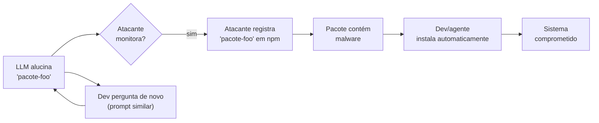

# Slopsquatting — o ataque via alucinação

> [!abstract] TL;DR
> Slopsquatting (termo cunhado por Seth Larson) é um ataque de supply chain que **não existia antes dos LLMs**: atacante observa que um modelo alucina certos nomes de pacote inexistentes, **registra esses nomes** em npm/PyPI/etc, e espera que devs (ou agentes) instalem. Pesquisa USENIX Security mostrou que LLMs são **determinísticos nas alucinações** — GPT-4 sugere o mesmo nome falso para >20% dos prompts similares. Em janeiro de 2026, `react-codeshift` (pacote inexistente) se espalhou por **237 repos GitHub** via skills de agentes que ninguém revisava. Mitigação: sandboxing, lockfile verification, package allowlisting.

## A mecânica do ataque



O ataque explora **determinismo da alucinação**: LLMs alucinam de forma reprodutível. Se você pergunta "como faço X em Python", o modelo sugere o mesmo pacote inventado para você e para outros mil devs.

## A descoberta que mudou o jogo

> [!quote] USENIX Security Symposium (research) — 2024-2025
> *"LLMs são creatures of habit — se GPT-4 sugere um pacote falso para um dev, há alta probabilidade (frequentemente >20%) de sugerir o mesmo pacote falso para outros devs em queries similares."*

Antes: alucinações pareciam **aleatórias**. Pensava-se que cada dev veria nomes inventados diferentes. **Falso.** Os mesmos nomes aparecem repetidamente. Atacantes apenas precisam observar e registrar.

## O caso `react-codeshift` (jan 2026)

> [!example] react-codeshift — caso real
> Janeiro de 2026: pacote `react-codeshift` foi reclamado em npm. Não tinha autor real, não tinha histórico, não tinha funcionalidade. Era um nome **alucinação-por-conflação** — modelo confundiu `react` + `codeshift` (real, mas separado).
>
> Espalhou em 237 repositórios GitHub via **AI-generated agent skills** que ninguém revisou.
>
> Downloads diários de **agentes automatizados** que instalavam sem humano olhar.
>
> Source: Trend Micro, Socket.dev (2026)

## Tipos de slopsquat

| Variante | Mecânica |
|---|---|
| **Hallucination-by-creation** | Modelo inventa nome do nada |
| **Hallucination-by-conflation** | Modelo combina nomes de libs reais (`react-codeshift`, `axios-fetch`) |
| **Hallucination-by-typo** | Modelo aproxima nome real (`pyhton-requests` em vez de `requests`) |
| **Cross-language confusion** | Modelo sugere nome de pacote npm em projeto Python e vice-versa |
| **Outdated reference** | Modelo sugere nome de lib que existiu mas foi descontinuada |

## Por que LLMs alucinam tanto pacote

- **Treinamento misto**: dados de treino incluem repos que mencionam libs antigas, deprecated, ou de domínio adjacente
- **Pattern completion**: modelo prefere completar com "nome plausível" do que admitir ignorância
- **Bundling de libs**: quando pedido para "usar X + Y + Z juntos", modelo inventa nome composto
- **Benchmarks que premiam confiança**: training optimization pode reforçar "responder algo" sobre "dizer não sei"

## Por que ataque escala em 2026

| Fator | Multiplicador |
|---|---|
| **Volume de geração** | LLMs geram milhares de imports/dia |
| **Velocidade de install automático** | Agentes rodam `npm install` sem prompt humano |
| **Tail de pacotes raros** | Atacante pode ocupar 1000s de nomes baratos |
| **Cross-pollination** | AI skills reutilizam lista de deps geradas |
| **Confiança no agente** | Devs aprovam install sem checar registry |

Slopsquat **multiplica** ataques tradicionais de supply chain (typosquatting). Antes: atacante precisava errar com letrinha. Agora: atacante apenas registra alucinações conhecidas.

## Mitigação — Defense in depth

### Layer 1 — Lockfiles + verification

```bash
# Sempre commitar e validar
package-lock.json
yarn.lock
poetry.lock

# CI verifica que install só usa pacotes do lockfile
npm ci  # NÃO npm install
```

`npm ci` falha se package.json discorda do lockfile. **Não permite que agente adicione dep silenciosamente.**

### Layer 2 — Allowlisting de registry

Usar registry interno (Verdaccio, JFrog Artifactory) com política de allowlist. Pacote desconhecido → bloqueado.

```yaml
# Política de exemplo
allowlist:
  - axios
  - react
  - lodash
  # ...

policy:
  unknown_package: BLOCK
  require_human_approval: true
```

### Layer 3 — Sandboxing de install

Rodar `npm install` em sandbox (container, VM, [[06 - Permissões e sandboxing|seatbelt/bubblewrap]]) com network limitada — evita post-install scripts maliciosos atingirem host.

### Layer 4 — Validação de pacote

```bash
# Verificar se package realmente existe e é confiável
npm view <pkg>
# Checar: idade, downloads, autor, fonte
```

Ferramentas: Socket.dev, Snyk Open Source, Endor Labs — fazem essa checagem automaticamente em CI.

### Layer 5 — Extended thinking nos agentes

Agentes modernos (Claude Code, OpenAI Codex CLI, Cursor com MCP) podem **verificar online** que o pacote existe antes de sugerir:

> [!quote] Claude Code CLI documentation
> *"Dynamically interleaves internal reasoning with external tools — live web searches, documentation lookups — to verify package availability as part of its generation pipeline."*

Reduz a alucinação significantemente. **Não elimina.**

## Detecção em projeto existente

```bash
# Listar deps suspeitas
npm ls --json | jq '.dependencies | keys[]' | xargs -I {} npm view {} --json 2>/dev/null

# Para cada dep:
# - Idade < 30 dias? Suspeito
# - Downloads < 100/semana? Suspeito
# - Sem maintainers ativos? Suspeito
# - Ausente de fontes confiáveis? Bloquear
```

Tools: Snyk, Socket.dev, npq (Node), pip-audit (Python).

## Sinais de slopsquat numa codebase

> [!question] Diagnóstico
> - [ ] Pacotes com nomes "compostos" estranhos (`react-tools-extras`)
> - [ ] Deps adicionadas sem PR — direto pelo agente
> - [ ] Lockfile mudou sem mudança de package.json correspondente
> - [ ] Pacote com <100 downloads/semana sendo usado
> - [ ] Pacote sem documentação ou repo
> - [ ] Skills de agente reutilizadas com lista de deps incluída
>
> 2+ marcadas: audit imediato.

## O que fazer se cair

1. **Isolar** — sandbox onde foi instalado, não conectar à rede
2. **Auditar** — `npm audit`, scan com Snyk; checar persistência (cron, services)
3. **Reset de credenciais** — qualquer secret tocado pelo processo
4. **Reportar** — para registry (npm support@npmjs.com, PyPI security@python.org)
5. **Postmortem** — qual gate falhou; reforçar (ver [[12 - O roadmap de segurança para times]])

## Anti-patterns

- **Confiar no `npm install`** — é o vetor primário
- **Aprovar install via prompt do agente sem checar** — humano fadiga e clica yes
- **Sem CI scan de novas deps** — slopsquat passa despercebido por dias
- **Lockfiles sem CI verification** — atacante pode adicionar via PR camuflado
- **Permitir agente em rede aberta** — install + post-install scripts comprometem host

## Veja também

- [[01 - Código gerado por IA é untrusted]]
- [[03 - Alucinações em código — APIs fantasma e parâmetros inexistentes]]
- [[06 - Permissões e sandboxing]]
- [[05 - SAST e SCA para código AI]]

## Referências

- **Trend Micro** — *Slopsquatting: When AI Agents Hallucinate Malicious Packages* (2026).
- **Socket.dev** — *The Rise of Slopsquatting: How AI Hallucinations Are Fueling a New Class of Supply Chain Attacks* (2026).
- **Snyk** — *Package Hallucination: Impacts and Mitigation* (2026).
- **Aikido** — *Slopsquatting: The AI Package Hallucination Attack Already Happening* (2026).
- **Mend.io** — *The Hallucinated Package Attack: Slopsquatting Explained* (2026).
- **USENIX Security Symposium** — Pesquisa sobre determinismo de alucinações em LLMs (2024-2025).
- **Cloudsmith** — *Typosquatting & Slopsquatting: Protecting Your Software Supply Chain* (2026).
