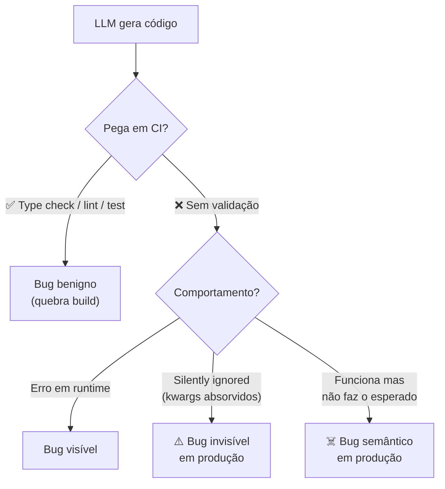

# Alucinações em código — APIs fantasma e parâmetros inexistentes

> [!abstract] TL;DR
> Além de [[02 - Slopsquatting — o ataque via alucinação|alucinar pacotes]], LLMs alucinam **dentro do código**: chamam métodos que não existem, passam parâmetros inventados, importam funções de módulos que não as exportam, criam tipos que ninguém declarou. Diferente de slopsquatting (vetor de ataque externo), essas alucinações são **bugs internos** que parecem código bom até alguém rodar. Detecção: type checker, linter, test, e — em projetos sérios — schema validation. O problema não é "o modelo é burro" — é que **plausibilidade visual ≠ correção semântica**.

## Os 5 tipos de alucinação em código

### 1. Métodos fantasma

```python
# Modelo gera:
result = response.json_safe()      # ← não existe em requests.Response

# Real:
result = response.json()            # API correta
```

Nome plausível. IDE corrige se você roda type check; passa silencioso se você não roda.

### 2. Parâmetros inventados

```python
# Modelo gera:
client.create_user(
    name="Maria",
    auto_validate=True,             # ← parâmetro não existe
    send_welcome_email=True
)

# Função real só aceita: name, email, role
```

Argumentos que **soam razoáveis**. Python aceita kwargs em assinaturas com `**kwargs`, então pode até rodar e ser silenciosamente ignorado.

### 3. Imports inválidos

```javascript
// Modelo gera:
import { useDeepCompareEffect } from 'react';   // ← não existe nativo

// Real:
import useDeepCompareEffect from 'use-deep-compare-effect'; // dep externa
```

Modelo confunde React core com hook de lib externa. Resultado: import quebrado em build.

### 4. Tipos inexistentes

```typescript
// Modelo gera:
function process(req: HttpRequest): HttpResponse { }

// Real: HttpRequest e HttpResponse não estão importados de lugar nenhum;
// modelo sugeriu nomes "razoáveis" sem checar tipos disponíveis
```

TypeScript pega na compilação. JavaScript puro deixa passar como `any`.

### 5. Comportamento alucinado

```python
# Modelo gera:
df.sort_by_multiple(["age", "name"])  # ← não existe; pandas usa sort_values

# Modelo gera (pior):
re.compile(pattern, flags=re.MAGIC)   # ← MAGIC não existe
```

O nome **descreve o que o dev quer**. Não corresponde à API real. LLM confundiu conceitos similares de outras libs.

## Por que LLMs fazem isso

| Causa | Exemplo |
|---|---|
| **Mistura entre versões** | API era assim em v1 da lib, mudou em v2 |
| **Confusão entre libs similares** | "Em pandas, sort_by_multiple não existe; em SQL, ORDER BY suporta múltiplas colunas" |
| **Pattern completion** | "Se função tem `create_user(name, email)`, modelo extrapola `auto_validate=` |
| **Naming intuitivo** | Modelo escolhe nome que **descreve o que faz**, não o que **é o nome real** |
| **Long-tail libs** | Lib pouco representada nos dados de treino |
| **Linguagens novas** | Pior em Rust, Zig, Mojo, etc. |

## A diferença entre alucinação benigna e perigosa



**Benigno:** quebra build → você descobre antes de mergir.
**Perigoso:** silenciosamente passa → produção em fogo.

## A camada de validação que pega cada tipo

| Camada | Pega |
|---|---|
| **Type check** (mypy, tsc) | Métodos/tipos inexistentes (estático) |
| **Linter** (ruff, eslint) | Imports não-usados, problemas de assinatura |
| **Test suite** | Comportamento errado se houver teste |
| **Schema validation** (Pydantic, Zod) | Parâmetros não declarados rejeitados |
| **Mock checking** (autospec) | Tests catch quando lib mockada não tem método |
| **Production telemetry** | Última linha de defesa — exceções, erros |

> [!tip] Pelo menos type check + test em CI
> Time que merge sem essas duas em CI está convidando alucinações para produção. Não é negociável em 2026.

## Detecção sistemática

### Estratégia 1 — Strict type checking

```toml
# pyproject.toml — mypy strict
[tool.mypy]
strict = true
warn_unused_ignores = true
disallow_any_explicit = true
```

```json
// tsconfig.json — TypeScript strict
{
  "compilerOptions": {
    "strict": true,
    "noUncheckedIndexedAccess": true,
    "noImplicitOverride": true
  }
}
```

Strict pega 80%+ das alucinações estáticas.

### Estratégia 2 — Pydantic / Zod / runtime schemas

```python
class CreateUserRequest(BaseModel):
    model_config = ConfigDict(extra="forbid")  # ← rejeita kwargs inventados
    name: str
    email: EmailStr
    role: Literal["admin", "user"]
```

`extra="forbid"` faz Pydantic **rejeitar** parâmetros não declarados em vez de ignorar. Mata "parâmetros inventados" silenciosos.

### Estratégia 3 — Spec-as-source

Em [[Spec-Driven Development|03 - Níveis de rigor — spec-first, spec-anchored, spec-as-source|spec-as-source]], a spec é a fonte autoritativa de assinaturas. Geração derivada da spec **não pode alucinar** — só pode produzir o que está declarado.

### Estratégia 4 — LLM critic com referência externa

Pipeline:
1. LLM gera código
2. **Outro agente** (critic) consulta documentação real (MCP server de docs)
3. Critic flag se referência não existe
4. Bloqueia merge

Latência maior, mas pega alucinação semântica que linter não pega.

## Quando "compila e roda" não basta

> [!warning] False sense of safety
> Código que roda **pode** estar errado. Exemplos:
>
> - `**kwargs` absorve `auto_validate=True` silenciosamente
> - JavaScript prototype pollution permite "métodos fantasma" funcionarem
> - Python duck typing aceita objetos errados se eles têm o método certo
> - SQL silenciosamente ignora colunas se driver permite
>
> Smoke test não substitui type check + schema validation.

## Mitigação proativa

### Para o agente

- AGENTS.md instruir: *"Se incerto sobre API, USE tools (web search, doc lookup). Não invente."*
- Skill: *"Antes de chamar lib X, verifique no código se a função existe."*
- Hook pre-commit: rodar type check + test relevante

### Para o time

- Type check **obrigatório** em CI (não warning)
- Schema validation em todos os boundaries (input/output)
- Code review focado em "essa função/parâmetro existe mesmo?"
- Adicionar `extra="forbid"`, `strict: true` em todo schema novo

## Métricas

| Métrica | Alvo |
|---|---|
| **% PRs com type errors detectados em CI** | <5% (se >10%, modelos alucinando muito) |
| **% bugs em prod por "API não existia"** | <2% |
| **% schemas com extra=forbid / strict** | >90% em boundaries |
| **Tempo médio CI type check** | <2 min |

## Anti-patterns

- **Type check como warning, não erro** — vira ruído ignorado
- **Schemas permissivos** — `extra="allow"` ou `Object<string, any>` passam alucinações
- **Confiar no "olhômetro"** — alucinação visual é plausível por design
- **Skipar test em CI "porque é só ajuste"** — janela perfeita para alucinação semântica
- **Sem audit log de prompts** — não sabe qual prompt levou ao bug

## Veja também

- [[01 - Código gerado por IA é untrusted]]
- [[02 - Slopsquatting — o ataque via alucinação]]
- [[05 - SAST e SCA para código AI]]
- [[09 - Testes imutáveis — a barreira que o agente não pode reescrever]]
- [[Spec-Driven Development|07 - Fase Validate — spec como contrato executável]]

## Referências

- **Veracode** — *2025 GenAI Code Security Report* (2025).
- **Trend Micro** — *Slopsquatting and AI Hallucinations* (2026).
- **OWASP Top 10 for LLM Applications 2025-2026* — categoria *Hallucination*.
- **Pydantic Documentation** — *extra forbid for strict input validation* (2026).
