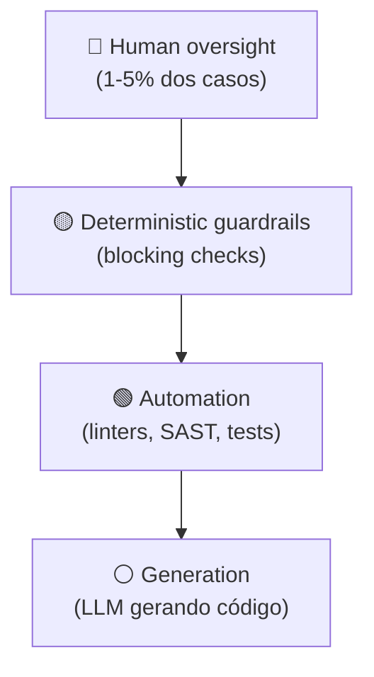

# A pirâmide de validação AI

> [!abstract] TL;DR
> Nenhuma camada sozinha protege contra os 45% de [[01 - Código gerado por IA é untrusted|código inseguro]] e [[02 - Slopsquatting — o ataque via alucinação|supply chain attacks]]. A solução é **defesa em profundidade** estruturada como pirâmide: na base, **automação massiva** (linters, type checkers, SAST escalando para milhares de PRs); no meio, **guardrails determinísticos** ([[Context Engineering|12 - Guardrails determinísticos]]) que param classes de ataque conhecidas; no topo, **human oversight** focado nos poucos casos que merecem revisão humana profunda. Triângulo invertido onde tem o problema.

## A pirâmide



**Fluxo:** geração → automação → guardrails → humano. Cada camada filtra. Humano só vê o que precisa de julgamento real.

## Por que pirâmide e não checklist

A tentação é "escrever uma lista grande de coisas pra revisar". Falha porque:

- Volume gerado por IA esmaga revisão linear
- Humano fadiga em casos rotineiros, deixa passar casos sérios
- Custo escala linearmente com volume → caro
- Cada camada está fazendo o trabalho errado

Pirâmide é **especialização por camada**: máquina faz o que máquina faz bem; humano faz o que humano faz bem.

## Camada 1 — Automação (90-95% do trabalho)

A base larga. Roda em **todo PR**, em **todo commit**, sem exceção.

| Ferramenta | Pega |
|---|---|
| **Type checker** (mypy, tsc) | Métodos/tipos inexistentes ([[03 - Alucinações em código — APIs fantasma e parâmetros inexistentes]]) |
| **Linter** (ruff, eslint) | Padrões de código, dead code, antipatterns |
| **SAST** (Snyk, Semgrep, CodeQL) | OWASP-grade vulns ([[05 - SAST e SCA para código AI]]) |
| **SCA** (Snyk, Socket.dev) | Slopsquat, dep vulneráveis ([[02 - Slopsquatting — o ataque via alucinação]]) |
| **Test suite** | Comportamento ([[09 - Testes imutáveis — a barreira que o agente não pode reescrever]]) |
| **Format check** | Estilo |

**Critério de qualidade:** todas estas DEVEM **bloquear PR** se falharem. Não devem ser warnings ignorados.

## Camada 2 — Guardrails determinísticos (4-9%)

Quando automação genérica não basta — regras **específicas do projeto**:

| Guardrail | Exemplo |
|---|---|
| **Schema validation** | Output do LLM tem `extra="forbid"` em Pydantic |
| **Permission boundaries** | Agente não pode chamar tools fora do allowlist ([[06 - Permissões e sandboxing]]) |
| **Rate limits** | LLM não faz >N tool calls por turno |
| **Sensitive operation gating** | Mudanças em DB de prod requerem human approval |
| **Output format enforcement** | JSON mode, structured outputs |
| **Domain-specific rules** | "Nenhuma string SQL concatenada com user input" |
| **Hallucination check** | Pacotes verificados em registry oficial antes de install |

Ver [[Context Engineering|12 - Guardrails determinísticos]] para fundamento.

**Critério:** regras **codificáveis**. Se você consegue escrever a regra, escreva a regra. Não delegue julgamento determinístico para LLM.

## Camada 3 — Human oversight (1-5%)

Para o que sobrou: julgamento real.

**O que humano faz bem:**
- Revisão de **arquitetura** (decisões com trade-offs ambíguos)
- Avaliação de **mudanças cross-cutting** (security policy, auth)
- Verificação de **intent** (o código atende ao "porquê" da feature?)
- Aprovação de **operações destrutivas** (drop table, force push)
- Escalação de **incidentes** detectados pelas camadas inferiores

**O que humano NÃO faz bem (deixe para máquina):**
- Detectar XSS em template
- Achar SQL injection escondido
- Verificar 50 linhas de imports
- Confirmar que typescript types batem
- Checar que pacote npm existe

> [!warning] Review fatigue mata
> Time que aprova 100 PRs/semana **não revisa** o de número 47. Camadas 1 e 2 existem para que a camada 3 só receba **5 PRs/semana** que **realmente precisam** de olhar humano.

## Anatomia do pipeline ideal

```yaml
# .github/workflows/ai-code-validation.yml
on: [pull_request]

jobs:
  layer1-automation:
    steps:
      - name: Type check (BLOCK)
        run: mypy src/
      - name: Lint (BLOCK)
        run: ruff check src/
      - name: SAST (BLOCK)
        run: semgrep --config=auto --error
      - name: SCA (BLOCK)
        run: snyk test --severity-threshold=high
      - name: Test suite (BLOCK)
        run: pytest
      - name: Coverage (BLOCK if < 80%)
        run: pytest-cov --fail-under=80

  layer2-guardrails:
    needs: layer1-automation
    steps:
      - name: Schema validation
        run: ./scripts/check-schemas.sh
      - name: Permission boundary check
        run: ./scripts/check-tool-allowlist.sh
      - name: Sensitive ops gate
        if: contains(github.event.pull_request.changed_files, 'migrations/')
        run: echo "::warning::DB migration detected - human approval required"

  layer3-routing:
    needs: layer2-guardrails
    steps:
      - name: Auto-route review
        run: ./scripts/route-review.sh
        # Sensitive PR → senior + security-reviewer
        # Routine PR → any reviewer
```

## Implementação progressiva

Não tente tudo de uma vez. Roadmap típico (ver também [[12 - O roadmap de segurança para times]]):

| Semana | Adiciona |
|---|---|
| 1 | Type check + linter (bloqueando) |
| 2 | Test suite obrigatório + coverage threshold |
| 3 | SAST básico (Semgrep config=auto) |
| 4 | SCA (Snyk ou Socket.dev) |
| 5-6 | Schema validation em boundaries |
| 7-8 | Permission boundaries para agentes |
| 9-10 | Routing inteligente de review humano |
| 11-12 | Métricas e ajuste fino |

## Quando uma camada falha

| Falha | Sintoma | Fix |
|---|---|---|
| **Camada 1 lenta** | CI demora >15 min, time pula validação | Otimize, paralelize, incremental |
| **Camada 1 com falsos positivos** | Time desativa rule | Calibre rules, suppress com comentário |
| **Camada 2 muito rígida** | Bloqueio em casos legítimos | Refine regras com base em casos reais |
| **Camada 2 muito frouxa** | Issues passam | Adicione regra específica para o pattern |
| **Camada 3 fadigada** | Reviews superficiais | Aumente camadas 1 e 2 para reduzir volume |

## Métricas da pirâmide

| Métrica | Alvo | Significado |
|---|---|---|
| **% PRs bloqueados em camada 1** | 30-50% | Sinal saudável — automação funciona |
| **% PRs bloqueados em camada 2** | 5-15% | Guardrails calibrados |
| **% PRs revisados manualmente** | <10% | Humano focado |
| **Tempo médio CI total** | <15 min | Não sufoca produtividade |
| **Defect escape rate** | <5% | Issues que chegam em prod |
| **% issues detectados em prod (não em CI)** | <10% | Pirâmide está pegando |

## Anti-patterns

- **"Vamos só fazer review humano com mais cuidado"** — não escala com volume IA
- **SAST como warning, não erro** — vira ruído
- **Camada 2 por LLM ("AI critic")** — contraditório; quem valida o validador?
- **Pular camada 1 "para mover rápido"** — produção paga depois
- **Métricas só em camada 3** — perde sinal das anteriores
- **Single-vendor SAST** — Veracode mostra: 78% dos issues só pegos por uma das ferramentas; **rode 2+**

## Veja também

- [[05 - SAST e SCA para código AI]]
- [[06 - Permissões e sandboxing]]
- [[07 - Security-focused prompting]]
- [[08 - Code review de código AI — o que muda]]
- [[Context Engineering|12 - Guardrails determinísticos]]

## Referências

- **Veracode** — *2025 GenAI Code Security Report* (2025).
- **DryRun Security** — *Top 10 AI SAST Tools for 2026* (2026).
- **NVIDIA** — *Practical Security Guidance for Sandboxing Agentic Workflows* (2026).
- **Anthropic** — *Engineering Claude Code Sandboxing* (2026).
- **OWASP Top 10 for LLM Applications* (2025-2026).
