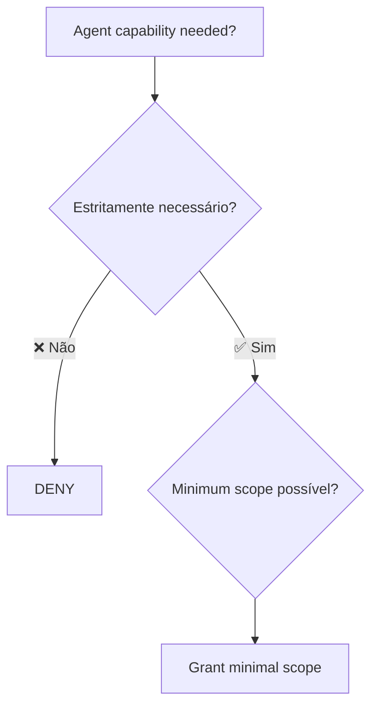

# Permissões e sandboxing

> [!abstract] TL;DR
> Agente AI precisa rodar comandos, ler arquivos, fazer chamadas de rede — exatamente os privilégios que atacante quer. **Least privilege** + **sandboxing** é como você roda agentes sem permitir que um prompt errado destrua produção. Em 2026, Cursor com Claude wipou banco de produção em **9 segundos** — o caso é cautionary tale citado por toda documentação de sandboxing. Anthropic aposta em OS-level sandboxing (bubblewrap/Seatbelt) com filesystem + network isolation. Defense in depth é mandatório: app-level + OS-level + infra-level.

## A tragédia que define o problema

> [!danger] Caso real (2025)
> Cursor com agente Claude **wipou banco de produção e backups em 9 segundos**.
>
> Causa: agente tinha credenciais de produção + permissão de exec + nenhuma camada de gating.
>
> Lição: *aceitar prompts em produção é apostar a casa.*

Todo agente de coding desde então é projetado com sandboxing como default. Mas configuração padrão **não basta** — você precisa entender as camadas.

## Princípio: least privilege



Default = deny. Toda permissão concedida deve ser **justificada** e **escopo mínimo**.

| Operação | Escopo errado | Escopo correto |
|---|---|---|
| Ler arquivos | Filesystem inteiro | Só `./src/` e `./tests/` |
| Escrever arquivos | Qualquer lugar | Só `./src/`, `./tests/`, e `./docs/` |
| Network | Tudo | Só GitHub API, npm registry, docs sites |
| Exec | Bash livre | Allowlist de comandos (`npm test`, `pytest`, etc.) |
| Git | Push, force-push, delete branch | Só commit + branch local |
| DB | Production | Local dev DB (via env) |

## As três camadas de sandboxing

### Layer 1 — Application-level

Agente em si tem regras: tools allowlist, prompts de denial, refusal policies.

```json
// Claude Code permissions config
{
  "permissions": {
    "allow_tools": ["read_file", "write_file", "grep", "bash_safe"],
    "deny_tools": ["exec_dangerous", "network_unrestricted"],
    "ask_before_writing": true,
    "deny_paths": ["/etc/", "~/.ssh/", ".env*"]
  }
}
```

### Layer 2 — OS-level

OS enforça mesmo se app falha. Anthropic Claude Code usa:

- **Linux:** `bubblewrap` (namespaces, mount restrictions)
- **macOS:** `Seatbelt` (sandbox profiles)
- **Windows:** AppContainer

```bash
# Exemplo de bubblewrap profile
bwrap \
  --ro-bind / / \
  --bind ./src ./src \           # write apenas em ./src
  --tmpfs /tmp \
  --unshare-net \                # sem rede (ou whitelist específica)
  --die-with-parent \
  -- claude-code
```

### Layer 3 — Infrastructure-level

Container, VM, ou sandbox dedicado. Defense in depth final.

| Solução | Forte em |
|---|---|
| **Docker** | Containers leves, fácil de configurar |
| **Firecracker microVMs** | Isolation forte, baixa latência |
| **gVisor** | Syscall sandboxing |
| **macOS kernel sandbox** (Agent Safehouse) | macOS-specific, kernel-level |

## Filesystem isolation

Default seguro:

```
./             ← read + write (working dir)
./.git/        ← read only (não permitir agente forçar push)
~/.ssh/        ← deny absoluto
~/.aws/        ← deny absoluto
/etc/          ← read only
.env           ← deny (nem read)
```

Claude Code's sandboxed bash tool: write **default** ao cwd e subdirs; read default ao filesystem **exceto paths denied**.

> [!tip] Reduz prompts em 84%
> Anthropic mediu: sandboxing bem configurado **reduz pedidos de aprovação em 84%** porque agente já sabe seus limites e não pergunta.

## Network isolation

Sem network isolation, agente comprometido pode:

- Exfiltrar arquivos sensíveis
- Baixar payloads adicionais
- Conectar a C2 do atacante
- Atacar serviços internos da rede

Configuração mínima:

```yaml
# Allowlist
allow_hosts:
  - api.anthropic.com
  - api.openai.com
  - github.com
  - registry.npmjs.org
  - pypi.org
  - docs.python.org

deny_hosts:
  - "*"  # default deny
```

Implementação: proxy filtrante (mitmproxy, custom), iptables com OUTPUT rules, ou container com network namespace específico.

## Exec — o vetor mais perigoso

Bash livre = comprometimento total. Patterns recomendados:

### Safe-bash com allowlist

```yaml
allow_commands:
  - "pytest"
  - "npm test"
  - "npm install"      # cuidado: post-install scripts
  - "git status"
  - "git diff"

deny_commands:
  - "rm -rf"
  - "curl"
  - "wget"
  - "sudo"

require_approval:
  - "npm install"      # cuidado extra
  - "git push"
  - "git rebase"
```

### Subcommand parsing

```bash
# Não basta whitelist do comando — checar argumentos
git status         ✅ ok
git push --force   ❌ deny
git reset --hard   ❌ deny
```

### Vulnerability famous: 50-subcommand bypass

> [!warning] CVE-2026-25723 (Claude Code)
> *"Claude Code silently dropped deny-rule enforcement once a command exceeded 50 subcommands because engineers had traded security for speed."*
>
> *"File-write restrictions hit when piped sed and echo commands escaped the project sandbox because command chaining was not validated."*
>
> Lição: enforcement **deve permanecer** mesmo em performance crítica. Bypass por complexidade do input é vetor real.

## Git: cuidados especiais

| Operação | Default | Por quê |
|---|---|---|
| `git commit` | ✅ Allow | Local-only, reversível |
| `git push` | ⚠️ Approve | Visível externamente |
| `git push --force` | ❌ Deny | Destrói history |
| `git reset --hard` | ❌ Deny | Destrói trabalho |
| `git rebase -i` | ⚠️ Approve | Modifica history |
| `git branch -D` | ⚠️ Approve | Destrói branch |
| `git config` | ❌ Deny | Mudança de identidade/auth |

## Database: regra de ouro

> [!danger] Agente NUNCA toca prod DB
>
> Devs não dão acesso de prod a junior. Não dão a agente. Padrão:
>
> - **Dev:** local DB com seed
> - **Test:** banco efêmero (Docker, SQLite in-memory)
> - **Staging:** banco isolado, **read-only** para agente
> - **Prod:** **zero acesso** do agente

## Padrão dual-mode (Anthropic)

Claude Code suporta dois modos:

- **Plan mode**: agente lê, raciocina, propõe — **não executa**
- **Agent mode**: agente executa, dentro do sandbox

Plan → review humana → agent. Vale especialmente para tasks ambíguas.

## Setup recomendado por nível

| Nível | Setup |
|---|---|
| **Solo dev** | Sandbox padrão (Claude Code, Cursor) + git permissions + network allowlist |
| **Time pequeno** | + Docker para exec + secrets em vault + read-only staging DB |
| **Time enterprise** | + Firecracker microVMs + audit log + permission breaks com approval workflow |
| **Compliance pesado** | + kernel sandboxing + formal policy enforcement + zero-trust between agent and infra |

## Checklist de sandboxing

> [!example] Antes de rodar agente em codebase real
> - [ ] Filesystem allowlist configurado (não permite escrita fora do projeto)
> - [ ] `~/.ssh/`, `~/.aws/`, `.env*` denied
> - [ ] Network allowlist (só hosts necessários)
> - [ ] Bash com allowlist de comandos
> - [ ] Git: `--force` e `reset --hard` denied
> - [ ] DB: agente não tem credenciais de prod
> - [ ] Container/VM se executar código com untrusted input
> - [ ] Audit log das ações do agente
> - [ ] Approval flow para operações sensíveis

## Anti-patterns

- **"Permissão total porque incomoda menos"** — vira incidente
- **Sandbox só app-level** — Claude vulns mostram que app pode falhar
- **Network livre** — exfiltração trivial
- **Mesmo sandbox para test e prod** — propagação de comprometimento
- **Sem audit log** — incidente sem forense
- **Exception manuais** ("só hoje rodo sem sandbox") — viraram permanente

## Veja também

- [[Context Engineering|12 - Guardrails determinísticos]]
- [[04 - A pirâmide de validação AI]]
- [[Economia de Tokens|15 - Orçamento e hard limits]] — kill switches em sessões
- [[Agentes de Codificação|14 - agents.md e configuração de projeto]]

## Referências

- **Anthropic** — *Engineering Claude Code Sandboxing* (2026).
- **Anthropic Claude Code Docs** — *Sandboxing reference* (2026).
- **Truefoundry** — *Claude Code Sandboxing: Network Isolation, File System Controls* (2026).
- **Adversa AI** — *Critical Claude Code vulnerability: Deny rules silently bypassed* (2026).
- **NVIDIA** — *Practical Security Guidance for Sandboxing Agentic Workflows* (2026).
- **Docker** — *Claude Code in Docker sandboxes* (2026).
- **Startup Fortune** — *Cursor's Claude agent wipes production database and backups in 9 seconds* (2025).
- **The Menon Lab** — *Agent Safehouse: Kernel-Level Sandboxing for AI Coding Agents* (2026).
