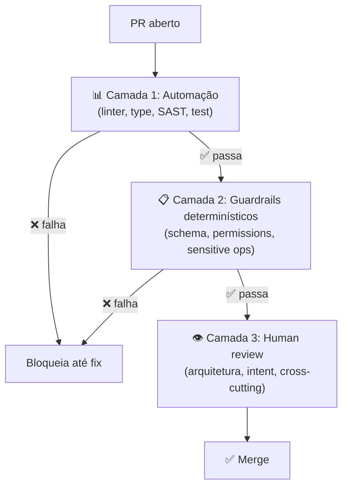

# Code review de código AI — o que muda

> [!abstract] TL;DR
> Code review de código gerado por IA **não é o mesmo** de código humano. Volume é maior (5-10x), velocidade é maior, viés do reviewer é diferente (aceita demais por inércia), e classes de defeito são diferentes (alucinações + vulnerabilidades sistemáticas). A regra: **delegue o que máquina faz para [[04 - A pirâmide de validação AI|automação]]**, e **foque humano** em arquitetura, intent, e mudanças cross-cutting. Esta nota apresenta o checklist específico, os red flags, e o anti-pattern do "approve fadigado" que está mascarando débito em todo lugar em 2026.

## Por que review tradicional falha

| Review tradicional | Code review de IA |
|---|---|
| 5-10 PRs/dev/semana | 50+ PRs (incluindo IA) |
| Reviewer conhece o autor | Autor é "modelo X versão Y" |
| Bugs distribuídos por estilo individual | Bugs **sistemáticos** por classe |
| Volume cabe em atenção humana | Volume **esmaga** atenção humana |
| Critério: "faz sentido?" | Critério: "atende contrato?" |

Aplicar review tradicional a volume IA = **review fadigado** = approve sem ler.

## A divisão de trabalho correta



Humano **só vê** o que **precisa** de julgamento humano. Se PR fica em camadas 1 ou 2, **nem chega** ao reviewer.

## O que humano deve checar (sim)

### 1. Intent vs implementation

> *"Esse código atende ao 'porquê' da feature?"*

LLM atende ao "o quê" tipicamente bem (especialmente com [[Spec-Driven Development|02 - O que é Spec-Driven Development|spec]]). Atende ao "porquê" tipicamente mal — não tem visão estratégica do produto.

Pergunte:
- Esse approach faz sentido para o negócio?
- Foi resolvido o problema correto, ou só implementado o que o ticket pediu?
- Há trade-offs implícitos que precisam ser explicados?

### 2. Mudanças cross-cutting

PRs que tocam vários módulos são alto risco. LLM pode quebrar invariantes que estão em pedaços não-óbvios da codebase.

Procure:
- Mudança em padrão usado em vários lugares mas só atualizado em um
- Adição de dependência que afeta outros módulos
- Mudança em interface compartilhada
- Migration que afeta dados existentes

### 3. Decisões arquiteturais

Mesmo com [[Spec-Driven Development|05 - Fase Design e Plan — arquitetura e decomposição|plan]], LLM pode introduzir patterns alternativos que conflitam com convenções do projeto.

Procure:
- Novo pattern arquitetural sem ADR
- "Service" criado quando outro fazia parecido
- Camada extra que duplica responsabilidade
- Dependência que viola layering (ex: model importando service)

### 4. Edge cases sutis

Acceptance tests cobrem casos esperados. LLM tende a **não pensar** em casos não esperados.

Procure:
- O que acontece se input é vazio? null? muito grande?
- Concorrência: dois usuários simultâneos?
- Falha parcial: tool 1 ok, tool 2 falhou?
- Timeout: e se o request demorar 30s?
- Retry: e se o request for repetido?

### 5. Mudanças sensíveis

Mesmo com camadas 1 e 2 verdes, **estas exigem humano**:

- Mudança em código de auth/authorization
- Migrations destrutivas (DROP COLUMN, etc.)
- Mudança em código de cobrança/pagamento
- Alteração em política de logging (especialmente PII)
- Alteração em CI/CD security gates
- Atualização de dependências críticas

## O que humano NÃO deve checar (não)

Coisas que máquina faz **melhor**:

- Estilo de código (linter)
- Tipos (type checker)
- XSS, SQL injection, etc. (SAST)
- Pacotes vulneráveis (SCA)
- Coverage de testes (CI)
- Format / spacing (formatter)
- Imports não usados (linter)

Se você está checando isso manualmente, está **gastando humano em automação**. Mova para CI.

## Red flags em PR de IA

> [!warning] Sinais de alerta
> - **PR enorme** (>500 LOC adicionadas) — provavelmente vibe-coded
> - **Sem tests novos** ou tests que não falham se você quebrar a feature
> - **Many small unrelated changes** ("aproveitei e refatorei isso aqui também")
> - **Comentários explicando o óbvio** (sinal de modelo "preenchendo")
> - **Imports estranhos ou compostos** (`react-codeshift`, possível [[02 - Slopsquatting — o ataque via alucinação|slopsquat]])
> - **API calls com parâmetros não documentados** ([[03 - Alucinações em código — APIs fantasma e parâmetros inexistentes|alucinação]])
> - **Mudança "drive-by" em arquivo não relacionado** — drift
> - **Justificativa vaga**: "fix bug" sem dizer qual
> - **Resposta do autor "o agente fez"** quando perguntado sobre escolha — sem comprehension gate

## Checklist de review para AI PR

```markdown
## AI Code Review Checklist

### Arquitetura
- [ ] Approach faz sentido para o problema?
- [ ] Não introduz pattern divergente do projeto?
- [ ] Não viola separation of concerns / layering?

### Intent
- [ ] Atende ao "porquê" do ticket, não só "o quê"?
- [ ] Trade-offs implícitos estão documentados?
- [ ] Out-of-scope da spec foi respeitado?

### Edge cases
- [ ] Input vazio / null / muito grande?
- [ ] Concorrência?
- [ ] Falha parcial / retry?
- [ ] Timeout?

### Cross-cutting
- [ ] Padrão alterado em todos os lugares relevantes?
- [ ] Dependências afetadas atualizadas?
- [ ] Migration não quebra dados existentes?

### Specific risk
- [ ] Auth / authorization tocado? (escalação extra)
- [ ] DB migration destrutiva? (escalação extra)
- [ ] Cobrança / dados sensíveis? (escalação extra)

### Sanity
- [ ] PR de tamanho razoável (<300 LOC ideal)?
- [ ] Tests novos cobrem comportamento, não só linha?
- [ ] Imports não suspeitos?
- [ ] Comentários úteis (não "preenchimento")?
```

## Routing automático

Em volume alto, route reviews por categoria:

```yaml
# Pseudo-config de routing
routes:
  - if: changed_files matches "src/auth/**"
    require: senior_dev + security_team

  - if: changed_files matches "migrations/**"
    require: senior_dev + dba

  - if: pr_size > 500
    require: senior_dev
    label: "large-pr-review-needed"

  - if: changed_files matches "tests/**"
    require: any_dev  # tests são candidato a review mais leve

  - default:
    require: any_dev
```

Filtra automaticamente: PRs sensíveis vão para reviewers certos. PRs rotina vão para qualquer um.

## Comprehension gate aplicado

[[Agentes de Codificação|03 - O comprehension gate]] em prática durante review:

> [!quote]
> *"Se o autor (humano que abriu o PR) não consegue explicar a mudança, NÃO mergeie. Se você (reviewer) não entende a mudança, NÃO aprove."*

Adapte: peça ao autor para explicar **a decisão arquitetural** — não a mudança linha-a-linha. Se ele recorre a "o agente fez assim", o gate falhou.

## Métricas de review

| Métrica | Alvo |
|---|---|
| **Tempo médio review** | <2h após CI verde |
| **Mean comments por PR** | 1-3 (acima → camadas 1-2 fracas; abaixo → review superficial) |
| **% PRs aprovados sem comentário** | <30% (acima → review fadigado) |
| **% bugs em prod por classe "passou no review"** | <2% |
| **% PRs revertidos** | <3% |
| **Reviewer fatigue index** | Watch out — métrica nova |

## Anti-patterns

- **"LGTM" como pattern** — review virou ritual; rever processo
- **Reviewer único para tudo** — tech lead fadigado vira gargalo
- **Review depois do merge** ("merge first, review later") — política de débito
- **"O agente fez, eu só rodei"** — autor sem comprehension gate
- **Aprovar com testes vermelhos** — destrói o sinal completamente
- **Sem checklist** — review depende do dia do reviewer

## Veja também

- [[04 - A pirâmide de validação AI]]
- [[09 - Testes imutáveis — a barreira que o agente não pode reescrever]]
- [[10 - Métricas de qualidade AI — defect escape rate, rework ratio]]
- [[Agentes de Codificação|03 - O comprehension gate]]
- [[Spec-Driven Development|07 - Fase Validate — spec como contrato executável]]

## Referências

- **Anthropic** — *Best practices for Claude Code: Code review* (2026).
- **GitHub** — *Code review for AI-generated code: best practices* (2026).
- **Augment Code** — *AI Spec-Driven Development Workflows* (2026).
- **Atlassian** — *Code review in the era of AI assistants* (2026).
- **Plus8Soft** — *The Comprehension Gate* (2025).
