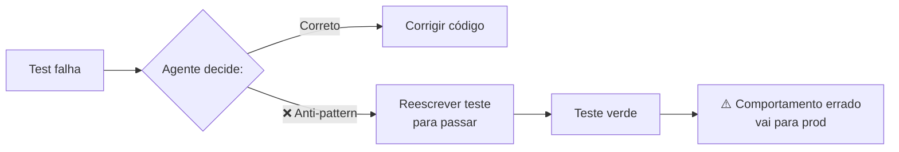
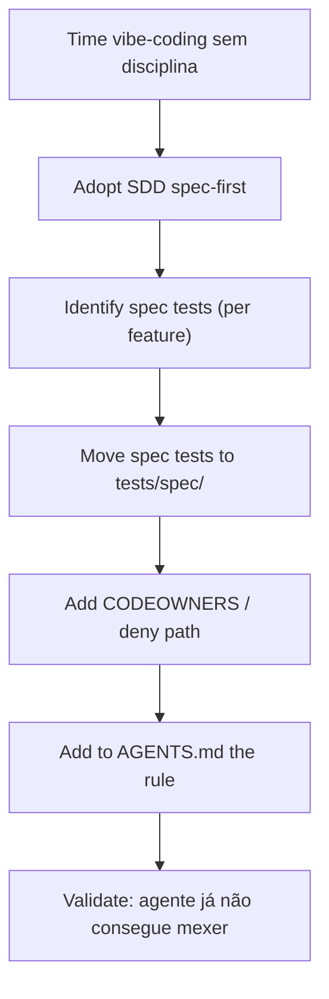

# Testes imutáveis — a barreira que o agente não pode reescrever

> [!abstract] TL;DR
> O anti-pattern mais comum em AI coding: **agente reescreve o teste** quando o teste falha, em vez de corrigir o código. Resultado: teste passa, comportamento está errado, ninguém percebe até produção. A solução é tornar **certos testes imutáveis** — fora do alcance do agente, sob proteção arquitetural. Suite "spec tests" derivada de [[Spec-Driven Development|07 - Fase Validate — spec como contrato executável|acceptance criteria]] vira a **barreira** do produto: agente pode mudar implementação livremente, mas **não pode tocar nesses testes**. Pattern recomendado por Anthropic, Augment, e em SDD geral.

## O anti-pattern



Casos comuns:
- Teste falha por race condition → agente adiciona `time.sleep(1)` no teste
- Teste verifica retorno exato → agente muda `assertEqual(x, "Maria")` para `assertIn("M", x)`
- Teste verifica comportamento → agente comenta out o teste com "TODO: revisar"
- Teste verifica edge case → agente deleta o teste

LLMs fazem isso porque:
- "Make the test pass" é interpretado literalmente
- Sem instrução de proteger teste, modificar é mais fácil que corrigir
- Patrocínio do humano "só faça o teste passar" reforça o pattern

## A solução: testes em quarentena

Separe testes em camadas com **proteção crescente**:

| Camada | Protegido contra | Quem pode mudar |
|---|---|---|
| **Unit tests rotineiros** | Nada — agente pode adaptar | Qualquer um |
| **Integration tests** | Mudanças sem justificativa | Code review obrigatório |
| **Spec tests / contract tests** | **Agente** | Só humano + spec change |
| **Security tests** | **Agente + dev individual** | Security team |

A camada 3-4 é a **barreira**. Agente sabe que **não pode tocar** nesses arquivos.

## Como tornar testes imutáveis (na prática)

### Opção 1 — Path-based deny

No sandbox do agente ([[06 - Permissões e sandboxing]]):

```json
{
  "deny_paths": [
    "tests/spec/**",
    "tests/security/**",
    "tests/contract/**"
  ]
}
```

Agente fisicamente **não consegue** abrir esses arquivos. Não há "mas eu queria corrigir" — a edição falha.

### Opção 2 — Branch protection + CODEOWNERS

```
# .github/CODEOWNERS
tests/spec/         @security-team @tech-leads
tests/security/     @security-team
tests/contract/     @api-owners
```

Agente pode propor mudança via PR, mas merge só com aprovação de team específico.

### Opção 3 — Linha explícita no AGENTS.md

```markdown
## Test policy

NEVER modify files in:
- tests/spec/
- tests/security/
- tests/contract/

If a test in these directories fails, the BUG IS IN THE CODE, not in the test.
Fix the code, or pause and request human review of the spec.
```

Combina com path-based deny. Agente sabe e física não pode mesmo.

### Opção 4 — Hash-based imutabilidade

Time guarda hashes de arquivos críticos. CI verifica se hash mudou:

```yaml
- name: Verify spec tests integrity
  run: |
    for f in tests/spec/*.py; do
      if [[ "$(sha256sum $f | cut -d' ' -f1)" != "$(cat $f.hash)" ]]; then
        echo "::error::Spec test $f was modified! Spec test changes require security team approval."
        exit 1
      fi
    done
```

Mudança requer atualizar hash deliberadamente — passa por humano.

## Spec tests — o que são

Tests vinculados a [[Spec-Driven Development|07 - Fase Validate — spec como contrato executável|acceptance criteria]] da spec. Cada AC tem um (ou mais) teste(s) que demonstram que AC é atendido.

```python
# tests/spec/refunds/test_acceptance.py
"""
Spec tests for refunds feature.
DO NOT MODIFY without spec change approval.
Linked to: specs/refunds/spec.md
"""

@pytest.mark.spec("refunds#AC1")
def test_refund_full_within_7_days():
    """AC1: Refund total dentro de 7 dias deve ser aceito."""
    payment = create_payment(age_days=3, amount=Decimal("100.00"))

    result = refund_service.request(
        payment_id=payment.id,
        amount=payment.amount,
        reason="customer_request"
    )

    assert result.status == "pending"
    assert result.refund_id is not None

@pytest.mark.spec("refunds#AC2")
def test_refund_partial_after_7_days_requires_approval():
    """AC2: Refund parcial após 7 dias requer aprovação."""
    # ...
```

Cada teste é **derivado da spec**. Se spec muda → teste muda → mas o **fluxo de mudança** passa por revisão da spec, não edição livre.

## Security tests — o que são

Tests que **não** verificam funcionalidade — verificam ausência de vulnerabilidade. Categorias:

```python
# tests/security/test_sql_injection.py

def test_search_endpoint_resists_sql_injection():
    """Atacante tenta UNION SELECT via parâmetro."""
    response = client.get("/search?q=' UNION SELECT password FROM users--")
    assert response.status_code == 200  # não falha (DOS)
    assert "password" not in response.text  # não vaza

def test_upload_endpoint_blocks_path_traversal():
    """Atacante tenta escrever fora do upload dir."""
    response = client.post("/upload", files={
        "file": ("../../etc/passwd", b"malicious", "text/plain")
    })
    assert response.status_code == 400
    assert not Path("/etc/passwd_modified").exists()
```

Estes **nunca** podem ser modificados por agente. Bug exposto significa vulnerabilidade real.

## Contract tests — o que são

Tests que verificam **interface externa** do serviço. Outros sistemas dependem desses contratos.

```python
# tests/contract/test_payment_api.py

def test_post_refunds_returns_201_with_required_fields():
    """Contract com mobile app: response shape estável."""
    response = client.post("/refunds", json=valid_refund_request)

    assert response.status_code == 201
    body = response.json()

    # Mobile app espera estes fields:
    assert "refund_id" in body
    assert "estimated_completion" in body
    assert "status" in body
```

Mudar contract test = quebrar consumidores externos. Imutável até **migração intencional** seja planejada.

## Test code is code — mas com regra diferente

> [!warning] Tests também precisam de [[05 - SAST e SCA para código AI|SAST]]
> Testes podem ter sua próprias vulnerabilidades:
>
> - Test fixture com hardcoded credential que vaza
> - Mock que aceita input sem validação
> - SQL fixture com injection oculta
>
> Imutabilidade não isenta de auditoria.

## Padrão de adoção



Adoção parcial: comece com **spec tests**. Adicione security tests quando time tiver bandwidth para mantê-los. Contract tests vêm com maturidade de API design.

## Sinais de boa adoção

- ✅ Agente nunca tenta editar arquivos em `tests/spec/`
- ✅ Quando teste spec falha, time discute spec, não teste
- ✅ Mudanças em spec test são raras e versionadas
- ✅ Security tests ficam vermelhos (com bug real) só quando deveriam
- ✅ Contract tests detectam breaking changes antes de merge

## Sinais de má adoção

- ❌ Devs editam `tests/spec/` direto (deny path mal configurado)
- ❌ Spec tests têm `pytest.mark.skip` espalhados ("temporário")
- ❌ Security tests vermelhos por mais de 1 sprint sem justificativa
- ❌ Contract tests tornam-se decoração, ignorados em PR
- ❌ Hash check sempre pulado em CI

## Métricas

| Métrica | Alvo |
|---|---|
| **% spec tests passando** | 100% (vermelho = bloquear merge) |
| **% AC com spec test correspondente** | 100% |
| **Mudanças não autorizadas em tests/spec/** | 0 |
| **Security tests passando antes de merge** | 100% |
| **Contract tests breaking change rate** | <1% das releases |

## Anti-patterns

- **Sem categorização — todos os tests no mesmo lugar** — agente edita o crítico junto
- **Skip em spec test "porque está flaky"** — flake em spec test = bug, não razão para skip
- **"Tests imutáveis" como regra documentada mas sem enforcement** — depende de boa-fé do agente
- **Hash check só em main, não em PR** — agente pode mudar e mergir antes do check
- **Spec test que depende de implementação específica** — vira frágil, time skipa

## Veja também

- [[04 - A pirâmide de validação AI]]
- [[06 - Permissões e sandboxing]]
- [[08 - Code review de código AI — o que muda]]
- [[Spec-Driven Development|06 - Fase Implement — execução disciplinada]]
- [[Spec-Driven Development|07 - Fase Validate — spec como contrato executável]]

## Referências

- **Anthropic** — *Best practices for Claude Code: Test discipline* (2026).
- **Augment Code** — *AI Spec-Driven Development Workflows* (2026).
- **Martin Fowler** — *Specification by Example* (princípios subjacentes, 2014).
- **GitHub Spec Kit** — *Spec tests as contracts* (2026).
