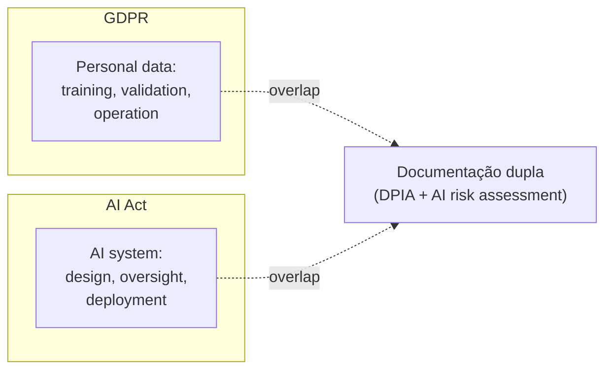

# Governance as architecture — EU AI Act, GDPR, licenças

> [!abstract] TL;DR
> EU AI Act fica **totalmente aplicável em 2 de agosto de 2026**. Para times que usam ou desenvolvem IA, isso muda nível de obrigação. Para code generation: documentar qual modelo GPAI foi usado, qual spec governou geração, qual revisão humana ocorreu, quais modificações foram feitas. **Logs por mínimo 6 meses (Art. 19)**. GDPR continua valendo paralelamente: dados pessoais usados em treino, validação ou operação caem sob ambos. Para sair com isso de pé, tratar **governance as architecture**: gates de compliance no pipeline, não em PDF.

## O que muda em agosto de 2026

> [!warning] EU AI Act — datas-chave
> - **2 fev 2025:** práticas proibidas começam a aplicar
> - **2 ago 2025:** governance + obrigações de GPAI models
> - **2 ago 2026:** lei totalmente aplicável (incluindo high-risk)
> - **2 ago 2027:** algumas exceções para sistemas pré-existentes

A partir de agosto de 2026, **descumprir não é "boas práticas"** — é multa de até **€35M ou 7% do faturamento global**.

## Quem é afetado

| Papel | Obrigações |
|---|---|
| **Provider GPAI** (treina/oferece modelo) | Documentação técnica, copyright transparency, training data disclosure |
| **Deployer** (usa AI em produção) | Risk assessment, human oversight, monitoring, transparency to users |
| **Empresa fora da UE** que vende para clientes UE | Mesmas obrigações que provider/deployer UE — extraterritorialidade |

> [!info] US/BR companies não escapam
> Empresa brasileira vendendo SaaS com IA para cliente alemão **está sujeita ao Act**. Tem que documentar e compliance da mesma forma.

## Para code generation especificamente

Empresa usando LLM para gerar código tem que documentar:

| O quê | Como armazenar |
|---|---|
| **GPAI model usado** (Claude X, GPT Y) | Per-PR ou per-deploy log |
| **Spec ou prompt que governou geração** | Versionado em git ([[Spec-Driven Development\|02 - O que é Spec-Driven Development]]) |
| **Revisão humana ocorrida** | Code review record (PR, approver, comments) |
| **Modificações feitas** | Diff entre output do LLM e código mergido |
| **Data/hora** | Audit log |

Tudo retido por **mínimo 6 meses** (Art. 19). Bens regulados (financeiro, médico): **anos**.

## A interseção AI Act + GDPR



GDPR governa **dados** que entram/saem do AI. AI Act governa **o sistema** AI em si. Em produto real, **ambos aplicam**.

| Cenário | GDPR | AI Act |
|---|---|---|
| Modelo treinado com PII | ✅ Sim (DPIA) | ✅ Sim (data governance) |
| Endpoint que chama LLM com user input | ✅ Sim (processing) | ✅ Sim (deployer obligations) |
| LLM gera código que processa PII | ✅ Indireto | ✅ Sim |
| Logs de prompts contendo PII | ✅ Sim (retention rules) | ✅ Sim (Art. 19) |

## High-risk AI systems

AI Act define categorias de risco. **High-risk** tem requisitos pesados:

- Risk management system documentado
- Data governance (qualidade de dados de treino)
- Documentação técnica detalhada
- Logging automático com retenção
- Human oversight obrigatório
- Accuracy + robustness + cybersecurity comprovados

Categorias high-risk relevantes para devs:
- AI em educação (admission, scoring)
- AI em recrutamento
- AI em crédito / scoring
- AI em justiça / law enforcement
- AI em infraestrutura crítica

> [!tip] Code generation **típica** não é high-risk
> Usar Claude/Cursor para gerar código de feature comum **não cai em high-risk** por si só. Mas **o produto que você está construindo** pode cair, e aí o code generation fica sob escrutínio também.

## Open source — exceção parcial

Modelos liberados sob **licença open source** estão **isentos** de obrigações de provider — **exceto** se forem GPAI com risco sistêmico.

```
Llama 3 (Meta, open source)        → exceção (não-sistêmico)
DeepSeek-R1 (open source)          → caso a caso (sistêmico se large?)
GPT-5 (proprietary, OpenAI)        → obrigações completas
```

**Mas** se você **deploya** open-source model em high-risk use, herda obrigações de **deployer**. Open source não te isenta de avaliar o uso.

## Licenças de código gerado

Discussão paralela: **quem é dono do código gerado por IA?**

| Posição | Argumento |
|---|---|
| **Sem copyright** (US Copyright Office, 2023+) | Não há autor humano direto |
| **Copyright do prompt-author** | Se humano deu input substancial |
| **Copyright do model provider** | Termos de serviço |
| **Domínio público de facto** | Se ninguém pode reivindicar |

**Implicações práticas:**
- Não confunda licença de código com licença de modelo
- Verifique TOS de Cursor/Copilot/Claude para code IP rights
- Em compliance regulado, **nunca** assuma — pergunte ao legal

## Licenças de dependências

LLM pode introduzir libs com licenças incompatíveis:

| Licença | Compatível com proprietary? |
|---|---|
| **MIT, BSD, Apache 2** | ✅ Sim |
| **LGPL** | ⚠️ Sim com cuidados (linking dynamic) |
| **GPL, AGPL** | ❌ Contamina (copyleft viral) |
| **SSPL** | ❌ Restrição de SaaS |
| **CC-NC** | ❌ Não-comercial — não pode em produto |

> [!warning] AGPL via slopsquat = pesadelo
> Atacante registra pacote em npm com licença AGPL. Agente instala. Produto proprietário "infectado" — toda codebase pode virar copyleft.
>
> Defesa: SCA com **license check** ([[05 - SAST e SCA para código AI]]).

## Governance as architecture — operacionalização

Em vez de "compliance é responsabilidade do legal", embute na arquitetura:

```yaml
# .github/workflows/compliance.yml

jobs:
  ai-attribution:
    steps:
      - name: Detect AI-generated PR
        run: ./scripts/detect-ai-pr.sh
        # Procura por padrões: PR aberto por bot, mensagens com 'generated by'

      - name: Attach AI metadata
        if: ${{ env.IS_AI_PR == 'true' }}
        run: |
          echo "AI Model: ${{ env.AI_MODEL }}" >> ai-audit.log
          echo "Spec: $(cat specs/${{ env.FEATURE }}/spec.md)" >> ai-audit.log
          echo "Reviewer: ${{ github.event.pull_request.assignees[0].login }}" >> ai-audit.log

  license-check:
    steps:
      - run: |
          # SCA tool com license whitelist
          snyk test --license-policy=licenses-allowed.json

  data-governance:
    steps:
      - run: |
          # PII detection em logs de prompt
          ./scripts/scan-prompts-for-pii.sh

  retention-enforcement:
    steps:
      - run: |
          # Garantir que audit logs estão sendo exportados
          ./scripts/verify-audit-pipeline.sh
```

Cada gate de compliance é **código**. Falha de gate é falha de PR.

## DPIA e AI risk assessment integrados

| Documento | Quando | Conteúdo |
|---|---|---|
| **DPIA** (Data Protection Impact Assessment) | Antes de deploy de processing de PII | GDPR Art. 35 |
| **AI Risk Assessment** | Antes de deploy de AI system | AI Act Art. 9 |
| **Combined** (recomendado) | Sistemas que tocam ambos | Cobre os dois |

Padrão: produzir **um documento** que satisfaça os dois — economiza retrabalho.

## Logging e retenção

Mínimo legal AI Act: 6 meses. Recomendado:

| Tipo | Retenção sugerida |
|---|---|
| Audit log (quem, quando, o quê) | 7 anos (compliance financeiro) |
| Prompts dos usuários (sem PII) | 6-12 meses |
| Outputs do modelo (para auditoria) | 12-24 meses |
| Decisões de approval/denial | 7 anos |
| Métricas agregadas | indefinida |

**Não armazene PII em logs.** Use redaction ([[Context Engineering|12 - Guardrails determinísticos]]) antes de log.

## Sinais de compliance maduro

- ✅ Cada PR de IA tem audit metadata anexada
- ✅ Audit log é immutable (write-once, time-stamped)
- ✅ License check bloqueia AGPL/SSPL no SCA
- ✅ DPIA + AI assessment combinados, versionados
- ✅ Retenção de prompts/outputs automatizada
- ✅ Time legal/security tem dashboard, não relatórios manuais

## Sinais de compliance teatral

- ❌ "Documentamos as práticas" mas não há audit automático
- ❌ DPIA em Word, não acionável
- ❌ Sem rastreio de qual modelo foi usado em que código
- ❌ Sem SCA com license policy
- ❌ Logs com PII (não-conformidade GDPR + AI Act)
- ❌ Compliance "é responsabilidade do legal" — devs não envolvidos

## Para times brasileiros

LGPD é o equivalente brasileiro do GDPR. Em estrutura, similar. **Não há ainda** equivalente brasileiro do AI Act, mas:

- Marco Civil + LGPD já cobrem boa parte
- Lei do AI brasileira (PL 2338/2023) em discussão — vai espelhar partes do EU AI Act
- Empresas exportando para UE: cumprir EU AI Act direto

## Anti-patterns

- **"Vamos fazer compliance no Q4"** — Q4 nunca chega
- **PDF de policy sem enforcement** — vira papel
- **Audit log gerado mas nunca lido** — sem alerta, sem auditoria real
- **Confundir AI Act com GDPR** — são complementares, ambos aplicam
- **Open source = isento de tudo** — só de obrigações específicas, não de deployer
- **License check superficial** — pacote dependency-of-dependency pode introduzir AGPL

## Veja também

- [[Context Engineering|12 - Guardrails determinísticos]]
- [[05 - SAST e SCA para código AI]]
- [[12 - O roadmap de segurança para times]]
- [[10 - Métricas de qualidade AI — defect escape rate, rework ratio]]

## Referências

- **EU Commission** — *AI Act regulatory framework* (digital-strategy.ec.europa.eu).
- **Secure Privacy** — *EU AI Act 2026: Key Compliance Requirements* (2026).
- **Augment Code** — *The 2026 EU AI Act and AI-Generated Code* (2026).
- **Legalnodes** — *EU AI Act 2026 Updates: Compliance Requirements and Business Risks* (2026).
- **GDPR Register** — *EU AI Act Compliance 2026* (2026).
- **Tredence** — *EU AI Act 2026 Compliance Guide for US Companies* (2026).
- **artificialintelligenceact.eu** — *Up-to-date developments and analyses of the EU AI Act* (2026).
