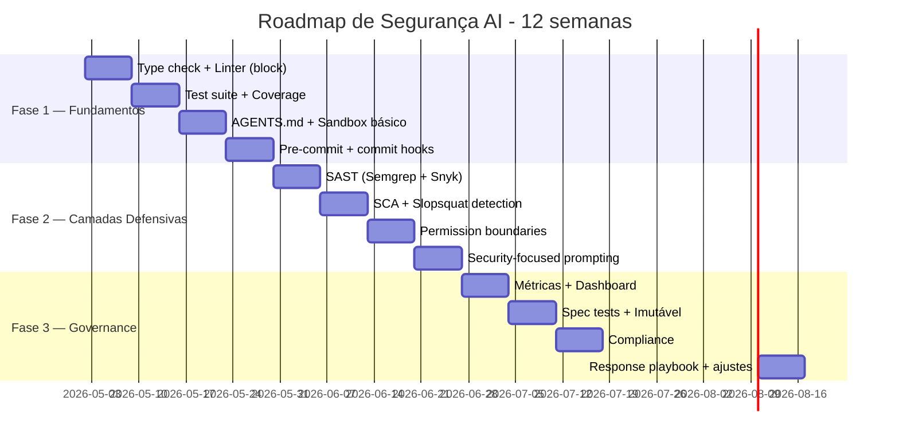

# O roadmap de segurança para times

> [!abstract] TL;DR
> Esta nota fecha a Trilha 6 com **plano de adoção progressiva** — semana a semana, do zero a um pipeline de segurança maduro para AI code. Não tente tudo de uma vez. Padrão recomendado: **3 fases**, cada uma de 4-6 semanas. Fase 1 instala **fundamentos** (type check, lint, test obrigatórios em CI); fase 2 adiciona **camadas defensivas** (SAST, SCA, sandbox, prompting policies); fase 3 traz **governance** (métricas, compliance, response playbooks). Ao final: time vai gerar com IA **mais rápido E mais seguro** que a baseline pré-IA.

## A premissa

> *"Sem AI security é incidente em prod; com AI security mal implementada é fricção que mata produtividade. Adopt progressively."*

Mover muito devagar = produção em fogo. Mover muito rápido = time abandona o método. Roadmap intermediário é o caminho.

## O panorama de 12 semanas



Cada barra = ~1 semana de implementação + monitoring.

## Fase 1 — Fundamentos (semanas 1-4)

### Semana 1 — Type check + Linter bloqueando

**Por quê primeiro:** pega 60% das [[03 - Alucinações em código — APIs fantasma e parâmetros inexistentes|alucinações]] sem custo extra.

```yaml
# .github/workflows/checks.yml
on: [push, pull_request]
jobs:
  static:
    steps:
      - name: Type check (BLOCK)
        run: mypy src/ --strict   # ou tsc --noEmit
      - name: Lint (BLOCK)
        run: ruff check src/      # ou eslint
```

> [!tip] **Block, não warn.** Sem block, time aprende a ignorar.

### Semana 2 — Test suite + coverage

```yaml
- name: Test
  run: pytest --cov=src --cov-fail-under=80
```

Coverage 80% é meta inicial. Subir gradualmente.

### Semana 3 — AGENTS.md + sandbox básico

Criar/atualizar `AGENTS.md` com:

- Convenções de código
- **Security policies** ([[07 - Security-focused prompting]])
- Test policy (ver [[09 - Testes imutáveis — a barreira que o agente não pode reescrever]])

Sandbox padrão de Claude Code/Cursor habilitado:

- Filesystem allowlist
- Network allowlist
- Bash command allowlist
- `~/.ssh/`, `.env*` denied

### Semana 4 — Pre-commit hooks

Hooks locais que rodam **antes** de commit:

```yaml
# .pre-commit-config.yaml
repos:
  - repo: https://github.com/astral-sh/ruff-pre-commit
    hooks: [{id: ruff}]
  - repo: https://github.com/pre-commit/mirrors-mypy
    hooks: [{id: mypy}]
  - repo: https://github.com/Yelp/detect-secrets
    hooks: [{id: detect-secrets}]
```

Time recebe feedback **imediato**, não no CI 10 min depois.

### Saída da Fase 1

- ✅ Type check + lint bloqueando todos os PRs
- ✅ Test coverage ≥80%
- ✅ AGENTS.md com policies básicas
- ✅ Sandbox configurado
- ✅ Pre-commit ativo
- ✅ Defect escape rate caindo

## Fase 2 — Camadas defensivas (semanas 5-8)

### Semana 5 — SAST

Adicionar **2 tools** (regra dos 78%):

```yaml
- name: Semgrep
  uses: returntocorp/semgrep-action@v1
  with:
    config: p/owasp-top-ten p/secrets

- name: Snyk Code
  uses: snyk/actions/setup@master
  run: snyk code test --severity-threshold=medium
```

Calibrar: começar como warning, virar block após 1 semana de calibração.

### Semana 6 — SCA + slopsquat

```yaml
- name: Snyk Open Source
  run: snyk test --severity-threshold=high

- name: Socket Security
  uses: socketsecurity/action@v1
```

Lockfile verification:

```yaml
- run: |
    if ! npm ci; then
      echo "::error::package-lock.json out of sync"
      exit 1
    fi
```

### Semana 7 — Permission boundaries refinadas

[[06 - Permissões e sandboxing|Sandbox]] avançado:

- Allowlist de comandos bash mais estrita
- Network proxy filtrante
- Git: deny de `--force`, `reset --hard`
- DB: confirmar zero acesso a prod
- Audit log de todas as ações do agente

Considerar: rodar agente em container Docker para isolation extra.

### Semana 8 — Security-focused prompting

Migrar instruções genéricas para [[07 - Security-focused prompting|patterns que funcionam]]:

- Threat models por tipo de feature
- Listas negativas explícitas em AGENTS.md
- Schema enforcement com `extra="forbid"`
- Templates por categoria de feature

### Saída da Fase 2

- ✅ SAST + SCA bloqueando PRs
- ✅ Slopsquat detection ativa
- ✅ Sandbox refinado
- ✅ Prompting policies em AGENTS.md
- ✅ Vulnerability introduction rate (VIR) próxima de zero em CWE críticas

## Fase 3 — Governance (semanas 9-12)

### Semana 9 — Métricas + dashboard

Implementar [[10 - Métricas de qualidade AI — defect escape rate, rework ratio|métricas]]:

- Defect escape rate
- Rework ratio
- Mean time to defect
- Vulnerability introduction rate
- AI-attributable defects

Dashboard simples (Grafana/Datadog/Notion table) com revisão semanal.

### Semana 10 — Spec tests + imutabilidade

[[09 - Testes imutáveis — a barreira que o agente não pode reescrever|Spec tests]]:

- Estrutura `tests/spec/`, `tests/security/`, `tests/contract/`
- Path-based deny no sandbox
- CODEOWNERS para essas pastas
- AGENTS.md atualizado com regra explícita

### Semana 11 — Compliance: AI Act + GDPR

Se aplicável (clientes UE, dados de EU citizens, high-risk use):

- Audit log automático de PRs com IA
- Metadata: modelo, spec, reviewer, modificações
- Retenção configurada (mínimo 6 meses)
- DPIA + AI risk assessment combinados (versionados)
- License check no SCA

Ver [[11 - Governance as architecture — EU AI Act, GDPR, licenças]].

### Semana 12 — Response playbook + ajustes

Documento "**O que fazer quando**":

- Slopsquat detectado → isolar, audit, reset creds
- Vuln em prod → rollback, postmortem, fix forward
- AIAD subindo → análise causa raiz, ajuste de gates
- Drift → reforçar SDD, calibrar gates

Revisão final: o que funcionou, o que não, ajustes para próximo trimestre.

### Saída da Fase 3

- ✅ Dashboard com métricas atualizado semanalmente
- ✅ Spec tests imutáveis em produção
- ✅ Compliance pipeline ativa
- ✅ Response playbook documentado
- ✅ Time tem **mais** velocity líquida com **menos** débito que pré-IA

## Sinais de adoção bem-sucedida

| Sinal | Meta |
|---|---|
| **Defect escape rate** | -50% vs início |
| **Vulnerability introduction (críticas)** | 0 nas últimas 8 semanas |
| **Rework ratio** | <20% |
| **MTTD** | >7 dias (vs 1-2 dias inicial) |
| **PRs bloqueados em CI** | 30-50% (saudável) |
| **PRs com human review fadigado** | -70% |
| **Velocity líquida** | +10-30% vs baseline |

## Sinais de adoção falhando

> [!warning] Reagir
> - DER subindo apesar de gates → camadas com gap
> - Time desativando rules → falsos positivos demais; calibrar
> - Pre-commit pulado em PRs urgentes → política de exception
> - Dashboard nunca olhado → revisão semanal não acontece
> - Devs frustrados → adoção forçada vs. cultural

## Adaptações por tamanho de time

| Tamanho | Fase 1 | Fase 2 | Fase 3 |
|---|---|---|---|
| **Solo dev** | 1-2 semanas | Skip ou simplificado | Skip ou simplificado |
| **Time pequeno (2-5)** | 4 semanas | 4 semanas | 4 semanas |
| **Time médio (5-15)** | 4 semanas | 4 semanas | 4 semanas + dedicated security person |
| **Time grande (>15)** | 6 semanas | 6 semanas + multiple SAST | 6 semanas + dedicated security team |
| **Enterprise / regulated** | 8 semanas | 8 semanas | Compliance é primário, não Fase 3 |

## Manutenção pós-adoção

- **Mensal:** revisar métricas, ajustar gates calibrados
- **Trimestral:** revisar SAST rules, atualizar dependências de tools
- **Semestral:** atualizar threat models, AI tools (Claude/Cursor versões novas)
- **Anual:** auditoria de compliance, atualização de DPIA/AI assessment

## Anti-patterns na adoção

- **Tudo de uma vez** — time abandona, vira teatro
- **Pular Fase 1, ir direto para SAST avançado** — fundação fraca
- **Compliance só no final, sem fundação técnica** — vira documentação sem enforcement
- **Sem buy-in do time** — gates ignorados ou desativados
- **Sem revisão de métricas** — não sabe se funcionou
- **"Configurar e esquecer"** — tools envelhecem, ataques evoluem

## A pergunta de fechamento

Após 12 semanas:

> *"Estamos gerando código com IA mais rápido E com qualidade igual ou melhor que pré-IA?"*

Se sim → adoção bem-sucedida.
Se não → ajuste calibração, talvez voltar uma fase.

Sem essa pergunta sendo respondida com **dados**, adoção é fé.

## Veja também

- [[01 - Código gerado por IA é untrusted]]
- [[04 - A pirâmide de validação AI]]
- [[10 - Métricas de qualidade AI — defect escape rate, rework ratio]]
- [[11 - Governance as architecture — EU AI Act, GDPR, licenças]]
- [[Spec-Driven Development|11 - Guia de implementação SDD — do zero ao projeto]]
- [[Context Engineering|14 - Context engineering na prática — setup completo]]

## Referências

- **Veracode** — *2025 GenAI Code Security Report* (2025).
- **DryRun Security** — *Top 10 AI SAST Tools for 2026* (2026).
- **Anthropic** — *Best practices for Claude Code* (2026).
- **NVIDIA** — *Practical Security Guidance for Sandboxing Agentic Workflows* (2026).
- **EU AI Act** — entrada em aplicação total agosto 2026.
