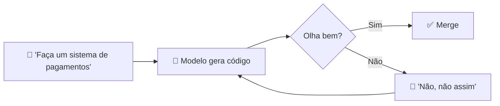

# O problema do vibe coding em produção

> [!abstract] TL;DR
> "Vibe coding" — descrever objetivos vagos para um agente e aceitar o que ele entrega — é fantástico para protótipos e ruinoso em produção. Em 2025-2026, múltiplos relatórios convergiram: **45% do código gerado por IA tem vulnerabilidade de segurança** (Veracode 2025); estudos acadêmicos elevam para >60%; Salesforce Ben e analistas chamam **2026 de "o ano do tech debt"**. O problema não é a ferramenta — é a metodologia. Pedir código com prompts ambíguos garante código ambíguo. SDD existe como resposta direta a esta crise.

## A definição que se popularizou

O termo *vibe coding* foi cunhado por Karpathy (fev 2025) para descrever um modo casual de codificar com IA: você descreve a intenção em linguagem natural, aceita o que o modelo entrega, e itera por feedback. Para protótipos, é libertador. Para produção, é o caminho mais rápido para tech debt acumulado.



O loop "olha bem? → merge" é o cerne do problema. Sem critério explícito de sucesso, o que vai para produção é o que parece certo na demo, não o que **é** certo.

## Os números

> [!warning] Veracode 2025 GenAI Code Security Report
> *"Cerca de 45% do código gerado por IA contém falhas de segurança."* Estudos acadêmicos independentes mediram >60%.

> [!warning] Salesforce Ben (2026 predictions)
> *"2026 será o ano do tech debt — graças ao vibe coding."*

> [!warning] Multiple research studies (2025-2026)
> Vibe coding e AI co-workers estão produzindo: degradação acelerada de qualidade, crescimento exponencial de vulnerabilidades, manutenção insustentável.

A questão não é se acontece — é quão rápido escala. Time pequeno + agente capaz pode produzir em 3 meses uma codebase que um time de manutenção levaria 18 meses para estabilizar.

## Por que LLMs falham em produção sem spec

A falha não é "modelo não é inteligente o bastante" — é **falta de constraint**:

| Sintoma | Causa raiz |
|---|---|
| **Hallucinations de dependências** | Sem schema explícito, modelo inventa libs/imports |
| **Drift arquitetural** | Sem regra explícita, cada feature usa padrão diferente |
| **Bug regression em retrabalho** | Sem teste como contrato, fix de bug A quebra B |
| **Insegurança "padrão"** | Sem política, modelo escolhe defaults inseguros |
| **Inconsistência cross-feature** | Sem canon, mesma operação tem 3 implementações |
| **Perda de contexto entre sessões** | Sem persistência, agente "esquece" decisões |

Cada sintoma é a falta de uma **especificação** explícita. Mais inteligência no modelo não cura — porque ambiguidade no input gera ambiguidade no output.

## A equação do tech debt acelerado

```
tech_debt = velocidade_geração × ambiguidade_intent × falta_de_validação
```

LLMs maximizam o primeiro termo. Sem reduzir os outros dois, débito explode. Vibe coding maximiza os três.

## O paradoxo da produtividade

A primeira sensação ao adotar agentes é **euforia**: "produzo 5x mais!". Em 6 meses, o time desce para a realidade:

- 30-40% do tempo agora é gasto **revisando** outputs do agente
- Mais 20% **refatorando** o que estava "quase certo"
- Mais 10% **debugando** falhas em prod que passaram batido
- Net: produtividade real raramente bate +50%, e o **acúmulo** de débito reduz produtividade futura

Sem disciplina, vira dívida com juros compostos.

## Sintomas de vibe coding em uma equipe

> [!question] Diagnóstico — sua equipe sofre disso?
>
> - [ ] Não há padrão claro do que entra em PR gerado por IA
> - [ ] "Funciona na minha máquina" virou "funciona pro Cursor"
> - [ ] Cada engenheiro promptea de jeito diferente para a mesma feature
> - [ ] Não há testes específicos para regressões introduzidas por IA
> - [ ] Decisões de arquitetura mudam sem registro
> - [ ] Specs (quando existem) ficam stale enquanto código avança
> - [ ] Code review virou "olhar e aprovar" porque ninguém entende mais o todo
>
> 4+ marcadas → você está em vibe coding territory.

## A crise está nos dados de incidentes

| Dado | Fonte | Período |
|---|---|---|
| 45% do código IA com falhas de segurança | Veracode 2025 GenAI Report | 2025 |
| 60%+ em estudos acadêmicos | Múltiplos papers | 2025-2026 |
| 65% das falhas enterprise IA atribuídas a context drift | CIO Magazine | 2025 |
| Crescimento exponencial de vulnerabilidades em projetos AI-heavy | Pixelmojo, Tech Startups | 2026 |

**Ninguém está dizendo "pare de usar IA"**. A indústria está dizendo: o método precisa mudar.

## A resposta: spec-driven development

> [!quote] Augment Code (2026)
> *"Teams that win are the ones who 'encode intent precisely', using spec-driven development (SDD), one of the strongest emerging methods for engineering, because it translates business intent into machine-readable constraints, which both humans and AI can follow."*

SDD não é "voltar a waterfall". É reconhecer que **agentes precisam de contrato**, do mesmo jeito que um humano precisa de DoD. Os próximos capítulos da trilha mostram o como.

## Veja também

- [[02 - O que é Spec-Driven Development]]
- [[03 - Níveis de rigor — spec-first, spec-anchored, spec-as-source]]
- [[Agentes de Codificação|02 - Vibe coding vs engenharia disciplinada]]
- [[Agentes de Codificação|03 - O comprehension gate]]
- [[Segurança e Guardrails]]

## Referências

- **Andrej Karpathy** — *Vibe coding* (fev 2025).
- **Veracode** — *2025 GenAI Code Security Report* (2025).
- **Salesforce Ben** — *2026 Predictions: It's the Year of Technical Debt* (2026).
- **Pixelmojo** — *The AI Coding Technical Debt Crisis* (2026).
- **Tech Startups** — *The Vibe Coding Delusion* (dez 2025).
- **arxiv:2512.11922** — *Vibe Coding in Practice: Flow, Technical Debt* (2025).
