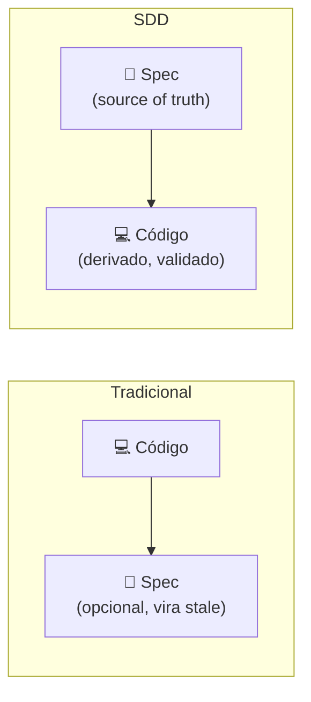
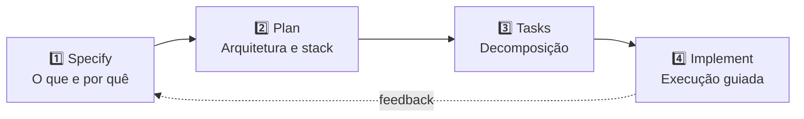

# O que é Spec-Driven Development

> [!abstract] TL;DR
> Spec-Driven Development (SDD) é a metodologia que **inverte a relação entre código e especificação**. Tradicionalmente, código é o source of truth e specs são documentação opcional. Em SDD, **specs são o source of truth**, e código é um artefato derivado e validado contra elas. O pipeline canônico tem 4 fases: **Specify → Plan → Tasks → Implement** (variante GitHub Spec Kit). Specs viram contratos executáveis: validados em CI/CD, atualizados com PR, e usados como contexto persistente do agente. Foi a resposta direta da indústria em 2025-2026 ao tech debt do [[01 - O problema do vibe coding em produção|vibe coding]].

## A inversão fundamental



> [!quote] Augment Code — *What Is Spec-Driven Development* (2026)
> *"SDD turns specifications from passive documentation into executable contracts that constrain what AI agents generate. Code becomes a generated output derived from these human-authored specifications."*

## Por que isso muda tudo para agentes

Para humanos, "spec é a fonte da verdade" pode soar burocrático. Para LLMs, é **a única forma de obter previsibilidade**:

- Sem spec, o agente preenche ambiguidade com **alucinação plausível**
- Com spec, o agente preenche ambiguidade **consultando a spec**
- Sem spec, validação é "olhômetro humano"
- Com spec, validação é **regra mecânica**

A spec é, simultaneamente: contexto do agente, contrato do output, base de testes, registro de decisão.

## O pipeline canônico

A forma mais difundida em 2026 (GitHub Spec Kit, Kiro, OpenSpec) tem 4 fases:



### Fase 1 — Specify

**Pergunta:** *"O que estamos construindo e por quê?"*

- Linguagem natural estruturada (markdown), legível por humano e LLM
- Foco em **outcomes** e **constraints**, não em implementação
- Exemplos: user journeys, acceptance criteria, non-functional requirements

Ver [[04 - Fase Specify — definindo outcomes e constraints]].

### Fase 2 — Plan

**Pergunta:** *"Que arquitetura, stack e decisões técnicas atendem a spec?"*

- Stack escolhida com justificativa
- Diagramas, contratos de API, schemas
- Constraints concretas (perf, security, compliance)

Ver [[05 - Fase Design e Plan — arquitetura e decomposição]].

### Fase 3 — Tasks

**Pergunta:** *"Como decompor o plano em unidades pequenas, testáveis, revisáveis?"*

- Cada task tem entrada, saída, critério de aceitação
- Ordem de execução com dependências explícitas
- Tasks pequenas o bastante para serem feitas (ou refeitas) em uma sessão

Ver [[06 - Fase Implement — execução disciplinada]].

### Fase 4 — Implement

**Pergunta:** *"Executar as tasks usando spec + plan como contexto, com validação contínua."*

- Agente trabalha task-a-task
- Cada task tem teste; teste falha → not done
- Spec é referência ativa, não decoração

Ver [[07 - Fase Validate — spec como contrato executável]].

## Variações de naming

Diferentes ferramentas usam nomes ligeiramente diferentes para fases similares:

| Spec Kit (GitHub) | Kiro (Amazon) | OpenSpec | Augment Code |
|---|---|---|---|
| Specify | Specs | Proposal | Specify |
| Plan | Steering | (incluído) | Design |
| Tasks | (incluído) | (incluído) | Plan |
| Implement | Hooks + Subagents | Apply + Archive | Build |

A semântica é a mesma: **spec → plano → tasks → execução validada**.

## O que muda na prática

### O artefato central muda

Antes: PR é o artefato. Spec, se existe, está num Confluence stale.
Depois: **A spec é versionada no repositório**. PR de feature começa com PR da spec.

### O loop de mudança muda

```
Antes:
  ideia → código → review → merge → (talvez) atualizar doc

Depois:
  ideia → spec → review da spec → plan → tasks → código → validação contra spec → merge
```

Mais passos, sim. Cada passo elimina ambiguidade. **Latência inicial maior, retrabalho radicalmente menor.**

### A revisão muda

Antes: review olha código, julga "parece certo".
Depois: review olha **se o código atende a spec**. Critério mecânico em boa parte.

## Não é waterfall reciclado

> [!warning] Diferenças cruciais
>
> | Waterfall | SDD |
> |---|---|
> | Spec é gigante e antecipada | Spec é incremental, por feature |
> | Spec assinada → execução longa cega | Spec → tasks pequenas → feedback rápido |
> | Mudança de spec = projeto refeito | Mudança de spec = PR atomizado |
> | Spec em Word/PDF | Spec em markdown versionado |
> | Spec lida por humano só | Spec lida por humano e máquina |
> | Validação no fim | Validação contínua (CI/CD) |

SDD é **agile com contrato explícito**. Não acabou com sprints; acabou com prompts ambíguos.

## Quando SDD compensa

| Cenário | Vale SDD? |
|---|---|
| Protótipo descartável | ❌ Não |
| Hackathon de fim de semana | ❌ Não |
| Produto em produção, time >2 | ✅ Sim |
| Brownfield com tech debt | ✅✅ Especialmente |
| Compliance regulado | ✅✅✅ Praticamente obrigatório em 2026 |
| Feature isolada de baixa criticidade | ⚠️ Pode ser overkill |

## A trilha completa em uma frase

SDD diz: **transforme intent em contratos explícitos antes de pedir código**, e o agente vira aliado em vez de fonte de débito.

## Veja também

- [[01 - O problema do vibe coding em produção]]
- [[03 - Níveis de rigor — spec-first, spec-anchored, spec-as-source]]
- [[04 - Fase Specify — definindo outcomes e constraints]]
- [[Context Engineering|02 - Os quatro pilares — prompt, context, intent, specification]]

## Referências

- **GitHub Blog** — *Spec-driven development with AI: Get started with a new open source toolkit* (2025).
- **Augment Code** — *What Is Spec-Driven Development? A Complete Guide* (2026).
- **Microsoft for Developers** — *Diving Into Spec-Driven Development With GitHub Spec Kit* (2026).
- **Martin Fowler** — *Understanding Spec-Driven-Development: Kiro, spec-kit, and Tessl* (2026).
- **DeepLearning.AI / JetBrains** — *Spec-Driven Development with Coding Agents* course (Andrew Ng + Paul Everitt, abr 2026).
