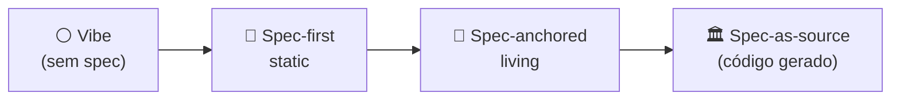

# Níveis de rigor — spec-first, spec-anchored, spec-as-source

> [!abstract] TL;DR
> SDD não é binário. Há um **espectro de rigor** entre vibe coding (zero spec) e spec-as-source (spec gera código). A escolha depende do projeto: protótipo pode viver sem; produto crítico precisa de spec viva. Quatro níveis nomeáveis: **Vibe** (sem spec), **Spec-first/static** (escreveu uma vez, não mantém), **Spec-anchored/living** (mantida em sincronia com código), **Spec-as-source** (spec é fonte, código é gerado). A indústria em 2026 separou ferramentas em duas categorias: *static-spec* (estruturam upfront) e *living-spec* (mantêm sincronia contínua) — Augment Code, Martin Fowler.

## O espectro



| Nível | Spec mantida? | Validação? | Custo de adoção | ROI esperado |
|---|---|---|---|---|
| Vibe | Não existe | Olhômetro | Zero | Negativo em prod |
| Spec-first / static | Não | Manual | Baixo | Médio (curto prazo) |
| Spec-anchored / living | Sim, contínua | Automatizada parcial | Médio | Alto |
| Spec-as-source | Sim, autoritativa | Total | Alto | Muito alto (em escala) |

## Nível 0 — Vibe

**Como é:** *"Faça um sistema de login."* → modelo gera → você merga.

- Sem documento de requisitos
- Sem critério de aceitação explícito
- Code review é olhômetro
- Próxima feature começa do zero

**Quando vale:** prototipos, hackathons, throwaway scripts, exploração inicial.

**Quando dói:** qualquer coisa em produção. Ver [[01 - O problema do vibe coding em produção]].

## Nível 1 — Spec-first / static-spec

**Como é:** escreve a spec **antes** do código, mas depois ela vive como documentação parada.

```
docs/features/login.md   ← escrito antes
src/login/               ← código vive depois
```

- Spec define a primeira versão
- Mudanças subsequentes acontecem **só no código**
- Em 3-6 meses, spec e código divergem
- Vira "documentação de comissão" — útil para onboarding, fora disso ignorada

**Vantagens:**
- Custo baixo de adoção (só uma disciplina inicial)
- Reduz drift na primeira iteração
- Bom para projetos curtos

**Limitações:**
- Drift inevitável após primeira feature shippada
- Time esquece de atualizar
- LLM em sessões posteriores usa spec stale

**Ferramentas típicas:** Notion + revisão pré-PR, GitHub Issues estruturadas.

## Nível 2 — Spec-anchored / living-spec

**Como é:** spec está **versionada no repositório** e é mantida em sincronia com o código a cada PR. Mudança de comportamento → mudança de spec → mudança de código → tudo no mesmo PR.

```
specs/auth/login.md     ← single source mantida
src/login/              ← derivada (e validada contra)
tests/login/            ← roda assertions da spec
```

- PR template inclui "spec atualizada"
- CI tem job que checa drift (spec menciona endpoint que código não tem → fail)
- Code review olha spec **e** código

**Vantagens:**
- Spec sempre fresca
- Agente em sessões futuras tem contexto correto
- Onboarding novo dev é 10x mais rápido
- LLM vira aliado, não fonte de drift

**Limitações:**
- Disciplina adicional (PR template, CI, hábito)
- Curva de adoção 3-6 semanas
- Pode virar burocracia se aplicar a tudo

**Ferramentas típicas:** GitHub Spec Kit, OpenSpec, Kiro (steering files), [[10 - Structured state tracking|NOTES.md/SYSTEM-DESIGN.md]] versionados.

## Nível 3 — Spec-as-source

**Como é:** spec é **autoritativa**. Código é regenerado/derivado a partir dela. Conflito spec vs código? Spec ganha — código é refeito.

```
specs/auth.spec.yml      ← AUTORITATIVO (machine-readable)
src/auth/                ← gerado/derivado, regenerável
contracts/auth.test.yml  ← deriva da spec, executável
```

- Mudança de comportamento **só** entra na spec
- Pipeline CI gera código (ou stubs) a partir da spec
- Validação automática: gerador prova que código atende spec

**Vantagens:**
- Drift impossível por construção
- Auditoria trivial (spec é o registro)
- Compliance fica mais barato (Lean 4-style verification possível — ver [[Context Engineering|12 - Guardrails determinísticos]])
- Multiagent SDD funciona naturalmente ([[09 - SDD com agentes — coordinator/implementor/validator]])

**Limitações:**
- Stack precisa suportar geração / templating
- Inicial pesado: spec linguagem, generator, testes
- Domínio precisa ser modelável (não funciona para tudo)
- Time precisa formalizar pensamento

**Ferramentas típicas:** Kiro com specs estruturadas, Tessl, sistemas de codegen tradicionais (OpenAPI Generator, Protobuf) acoplados a SDD, frameworks emergentes.

## Quando subir um nível

> [!tip] Heurística
>
> **Vibe → Spec-first:** quando a feature dura mais de 1 sprint.
>
> **Spec-first → Spec-anchored:** quando alguém perguntou "isso ainda funciona assim?" e ninguém sabia.
>
> **Spec-anchored → Spec-as-source:** quando compliance exige rastreabilidade total ou quando você tem ≥3 implementações da mesma spec (web, mobile, API).

## Mistura de níveis dentro do mesmo projeto

Não é "tudo ou nada". Projetos maduros frequentemente têm **níveis diferentes por área**:

```
projeto/
├── core/            ← Spec-as-source (compliance crítico)
├── public-api/      ← Spec-anchored (estabilidade)
├── admin/           ← Spec-first (mudança rápida)
└── experiments/     ← Vibe (descartável)
```

Aplicar o nível certo ao escopo certo é decisão arquitetural — não dogma.

## Sinais de que escolheu o nível errado

| Sintoma | Diagnóstico |
|---|---|
| "Spec atrapalha mais que ajuda" | Nível alto demais para o escopo |
| "Não sei o que era pra fazer" | Nível baixo demais |
| "Spec stale, ninguém usa" | Spec-first onde precisava ser anchored |
| "Geração quebra mais do que ajuda" | Spec-as-source onde anchored bastava |
| "Agente segue spec mas drift continua" | Falta automação de validação ([[07 - Fase Validate — spec como contrato executável]]) |

## A escolha não é técnica — é organizacional

O nível certo depende de:

- **Tamanho do time** — 1 dev → spec-first; 20 → anchored ou source
- **Vida útil do código** — 1 mês → spec-first; 5+ anos → anchored mínimo
- **Criticidade** — pet project → vibe; sistema de pagamento → source
- **Compliance** — interno → spec-first; financeiro → source com formal proof

## Veja também

- [[02 - O que é Spec-Driven Development]]
- [[10 - Integração com context engineering — specs como contexto persistente]]
- [[12 - Debates — spec-as-source vs pragmatismo]]
- [[Context Engineering|02 - Os quatro pilares — prompt, context, intent, specification]]

## Referências

- **Augment Code** — *6 Best Spec-Driven Development Tools for AI Coding in 2026* (2026, distinção living vs static).
- **Martin Fowler** — *Understanding Spec-Driven-Development: Kiro, spec-kit, and Tessl* (2026).
- **GitHub Blog** — *Spec-driven development with AI* (2025).
- **Hashrocket** — *OpenSpec vs Spec Kit: Choosing the Right AI-Driven Development Workflow* (2026).
