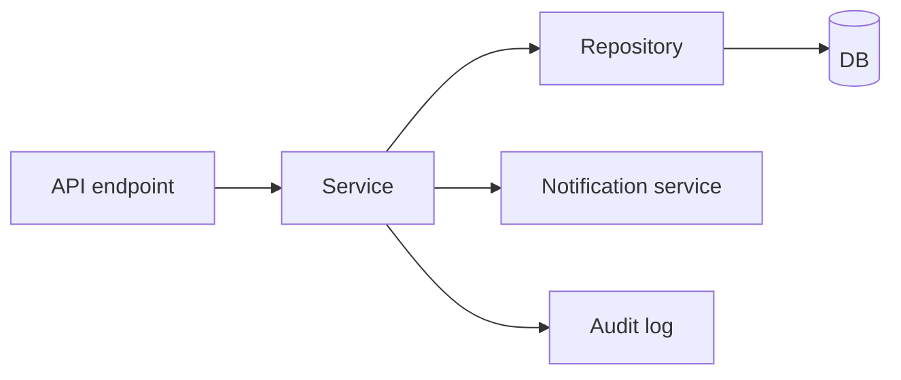
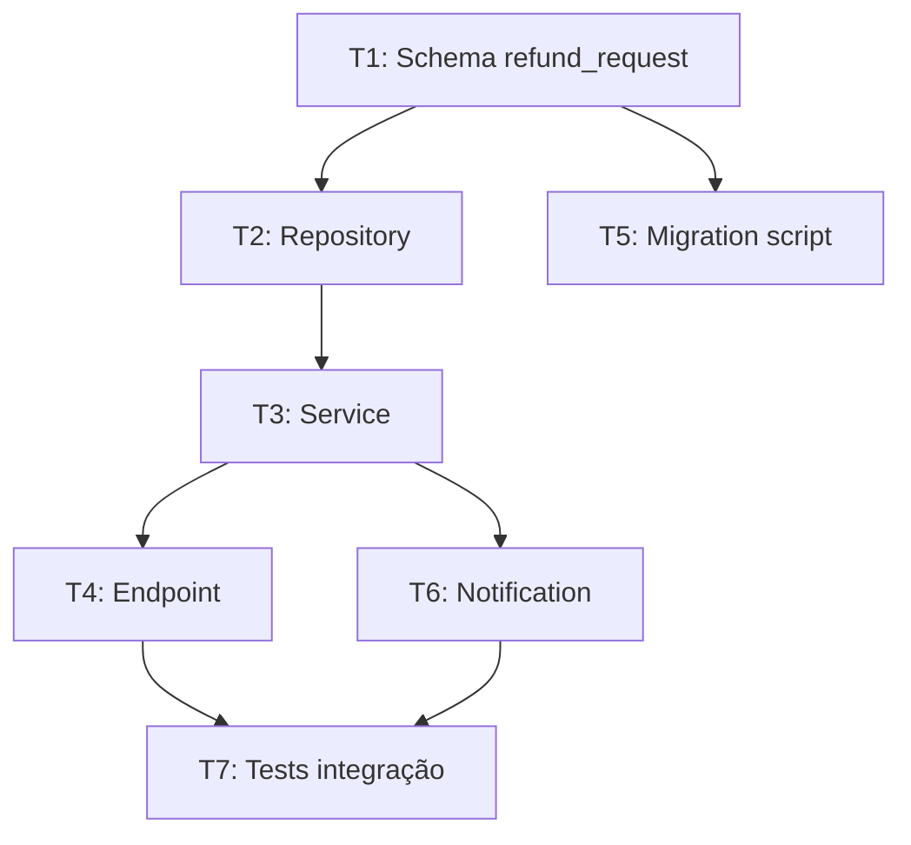

# Fase Design e Plan — arquitetura e decomposição

> [!abstract] TL;DR
> Plan responde **como** vamos atender a [[04 - Fase Specify — definindo outcomes e constraints|spec]]. Duas dimensões: **design** (que arquitetura, que stack, que contratos) e **decomposição** (em quais tasks pequenas e ordenadas o trabalho cabe). O artefato canônico é um documento de plano + uma lista de tasks com dependências. Em 2026, frameworks como Spec Kit/Kiro/OpenSpec automatizam parte da decomposição via LLM, mas a aprovação fica com humano. **Tasks pequenas, testáveis e revisáveis** são o critério de qualidade do plano.

## Plan vs Specify

| Specify | Plan |
|---|---|
| O quê e por quê | Como (arquitetura) |
| Outcomes, journeys, AC | Componentes, contratos, decisões |
| User-facing | Engineer-facing |
| 1-3 páginas | 2-5 páginas |
| Não muda no implementation | Pode evoluir conforme decisões aparecem |

Misturar volta a ser tentador — *"a spec deveria dizer que usa Postgres"*. Não. Postgres é decisão de Plan. Spec é agnóstica de implementação.

## Os 5 componentes do Plan

### 1. Decisões arquiteturais (ADRs)

```markdown
## Decisões

### D1 — Persistência: Postgres
**Razão:** Já no stack; suporta jsonb para metadata flexível.
**Alternativas consideradas:** MongoDB (rejected: time não tem expertise).

### D2 — Idempotência: chave externa do cliente
**Razão:** Cliente pode reenviar sem duplicar.
**Constraint atendida:** NFR de "0 perda de evento".
```

Decisões registradas com **razão** evitam que a próxima sessão do agente as reverta sem motivo.

### 2. Stack e dependências

- Linguagens, runtimes, frameworks (idealmente já em [[Context Engineering|11 - Skills e instructions como contexto|AGENTS.md]])
- Libs específicas para a feature
- Versões fixadas

### 3. Componentes e responsabilidades



Cada caixa nomeada, cada seta com contrato. Não diagrama poético — diagrama com função.

### 4. Contratos de interface

```yaml
# Endpoint
POST /refunds
Request:
  payment_id: string (uuid)
  amount: decimal
  reason: enum [duplicate, fraud, customer_request]
Response 201:
  refund_id: string
  estimated_completion: iso8601
Response 400: ValidationError
Response 409: AlreadyRefunded
```

Em [[03 - Níveis de rigor — spec-first, spec-anchored, spec-as-source|spec-as-source]], esses contratos viram OpenAPI executáveis.

### 5. Constraints técnicas mapeadas

Cada NFR da spec → restrição técnica concreta no plan:

| NFR (spec) | Constraint técnica (plan) |
|---|---|
| Latência p95 < 500ms | Indexação em payment_id; cache em Redis para idempotency lookup |
| 0 perda de evento | Outbox pattern + dead-letter queue |
| Auditável 7 anos | Audit log em tabela separada; backup mensal para S3 Glacier |

## Decomposição em tasks

Plan termina virando uma lista de **tasks pequenas**. Critério de qualidade:

> [!tip] A "regra das 3 hours"
> Cada task deve ser fazível em ≤3 horas (humano ou agente). Mais que isso → quebra em subtasks. Tasks grandes escondem ambiguidade.

### Anatomia de uma task

```markdown
## Task: T1 — Schema de refund_request

### Objetivo
Criar tabela `refund_requests` no Postgres + migration.

### Inputs
- Plan (sections D1, contratos)
- Spec (campo `amount`, `reason` enum)

### Outputs
- Migration em `migrations/004_refund_requests.sql`
- Modelo SQLAlchemy em `src/models/refund_request.py`

### Acceptance
- [ ] Migration roda sem erro em DB limpo
- [ ] Modelo tem type hints completos
- [ ] Teste de modelo passa (unit)
- [ ] Migration tem rollback funcional

### Dependencies
Nenhuma (primeira task)

### Estimativa
1h
```

### Ordem e dependências (DAG)



Tasks formam um **DAG** (directed acyclic graph). Algumas paralelizáveis; outras sequenciais. Em [[09 - SDD com agentes — coordinator/implementor/validator|multi-agent SDD]], esse DAG é o input do coordinator.

## LLM no Plan — onde ajuda

**Ajudam muito:**
- Sugerir decomposição em tasks dado o plan
- Identificar dependências implícitas
- Estimar tasks comparando com histórico
- Mapear NFRs para constraints técnicas

**Cuidado:**
- Sugerem stack desnecessariamente complexa ("vamos adicionar Kafka")
- Inventam dependências entre tasks ("T3 depende de Redis" — sem razão)
- Tendem a granularidade errada (tasks muito grandes ou muito pequenas)

> [!example] Pattern: humano decide stack, LLM detalha tasks
> Engenheiro define em 30 min: "Postgres + FastAPI + Outbox pattern".
> LLM, com isso + a spec, gera 12 tasks numeradas em 3 min.
> Engenheiro revisa, ajusta dependências e estimativas, aprova.

## Múltiplas implementações de plan

Para a mesma spec, podem existir **múltiplos plans válidos** com trade-offs diferentes:

| Plan | Stack | Complexidade | Latência | Custo infra |
|---|---|---|---|---|
| Plan A | Postgres + sync | Baixa | OK | Baixo |
| Plan B | Postgres + Redis | Média | Melhor | Médio |
| Plan C | Postgres + Kafka + ES | Alta | Excelente | Alto |

Escolha de plan = **decisão de arquitetura**. Documente a razão (D1, D2…).

## Como o plan vira contexto do agente

```
specs/refunds/spec.md       ← imutável durante implementation
plan/refunds/plan.md        ← imutável durante implementation
plan/refunds/tasks.md       ← marcações [x] conforme avança
src/refunds/                ← derivado
```

Agente carrega spec + plan + tasks como **contexto base** em toda sessão de implementation. Sem isso, ele "esquece" decisões arquiteturais.

## Anti-patterns

- **Plan que vira pseudocódigo** — invade Implement
- **Plan sem decisões registradas** — só diagrama, sem razão
- **Tasks com 8h+ "fazer feature inteira"** — quebra em sub-tasks
- **Tasks sem acceptance** — agente não sabe quando terminou
- **Dependências implícitas** — tarefa quebra porque outra não foi feita
- **Plan sem NFR mapeado** — performance/segurança vira surpresa
- **Plan que muda no meio sem registro** — drift volta

## Métricas

| Métrica | Alvo |
|---|---|
| **Tasks por spec** | 8-20 (mais que 30 → spec grande demais) |
| **% tasks completas em ≤ estimativa** | >70% |
| **Mudanças no plan durante implement** | <2 por feature |
| **Decisões registradas (ADRs)** | 100% das escolhas significativas |

## Veja também

- [[04 - Fase Specify — definindo outcomes e constraints]]
- [[06 - Fase Implement — execução disciplinada]]
- [[09 - SDD com agentes — coordinator/implementor/validator]]
- [[Context Engineering|10 - Structured state tracking]]

## Referências

- **GitHub Spec Kit** — *Plan phase docs* (2026).
- **Augment Code** — *Coordinator-Implementor-Verifier Pattern* (2026).
- **Anthropic** — *Best Practices for Claude Code: Planning* (2026).
- **Microsoft for Developers** — *Diving Into Spec-Driven Development With GitHub Spec Kit* (2026).
