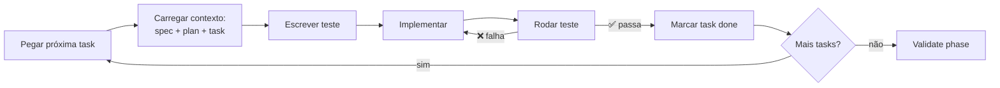
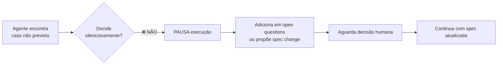
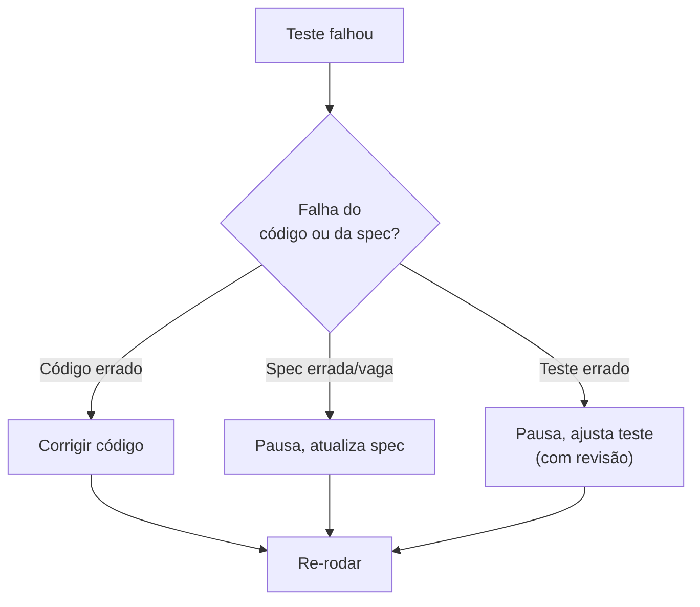

# Fase Implement — execução disciplinada

> [!abstract] TL;DR
> Implement é onde o agente realmente codifica — mas não em modo livre. Usa **spec + plan + tasks como contexto persistente**, trabalha **uma task por vez**, escreve **teste antes** ou junto, e marca a task como done **só quando passa critério de aceitação**. Se desviar do plan, pausa e atualiza o plan (não o oposto). É aqui que SDD se diferencia de "AI escrevendo código com mais documentação": validação contínua contra spec, não no final.

## A regra de ouro

**Trabalhe uma task de cada vez. Spec é referência, plan é roteiro, tarefa é unidade de progresso.**



## Carregar o contexto certo

A cada sessão (ou turno significativo), o agente recarrega:

| Fonte | Posição | Volume típico |
|---|---|---|
| **AGENTS.md** | sempre, no topo | 1-3K |
| **Spec da feature** | sempre, contexto base | 500-2K |
| **Plan da feature** | sempre, contexto base | 1-2K |
| **Task atual** | sempre, foco | 100-300 |
| **Histórico recente da sessão** | sob demanda | variável |
| **Código relevante** | JIT via tools | variável |

A combinação cabe em <10K tokens, deixando janela ampla para reasoning + código.

## Test-first dentro do SDD

Acceptance criteria da task **viram testes**. Convenção: teste é escrito **antes** ou **simultâneo** ao código:

```python
# tests/refunds/test_refund_service.py — escrito ANTES da implementação

def test_refund_full_within_7_days_creates_pending_refund():
    """AC1 do spec: refund total ≤7 dias → cria refund pendente."""
    payment = create_payment(age_days=3)
    result = refund_service.request(payment.id, amount=payment.amount)
    assert result.status == "pending"
    assert result.refund_id is not None

def test_refund_partial_after_7_days_requires_approval():
    """AC2 do spec: refund parcial >7 dias → requer aprovação."""
    payment = create_payment(age_days=15)
    result = refund_service.request(payment.id, amount=payment.amount / 2)
    assert result.status == "approval_required"
```

> [!tip] Sem teste, sem done
> A task **não é done** se o teste correspondente ao critério de aceitação não está escrito e passando.

## A unidade de progresso é a task

| Não | Sim |
|---|---|
| "Implementar a feature toda na sessão" | "Implementar Task T3" |
| "Vou refatorar enquanto implemento Task T3" | "T3 done. Refactor é Task T8" |
| "Esse plan tá meio ruim, mudo no código" | "Plan parece errado. Pausa, atualiza plan, segue" |
| "Vou seguir minha intuição aqui" | "Plan diz X. Faço X. Se intuição diz Y, escreve em open questions" |

## Spec drift detection durante implement

Se o agente percebe que **a spec não cobre** uma situação real:



Decisões silenciosas durante implement são a fonte #1 de drift. Anti-pattern. Padrão correto: **registrar e pausar**.

## Hooks para disciplina (Kiro, Claude Code)

Ferramentas em 2026 oferecem hooks que automatizam disciplina:

| Hook | Trigger | Ação |
|---|---|---|
| `pre-edit` | Antes de modificar arquivo | Verifica spec/plan está em contexto |
| `pre-test` | Antes de rodar test | Verifica teste existe para AC |
| `post-test` | Depois de teste passar | Marca task como done |
| `pre-commit` | Antes de commit | Roda linter, type check, test suite |
| `pre-merge` | Antes de merge | Valida cobertura de spec ([[07 - Fase Validate — spec como contrato executável]]) |

Hooks são a infraestrutura que torna disciplina **default** em vez de **opcional**.

## Pequenos commits, mensagens com link para spec/task

```
feat(refunds): T3 — implement refund_service.request

Implements AC1 and AC2 from specs/refunds/spec.md.

Refs: plan/refunds/plan.md (D2 — idempotency via outbox)
Closes: T3
```

Cada commit referencia spec + task. Audit trail viaja com o git history.

## O loop falha-corrige

Quando teste falha:



A maioria das falhas é "código errado" — fix simples. Mas SDD obriga a **diagnosticar** antes de corrigir. Patcheando teste para passar (sem revisão da spec) = anti-pattern grave.

## Multi-task em paralelo (avançado)

Tasks **independentes** no DAG podem ser feitas em paralelo:

```
T1 (schema) ──┐
              ├──→ T3 (service) ──→ T4 (endpoint)
T2 (test setup) ─┘
T5 (notification) (paralela com T3 e T4)
```

Em [[09 - SDD com agentes — coordinator/implementor/validator|multi-agent SDD]], o coordinator dispara sub-agentes em paralelo. Em time pequeno, vira distribuição entre devs ou múltiplas sessões do mesmo dev.

## Quando o agente não sabe

Padrões aceitáveis quando o agente está incerto:

1. **Pesquisar no codebase** (grep, read_file de exemplos similares)
2. **Consultar a spec** (o resposta pode estar lá)
3. **Reler o plan** (decisão pode já ter sido tomada)
4. **Pausar e perguntar** (humano decide)

**Inaceitável:** chutar e seguir adiante sem registro.

## Métricas

| Métrica | Alvo |
|---|---|
| **% tasks completadas em primeira tentativa** | >70% |
| **% AC com teste correspondente** | 100% |
| **Tempo médio entre task start e done** | ≤ estimativa do plan |
| **Mudanças no plan durante implement** | <2/feature |
| **Tasks "skipadas" por sair do escopo** | <5% |

## Anti-patterns

- **Pular task — fazer várias juntas** — perde rastreabilidade e causa rework
- **Não escrever teste antes** — code review descobre tarde
- **Mudar plan no commit message em vez de PR no plan** — drift silencioso
- **Marcar task done com teste falhando** — destrói o sinal
- **Adicionar funcionalidade fora da spec** — viola o contrato
- **Sessões muito longas sem checkpoint** — perdas em caso de erro

## Veja também

- [[05 - Fase Design e Plan — arquitetura e decomposição]]
- [[07 - Fase Validate — spec como contrato executável]]
- [[09 - SDD com agentes — coordinator/implementor/validator]]
- [[Context Engineering|10 - Structured state tracking]]
- [[Agentes de Codificação|03 - O comprehension gate]]

## Referências

- **Anthropic** — *Best Practices for Claude Code: Implementation* (2026).
- **Kiro** — *Hooks and Subagents documentation* (2026).
- **GitHub Spec Kit** — *Implement phase* (2026).
- **OpenSpec** — *Apply phase state machine* (2026).
