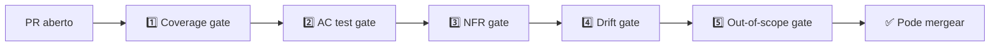

# Fase Validate — spec como contrato executável

> [!abstract] TL;DR
> Validate é o que **fecha o ciclo** SDD — sem ela, virou só "documentação melhor". Fase Validate transforma a spec em **contrato executável**: jobs de CI verificam que cada acceptance criterion da spec corresponde a teste passando, que código não tem features fora do escopo, que NFRs (latência, cobertura, segurança) batem com o declarado. Em 2026, ferramentas como Kiro, Spec Kit e Tessl integram validation diretamente no pipeline. **Drift detection** (spec menciona X que código não tem) é o gate central.

## A pergunta que Validate responde

> *"Como mecanicamente provar que o código atende à spec?"*

Sem essa fase, a spec vira teatro. Com ela, vira lei.

## Os 5 gates canônicos



### Gate 1 — Coverage gate

**Pergunta:** *cada acceptance criterion tem pelo menos um teste?*

```yaml
# .ci/spec-coverage.yml
on: [pull_request]
jobs:
  spec-coverage:
    runs-on: ubuntu-latest
    steps:
      - run: spec-kit verify --coverage --min=100
```

`spec-kit verify --coverage` extrai os `AC1`, `AC2`, … da spec, busca testes com tag/comment matching e falha se algum AC não tem teste.

### Gate 2 — Acceptance test gate

**Pergunta:** *os testes vinculados a cada AC passam?*

Convencional: cada teste referencia o AC que valida.

```python
@pytest.mark.spec("refund.spec.md#AC1")
def test_refund_full_within_7_days():
    ...
```

Pipeline filtra testes por spec, roda, falha se algum AC tem teste vermelho.

### Gate 3 — NFR gate

**Pergunta:** *os non-functional requirements são atendidos?*

NFRs viram **assertions executáveis**:

| NFR (spec) | Gate (CI) |
|---|---|
| `latency_p95_ms: 500` | Load test simulado: assert p95 < 500 |
| `idempotency: required` | Teste manda mesma request 2x: assert mesmo resultado |
| `audit_retention_years: 7` | Inspect schema: assert tabela tem retention policy |
| `coverage_min: 80%` | pytest-cov fail-under=80 |

NFRs ignorados em CI = NFRs não-atendidos.

### Gate 4 — Drift gate

**Pergunta:** *a spec menciona algo que o código não tem (ou vice-versa)?*

Esse é o gate mais crítico em [[03 - Níveis de rigor — spec-first, spec-anchored, spec-as-source|spec-anchored]] e [[03 - Níveis de rigor — spec-first, spec-anchored, spec-as-source|spec-as-source]].

```python
# Pseudocode de drift-detector
def check_drift(spec, code):
    spec_endpoints = extract_endpoints(spec)        # e.g. ["POST /refunds"]
    code_endpoints = extract_routes(code)
    if missing := spec_endpoints - code_endpoints:
        fail(f"Spec menciona {missing}, código não implementa")
    if extra := code_endpoints - spec_endpoints:
        fail(f"Código tem {extra} fora da spec")
```

Implementações reais: parser de OpenAPI vs routes do código, AST scanner vs spec.

### Gate 5 — Out-of-scope gate

**Pergunta:** *o PR adicionou algo que a spec marcou como out-of-scope?*

Spec declara:
```markdown
## Out of scope
- Refund em método diferente do original
- Refund de mais de 90 dias
```

CI procura por endpoints/funções relacionados; falha se aparecer.

## Spec como contrato executável — exemplos

### Em OpenAPI (machine-readable)

```yaml
# spec.yml — fonte autoritativa
paths:
  /refunds:
    post:
      x-acceptance:
        - id: AC1
          test: tests/refunds/test_refund_full.py::test_full_within_7_days
        - id: AC2
          test: tests/refunds/test_refund_partial.py::test_partial_after_7_days
```

CI extrai `x-acceptance` e roda os testes vinculados.

### Em markdown estruturado (legível)

```markdown
## AC1 — Refund total ≤7 dias
**Test:** [test_refund_full_within_7_days](tests/refunds/test_refund_full.py)
**Status:** automated
```

Spec-kit parser lê esses links e roda os testes referenciados.

## Pipeline real (exemplo CI/CD)

```yaml
# .github/workflows/spec-validate.yml
name: SDD Validation

on:
  pull_request:
    paths: ['specs/**', 'src/**', 'tests/**']

jobs:
  spec-validate:
    runs-on: ubuntu-latest
    steps:
      - uses: actions/checkout@v4

      # Gate 1: cobertura de AC
      - name: Acceptance coverage
        run: spec-kit verify --coverage --fail-on-missing

      # Gate 2: testes de AC
      - name: Run acceptance tests
        run: pytest -m spec --tb=short

      # Gate 3: NFRs
      - name: Latency NFR
        run: ./scripts/load-test.sh --p95-max=500ms

      # Gate 4: drift
      - name: Spec-code drift
        run: spec-kit verify --drift

      # Gate 5: out-of-scope
      - name: Out-of-scope check
        run: spec-kit verify --no-out-of-scope

      # Hook para LLM critic
      - name: LLM critic review
        run: claude-cli review-pr --spec specs/refunds/
```

> [!tip] LLM critic como gate auxiliar
> O *último* gate frequentemente é um LLM rodando como **critic** — não como decisor, mas como sinalizador. Compara spec vs implementação e flag inconsistências semânticas que regex não pega.

## Living-spec workflow

Em [[03 - Níveis de rigor — spec-first, spec-anchored, spec-as-source|spec-anchored]]:

```
PR contém:
├── Mudança em specs/refunds/spec.md  (novo AC)
├── Novo teste em tests/refunds/      (referencia novo AC)
├── Mudança em src/refunds/           (atende novo AC)
└── PR description: link para AC novo
```

**Bloqueio se faltar qualquer um:**

- Spec mudou + sem teste → coverage gate falha
- Spec mudou + sem código → drift gate falha
- Código mudou + sem spec → drift gate falha (out-of-scope)

Isso força a sincronia.

## Validate em Kiro / Spec Kit / OpenSpec

| Ferramenta | Validate como |
|---|---|
| **Kiro** | Hooks de pre-commit + pre-merge; subagents de validation |
| **Spec Kit** | CLI `specify verify`; integra com GitHub Actions |
| **OpenSpec** | Estado `archive` exige spec applied + tests passing |
| **Tessl** | Validation contínua durante implement (mais agressivo) |

## Métricas de validation

| Métrica | Alvo |
|---|---|
| **% AC com teste vinculado** | 100% |
| **% PRs com drift detectado** | <5% (acima → spec ou código mal alinhados) |
| **Tempo do pipeline de validation** | <10 min |
| **% NFRs medidos em CI** | >70% (resto fica em test suite manual) |
| **Falsos positivos do drift gate** | <2% (acima vira fricção) |

## Anti-patterns

- **Validation só pré-merge, não no PR** — descoberta tarde
- **AC sem teste vinculado** — coverage gate é regex que não acha
- **NFRs como sugestão** — perf p95 > 500ms shippa porque "depois resolvemos"
- **Drift gate ignorado** — vira "warning" que ninguém olha
- **Out-of-scope flexível** — agente sempre adiciona "uma coisinha a mais"
- **Spec sem ID em AC** — impossível vincular automatizado

## Quando validation falha "demais"

Sintoma: pipeline falha em 30%+ dos PRs. Causas:

- Spec muito vaga (drift inevitável) → reforce [[04 - Fase Specify — definindo outcomes e constraints|specify]]
- Drift gate com regras erradas → calibre detector
- Time não está em [[03 - Níveis de rigor — spec-first, spec-anchored, spec-as-source|nível anchored]] mas exigindo gates desse nível

Validation é proporcional ao nível de rigor adotado. Forçar gates de spec-as-source num projeto spec-first quebra o time.

## Veja também

- [[06 - Fase Implement — execução disciplinada]]
- [[09 - SDD com agentes — coordinator/implementor/validator]]
- [[10 - Integração com context engineering — specs como contexto persistente]]
- [[Context Engineering|12 - Guardrails determinísticos]]
- [[Segurança e Guardrails]]

## Referências

- **GitHub Spec Kit** — *Verify command and validation flow* (2026).
- **Kiro** — *Hooks and CI integration* (2026).
- **Augment Code** — *AI Agent Workflows: Validation* (2026).
- **arxiv:2512.08769** — *A Practical Guide for Designing, Developing, and Deploying Production-Grade Agentic AI Workflows* (2025).
- **Anadea** — *CI/CD Pipelines for AI Agent Development* (2026).
