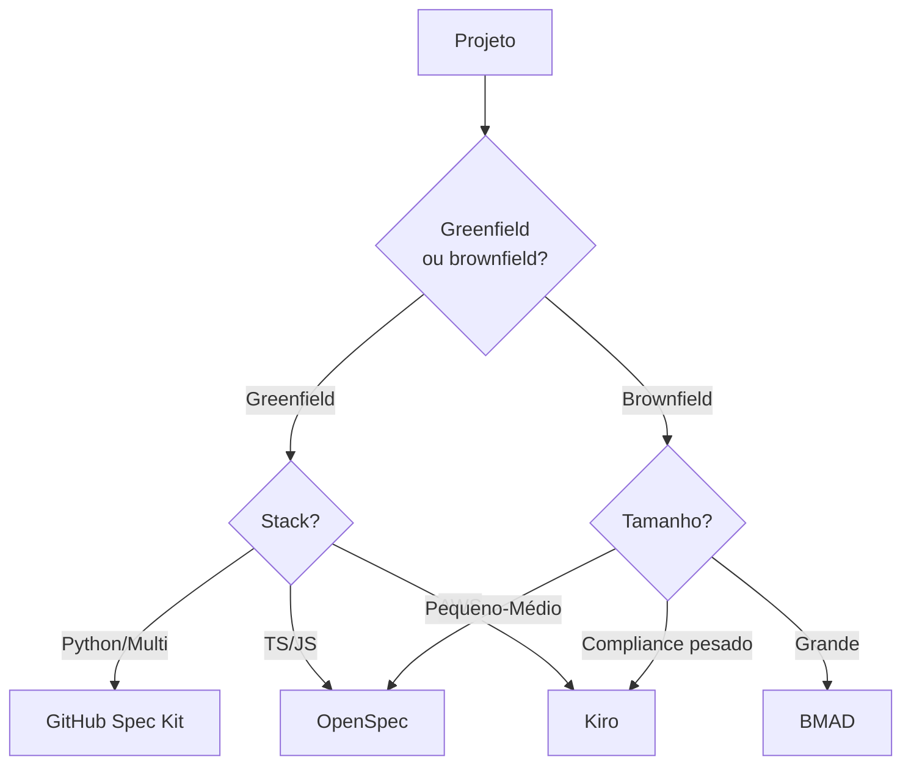

# Ferramentas SDD — Kiro, Spec Kit, OpenSpec, Tessl

> [!abstract] TL;DR
> O ecossistema SDD em 2026 estabilizou em **dois grandes campos**: *static-spec tools* (estruturam spec upfront, Spec Kit / OpenSpec) e *living-spec / agentic IDE* (spec viva integrada com agente, Kiro / Tessl). GitHub Spec Kit virou **o padrão open source** (88k stars, 30+ AI agents suportados). Kiro é a aposta da Amazon para substituir Q Developer. OpenSpec brilha em **brownfield**. Tessl empurra spec-as-source mais agressivamente. Esta nota mapeia quando usar cada um.

## O panorama em uma tabela

| Ferramenta | Categoria | Forte em | Stack | Modelo |
|---|---|---|---|---|
| **GitHub Spec Kit** | Static-spec, CLI | Greenfield, multi-agent | Python | Open source (MIT) |
| **OpenSpec** | Static-spec, CLI | Brownfield, npm-friendly | TypeScript | Open source |
| **Kiro** | Living-spec, IDE+CLI | Full-stack, AWS-aligned | Multi (rodando Claude) | Pago, da AWS |
| **Tessl** | Living-spec, plataforma | Spec-as-source agressivo | Multi | Pago |
| **BMAD** | Agentic framework | Brownfield large-scale | Multi | Open source |

## GitHub Spec Kit — o padrão open source

Lançado em 2025, mantido pelo GitHub (MIT-licensed). 88k stars + 129 releases até abril de 2026. Suporte a **28+ AI coding agents** (Copilot, Claude Code, Gemini CLI, Cursor, Windsurf, etc.).

### Workflow de 4 fases

```bash
specify init my-project
specify add "Add refunds feature"
# Gera prompt para LLM produzir spec.md

specify plan refunds
# Gera plan.md a partir da spec

specify tasks refunds
# Decompõe plan em tasks.md numerada

specify implement refunds
# Loop de execução task-a-task com agente
```

### Quando usar Spec Kit

✅ Greenfield projects
✅ Time já usa CLI tools (Claude Code, Cursor, etc.)
✅ Quer open source com governance ativa
✅ Multi-agent (Copilot + Claude Code colaborando)

❌ Brownfield gigante com convenções já enraizadas
❌ Time avesso a Python (instala como pip)
❌ Quer IDE-integrated (use Kiro)

### Estrutura típica

```
my-project/
├── specs/
│   └── refunds/
│       ├── spec.md
│       ├── plan.md
│       └── tasks.md
├── src/
└── .specify/
    └── config.yml
```

## OpenSpec — brownfield e npm-friendly

Spec-driven development em TypeScript, otimizado para projetos JS/TS já estabelecidos.

### Diferencial: state machine de 3 fases

```
Proposal → Apply → Archive
   ↓        ↓        ↓
Aprova   Implementa  Spec
spec     contra      tornada
         spec        permanente
```

Cada mudança é uma **proposta** que vira **apply** quando implementada e **archive** quando estabilizada. Estados explícitos = drift mais controlado.

### Quando usar OpenSpec

✅ Projeto JavaScript/TypeScript existente
✅ Brownfield com convenções estabelecidas
✅ Quer adoção incremental (não tudo de uma vez)
✅ Time prefere npm install a pip install

❌ Greenfield (Spec Kit é mais natural)
❌ Stack não-JS (use Spec Kit)

### Comando típico

```bash
npm install -g @openspec/cli
openspec init
openspec propose "Add refund support"
openspec apply refunds
openspec archive refunds
```

## Kiro — a aposta da Amazon

Lançado em meados de 2025, **substituirá Amazon Q Developer** (end-of-support em 30/abr/2027). IDE + CLI rodando agentes (Claude por baixo).

### Capabilities únicas

| Feature | O que faz |
|---|---|
| **Specs** | Estruturadas, drive end-to-end implementation |
| **Hooks** | Triggers em save/commit/etc. — enforcement automático |
| **Steering files** | Project-level config persistente (similar a [[Context Engineering\|11 - Skills e instructions como contexto\|AGENTS.md]]) |
| **Custom subagents** | Especialistas (security review, API contract validation) |
| **Multi-week tasks** | Agente trabalha por dias em tarefas grandes |

### Quando usar Kiro

✅ Já está em ecossistema AWS
✅ Quer IDE integrado (não só CLI)
✅ Tarefas longas/multi-semana
✅ Compliance pesado (subagents de security/audit)

❌ Open source / portable
❌ Time não-AWS
❌ Quer só CLI lightweight

### Caso real

> [!example] AWS Industries blog (2026)
> Drug discovery agent: 3 semanas de ideia para produção. Specs estruturadas + steering + subagents de validation científica. Reduziu timeline de meses para semanas.

## Tessl — spec-as-source agressivo

Tessl empurra a barra: spec não é só fonte, é **fonte autoritativa** com geração contínua. Para [[03 - Níveis de rigor — spec-first, spec-anchored, spec-as-source|nível 3]].

### Quando usar Tessl

✅ Domínio modelável (CRUD, APIs estruturadas)
✅ Compliance que exige rastreabilidade total
✅ Stack uniforme (não múltiplas linguagens divergentes)

❌ Domínio "criativo" (ex: ML research)
❌ Time pequeno sem expertise em formal modeling
❌ Greenfield exploratório

## BMAD — brownfield large-scale

Framework open source para brownfield com tech debt. Foco em **decompor** projeto existente em specs progressivamente.

### Quando usar BMAD

✅ Projeto legacy grande
✅ Quer recuperar/documentar spec retroativamente
✅ Adoção incremental, módulo a módulo

## Comparativo de adoção



## Compatibilidade entre ferramentas

| Combo | Funciona? | Comentário |
|---|---|---|
| Spec Kit + Claude Code | ✅✅ | Claude Code suporta nativamente |
| Spec Kit + Cursor | ✅ | Via prompts; menos integrado |
| Kiro + Spec Kit | ⚠️ | Sobreposição; escolha um |
| OpenSpec + Aider | ✅ | npm + Aider dão pra coexistir |
| Kiro + AGENTS.md | ✅ | Steering files + AGENTS.md complementam |

## Custo de adoção

| Ferramenta | Curva | Setup time |
|---|---|---|
| Spec Kit | Suave | 1-2 horas |
| OpenSpec | Suave | 1 hora |
| Kiro | Média | 1 dia (incluindo IDE) |
| Tessl | Íngreme | 1 semana (modeling) |
| BMAD | Média | 2-3 dias |

## Critérios de escolha

> [!question] Pergunte na ordem
> 1. **Greenfield ou brownfield?** → reduz pela metade
> 2. **Stack/ecossistema?** → AWS = Kiro; JS = OpenSpec; outros = Spec Kit
> 3. **Nível de rigor desejado?** ([[03 - Níveis de rigor — spec-first, spec-anchored, spec-as-source]]) — Tessl só faz sentido em nível 3
> 4. **Open source vs pago?** → Spec Kit/OpenSpec/BMAD vs Kiro/Tessl
> 5. **CLI vs IDE?** → Spec Kit/OpenSpec vs Kiro

## Decisão dual — start small

Padrão recomendado: **comece com Spec Kit** (open source, testa a metodologia), evolua para Kiro/Tessl se o projeto pede mais rigor. Migrar para frente é fácil; reverter complexidade desnecessária é doloroso.

## Veja também

- [[09 - SDD com agentes — coordinator/implementor/validator]]
- [[10 - Integração com context engineering — specs como contexto persistente]]
- [[11 - Guia de implementação SDD — do zero ao projeto]]
- [[Agentes de Codificação|11 - Comparativo — qual ferramenta para qual tarefa]]

## Referências

- **GitHub** — *spec-kit GitHub repo* (2026).
- **Fission-AI** — *OpenSpec GitHub repo* (2026).
- **Kiro** — *kiro.dev official site* (2026).
- **Martin Fowler** — *Understanding Spec-Driven-Development: Kiro, spec-kit, and Tessl* (2026).
- **AWS Industries Blog** — *From spec to production: a three-week drug discovery agent using Kiro* (2026).
- **Augment Code** — *6 Best Spec-Driven Development Tools for AI Coding in 2026* (2026).
- **Hashrocket** — *OpenSpec vs Spec Kit: Choosing the Right AI-Driven Development Workflow* (2026).
