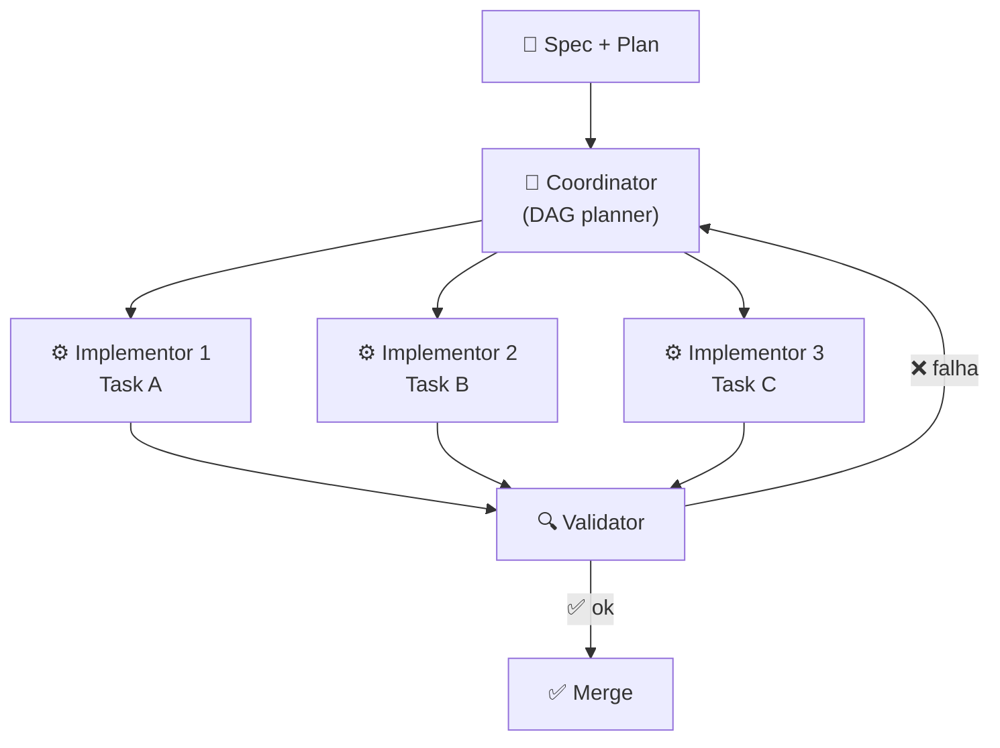

# SDD com agentes — coordinator, implementor, validator

> [!abstract] TL;DR
> SDD é onde **multi-agent começa a fazer sentido**. O padrão dominante em 2026 é o trio **Coordinator/Implementor/Validator (CIV)**: coordinator transforma spec em DAG de subtasks; implementors trabalham em paralelo, cada um com contexto isolado focado na sua task; validators verificam saídas contra spec antes de aceitar. Pesquisa peer-reviewed (VeriMAP, EACL 2026) formalizou o padrão. Anthropic, Augment, AWS Kiro convergiram. Ganho real: paralelismo seguro + isolamento de contexto + drift detection automatizada.

## A premissa



Cada papel tem **contexto isolado** — implementor 1 não vê o histórico do 2. Razão: [[Context Engineering|03 - Context rot e atenção diluída|context rot]] cresce com volume. Isolamento mantém atenção focada.

## Os três papéis

### Coordinator — o orquestrador

> [!quote] VeriMAP arXiv companion (2026)
> *"The Coordinator is the central orchestrator of multi-agent task execution, following the task plan (represented as a DAG) to support reliable and adaptive execution."*

**Responsabilidades:**
- Transformar [[05 - Fase Design e Plan — arquitetura e decomposição|plan]] em DAG de subtasks
- Identificar dependências entre tasks
- Disparar implementors em paralelo onde DAG permite
- Aceitar/rejeitar resultados após validation
- Replanejar se task falha repetidamente

**Contexto:**
- Spec completa
- Plan completo
- Estado do DAG (tasks done/in-progress/blocked)
- **Não vê** o detalhe interno de cada implementor

**Modelo típico:** Opus / Sonnet (precisa raciocínio sobre o todo).

### Implementor — o executor focado

**Responsabilidades:**
- Receber **uma task** com input + acceptance
- Carregar **só o contexto relevante** (spec da feature + plan da feature + arquivos da task)
- Escrever código + testes
- Reportar resultado (passa/falha + evidência)

**Contexto:**
- Task atual (entrada, saída, AC)
- Arquivos do escopo da task
- AGENTS.md / coding conventions
- **Não vê** outras tasks rodando em paralelo

**Modelo típico:** Sonnet / Haiku (tarefa estreita, modelo barato basta).

> [!tip] Por que isolamento ganha
> Implementor com 5K tokens de contexto **resolve melhor uma task** do que coordinator monolítico com 200K tokens carregando 12 tasks. Atenção focada > atenção dispersa.

### Validator — o verificador independente

**Responsabilidades:**
- Receber output do implementor
- Rodar gates (testes do AC, drift, NFR — ver [[07 - Fase Validate — spec como contrato executável]])
- Verificar **independentemente** se atende a spec
- Aprovar ou retornar feedback estruturado

**Contexto:**
- Spec da feature
- Output do implementor (código + testes)
- **Não vê** o reasoning do implementor (evita "passar à vontade")

**Modelo típico:** Sonnet — diferente do implementor (evita mesmo viés).

> [!warning] Validator deve ser independente
> Se validator é o **mesmo agente** com o mesmo prompt do implementor, ele aprova qualquer coisa. Independência arquitetural (modelo diferente, prompt diferente, contexto diferente) é o que torna o gate efetivo.

## Por que isso destrava SDD

| Sem CIV | Com CIV |
|---|---|
| Um agente faz tudo, contexto inflado | Cada agente tem foco estreito |
| Tasks sequenciais → tempo total alto | Paralelismo onde DAG permite |
| Validation = "olhômetro" do humano | Validation = agente independente automatizado |
| Drift detectado tarde | Drift detectado por task |
| Sessão única → falha → recomeço | Falha de task → re-run isolado |

## DAG como input

O coordinator **não inventa o DAG do nada** — ele recebe o plan + tasks de [[05 - Fase Design e Plan — arquitetura e decomposição|fase Plan]] e mapeia para um grafo:

```yaml
# tasks.yml gerado pelo coordinator
tasks:
  T1:
    name: "Schema refund_request"
    inputs: [spec, plan]
    outputs: [migrations/004_*.sql, src/models/refund_request.py]
    depends_on: []
    parallel_safe: true

  T2:
    name: "Repository"
    inputs: [spec, plan, T1]
    depends_on: [T1]
    parallel_safe: true

  T3:
    name: "Service"
    inputs: [spec, plan, T2]
    depends_on: [T2]
    parallel_safe: false  # depende de decisão arquitetural

  T4: { depends_on: [T3] }
  T5: { depends_on: [T1], parallel_safe: true }  # paralelo com T2
```

Coordinator dispara em paralelo onde `parallel_safe: true`. Quando valida e aprova, libera próximas.

## VeriMAP — o caso peer-reviewed

> [!info] VeriMAP (EACL 2026)
> *"Verification-aware planning with DAG-structured subtasks and dependencies."* O sistema formaliza CIV com prova mecânica de que cada subtask atendeu seu contrato antes de prosseguir.

Aplicações: domínios regulados (financeiro, médico) onde rastreabilidade é exigida.

## Variantes do padrão

### Hierarchical (multi-level)

Coordinator pode delegar a **sub-coordinators** para mega-tasks:

```
Coordinator
├── Sub-coordinator A (feature 1)
│   ├── Implementor A1
│   └── Implementor A2
└── Sub-coordinator B (feature 2)
    ├── Implementor B1
    └── Implementor B2
```

Útil em features grandes ou multi-equipes.

### Specialist subagents (Kiro)

Em vez de implementors genéricos, **subagents especializados**:

- `security-reviewer`
- `api-contract-validator`
- `infrastructure-provisioner`
- `db-migration-writer`

Coordinator escolhe specialist por tipo de task.

### LLM critic como validator extra

Pipeline tem N validators encadeados, cada um com foco diferente:

```
Implementor → Test validator → Security validator → Style validator → Approve
```

## Implementações práticas em 2026

| Stack | Como fazer CIV |
|---|---|
| **Claude Code (single tool)** | `Task` tool com `subagent_type` para sub-agentes; orchestration manual no main thread |
| **LangGraph** | StateGraph com nodes coordinator/implementor/validator |
| **Kiro** | Specs + steering + custom subagents nativos |
| **OpenAI Swarm** | Handoffs entre roles |
| **Custom (Python + Anthropic SDK)** | Loop em código, prompt engineering por papel |

## Métricas

| Métrica | Alvo |
|---|---|
| **Speedup vs single-agent** | 2-4x em features com tasks paralelizáveis |
| **% tasks aprovadas em primeira validation** | >75% |
| **% drift detectado pelo validator (não humano)** | >90% |
| **Tokens por feature (CIV vs single)** | Comparável ou menor (apesar de mais agentes) |
| **Coordenação overhead** | <20% do tempo total |

## Quando NÃO usar multi-agent SDD

- Feature muito pequena (1-2 tasks) — overhead ganha
- Time pequeno sem expertise em coordenação
- Falta de DAG claro (signal de plan vago)
- Domínio criativo onde validation mecânica é difícil

## Anti-patterns

- **Coordinator sem paralelismo** — vira chain inútil
- **Implementors recebendo plan completo** — perde isolamento de contexto
- **Validator com prompt = "is this good?"** — viés de aceitar
- **DAG inferido pelo coordinator sem revisão humana** — pode pular dependências
- **Sem fallback quando task falha 3+ vezes** — coordinator entra em loop
- **Custos não monitorados** — N agentes × tokens vira custo escondido

## Veja também

- [[05 - Fase Design e Plan — arquitetura e decomposição]]
- [[06 - Fase Implement — execução disciplinada]]
- [[07 - Fase Validate — spec como contrato executável]]
- [[08 - Ferramentas SDD — Kiro, Spec Kit, OpenSpec, Tessl]]
- [[Context Engineering|09 - Shared memory em multi-agent]]
- [[Economia de Tokens|10 - Sub-agentes especializados]]

## Referências

- **VeriMAP** — *EACL 2026 paper, verification-aware multi-agent planning*.
- **Augment Code** — *Coordinator-Implementor-Verifier Pattern for Dev Teams* (2026).
- **Anthropic** — *Claude Agent SDK: Subagents and Orchestration* (2026).
- **arxiv:2512.08769** — *A Practical Guide for Designing, Developing, and Deploying Production-Grade Agentic AI Workflows* (2025).
- **Kiro** — *Custom subagents documentation* (2026).
