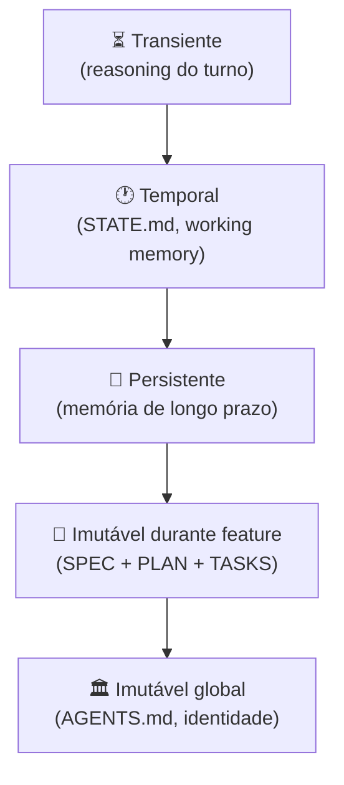

# Integração com context engineering — specs como contexto persistente

> [!abstract] TL;DR
> SDD e [[Context Engineering]] não são disciplinas separadas — são **camadas da mesma stack**. Specs são contexto: imutável, versionado, persistente, machine-readable. Plan é contexto. Tasks são contexto. Quando você faz SDD direito, está fazendo context engineering correto **por construção**. A spec entra na hierarquia de [[Context Engineering|05 - Camadas de contexto — persistente, temporal, transiente|camadas]] no nível mais alto (imutável durante a feature). Esta nota mostra como conectar as duas trilhas operacionalmente.

## A correspondência

| Pilar de [[Context Engineering|02 - Os quatro pilares — prompt, context, intent, specification|context engineering]] | Onde SDD entrega |
|---|---|
| **Prompt craft** | Tasks tem prompts pequenos e focados (acceptance + escopo) |
| **Context engineering** | Spec + plan + tasks + AGENTS.md formam pipeline |
| **Intent engineering** | Outcomes da spec encodam o objetivo do produto |
| **Specification engineering** | É o pilar — SDD é a operacionalização |

SDD é **specification engineering colocada em prática**, conectada com tudo abaixo na pirâmide.

## Onde a spec mora nas camadas



A spec ocupa a **penúltima** camada — imutável **durante a feature**, mutável entre features (cada feature = nova spec). Plan e tasks acompanham.

## Como spec entra na pipeline de contexto

```python
def build_context_for_implementor(turn):
    return [
        load_agents_md(),                    # imutável global
        load_spec(turn.feature),              # imutável durante feature
        load_plan(turn.feature),              # imutável durante feature
        load_current_task(turn.task_id),      # foco do turno
        load_state_md(turn.session),          # working memory
        recent_history_compacted(turn),       # temporal
        relevant_code_jit(turn),              # JIT retrieval
    ]
```

Note como spec se encaixa **naturalmente** no padrão de [[Context Engineering|04 - Context pipelines — montagem dinâmica]].

## Spec como contexto persistente entre sessões

Sem SDD:

```
Sessão 1: agente decide usar Postgres + outbox para idempotência
Sessão 5: agente "esquece" e usa Redis SET para a mesma feature
→ inconsistência arquitetural
```

Com SDD:

```
Sessão 1: agente lê plan.md (D2: idempotency via outbox) → usa outbox
Sessão 5: agente lê plan.md (D2: idempotency via outbox) → ainda usa outbox
→ consistência por construção
```

A spec é **memória externa** que sobrevive a context window resets, agentes diferentes, sessões cruzadas.

## Drift de spec = drift de contexto

> [!warning] Spec stale = context rot estrutural
> Se a spec descreve API v1 e o código já está em v3, o agente carrega contexto **errado** em todo turno. Não é só "doc desatualizada" — é veneno injetado na atenção do modelo.

Por isso [[03 - Níveis de rigor — spec-first, spec-anchored, spec-as-source|spec-anchored]] (living-spec) é o padrão recomendado: garante que contexto persistente reflita realidade.

## Spec + AGENTS.md — divisão de trabalho

| | AGENTS.md | spec.md |
|---|---|---|
| **Escopo** | Projeto inteiro | Uma feature |
| **Vida** | Trimestres a anos | Sprints |
| **Mudança** | Rara | Por feature |
| **Conteúdo** | Convenções, build, security policies | Outcomes, AC, NFRs |
| **Tamanho** | 1-3K | 1-3K |
| **Uso pelo agente** | Sempre carregado | Carregado quando trabalhando na feature |

**Não duplique.** Coisa que vale para todo o projeto vai em AGENTS.md. Coisa específica da feature vai na spec.

## Skills + specs — combo poderoso

[[Context Engineering|11 - Skills e instructions como contexto|Skills]] resolvem **padrões recorrentes**; specs descrevem **o trabalho atual**.

```
.agent/
├── skills/
│   ├── adding-endpoint.md      ← skill (reusável)
│   └── refactoring-pydantic.md ← skill
└── specs/
    └── refunds/
        ├── spec.md             ← spec da feature atual
        ├── plan.md
        └── tasks.md
```

Quando trabalhando na feature **refunds**:
1. Agente carrega `AGENTS.md` (sempre)
2. Carrega `specs/refunds/*` (porque é a feature ativa)
3. Quando vai adicionar endpoint, ativa skill `adding-endpoint.md` (porque é o padrão)
4. Aplica skill com **constraints da spec**

Skills genéricas + spec específica = output certo.

## JIT retrieval guiado pela spec

[[Context Engineering|06 - Dynamic retrieval beyond RAG|JIT retrieval]] funciona melhor quando a spec dá o roteiro:

> [!example]
> Spec: *"Endpoint POST /refunds chama refund_service.request, que persiste em refund_request table."*
>
> Agente decide ler:
> - `src/refunds/service.py` (mencionado na spec via inferência)
> - `src/models/refund_request.py` (mencionado)
> - `tests/refunds/test_service.py` (para entender padrão de teste)
>
> **Não lê:** o resto do codebase. Spec foi o filtro.

Sem spec, agente faz `glob "**/*.py"` e tenta inferir. Com spec, **JIT retrieval é cirúrgico**.

## Compactação que preserva spec

Quando histórico passa do limite e [[Context Engineering|07 - Compressão e pruning de informação|compactação]] roda, a regra:

> [!tip] Spec NUNCA é compactada
> Spec, plan e tasks ficam **fora** da compactação. Eles são âncora. O que compacta é histórico de turnos, tool outputs, reasoning.

Compactação não-cuidadosa pode "resumir" a spec e perder constraint crítica. Em frameworks maduros (Kiro), spec fica em região protegida.

## Multi-agent SDD como context engineering puro

[[09 - SDD com agentes — coordinator, implementor, validator|CIV]] é literalmente uma **arquitetura de contexto distribuída**:

| Camada | Quem vê | Quem não vê |
|---|---|---|
| Coordinator | Spec + plan + DAG | Detalhe interno de implementors |
| Implementor 1 | Spec + plan + sua task | Outras tasks, reasoning de outros |
| Implementor 2 | Spec + plan + sua task | Outras tasks, reasoning de outros |
| Validator | Spec + output | Reasoning do implementor |

Cada papel tem **mínima janela de contexto** com **máxima relevância**. É o ideal de [[Context Engineering|13 - Entropia e qualidade de contexto|entropia de contexto]].

## Padrão de adoção combinada

```
Semana 1-2: Adopt context engineering basics
  - Criar AGENTS.md
  - Configurar prompt caching
  - JIT retrieval via tools nativas

Semana 3-4: Adopt SDD (nível spec-first)
  - Escrever spec antes de cada feature
  - Versionar em specs/

Semana 5-6: Subir para spec-anchored
  - Living spec via PR
  - Drift gate básico

Mês 2: Multi-agent CIV
  - Coordinator/implementor/validator (Kiro ou framework custom)
  - Specs como contexto distribuído

Mês 3+: Spec-as-source (se domínio permite)
  - Geração a partir da spec
  - Validação formal
```

## Métricas integradas

| Métrica | SDD | Context Engineering | Combinada |
|---|---|---|---|
| Drift entre spec e código | <5% | — | — |
| Cache hit rate | — | >70% | Depende de spec estável |
| Tokens por feature | — | -40% baseline | Com SDD: -50% (spec evita re-explorações) |
| % AC com teste | 100% | — | Reforça consistência |
| Sessões que perdem contexto | — | -70% | -90% com SDD anchored |

## Anti-patterns na integração

- **Spec sem versão** — não pode ser memória persistente confiável
- **Spec gigantesca** — vira context rot por si só
- **AGENTS.md duplicando spec** — uma das duas vai stale
- **Compactação que toca spec** — perde constraint crítica
- **Implementor com plan completo** — anula isolamento de contexto
- **Skills citando specs específicas** — quebra reusabilidade

## Veja também

- [[Context Engineering]] — trilha inteira
- [[02 - O que é Spec-Driven Development]]
- [[09 - SDD com agentes — coordinator, implementor, validator]]
- [[Context Engineering|02 - Os quatro pilares — prompt, context, intent, specification]]
- [[Context Engineering|11 - Skills e instructions como contexto]]
- [[Context Engineering|14 - Context engineering na prática — setup completo]]

## Referências

- **Anthropic** — *Effective context engineering for AI agents* (2025).
- **Augment Code** — *AI Spec-Driven Development Workflows* (2026).
- **Atlan** — *Context Engineering Framework for Enterprise AI* (2026).
- **GitHub Spec Kit** — *Integration with AI agents documentation* (2026).
