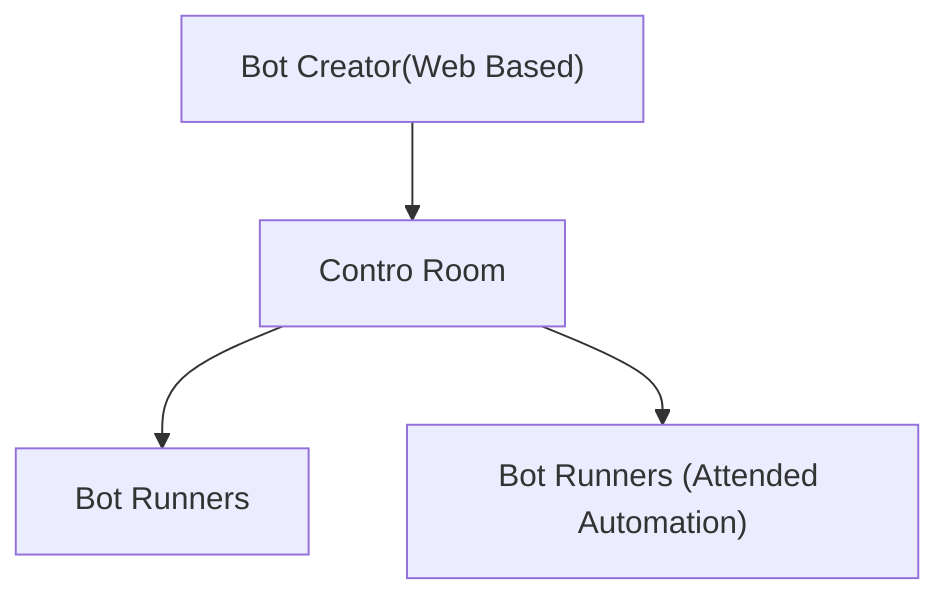

- [[#What is RPA]]
- [[#What are the Benefits os RPA? Why would I use it?]]
- [[#Where do these RPA bots actually work?]]

# What is RPA

RPA stands for Robotic Process Automation.

> [!important] Specialized
> 
> **software robots** that **automate high-volume, repetitive, rule-based** tasks in an **auditable** and **reliable** way

1. **Specialized Software Robots**:
    
    - In the context of RPA, specialized software robots refer to virtual workers or bots created using RPA platforms like Automation Anywhere. These bots are programmed to perform specific tasks just like a human would, but in a virtual environment.
    

1. **Automate**:
    
    - Automation involves using technology, such as RPA bots, to execute tasks or processes without human intervention. In the case of Automation Anywhere, this could include automating tasks such as data entry, report generation, or system integrations.
    

1. **High-volume**:
    
    - High-volume refers to tasks or processes that occur frequently or involve large amounts of data or transactions. RPA is particularly effective at handling high-volume tasks because it can work tirelessly around the clock without getting tired or making errors.
    

1. **Repetitive**:
    
    - Repetitive tasks are those that are performed regularly and follow a predictable pattern. RPA excels at automating such tasks because it can consistently follow predefined rules and instructions without deviation.
    

1. **Rule-based**:
    
    - Rule-based tasks are those that can be defined by a set of explicit instructions or rules. RPA bots operate based on these rules, which are programmed by developers during the automation process. Automation Anywhere allows developers to create bots that follow specific rules to perform tasks accurately and efficiently.
    

1. **Auditable**:
    
    - Auditable refers to the ability to track and monitor the actions performed by RPA bots. Automation Anywhere provides features for logging bot activities, tracking changes made during automation development, and generating audit trails. This ensures transparency and accountability in the automation process, which is crucial for compliance and regulatory purposes.
    

1. **Reliable**:
    
    - Reliability in the context of RPA means that the automation process consistently produces accurate results and operates as intended. Automation Anywhere offers robust error-handling mechanisms, exception handling, and debugging tools to ensure that bots perform reliably under various conditions and scenarios.
    

# What are the Benefits os RPA? Why would I use it?

- Improve Productivity
    
    - Get more done with the same staff
    

- Speed and Accuracy
    
    - Tasks done the single way every single time
    

- Improve Customer Experience
    
    - Faster turn-around times
    

- Improved Employee Morale
    
    - Employees focusing on human tasks, not robotic tasks
    

- Increased Compliance
    
    - Full auditing capabilities
    

- Low Barrier Entry
    
    - Low Code bot building without programming background required
    

- Scalability and Flexibility
    
    - Quickly scale up to accommodate unexpected volumes
    

- Compatibility with existing systems
    
    - Old apps, new apps, no problem!
    
    - Automation Anywhere can interact with GUIs and with APIs
    

# Where do these RPA bots actually work?

Control Room

Bot Creator (Web Based)

Bot Runners (unattended, running on a server - cloud or on-promise)

Bot Runner (attended, on a desktop, with human intervention)

  

