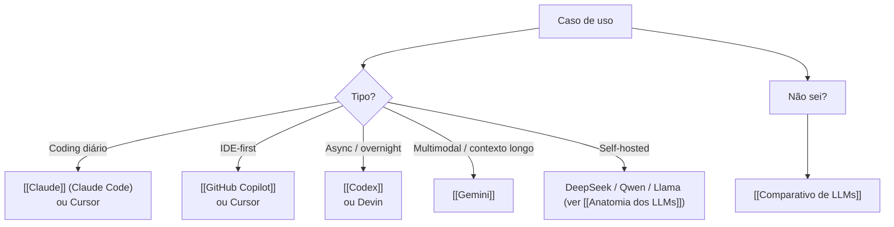

# Ferramentas de IA

Catálogo de ferramentas de IA usadas na engenharia de software em 2026 — modelos, IDEs com IA, agents cloud, e comparativos. Cada nota é deep dive em uma ferramenta específica, com setup, capabilities, custo, quando usar. Para visão arquitetural sobre **categorias** de ferramentas, ver [[Agentes de Codificação]] (coding agents) e [[Anatomia de Agents]] (fundamentos genéricos).

> [!tip] Como navegar
> Cada nota é um deep dive de uma ferramenta. Para escolher, use o **[[Comparativo de LLMs]]** que cruza modelos por custo, qualidade, latência, e use case.

## Ferramentas mapeadas

### Coding agents e IDEs

- **[[Claude]]** — Anthropic: Claude Code, API, Agent SDK, MCP, sandboxing
- **[[GitHub Copilot]]** — completions no IDE, chat, agent mode (Microsoft/GitHub)
- **[[Codex]]** — agent cloud da OpenAI (sandbox, async, retorna PR)
- **[[Gemini]]** — multimodal do Google, Code Assist, contextos longos

### Comparativos

- **[[Comparativo de LLMs]]** — tabela definitiva: qual usar quando, por custo, qualidade, latência

## Como escolher



## O que falta neste catálogo

Não cobertos com profundidade aqui (ver outras trilhas):

- **Cursor** — coberto em [[Agentes de Codificação|04 - Cursor — AI-native IDE]]
- **Aider** — coberto em [[Agentes de Codificação|09 - Aider — o pair programmer de terminal]]
- **OpenCode** — coberto em [[Agentes de Codificação|10 - OpenCode — o harness open source]]
- **Windsurf** — coberto em [[Agentes de Codificação|07 - Windsurf e Cascade]]
- **Devin** — coberto em [[Agentes de Codificação|13 - Devin e agentes autônomos cloud]]
- **Kiro** — coberto em [[Spec-Driven Development|08 - Ferramentas SDD — Kiro, Spec Kit, OpenSpec, Tessl]]
- **Letta, Mem0, Zep** — cobertos em [[Memória de Agentes]]

## Cadência de manutenção

Ferramentas mudam **rápido**. Versões, pricing, capabilities movem trimestralmente.

| Item | Cadência |
|---|---|
| Versões e capabilities | Trimestral |
| Pricing | Trimestral |
| Comparativo | Semestral |
| Setup guides | Anual ou em breaking changes |

## Veja também

- [[03-Domínios/IA/index|index do domínio IA]]
- [[Anatomia dos LLMs]]
- [[Anatomia de Agents]]
- [[Agentes de Codificação]]
- [[03-Domínios/IA/index|Formação Engenheiro de IA]]

## Todas as ferramentas

```dataview
TABLE
  title AS "Título",
  status AS "Status"
FROM "03-Domínios/IA/Ferramentas de IA"
WHERE type != "moc"
SORT file.name ASC
```
